# Architecture Frequently Asked Questions (FAQ)

**Version**: 1.0.0  
**Last Updated**: 2025-10-30  
**Status**: Active

## Overview

This document addresses common questions about the Task Management System architecture, covering design decisions, implementation patterns, and operational considerations.

---

## Table of Contents

- [Architecture Decisions](#architecture-decisions)
- [Clean Architecture & DDD](#clean-architecture--ddd)
- [Technology Stack](#technology-stack)
- [Scalability & Performance](#scalability--performance)
- [Security](#security)
- [Deployment & Operations](#deployment--operations)
- [Development Workflow](#development-workflow)
- [Cost & Resources](#cost--resources)

---

## Architecture Decisions

### Q: Why Clean Architecture instead of a simpler layered architecture?

**A**: Clean Architecture provides several critical benefits for our long-term success:

**Benefits**:

- ✅ **Testability**: Domain logic can be tested without databases, APIs, or external services
- ✅ **Maintainability**: Changes to frameworks (FastAPI → something else) don't affect business logic
- ✅ **Flexibility**: Can swap databases (MySQL → PostgreSQL) without rewriting domain code
- ✅ **Team scalability**: Clear boundaries enable parallel development
- ✅ **Long-term value**: Business logic is protected from technology churn

**Trade-offs**:

- ⚠️ More boilerplate code (interfaces, DTOs)
- ⚠️ Steeper learning curve for junior developers
- ⚠️ Initial development is slower

**When it pays off**: After 6-12 months when making framework/database changes or onboarding new developers.

**Related**: [ADR-001: Clean Architecture](./decisions/adr-001-clean-architecture.md)

---

### Q: Why 5 bounded contexts instead of a monolithic model?

**A**: Bounded contexts align with how the business thinks about the domain:

**5 Contexts**:

1. **User & Organization Management** - Who can access?
2. **Project & Task Management** - What work exists?
3. **Collaboration & Comments** - How do people communicate?
4. **Notifications** - How are users informed?
5. **Audit & Compliance** - What happened and when?

**Benefits**:

- ✅ **Clear ownership**: Each context has a dedicated team
- ✅ **Independent evolution**: Can change task management without affecting notifications
- ✅ **Microservices ready**: Easy to extract contexts into separate services later
- ✅ **Reduced coupling**: Changes in one context rarely affect others

**Current state**: All contexts in one codebase (modular monolith)

**Future**: Can extract to microservices if needed (e.g., Notifications becomes separate service)

**Related**: [ADR-003: Bounded Contexts](./decisions/adr-003-bounded-contexts.md), [Bounded Contexts](./bounded-contexts.md)

---

### Q: Why not microservices from the start?

**A**: Microservices add significant operational complexity that's not justified at our current scale.

**Our approach**: **Modular Monolith → Microservices**

**Modular Monolith Advantages** (0-100K users):

- ✅ Simpler deployment (one application)
- ✅ Easier debugging (single process)
- ✅ Faster development (no network calls between contexts)
- ✅ Lower infrastructure cost
- ✅ Easier to refactor (no API versioning between contexts)

**When to consider microservices**:

- ⚠️ Different scaling needs (e.g., Notifications need 10x more resources)
- ⚠️ Independent deployment required (deploy Notifications without affecting Tasks)
- ⚠️ Team coordination overhead (multiple teams stepping on each other)
- ⚠️ Technology diversity needed (Notifications in Node.js for real-time)

**Current decision**: Stay monolith until we hit 50K+ users or face specific scaling bottlenecks.

**Related**: [Scalability](./scalability.md), [Bounded Contexts](./bounded-contexts.md)

---

## Clean Architecture & DDD

### Q: What's the difference between an Entity and an Aggregate?

**A**: Both are domain concepts but serve different purposes:

**Entity**:

- Has identity (ID) that remains constant
- Mutable state that changes over time
- Example: `User`, `Task`, `Project`

**Aggregate**:

- Cluster of entities with one **Aggregate Root**
- Enforces consistency boundaries
- Only root is accessible from outside
- Example: `Project` (root) contains `Task` entities

```python
# Entity
class Task:
    def __init__(self, id: TaskId, title: str):
        self.id = id
        self.title = title

    def change_title(self, new_title: str):
        self.title = new_title  # Entity mutates

# Aggregate Root
class Project:
    def __init__(self, id: ProjectId, name: str):
        self.id = id
        self.name = name
        self._tasks: list[Task] = []  # Aggregate contains entities

    def add_task(self, task: Task):
        # Aggregate enforces business rules
        if len(self._tasks) >= 1000:
            raise ValueError("Project cannot have more than 1000 tasks")
        self._tasks.append(task)

    @property
    def tasks(self) -> list[Task]:
        return self._tasks.copy()  # Return copy, not internal list
```

**Rule**: Always access `Task` through `Project`, never directly.

**Related**: [Layers](./layers.md), [Bounded Contexts](./bounded-contexts.md)

---

### Q: When should I use a Value Object vs an Entity?

**A**: Use the identity test: "Does it have identity that matters?"

**Entity** (has identity):

- `User` - User ID 123 is different from User ID 456 even if same name
- `Task` - Task ID 789 is unique even if title duplicates
- **Rule**: If two instances with same attributes are DIFFERENT, use Entity

**Value Object** (no identity):

- `Money(100, "USD")` - Any $100 is the same as any other $100
- `EmailAddress("alice@example.com")` - Defined entirely by its value
- `Address(street, city, zip)` - Two identical addresses are interchangeable
- **Rule**: If two instances with same attributes are IDENTICAL, use Value Object

```python
# Value Object
@dataclass(frozen=True)  # Immutable
class Money:
    amount: Decimal
    currency: str

    def add(self, other: Money) -> Money:
        if self.currency != other.currency:
            raise ValueError("Cannot add different currencies")
        return Money(self.amount + other.amount, self.currency)

# Usage: Any Money(100, "USD") equals any other Money(100, "USD")
price1 = Money(Decimal("100"), "USD")
price2 = Money(Decimal("100"), "USD")
assert price1 == price2  # True - they're interchangeable

# Entity
class Task:
    def __init__(self, id: TaskId, title: str, price: Money):
        self.id = id
        self.title = title
        self.price = price

# Usage: Tasks are different even if attributes match
task1 = Task(TaskId("123"), "Write docs", Money(100, "USD"))
task2 = Task(TaskId("456"), "Write docs", Money(100, "USD"))
assert task1 != task2  # True - different tasks despite same title/price
```

**Related**: [Layers](./layers.md), [Glossary](./glossary.md)

---

### Q: How do I handle cross-context communication?

**A**: Use **Domain Events** or **Application Services** depending on coupling needs.

**Option 1: Domain Events** (loosely coupled, asynchronous):

```python
# When task is completed, publish event
class Task:
    def complete(self):
        self.status = TaskStatus.COMPLETED
        self.completed_at = datetime.utcnow()

        # Publish event
        self.add_domain_event(TaskCompletedEvent(
            task_id=self.id,
            project_id=self.project_id,
            completed_by=self.assigned_to,
            completed_at=self.completed_at
        ))

# Notification context listens to event
class TaskCompletedEventHandler:
    def __init__(self, notification_service: NotificationService):
        self._notification_service = notification_service

    async def handle(self, event: TaskCompletedEvent):
        # Notification context doesn't know about Task internals
        await self._notification_service.send_task_completed_notification(
            user_id=event.completed_by,
            task_id=event.task_id
        )
```

**Option 2: Application Service** (direct call, synchronous):

```python
# Application layer orchestrates across contexts
class CompleteTaskUseCase:
    def __init__(
        self,
        task_repo: TaskRepository,
        notification_service: NotificationService  # From different context
    ):
        self._task_repo = task_repo
        self._notification_service = notification_service

    async def execute(self, task_id: TaskId, user_id: UserId):
        task = await self._task_repo.get_by_id(task_id)
        task.complete()
        await self._task_repo.save(task)

        # Direct call to another context
        await self._notification_service.notify_task_completed(task_id, user_id)
```

**When to use each**:

- **Domain Events**: When action is optional, async, or many consumers (e.g., analytics, audit log, notifications)
- **Application Service**: When action is required, synchronous, immediate (e.g., authorization check)

**Related**: [Components](./components.md), [Data Flows](./data-flows.md)

---

## Technology Stack

### Q: Why FastAPI instead of Django or Flask?

**A**: FastAPI provides modern Python features we need for a scalable API:

| Feature            | FastAPI           | Django                | Flask             |
| ------------------ | ----------------- | --------------------- | ----------------- |
| **Async/Await**    | ✅ Native         | ⚠️ Partial (3.1+)     | ⚠️ Via extensions |
| **Type Hints**     | ✅ Required       | ❌ Not used           | ❌ Not used       |
| **API Docs**       | ✅ Auto-generated | ⚠️ DRF required       | ❌ Manual         |
| **Performance**    | ✅ 3-5x faster    | ⚠️ Slower             | ⚠️ Slower         |
| **Validation**     | ✅ Pydantic       | ⚠️ Forms/Serializers  | ❌ Manual         |
| **Learning Curve** | ⚠️ Medium         | ⚠️ Steep (ORM, admin) | ✅ Easy           |

**FastAPI advantages**:

- ✅ Built for APIs (not templates/forms)
- ✅ Modern Python (3.11+ with type hints)
- ✅ OpenAPI documentation out of the box
- ✅ High performance (comparable to Node.js)

**Trade-offs**:

- ⚠️ Smaller ecosystem than Django
- ⚠️ No built-in admin interface
- ⚠️ Need to assemble your own stack

**Related**: [ADR-002: Technology Stack](./decisions/adr-002-technology-stack.md)

---

### Q: Why MySQL instead of PostgreSQL?

**A**: Both are excellent. We chose MySQL for team familiarity and AWS RDS optimization:

**MySQL Advantages**:

- ✅ Team has 5+ years MySQL experience
- ✅ AWS RDS Aurora MySQL (highly optimized)
- ✅ Excellent read replica performance
- ✅ Simpler replication setup
- ✅ Good JSON support (5.7+)

**PostgreSQL Advantages** (considered but not critical for us):

- Advanced features (JSONB, arrays, full-text search)
- Better geospatial support (PostGIS)
- More SQL standard compliant

**Current decision**: MySQL 8.0+ provides everything we need.

**Future consideration**: If we need advanced PostgreSQL features (e.g., full-text search, geospatial), we can migrate (Clean Architecture makes this easier).

**Related**: [ADR-002: Technology Stack](./decisions/adr-002-technology-stack.md), [Database Optimization](./database-optimization.md)

---

### Q: Why Redis for caching instead of Memcached?

**A**: Redis provides data structures beyond simple key-value:

**Redis advantages**:

- ✅ Data structures (lists, sets, sorted sets, hashes)
- ✅ Pub/Sub for real-time features
- ✅ Persistence (AOF/RDB) for cache warmup
- ✅ Lua scripting for atomic operations
- ✅ Redis Streams for event bus

**Our use cases**:

- Session storage (strings with TTL)
- Real-time notification counts (sorted sets)
- Rate limiting (atomic increments)
- Pub/Sub for real-time updates (WebSocket bridge)

**Memcached advantages** (not critical for us):

- Slightly faster for pure key-value
- Lower memory overhead
- Simpler operations

**Related**: [Caching Strategy](./caching.md), [ADR-002: Technology Stack](./decisions/adr-002-technology-stack.md)

---

## Scalability & Performance

### Q: How many users can this architecture support?

**A**: Target: **50,000-100,000 active users** with current architecture.

**Capacity by phase**:

| Phase       | Users    | Concurrent | API Instances | Worker Instances | DB            | Monthly Cost |
| ----------- | -------- | ---------- | ------------- | ---------------- | ------------- | ------------ |
| **Phase 1** | 0-10K    | 100-500    | 3-5           | 5-10             | db.t3.large   | ~$500        |
| **Phase 2** | 10K-50K  | 500-2000   | 5-15          | 10-30            | db.r6g.large  | ~$2,000      |
| **Phase 3** | 50K-100K | 2000-5000  | 15-50         | 30-100           | db.r6g.xlarge | ~$5,000      |

**Scaling strategies**:

1. **Horizontal API scaling** (stateless, easy to add instances)
2. **Read replicas** (for read-heavy queries)
3. **Caching** (Redis for frequently accessed data)
4. **Async processing** (Celery workers for background tasks)

**Beyond 100K users**: Consider microservices extraction, database sharding, or multi-region deployment.

**Related**: [Capacity Planning](./capacity-planning.md), [Scalability](./scalability.md)

---

### Q: What's the expected API response time?

**A**: Performance targets vary by operation complexity:

| Operation                 | p50    | p95    | p99     | Notes                          |
| ------------------------- | ------ | ------ | ------- | ------------------------------ |
| **Simple GET** (cached)   | <50ms  | <100ms | <200ms  | User profile, project metadata |
| **Simple GET** (database) | <100ms | <200ms | <500ms  | Task list, single task         |
| **Complex GET**           | <200ms | <500ms | <1000ms | Filtered search, aggregations  |
| **POST/PUT**              | <150ms | <300ms | <700ms  | Create/update task             |
| **DELETE**                | <100ms | <200ms | <500ms  | Soft delete operations         |

**How we achieve this**:

- Multi-layer caching (Redis)
- Database query optimization (indexes, N+1 prevention)
- Connection pooling (50 connections, reduce overhead)
- Async I/O (FastAPI non-blocking operations)

**Monitoring**: Prometheus metrics, Grafana dashboards, CloudWatch alarms

**Related**: [Performance Targets](./performance.md), [Caching Strategy](./caching.md)

---

### Q: How do you handle N+1 query problems?

**A**: Multiple strategies depending on the use case:

**1. Eager Loading** (SQLAlchemy joinedload):

```python
# ❌ N+1 problem
projects = await session.execute(select(Project))
for project in projects:
    # Generates N queries for tasks
    print(project.tasks)  # Lazy load

# ✅ Solution: Eager load
projects = await session.execute(
    select(Project)
    .options(joinedload(Project.tasks))
)
# Single query with JOIN
```

**2. DataLoader Pattern** (batch loading):

```python
class TaskLoader:
    async def load_many(self, project_ids: list[ProjectId]) -> dict:
        # Single query for all projects
        tasks = await session.execute(
            select(Task)
            .where(Task.project_id.in_(project_ids))
        )
        # Group by project_id
        return group_by(tasks, key=lambda t: t.project_id)
```

**3. Database Views** (for complex aggregations):

```sql
-- Pre-calculated view
CREATE VIEW project_summary AS
SELECT
    p.id,
    p.name,
    COUNT(t.id) as task_count,
    COUNT(CASE WHEN t.status = 'COMPLETED' THEN 1 END) as completed_count
FROM projects p
LEFT JOIN tasks t ON t.project_id = p.id
GROUP BY p.id;
```

**Related**: [Database Optimization](./database-optimization.md), [Performance](./performance.md)

---

## Security

### Q: How do you prevent unauthorized cross-organization data access?

**A**: Multi-layer defense strategy:

**1. Database Level** (row-level filtering):

```python
# Every query automatically filters by organization
class TaskRepository:
    async def find_by_id(
        self,
        task_id: TaskId,
        organization_id: OrganizationId
    ) -> Task:
        return await self._session.execute(
            select(Task)
            .where(Task.id == task_id)
            .where(Task.organization_id == organization_id)  # ← Required
        )
```

**2. Application Level** (authorization check):

```python
class CompleteTaskUseCase:
    async def execute(self, task_id: TaskId, user_id: UserId):
        # 1. Get task
        task = await self._task_repo.find_by_id(task_id, user.organization_id)

        # 2. Check permission
        if not self._authz.can(user, "complete", task):
            raise Forbidden("Cannot complete task in different organization")

        # 3. Perform action
        task.complete()
```

**3. API Level** (authentication):

```python
@router.put("/tasks/{task_id}/complete")
async def complete_task(
    task_id: str,
    current_user: User = Depends(get_current_user)  # JWT validation
):
    # current_user.organization_id extracted from JWT
    await complete_task_use_case.execute(task_id, current_user.id)
```

**4. Audit Level** (logging):

```python
audit_log.record(
    actor=user_id,
    action="task.complete",
    resource=task_id,
    organization=organization_id
)
```

**Related**: [Authorization](./security/authorization.md), [Defense in Depth](./security/defense-in-depth.md)

---

### Q: How are passwords stored?

**A**: Bcrypt with salt (industry standard):

```python
from passlib.context import CryptContext

pwd_context = CryptContext(schemes=["bcrypt"], deprecated="auto")

# Hashing (registration)
hashed_password = pwd_context.hash("user_password_123")
# Result: $2b$12$KIXxJ... (60 characters)

# Verification (login)
is_valid = pwd_context.verify("user_password_123", hashed_password)
```

**Why bcrypt**:

- ✅ Slow by design (prevents brute force)
- ✅ Automatic salt (unique per password)
- ✅ Adaptive cost (can increase rounds as hardware improves)
- ✅ Industry standard (battle-tested)

**Not used**:

- ❌ Plain text (obviously insecure)
- ❌ MD5/SHA1 (too fast, broken)
- ❌ SHA256 alone (no salt, too fast)

**Configuration**:

- Bcrypt rounds: 12 (balance security vs performance)
- ~300ms to hash (acceptable for login)

**Related**: [Authentication](./security/authentication.md), [Data Protection](./security/data-protection.md)

---

### Q: How long do JWT tokens last?

**A**: Two-token strategy for security + convenience:

**Access Token**:

- **Lifespan**: 15 minutes
- **Purpose**: API authentication
- **Storage**: Memory only (not localStorage)
- **Claims**: user_id, organization_id, roles, permissions

**Refresh Token**:

- **Lifespan**: 7 days
- **Purpose**: Get new access token
- **Storage**: httpOnly cookie (XSS protection)
- **Claims**: user_id, token_family_id

```python
# Login response
{
  "access_token": "eyJhbGc...",  # 15-min JWT
  "token_type": "bearer",
  "expires_in": 900  # seconds
}
# + httpOnly cookie with refresh token (7 days)

# Refresh flow (every 15 minutes)
POST /api/v1/auth/refresh
Cookie: refresh_token=xyz...
→ New access_token (15 min)
```

**Why short access token**:

- ✅ Limits damage if stolen (expires quickly)
- ✅ Can't be revoked (but auto-expires)
- ✅ Stateless (no database lookup)

**Why long refresh token**:

- ✅ User convenience (don't login every 15 min)
- ✅ Can be revoked (stored in database)
- ✅ httpOnly cookie (protected from XSS)

**Related**: [Authentication](./security/authentication.md), [API Design](./api-design.md)

---

## Deployment & Operations

### Q: What's the deployment process from dev to production?

**A**: Three-stage pipeline with automated testing and manual approval:

```mermaid
graph LR
    Dev[Developer<br/>Push to PR] --> CI[CI Pipeline<br/>Tests + Build]
    CI -->|Pass| Merge[Merge to main]
    Merge --> DevDeploy[Auto Deploy<br/>to Dev]
    DevDeploy --> StagingDeploy[Auto Deploy<br/>to Staging]
    StagingDeploy --> E2E[E2E Tests<br/>Playwright]
    E2E -->|Pass| Approval[Manual Approval<br/>Product + Eng]
    Approval --> ProdDeploy[Blue-Green Deploy<br/>to Production]
    ProdDeploy --> Monitor[Monitor 30min<br/>Auto-rollback if issues]
```



**Timeline**:

- **Dev to Staging**: ~15 minutes (automated)
- **Staging validation**: 1-4 hours (manual testing)
- **Staging to Production**: ~30 minutes (manual approval + blue-green)
- **Total**: Same-day deployment for small changes, 1-2 days for major features

**Related**: [CI/CD Pipeline](./deployment/ci-cd-pipeline.md), [Environment Management](./deployment/environments.md)

---

### Q: What happens if a deployment fails in production?

**A**: Multi-level safety nets:

**1. Pre-deployment checks**:

- ✅ All tests pass (CI)
- ✅ Security scans pass (Trivy, Snyk)
- ✅ Staging validated (E2E tests)
- ✅ Database migrations tested

**2. Blue-Green deployment**:

- Old version (blue) keeps running
- New version (green) deployed alongside
- Traffic gradually shifts: 10% → 50% → 100%
- Monitor metrics at each step

**3. Automatic rollback triggers**:

- Error rate > 5% (compared to baseline)
- P95 latency > 1 second
- Health check failures > 50%
- Manual rollback button available

**4. Circuit breaker**:

```yaml
deployment_configuration:
  deployment_circuit_breaker:
    enable: true
    rollback: true # Auto-rollback on failure
```

**5. Rollback procedure** (~5 minutes):

```bash
# Automatic (triggered by circuit breaker)
# Or manual:
./scripts/rollback.sh production v1.2.3
```

**Recovery Time Objective (RTO)**: 15 minutes from detection to rollback complete

**Related**: [ECS Deployment](./deployment/ecs-deployment.md), [Incident Response](./observability/incident-response.md)

---

### Q: How do you handle database migrations in production?

**A**: Zero-downtime migration strategy:

**Phase 1: Backward Compatible Changes** (deploy with old code still running):

```sql
-- ✅ Safe: Add column with default
ALTER TABLE tasks ADD COLUMN priority INT DEFAULT 0;

-- ✅ Safe: Add index
CREATE INDEX idx_tasks_priority ON tasks(priority);

-- ✅ Safe: Add table
CREATE TABLE task_priorities (...);
```

**Phase 2: Deploy New Code** (uses new column, but handles old data):

```python
class Task:
    @property
    def priority(self) -> int:
        # Handle NULL from old records
        return self._priority if self._priority is not None else 0
```

**Phase 3: Backfill Data** (background job):

```python
# Celery task
@celery_app.task
def backfill_task_priorities():
    # Update in batches to avoid lock
    for batch in batched(tasks_without_priority, 1000):
        update_priorities(batch)
```

**Phase 4: Enforce Constraint** (after backfill complete):

```sql
-- Now safe to enforce NOT NULL
ALTER TABLE tasks MODIFY COLUMN priority INT NOT NULL;
```

**What we NEVER do**:

- ❌ Breaking changes without backward compatibility
- ❌ Rename/delete columns in same deployment as code change
- ❌ Long-running migrations during deploy (pre-run as background job)

**Related**: [ECS Deployment](./deployment/ecs-deployment.md), [Incident Response](./observability/incident-response.md)

---

### Q: How do you monitor the system in production?

**A**: Four pillars of observability:

**1. Structured Logging** (CloudWatch Logs):

```json
{
  "timestamp": "2025-10-30T14:32:10Z",
  "level": "INFO",
  "request_id": "abc123",
  "user_id": "user_456",
  "organization_id": "org_789",
  "action": "task.complete",
  "task_id": "task_101",
  "duration_ms": 45
}
```

**2. Metrics** (Prometheus → Grafana):

- Application: request_count, request_duration, error_rate
- Business: tasks_created, tasks_completed, active_users
- Infrastructure: CPU, memory, disk, network

**3. Distributed Tracing** (OpenTelemetry → Jaeger):

- Request flow: API → Service → Repository → Database
- Identify slow queries, N+1 problems

**4. Alerting** (CloudWatch Alarms → PagerDuty):

- P1 (Critical): Error rate > 5%, API down, database connection lost
- P2 (High): P95 latency > 1s, disk > 80%, memory > 85%
- P3 (Medium): Cache hit rate < 70%, worker queue > 1000

**Dashboards**:

- System Health (uptime, error rate, latency)
- API Performance (endpoint breakdown, p50/p95/p99)
- Database Performance (query time, connection pool, slow queries)
- Business Metrics (tasks created/completed, active users)

**Related**: [Observability](./observability/), [Monitoring](./observability/dashboards.md), [Alerting](./observability/alerting.md)

---

## Development Workflow

### Q: How do I set up a local development environment?

**A**: See full guide in [Quickstart](./quickstart.md). Quick version:

```bash
# 1. Clone and setup
git clone https://github.com/yourorg/taskmanager.git
cd taskmanager
python -m venv venv
source venv/bin/activate  # or `venv\Scripts\activate` on Windows
pip install -r requirements-dev.txt

# 2. Start dependencies (Docker Compose)
docker-compose up -d  # MySQL, Redis, Celery

# 3. Run migrations
alembic upgrade head

# 4. Start API
uvicorn main:app --reload --port 8000

# 5. Start worker (separate terminal)
celery -A worker worker --loglevel=info
```

**Access**:

- API: http://localhost:8000
- Docs: http://localhost:8000/docs (Swagger UI)
- RedisInsight: http://localhost:8001

**Related**: [Quickstart Guide](./quickstart.md)

---

### Q: How do I run tests?

**A**: Pytest with coverage:

```bash
# Unit tests (fast, no external dependencies)
pytest tests/unit -v

# Integration tests (requires Docker services)
docker-compose up -d postgres redis
pytest tests/integration -v

# All tests with coverage
pytest --cov=src --cov-report=html --cov-report=term

# Specific test file
pytest tests/unit/domain/test_task.py -v

# Specific test
pytest tests/unit/domain/test_task.py::TestTask::test_complete_task -v
```

**Coverage targets**:

- Minimum: 80% overall
- Domain layer: 95%+ (business logic critical)
- Infrastructure: 70%+ (external dependencies)

**Related**: [Unit and Integration Tests Instructions](.github/instructions/unit-and-integration-tests.instructions.md)

---

## Cost & Resources

### Q: What's the estimated monthly cost to run this?

**A**: Depends on scale. See [Capacity Planning](./capacity-planning.md) for details:

| Scale           | Users    | Monthly Cost  | Cost per User |
| --------------- | -------- | ------------- | ------------- |
| **Small** (MVP) | 0-1K     | $200-500      | $0.20-0.50    |
| **Medium**      | 1K-10K   | $500-2,000    | $0.05-0.20    |
| **Large**       | 10K-50K  | $2,000-5,000  | $0.04-0.10    |
| **Extra Large** | 50K-100K | $5,000-10,000 | $0.05-0.10    |

**Breakdown** (Medium scale - 10K users):

- Compute (ECS): $600/month (5 API + 10 Worker tasks)
- Database (RDS): $800/month (db.r6g.large Multi-AZ)
- Cache (Redis): $200/month (cache.r7g.medium)
- Storage (S3): $100/month (attachments + backups)
- Networking (ALB, data transfer): $200/month
- Monitoring (CloudWatch): $100/month
- **Total**: ~$2,000/month

**Cost optimization strategies**:

- Use Fargate Spot (70% discount) for non-critical workers
- S3 Intelligent-Tiering for attachments
- Reserved Instances for production database (40% discount)
- Lifecycle policies for old backups (→ Glacier)

**Related**: [Capacity Planning](./capacity-planning.md), [Environment Management](./deployment/environments.md)

---

### Q: What are the recommended instance sizes?

**A**: Varies by environment and scale:

**Development**:

- API: 0.25 vCPU, 512 MB (2 tasks) - $15/month
- Worker: 0.25 vCPU, 512 MB (2 tasks) - $15/month
- Database: db.t3.micro (1 vCPU, 1 GB) - $15/month
- Redis: cache.t3.micro - $12/month

**Staging** (production-like):

- API: 0.5 vCPU, 1 GB (3 tasks) - $35/month
- Worker: 0.5 vCPU, 1 GB (5 tasks) - $60/month
- Database: db.t3.large (2 vCPU, 8 GB) Multi-AZ - $180/month
- Redis: cache.t3.medium (2 nodes) - $80/month

**Production** (10K users):

- API: 1 vCPU, 2 GB (5-15 tasks, auto-scale) - $180-540/month
- Worker: 0.5 vCPU, 1 GB (10-30 tasks, auto-scale) - $180-540/month
- Database: db.r6g.large (2 vCPU, 16 GB) Multi-AZ + replica - $1,200/month
- Redis: cache.r7g.large (3 nodes) - $400/month

**Related**: [Environment Management](./deployment/environments.md), [Capacity Planning](./capacity-planning.md)

---

## Additional Questions?

**Can't find your question here?**

1. **Search documentation**: Use Table of Contents or navigation diagram
2. **Check ADRs**: Architecture Decision Records explain "why" decisions
3. **Ask the team**: Post in #architecture Slack channel
4. **Submit question**: Open GitHub issue with label `question`

---

## Related Documents

- **[README.md](./README.md)** - Architecture documentation overview
- **[Table of Contents](./TABLE_OF_CONTENTS.md)** - Complete document listing
- **[Navigation](./navigation.md)** - Visual guide to documentation
- **[Glossary](./glossary.md)** - Key terms and definitions
- **[Quickstart Guide](./quickstart.md)** - Getting started guide

---

**Last Reviewed**: 2025-10-30  
**Next Review**: 2026-01-30 (Quarterly)  
**Maintainer**: Architecture Team  
**Contribute**: Submit FAQ additions via pull request
