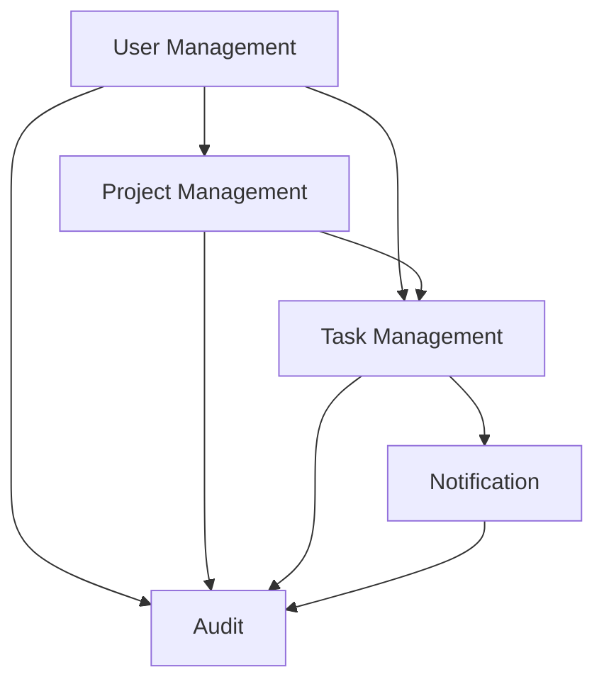
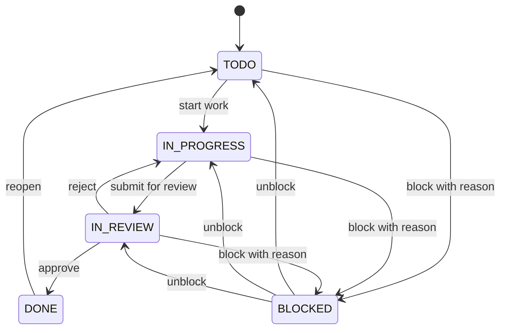
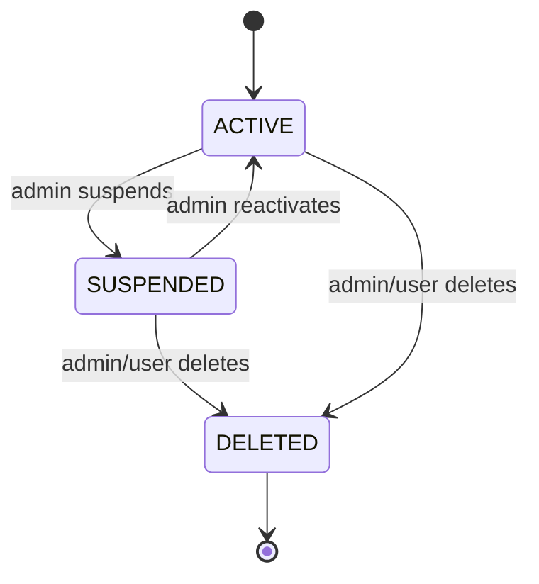

````markdown
# Bounded Contexts and Data Model

**Version**: 1.0.0  
**Last Updated**: 2025-10-30  
**Status**: Active

## Overview

This document defines the domain model, bounded contexts, and their relationships for the SaaS Task Management Platform. Following Domain-Driven Design principles, each bounded context maintains its own domain model with explicit integration contracts.

---

## Bounded Contexts Overview

The system is organized into five bounded contexts:

1. **User Management**: User accounts, authentication, organizations, and roles
2. **Project Management**: Projects, project memberships, and project-level permissions
3. **Task Management**: Tasks, subtasks, comments, attachments, and workflow
4. **Notification**: User notifications, preferences, and delivery channels
5. **Audit**: System activity logging for compliance and security



---

## 1. User Management Context

**Responsibility**: Managing user accounts, authentication, teams, and roles.

### Core Entities

#### User (Aggregate Root)

**Identity**: `user_id` (UUID)

**Attributes**:

- `email` (Email value object) - unique, validated
- `password_hash` (string) - bcrypt hashed
- `full_name` (string)
- `avatar_url` (URL value object, optional)
- `status` (UserStatus enum: ACTIVE, SUSPENDED, DELETED)
- `created_at`, `updated_at`, `last_login_at` (datetime)

**Relationships**:

- Member of multiple organizations (many-to-many)
- Has multiple roles per organization

**Invariants**:

- Email must be unique across the platform
- Password must meet complexity requirements (8+ chars, mixed case, numbers)
- Cannot delete user with active organization ownership

#### Organization

**Identity**: `organization_id` (UUID)

**Attributes**:

- `name` (string) - unique within platform
- `slug` (string) - URL-friendly identifier
- `owner_id` (User reference)
- `subscription_tier` (SubscriptionTier enum: FREE, PRO, ENTERPRISE)
- `max_members` (integer) - based on tier
- `created_at` (datetime)

**Invariants**:

- Must have at least one owner
- Member count cannot exceed `max_members`
- Slug must be globally unique

#### Role

**Identity**: `role_id` (UUID)

**Attributes**:

- `name` (RoleName enum: SUPER_ADMIN, ORG_ADMIN, PROJECT_MANAGER, MEMBER, VIEWER)
- `permissions` (set of Permission enum values)
- `organization_id` (Organization reference)
- `is_system_role` (boolean)

**Invariants**:

- System roles cannot be deleted
- Custom roles can only modify non-critical permissions

### Value Objects

- `Email`: Validates email format, provides normalized representation
- `PasswordHash`: Encapsulates hashing logic (bcrypt)

### Domain Events

- `UserRegistered`: New user creation
- `UserLoggedIn`: Successful authentication
- `UserRoleChanged`: Role modification
- `OrganizationCreated`: New organization
- `MemberInvited`: User invited to organization

### Repository Interface

```python
class UserRepository(ABC):
    def get_by_id(self, user_id: UUID) -> Optional[User]
    def get_by_email(self, email: Email) -> Optional[User]
    def save(self, user: User) -> None
    def delete(self, user_id: UUID) -> None
    def list_by_organization(self, org_id: UUID) -> List[User]
```

---

## 2. Project Management Context

**Responsibility**: Managing projects, project memberships, and project-level permissions.

### Core Entities

#### Project (Aggregate Root)

**Identity**: `project_id` (UUID)

**Attributes**:

- `name`, `description` (string)
- `organization_id` (Organization reference)
- `owner_id` (User reference)
- `status` (ProjectStatus enum: ACTIVE, ARCHIVED, DELETED)
- `visibility` (ProjectVisibility enum: PRIVATE, TEAM, PUBLIC)
- `created_at`, `updated_at`, `archived_at` (datetime)

**Invariants**:

- Owner must be member of parent organization
- Cannot archive project with incomplete critical tasks
- Project name must be unique within organization

#### ProjectMember

**Identity**: Composite `(project_id, user_id)`

**Attributes**:

- `role` (ProjectRole enum: OWNER, ADMIN, CONTRIBUTOR, VIEWER)
- `joined_at` (datetime)

**Invariants**:

- Project must have at least one OWNER
- User must be member of parent organization

#### ProjectTag

**Identity**: `tag_id` (UUID)

**Attributes**:

- `name` (string)
- `color` (Color value object)
- `project_id` (Project reference)

**Invariants**:

- Tag name unique within project

### Value Objects

- `Color`: Hex color code with validation (#RRGGBB)
- `ProjectSlug`: URL-friendly project identifier

### Domain Events

- `ProjectCreated`: New project initialized
- `ProjectArchived`: Project archived
- `MemberAddedToProject`: User added to project
- `MemberRemovedFromProject`: User removed from project
- `ProjectOwnershipTransferred`: Owner changed

### Repository Interface

```python
class ProjectRepository(ABC):
    def get_by_id(self, project_id: UUID) -> Optional[Project]
    def save(self, project: Project) -> None
    def delete(self, project_id: UUID) -> None
    def list_by_organization(self, org_id: UUID, include_archived: bool = False) -> List[Project]
    def list_by_user(self, user_id: UUID) -> List[Project]
```

---

## 3. Task Management Context

**Responsibility**: Managing tasks, subtasks, task assignments, and workflow states.

### Core Entities

#### Task (Aggregate Root)

**Identity**: `task_id` (UUID)

**Attributes**:

- `title` (string) - required
- `description` (string, optional) - supports markdown
- `project_id` (Project reference)
- `created_by_user_id`, `assigned_to_user_id` (User reference)
- `status` (TaskStatus enum: TODO, IN_PROGRESS, IN_REVIEW, DONE, BLOCKED)
- `priority` (TaskPriority enum: LOW, MEDIUM, HIGH, URGENT)
- `due_date` (date, optional)
- `estimated_hours`, `actual_hours` (decimal, optional)
- `position` (integer) - for ordering
- `parent_task_id` (Task reference, optional) - for subtasks
- `created_at`, `updated_at`, `completed_at` (datetime)

**Invariants**:

- Cannot assign to user not in project
- Cannot complete parent task if subtasks incomplete
- Position must be unique within project
- Due date must be in future when set

#### TaskComment

**Identity**: `comment_id` (UUID)

**Attributes**:

- `task_id`, `user_id` (references)
- `content` (string) - markdown supported
- `created_at`, `updated_at` (datetime)
- `is_deleted` (boolean)

**Invariants**:

- User must have access to parent project

#### TaskAttachment

**Identity**: `attachment_id` (UUID)

**Attributes**:

- `task_id`, `uploaded_by_user_id` (references)
- `file_name`, `mime_type`, `storage_path` (string)
- `file_size` (integer) - bytes
- `uploaded_at` (datetime)

**Invariants**:

- File size cannot exceed 50 MB
- Malicious file types rejected

### Value Objects

- `TaskStatus`: Enum with state transition rules
- `TaskPriority`: Enum with ordering semantics
- `Markdown`: Validated markdown content

### Domain Events

- `TaskCreated`, `TaskAssigned`, `TaskStatusChanged`, `TaskCompleted`
- `CommentAdded`, `AttachmentUploaded`

### Repository Interface

```python
class TaskRepository(ABC):
    def get_by_id(self, task_id: UUID) -> Optional[Task]
    def save(self, task: Task) -> None
    def delete(self, task_id: UUID) -> None
    def list_by_project(self, project_id: UUID, filters: TaskFilters) -> List[Task]
    def list_by_assignee(self, user_id: UUID) -> List[Task]
    def reorder_tasks(self, project_id: UUID, task_ids: List[UUID]) -> None
```

---

## 4. Notification Context

**Responsibility**: Managing user notifications, preferences, and delivery channels.

### Core Entities

#### Notification

**Identity**: `notification_id` (UUID)

**Attributes**:

- `user_id` (User reference) - recipient
- `type` (NotificationType enum: TASK_ASSIGNED, MENTION, COMMENT, PROJECT_INVITE, etc.)
- `title`, `message` (string)
- `action_url` (URL value object, optional)
- `related_entity_type` (string), `related_entity_id` (UUID)
- `is_read` (boolean)
- `created_at`, `read_at` (datetime)

**Invariants**:

- Cannot mark as read before creation
- Action URL must be valid if present

#### NotificationPreference

**Identity**: Composite `(user_id, notification_type)`

**Attributes**:

- `email_enabled`, `push_enabled`, `in_app_enabled` (boolean)

**Invariants**:

- At least one channel must be enabled per type

### Value Objects

- `NotificationChannel`: Enum (EMAIL, PUSH, IN_APP)
- `NotificationPriority`: Enum (LOW, NORMAL, HIGH)

### Domain Events

- `NotificationCreated`, `NotificationRead`, `NotificationPreferenceUpdated`

### Repository Interface

```python
class NotificationRepository(ABC):
    def get_by_id(self, notification_id: UUID) -> Optional[Notification]
    def save(self, notification: Notification) -> None
    def list_by_user(self, user_id: UUID, unread_only: bool = False) -> List[Notification]
    def mark_as_read(self, notification_id: UUID) -> None
    def mark_all_as_read(self, user_id: UUID) -> None
```

---

## 5. Audit Context

**Responsibility**: Recording and querying system activity for compliance and security.

### Core Entities

#### AuditLog (Append-Only)

**Identity**: `audit_id` (UUID)

**Attributes**:

- `timestamp` (datetime) - indexed
- `user_id`, `organization_id` (references)
- `action` (AuditAction enum: CREATE, UPDATE, DELETE, LOGIN, LOGOUT, etc.)
- `entity_type` (string), `entity_id` (UUID)
- `changes` (JSON) - before/after state
- `ip_address` (IPAddress value object)
- `user_agent`, `request_id` (string/UUID)

**Invariants**:

- Cannot be updated or deleted (append-only)
- Timestamp cannot be in future
- Must have either user_id or system_id

### Value Objects

- `IPAddress`: Validated IPv4/IPv6 address
- `AuditAction`: Enum of auditable actions

### Domain Events

- `AuditLogCreated`: New audit entry recorded

### Repository Interface

```python
class AuditLogRepository(ABC):
    def save(self, audit_log: AuditLog) -> None  # Append only
    def list_by_organization(self, org_id: UUID, filters: AuditFilters) -> List[AuditLog]
    def list_by_user(self, user_id: UUID, filters: AuditFilters) -> List[AuditLog]
    def list_by_entity(self, entity_type: str, entity_id: UUID) -> List[AuditLog]
```

---

## Cross-Context Integration Contracts

### User Management → Project Management

- **Contract**: Project ownership validation
- **Integration**: Project service queries User context to verify user belongs to organization
- **Event**: `UserRemovedFromOrganization` → Trigger removal from all org projects

### User Management → Task Management

- **Contract**: Task assignment validation
- **Integration**: Task service queries User context via Project membership
- **Event**: `UserRemovedFromProject` → Unassign user from all project tasks

### Project Management → Task Management

- **Contract**: Task project validation
- **Integration**: Task must belong to existing, non-archived project
- **Event**: `ProjectArchived` → Archive or delete all project tasks

### Task Management → Notification

- **Contract**: Notification trigger events
- **Integration**: Notification service subscribes to task events
- **Events**: `TaskAssigned`, `CommentAdded`, `TaskCompleted` → Create notifications

### All Contexts → Audit

- **Contract**: Audit log creation for significant actions
- **Integration**: All contexts publish events; Audit service subscribes and records
- **Events**: All domain events are auditable

---

## State Transition Diagrams

### Task Status Lifecycle



**Rules**:

- Only assigned user can move task to IN_PROGRESS
- Only project admin can move to IN_REVIEW
- Only task creator or admin can mark DONE
- Anyone with task access can mark BLOCKED with reason

### User Status Lifecycle



---

## Data Retention & Archival

### Active Data (Hot Storage - MySQL)

- Users: Active and suspended accounts
- Projects: Non-archived projects
- Tasks: Tasks in active projects
- Notifications: Last 90 days
- Audit logs: Last 12 months

### Archived Data (Cold Storage - S3)

- Projects: Archived projects (compressed JSON)
- Tasks: Tasks in archived projects
- Audit logs: > 12 months old (partitioned by year)

### Deletion Policy

- Deleted users: Anonymize after 30 days (GDPR compliance)
- Deleted tasks: Soft delete for 30 days, then hard delete
- Deleted projects: Soft delete for 90 days, then archive to S3

---

## Scalability Considerations

### Partitioning Strategy

- **Users**: Partition by organization_id for tenant isolation
- **Tasks**: Partition by project_id for query performance
- **Audit Logs**: Partition by timestamp (monthly tables)
- **Notifications**: Partition by user_id with automatic purging

### Indexing Strategy

- **Users**: Index on email, organization_id
- **Projects**: Index on organization_id, owner_id, status
- **Tasks**: Index on project_id, assigned_to_user_id, status, due_date
- **Audit Logs**: Index on timestamp, user_id, organization_id, entity_type

### Caching Strategy

- **User sessions**: Redis (15-minute TTL)
- **Project metadata**: Redis (5-minute TTL)
- **Task lists**: Redis (1-minute TTL, invalidate on write)
- **Notification counts**: Redis (real-time, invalidate on write)

---

## Summary

This data model defines five bounded contexts with clear boundaries and integration contracts. Each context maintains its own consistency boundary (aggregate roots) and communicates with other contexts via domain events. The model supports:

- **Scalability**: Partitioning, indexing, caching strategies
- **Compliance**: Audit logging, data retention policies
- **Maintainability**: Clear separation of concerns
- **DDD Principles**: Aggregate roots, value objects, domain events, repositories

## Related Documents

- [ADR-003: Bounded Contexts](./decisions/adr-003-bounded-contexts.md)
- [Technology Choices](./technology-choices.md)
- [Layer Responsibilities](./layers.md)
- [Data Flows](./data-flows.md)

---

**Last Reviewed**: 2025-10-30  
**Next Review**: 2026-01-30 (Quarterly)
````
