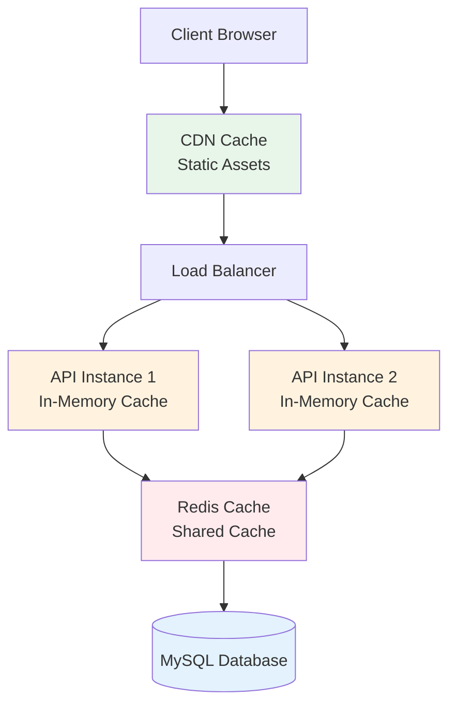

# Caching Strategy

**Version**: 1.0.0  
**Last Updated**: 2025-10-30  
**Status**: Active

## Overview

This document defines the multi-layer caching strategy for the Task Management System to reduce database load, improve response times, and support high concurrency. Effective caching is critical for meeting performance targets (API p95 < 200ms, database p95 < 50ms).

---

## Caching Principles

### Core Principles

1. **Layered Caching**: Multiple cache layers (CDN → App → Redis → Database)
2. **Short TTLs**: Prefer short TTLs with event-driven invalidation
3. **Cache Aside**: Application controls cache population and invalidation
4. **Eventual Consistency**: Accept brief staleness for performance
5. **Graceful Degradation**: System works without cache (slower)

### Cache Hierarchy



---

## Cache Layers

### Layer 1: CDN Cache (CloudFront)

**Purpose**: Cache static assets and public content close to users.

**Cached Content**:

- Static files (JS, CSS, images)
- Public API responses (rate limits, feature flags)
- OpenAPI documentation

**Configuration**:

```yaml
# CloudFront distribution settings
CacheBehaviors:
  - PathPattern: "/static/*"
    MinTTL: 3600 # 1 hour
    MaxTTL: 86400 # 24 hours
    DefaultTTL: 3600
    Compress: true

  - PathPattern: "/api/public/*"
    MinTTL: 60 # 1 minute
    MaxTTL: 300 # 5 minutes
    DefaultTTL: 120
    ForwardHeaders:
      - Authorization
```

**Cache Control Headers**:

```python
from fastapi import Response

@app.get("/static/logo.png")
async def get_logo():
    return Response(
        content=logo_bytes,
        media_type="image/png",
        headers={
            "Cache-Control": "public, max-age=3600, immutable",
            "ETag": calculate_etag(logo_bytes)
        }
    )
```

---

### Layer 2: Application In-Memory Cache

**Purpose**: Ultra-fast cache for frequently accessed, small data within a single API instance.

**Cached Content**:

- Feature flags
- Configuration values
- User role definitions

**Implementation**:

```python
from functools import lru_cache
from datetime import datetime, timedelta
from typing import Optional

class InMemoryCache:
    """Simple in-memory cache with TTL"""

    def __init__(self):
        self._cache: dict = {}
        self._ttl: dict = {}

    def get(self, key: str) -> Optional[any]:
        """Get value if not expired"""
        if key not in self._cache:
            return None

        if datetime.now() > self._ttl[key]:
            # Expired
            del self._cache[key]
            del self._ttl[key]
            return None

        return self._cache[key]

    def set(self, key: str, value: any, ttl_seconds: int = 300) -> None:
        """Set value with TTL"""
        self._cache[key] = value
        self._ttl[key] = datetime.now() + timedelta(seconds=ttl_seconds)

    def delete(self, key: str) -> None:
        """Invalidate cache entry"""
        self._cache.pop(key, None)
        self._ttl.pop(key, None)

# Global instance
app_cache = InMemoryCache()

# Usage
@lru_cache(maxsize=100)
def get_feature_flags() -> dict:
    """Cache feature flags in memory (refreshed on app restart)"""
    return {
        "new_ui_enabled": True,
        "ai_suggestions_enabled": False,
    }
```

---

### Layer 3: Redis Shared Cache

**Purpose**: Shared cache across all API instances for session data, frequently accessed entities, and computed results.

**Technology**: Redis 7.0+ (cluster mode for high availability)

**Cached Content Categories**:

| Content Type            | TTL             | Invalidation           | Use Case                  |
| ----------------------- | --------------- | ---------------------- | ------------------------- |
| **User Sessions**       | 15 minutes      | Token refresh, logout  | Authentication state      |
| **User Profiles**       | 5 minutes       | User update event      | Display name, avatar      |
| **Project Metadata**    | 5 minutes       | Project update event   | Project list, details     |
| **Task Lists**          | 1 minute        | Task CRUD events       | Project tasks, user tasks |
| **Notification Counts** | Real-time (30s) | New notification event | Unread badge count        |
| **Organization Info**   | 10 minutes      | Org update event       | Org name, settings        |
| **Computed Aggregates** | 5 minutes       | Related data change    | Project stats, user stats |

---

## Caching Patterns

### 1. User Session Cache

**Purpose**: Fast authentication without database lookup.

**TTL**: 15 minutes (refresh on activity)

**Schema**:

```python
from dataclasses import dataclass
from datetime import datetime
import json

@dataclass
class CachedUserSession:
    user_id: str
    organization_id: str
    email: str
    roles: list[str]
    permissions: list[str]
    last_activity: datetime

    def to_dict(self) -> dict:
        return {
            'user_id': self.user_id,
            'organization_id': self.organization_id,
            'email': self.email,
            'roles': self.roles,
            'permissions': self.permissions,
            'last_activity': self.last_activity.isoformat()
        }

    @classmethod
    def from_dict(cls, data: dict) -> 'CachedUserSession':
        return cls(
            user_id=data['user_id'],
            organization_id=data['organization_id'],
            email=data['email'],
            roles=data['roles'],
            permissions=data['permissions'],
            last_activity=datetime.fromisoformat(data['last_activity'])
        )

class SessionCache:
    """Manage user sessions in Redis"""

    def __init__(self, redis_client):
        self.redis = redis_client
        self.ttl = 900  # 15 minutes

    def get_session(self, token: str) -> Optional[CachedUserSession]:
        """Retrieve cached session"""
        key = f"session:{token}"
        data = self.redis.get(key)

        if not data:
            return None

        return CachedUserSession.from_dict(json.loads(data))

    def set_session(self, token: str, session: CachedUserSession) -> None:
        """Cache session with TTL"""
        key = f"session:{token}"
        self.redis.setex(
            key,
            self.ttl,
            json.dumps(session.to_dict())
        )

    def refresh_session(self, token: str) -> None:
        """Extend session TTL on activity"""
        key = f"session:{token}"
        self.redis.expire(key, self.ttl)

    def invalidate_session(self, token: str) -> None:
        """Remove session on logout"""
        key = f"session:{token}"
        self.redis.delete(key)
```

**Usage**:

```python
from fastapi import Depends, HTTPException, status
from fastapi.security import HTTPBearer

security = HTTPBearer()

async def get_current_user(
    credentials: HTTPAuthorizationCredentials = Depends(security)
) -> CachedUserSession:
    """Get current user from cache or database"""
    token = credentials.credentials

    # Try cache first
    session = session_cache.get_session(token)
    if session:
        # Refresh TTL on activity
        session_cache.refresh_session(token)
        return session

    # Cache miss - verify token and load from database
    try:
        payload = jwt.decode(token, SECRET_KEY, algorithms=["HS256"])
        user_id = payload.get("sub")

        user = db.query(User).filter_by(user_id=user_id).first()
        if not user:
            raise HTTPException(status_code=401, detail="Invalid token")

        # Populate cache
        session = CachedUserSession(
            user_id=user.user_id,
            organization_id=user.organization_id,
            email=user.email,
            roles=user.roles,
            permissions=user.get_permissions(),
            last_activity=datetime.now()
        )
        session_cache.set_session(token, session)

        return session

    except jwt.InvalidTokenError:
        raise HTTPException(status_code=401, detail="Invalid token")
```

---

### 2. Entity Cache (Cache-Aside Pattern)

**Purpose**: Cache frequently accessed domain entities.

**Pattern**: Application checks cache, populates on miss, invalidates on update.

**Implementation**:

```python
from typing import Optional, TypeVar, Generic
import json
from functools import wraps

T = TypeVar('T')

class EntityCache(Generic[T]):
    """Generic entity cache with cache-aside pattern"""

    def __init__(
        self,
        redis_client,
        entity_type: str,
        ttl: int = 300,
        serializer=json.dumps,
        deserializer=json.loads
    ):
        self.redis = redis_client
        self.entity_type = entity_type
        self.ttl = ttl
        self.serializer = serializer
        self.deserializer = deserializer

    def _make_key(self, entity_id: str) -> str:
        return f"entity:{self.entity_type}:{entity_id}"

    def get(self, entity_id: str) -> Optional[T]:
        """Get entity from cache"""
        key = self._make_key(entity_id)
        data = self.redis.get(key)

        if data:
            return self.deserializer(data)
        return None

    def set(self, entity_id: str, entity: T) -> None:
        """Cache entity with TTL"""
        key = self._make_key(entity_id)
        self.redis.setex(
            key,
            self.ttl,
            self.serializer(entity)
        )

    def delete(self, entity_id: str) -> None:
        """Invalidate cached entity"""
        key = self._make_key(entity_id)
        self.redis.delete(key)

    def delete_pattern(self, pattern: str) -> None:
        """Invalidate multiple entities by pattern"""
        keys = self.redis.keys(f"entity:{self.entity_type}:{pattern}")
        if keys:
            self.redis.delete(*keys)

# Usage
project_cache = EntityCache(
    redis_client=redis,
    entity_type="project",
    ttl=300,  # 5 minutes
    serializer=lambda p: json.dumps(p.to_dict()),
    deserializer=lambda data: Project.from_dict(json.loads(data))
)

class ProjectRepository:
    """Project repository with caching"""

    def get_by_id(self, project_id: UUID) -> Optional[Project]:
        """Get project with cache"""
        # Try cache first
        cached = project_cache.get(str(project_id))
        if cached:
            return cached

        # Cache miss - load from database
        project = self.db.query(Project).filter_by(project_id=project_id).first()

        if project:
            # Populate cache
            project_cache.set(str(project_id), project)

        return project

    def update(self, project: Project) -> None:
        """Update project and invalidate cache"""
        self.db.commit()

        # Invalidate cache
        project_cache.delete(str(project.project_id))

        # Also invalidate lists containing this project
        project_cache.delete_pattern(f"list:org:{project.organization_id}:*")
```

---

### 3. Query Result Cache

**Purpose**: Cache expensive query results (lists, aggregations).

**TTL**: 1-5 minutes (shorter for frequently changing data)

**Implementation**:

```python
from hashlib import sha256

class QueryCache:
    """Cache query results with automatic key generation"""

    def __init__(self, redis_client, ttl: int = 60):
        self.redis = redis_client
        self.ttl = ttl

    def _make_key(self, query: str, params: dict) -> str:
        """Generate cache key from query and params"""
        key_data = f"{query}:{json.dumps(params, sort_keys=True)}"
        hash_value = sha256(key_data.encode()).hexdigest()[:16]
        return f"query:{hash_value}"

    def get(self, query: str, params: dict) -> Optional[list]:
        """Get cached query result"""
        key = self._make_key(query, params)
        data = self.redis.get(key)

        if data:
            return json.loads(data)
        return None

    def set(self, query: str, params: dict, result: list) -> None:
        """Cache query result"""
        key = self._make_key(query, params)
        self.redis.setex(key, self.ttl, json.dumps(result))

query_cache = QueryCache(redis, ttl=60)

def get_project_tasks(project_id: UUID, status: Optional[str] = None) -> list[Task]:
    """Get tasks with caching"""
    cache_key = f"project:{project_id}:tasks"
    params = {'status': status} if status else {}

    # Try cache
    cached = query_cache.get(cache_key, params)
    if cached:
        return [Task.from_dict(t) for t in cached]

    # Cache miss - query database
    query = db.query(Task).filter_by(project_id=project_id)
    if status:
        query = query.filter_by(status=status)

    tasks = query.all()

    # Cache result
    query_cache.set(
        cache_key,
        params,
        [t.to_dict() for t in tasks]
    )

    return tasks
```

---

### 4. Computed Aggregate Cache

**Purpose**: Cache expensive aggregations (statistics, counts).

**TTL**: 5 minutes

**Implementation**:

```python
class AggregateCache:
    """Cache computed aggregates"""

    def __init__(self, redis_client, ttl: int = 300):
        self.redis = redis_client
        self.ttl = ttl

    def get_project_stats(self, project_id: UUID) -> Optional[dict]:
        """Get cached project statistics"""
        key = f"aggregate:project:{project_id}:stats"
        data = self.redis.get(key)

        if data:
            return json.loads(data)
        return None

    def set_project_stats(self, project_id: UUID, stats: dict) -> None:
        """Cache project statistics"""
        key = f"aggregate:project:{project_id}:stats"
        self.redis.setex(key, self.ttl, json.dumps(stats))

    def invalidate_project_stats(self, project_id: UUID) -> None:
        """Invalidate when tasks change"""
        key = f"aggregate:project:{project_id}:stats"
        self.redis.delete(key)

aggregate_cache = AggregateCache(redis)

def get_project_statistics(project_id: UUID) -> dict:
    """Get project stats with caching"""
    # Try cache
    cached = aggregate_cache.get_project_stats(project_id)
    if cached:
        return cached

    # Cache miss - compute from database
    stats = {
        'total_tasks': db.query(Task).filter_by(project_id=project_id).count(),
        'completed_tasks': db.query(Task).filter_by(
            project_id=project_id,
            status='COMPLETED'
        ).count(),
        'open_tasks': db.query(Task).filter_by(
            project_id=project_id,
            status='TODO'
        ).count(),
        'total_comments': db.query(Comment).filter_by(project_id=project_id).count(),
    }

    # Cache result
    aggregate_cache.set_project_stats(project_id, stats)

    return stats
```

---

## Cache Invalidation

### Event-Driven Invalidation

**Pattern**: Invalidate cache when domain events occur.

**Implementation**:

```python
from domain.events import DomainEvent, TaskCreatedEvent, TaskUpdatedEvent

class CacheInvalidationHandler:
    """Handle cache invalidation on domain events"""

    def __init__(
        self,
        entity_cache: EntityCache,
        query_cache: QueryCache,
        aggregate_cache: AggregateCache
    ):
        self.entity_cache = entity_cache
        self.query_cache = query_cache
        self.aggregate_cache = aggregate_cache

    def handle_task_created(self, event: TaskCreatedEvent) -> None:
        """Invalidate caches when task created"""
        task = event.task

        # Invalidate project task list
        self.query_cache.delete(f"project:{task.project_id}:tasks")

        # Invalidate project statistics
        self.aggregate_cache.invalidate_project_stats(task.project_id)

        # Invalidate assignee task list
        if task.assignee_id:
            self.query_cache.delete(f"user:{task.assignee_id}:tasks")

    def handle_task_updated(self, event: TaskUpdatedEvent) -> None:
        """Invalidate caches when task updated"""
        task = event.task

        # Invalidate task entity
        self.entity_cache.delete(str(task.task_id))

        # Invalidate lists
        self.query_cache.delete(f"project:{task.project_id}:tasks")

        # Invalidate statistics
        self.aggregate_cache.invalidate_project_stats(task.project_id)

    def handle_task_deleted(self, event: TaskDeletedEvent) -> None:
        """Invalidate caches when task deleted"""
        task = event.task

        # Invalidate everything related to this task
        self.entity_cache.delete(str(task.task_id))
        self.query_cache.delete(f"project:{task.project_id}:tasks")
        self.aggregate_cache.invalidate_project_stats(task.project_id)

# Register handlers
event_bus.subscribe(TaskCreatedEvent, cache_handler.handle_task_created)
event_bus.subscribe(TaskUpdatedEvent, cache_handler.handle_task_updated)
event_bus.subscribe(TaskDeletedEvent, cache_handler.handle_task_deleted)
```

### Invalidation Strategies

| Strategy              | Use Case                 | Pros              | Cons                            |
| --------------------- | ------------------------ | ----------------- | ------------------------------- |
| **TTL Expiration**    | Rarely changing data     | Simple, automatic | Stale data until TTL            |
| **Event-Driven**      | Frequently changing data | Always fresh      | Complex, must handle all events |
| **Write-Through**     | Critical consistency     | No stale data     | Higher write latency            |
| **Lazy Invalidation** | Non-critical data        | Good performance  | Temporarily stale               |

---

## Cache Warming

### Purpose

Pre-populate cache with frequently accessed data to avoid cold start.

### Implementation

```python
class CacheWarmer:
    """Warm up cache on application start"""

    async def warm_cache(self) -> None:
        """Pre-populate cache with hot data"""
        logger.info("Starting cache warm-up...")

        # 1. Load active organizations
        orgs = db.query(Organization).filter_by(status='ACTIVE').limit(100).all()
        for org in orgs:
            org_cache.set(str(org.organization_id), org)

        # 2. Load active projects
        projects = db.query(Project).filter_by(status='ACTIVE').limit(500).all()
        for project in projects:
            project_cache.set(str(project.project_id), project)

        # 3. Pre-compute statistics for top projects
        for project in projects[:50]:
            stats = compute_project_statistics(project.project_id)
            aggregate_cache.set_project_stats(project.project_id, stats)

        logger.info("Cache warm-up completed")

# Run on application startup
@app.on_event("startup")
async def startup_event():
    cache_warmer = CacheWarmer()
    await cache_warmer.warm_cache()
```

---

## Cache Monitoring

### Key Metrics

| Metric            | Target | Alert Threshold | Action                     |
| ----------------- | ------ | --------------- | -------------------------- |
| **Hit Rate**      | > 80%  | < 60%           | Review cache strategy      |
| **Miss Rate**     | < 20%  | > 40%           | Increase TTL or warm cache |
| **Eviction Rate** | < 5%   | > 10%           | Increase cache size        |
| **Latency**       | < 5ms  | > 10ms          | Check Redis performance    |
| **Memory Usage**  | < 80%  | > 90%           | Increase Redis memory      |

### Monitoring Implementation

```python
from prometheus_client import Counter, Histogram

# Metrics
cache_hits = Counter(
    'cache_hits_total',
    'Total cache hits',
    ['cache_layer', 'entity_type']
)

cache_misses = Counter(
    'cache_misses_total',
    'Total cache misses',
    ['cache_layer', 'entity_type']
)

cache_latency = Histogram(
    'cache_operation_duration_seconds',
    'Cache operation duration',
    ['operation', 'cache_layer']
)

class MonitoredCache:
    """Cache with monitoring"""

    def __init__(self, redis_client, entity_type: str):
        self.redis = redis_client
        self.entity_type = entity_type

    def get(self, key: str) -> Optional[any]:
        """Get with monitoring"""
        with cache_latency.labels(operation='get', cache_layer='redis').time():
            value = self.redis.get(key)

        if value:
            cache_hits.labels(cache_layer='redis', entity_type=self.entity_type).inc()
        else:
            cache_misses.labels(cache_layer='redis', entity_type=self.entity_type).inc()

        return value

    def set(self, key: str, value: any, ttl: int) -> None:
        """Set with monitoring"""
        with cache_latency.labels(operation='set', cache_layer='redis').time():
            self.redis.setex(key, ttl, value)
```

### Cache Health Check

```python
@app.get("/health/cache")
async def cache_health_check():
    """Check cache health"""
    try:
        # Test Redis connectivity
        redis.ping()

        # Get cache stats
        info = redis.info('stats')
        hit_rate = info['keyspace_hits'] / (info['keyspace_hits'] + info['keyspace_misses'])

        return {
            'status': 'healthy' if hit_rate > 0.6 else 'degraded',
            'hit_rate': hit_rate,
            'memory_used_mb': info['used_memory'] / 1024 / 1024,
            'connected_clients': info['connected_clients']
        }
    except Exception as e:
        return {
            'status': 'unhealthy',
            'error': str(e)
        }
```

---

## Best Practices

### DO ✅

1. **Use Cache-Aside Pattern**: Application controls cache
2. **Set Appropriate TTLs**: Balance freshness vs. performance
3. **Monitor Cache Hit Rate**: Aim for > 80%
4. **Invalidate on Write**: Keep data consistent
5. **Handle Cache Misses Gracefully**: Always have database fallback
6. **Use Compression**: For large cached values
7. **Namespace Keys**: Prevent collisions (`entity:user:123`)

### DON'T ❌

1. **Don't Cache Everything**: Cache only frequently accessed data
2. **Don't Use Long TTLs for Dynamic Data**: Causes stale data issues
3. **Don't Ignore Cache Failures**: Implement graceful degradation
4. **Don't Cache User-Specific Data Without Isolation**: Security risk
5. **Don't Forget to Invalidate**: Causes consistency issues
6. **Don't Use Cache as Primary Storage**: Cache is volatile

---

## Cache Sizing

### Redis Memory Requirements

**Formula**: `Memory = (Avg Entry Size × Number of Entries × 1.3 overhead)`

**Estimates**:

| Data Type     | Entry Size | Count             | Memory    |
| ------------- | ---------- | ----------------- | --------- |
| User Sessions | 2 KB       | 10,000 concurrent | 26 MB     |
| User Profiles | 5 KB       | 100,000 users     | 650 MB    |
| Projects      | 10 KB      | 50,000 projects   | 650 MB    |
| Task Lists    | 50 KB      | 10,000 lists      | 650 MB    |
| Aggregates    | 1 KB       | 50,000            | 65 MB     |
| **Total**     |            |                   | **~2 GB** |

**Recommendation**: 4 GB Redis instance (100% growth headroom)

---

## Related Documents

- [Scalability Patterns](./scalability.md)
- [Performance Targets](./performance.md)
- [Data Partitioning](./data-partitioning.md)
- [Database Optimization](./database-optimization.md)

---

**Last Reviewed**: 2025-10-30  
**Next Review**: 2026-01-30 (Quarterly)
