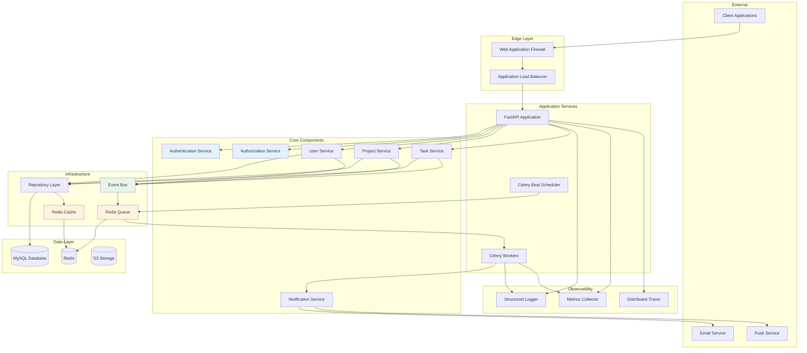
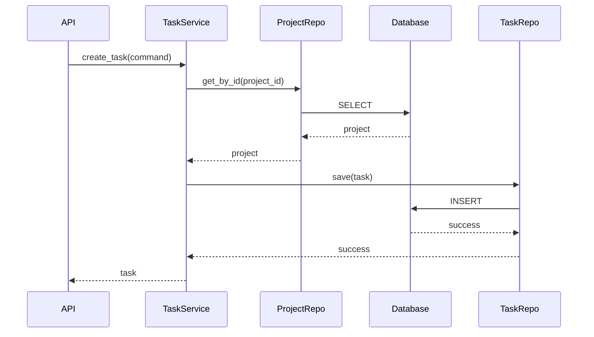
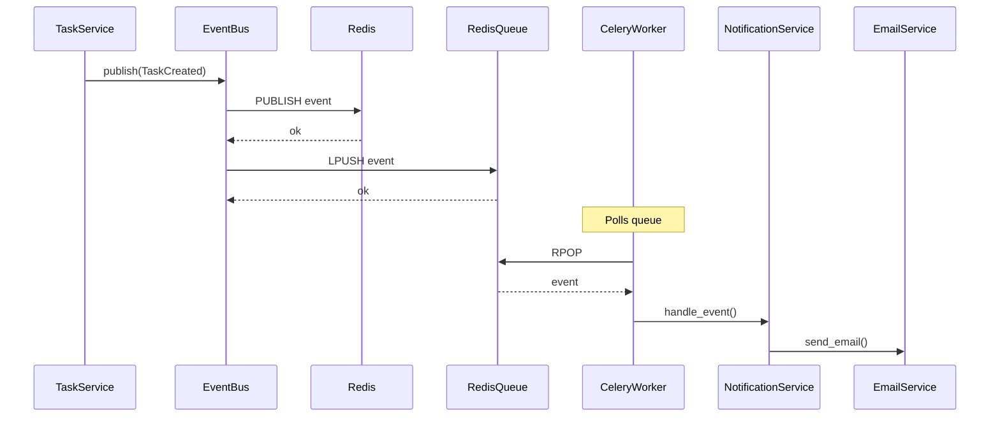

# Component Interactions

**Version**: 1.0.0  
**Last Updated**: 2025-10-30  
**Status**: Active

## Overview

This document describes the major system components, their responsibilities, and how they interact with each other. Each component is designed to fulfill a specific role within the overall architecture while maintaining loose coupling through well-defined interfaces.

---

## Component Diagram



---

## Core Components

### 1. Application Load Balancer (ALB)

**Purpose**: Distribute incoming HTTP/HTTPS traffic across multiple API instances.

**Responsibilities**:

- TLS termination (HTTPS → HTTP)
- Health check monitoring
- Traffic distribution (round-robin)
- Sticky sessions (if needed)
- Request routing based on path

**Technology**: AWS Application Load Balancer

**Configuration**:

```yaml
Health Check:
  Path: /health
  Interval: 30 seconds
  Timeout: 5 seconds
  Healthy Threshold: 2
  Unhealthy Threshold: 3

Target Group:
  Protocol: HTTP
  Port: 8000
  Deregistration Delay: 30 seconds
```

**Interactions**:

- **Inbound**: Client applications (web, mobile)
- **Outbound**: FastAPI instances
- **Health Monitoring**: Periodic /health endpoint checks

---

### 2. FastAPI Application

**Purpose**: Handle HTTP requests, route to appropriate services, manage request/response lifecycle.

**Responsibilities**:

- HTTP request parsing and validation
- JWT token validation
- Route requests to use cases
- Error handling and HTTP status codes
- OpenAPI documentation generation
- CORS handling
- Rate limiting (via middleware)

**Technology**: FastAPI 0.104+, Python 3.11+

**Key Features**:

```python
# Main application
app = FastAPI(
    title="Task Management API",
    version="1.0.0",
    docs_url="/api/docs",
    openapi_url="/api/openapi.json"
)

# Middleware stack
app.add_middleware(CORSMiddleware)
app.add_middleware(AuthenticationMiddleware)
app.add_middleware(LoggingMiddleware)
app.add_middleware(MetricsMiddleware)

# Router registration
app.include_router(auth_router, prefix="/api/v1/auth")
app.include_router(users_router, prefix="/api/v1/users")
app.include_router(projects_router, prefix="/api/v1/projects")
app.include_router(tasks_router, prefix="/api/v1/tasks")
```

**Interactions**:

- **Inbound**: ALB (HTTP requests)
- **Outbound**: Use cases, authentication service, metrics collector
- **Dependencies**: Redis (session cache), Database (via repositories)

---

### 3. Authentication Service

**Purpose**: Manage user authentication, JWT token generation and validation.

**Responsibilities**:

- Password verification (bcrypt)
- JWT access token generation (15-min expiry)
- JWT refresh token generation (30-day expiry)
- Token validation and parsing
- Session management (Redis cache)
- Token blacklisting for logout

**Implementation**:

```python
class AuthenticationService:
    def authenticate(self, email: str, password: str) -> TokenPair:
        # 1. Retrieve user by email
        user = self.user_repo.get_by_email(Email(email))

        # 2. Verify password
        if not user or not user.verify_password(password):
            raise InvalidCredentialsError()

        # 3. Generate tokens
        access_token = self._generate_jwt(user, expires_minutes=15)
        refresh_token = self._generate_jwt(user, expires_days=30)

        # 4. Cache session
        self.cache.set(f"session:{access_token}", {
            "user_id": str(user.user_id),
            "email": user.email.value
        }, ttl=900)

        # 5. Log event
        self.audit_service.log_login(user.user_id)

        return TokenPair(access_token, refresh_token)

    def validate_token(self, token: str) -> UserContext:
        # 1. Check blacklist
        if self.cache.exists(f"blacklist:{token}"):
            raise InvalidTokenError("Token has been revoked")

        # 2. Verify JWT signature and expiry
        payload = jwt.decode(token, self.secret_key, algorithms=["HS256"])

        # 3. Check session cache
        session = self.cache.get(f"session:{token}")
        if not session:
            raise InvalidTokenError("Session expired")

        return UserContext(
            user_id=UUID(payload["sub"]),
            email=payload["email"],
            roles=payload["roles"]
        )
```

**Interactions**:

- **Inbound**: API controllers
- **Outbound**: User repository, Redis cache, audit service
- **Events**: Publishes `UserLoggedIn`, `UserLoggedOut`

---

### 4. Authorization Service

**Purpose**: Enforce role-based access control (RBAC) and resource-level permissions.

**Responsibilities**:

- Permission checking based on roles
- Resource ownership validation
- Organization membership verification
- Project membership verification

**Implementation**:

```python
class AuthorizationService:
    def can_access_project(self, user_id: UUID, project_id: UUID) -> bool:
        # Check if user is member of project
        return self.project_repo.is_member(project_id, user_id)

    def can_modify_task(self, user_id: UUID, task_id: UUID) -> bool:
        task = self.task_repo.get_by_id(task_id)
        if not task:
            return False

        # Check if user is project member with appropriate role
        membership = self.project_repo.get_membership(task.project_id, user_id)
        return membership and membership.role in [
            ProjectRole.OWNER,
            ProjectRole.ADMIN,
            ProjectRole.CONTRIBUTOR
        ]

    def require_role(self, user_id: UUID, org_id: UUID, required_role: Role) -> None:
        membership = self.org_repo.get_membership(org_id, user_id)
        if not membership or not membership.has_role(required_role):
            raise InsufficientPermissionsError()
```

**Interactions**:

- **Inbound**: API controllers, use cases
- **Outbound**: User/project/organization repositories
- **Caching**: Permission checks cached in Redis

---

### 5. Domain Services (User, Project, Task)

**Purpose**: Implement use cases and orchestrate domain entities.

**Responsibilities**:

- Execute business workflows
- Coordinate multiple repositories
- Validate business rules
- Publish domain events
- Transaction management

**Example - Task Service**:

```python
class TaskService:
    def create_task(self, command: CreateTaskCommand) -> Task:
        # 1. Validate project exists
        project = self.project_repo.get_by_id(command.project_id)
        if not project:
            raise ProjectNotFoundError()

        # 2. Check permissions
        if not self.authz.can_access_project(command.user_id, command.project_id):
            raise InsufficientPermissionsError()

        # 3. Create domain entity
        task = Task.create(
            title=command.title,
            description=command.description,
            project_id=command.project_id,
            created_by=command.user_id
        )

        # 4. Save to repository
        self.task_repo.save(task)

        # 5. Publish domain events
        for event in task.domain_events:
            self.event_bus.publish(event)

        return task
```

**Interactions**:

- **Inbound**: API controllers
- **Outbound**: Repositories, event bus, cache
- **Events**: Publishes domain events (TaskCreated, TaskAssigned, etc.)

---

### 6. Repository Layer

**Purpose**: Abstract data access and provide collection-like interfaces for domain entities.

**Responsibilities**:

- CRUD operations for entities
- Query construction
- Entity-to-ORM mapping
- Transaction management
- Caching layer integration

**Structure**:

```python
# Domain interface (in domain layer)
class TaskRepository(ABC):
    @abstractmethod
    def get_by_id(self, task_id: UUID) -> Optional[Task]: ...

    @abstractmethod
    def save(self, task: Task) -> None: ...

    @abstractmethod
    def list_by_project(self, project_id: UUID) -> List[Task]: ...

# SQLAlchemy implementation (in infrastructure layer)
class SqlAlchemyTaskRepository(TaskRepository):
    def __init__(self, session: Session, cache: RedisCache):
        self._session = session
        self._cache = cache

    def get_by_id(self, task_id: UUID) -> Optional[Task]:
        # Try cache first
        cached = self._cache.get(f"task:{task_id}")
        if cached:
            return self._deserialize(cached)

        # Query database
        model = self._session.query(TaskModel).filter_by(task_id=task_id).first()
        if not model:
            return None

        # Map to domain entity
        task = self._mapper.to_entity(model)

        # Cache result
        self._cache.set(f"task:{task_id}", self._serialize(task), ttl=60)

        return task
```

**Interactions**:

- **Inbound**: Domain services
- **Outbound**: MySQL database, Redis cache
- **Transactions**: Managed via SQLAlchemy session

---

### 7. Redis Cache

**Purpose**: Reduce database load by caching frequently accessed data.

**Responsibilities**:

- Session storage (JWT validation data)
- Entity caching (users, projects, tasks)
- API rate limiting counters
- Distributed locks
- Pub/sub for events

**Caching Strategies**:

| Data Type           | TTL       | Invalidation Strategy       |
| ------------------- | --------- | --------------------------- |
| User sessions       | 15 min    | Time-based expiration       |
| User profiles       | 5 min     | Write-through               |
| Project metadata    | 5 min     | Write-through               |
| Task lists          | 1 min     | Write-through + event-based |
| Notification counts | Real-time | Event-based                 |
| Permission checks   | 5 min     | Event-based                 |

**Implementation**:

```python
class RedisCache:
    def __init__(self, redis_client: redis.Redis):
        self._redis = redis_client

    def get(self, key: str) -> Optional[Any]:
        value = self._redis.get(key)
        return json.loads(value) if value else None

    def set(self, key: str, value: Any, ttl: int = 300) -> None:
        serialized = json.dumps(value)
        self._redis.setex(key, ttl, serialized)

    def delete(self, key: str) -> None:
        self._redis.delete(key)

    def invalidate_pattern(self, pattern: str) -> None:
        """Invalidate all keys matching pattern."""
        keys = self._redis.keys(pattern)
        if keys:
            self._redis.delete(*keys)
```

**Interactions**:

- **Inbound**: Repositories, authentication service, rate limiter
- **Outbound**: Redis server (AWS ElastiCache)

---

### 8. Event Bus

**Purpose**: Enable asynchronous communication between bounded contexts via domain events.

**Responsibilities**:

- Publish domain events
- Subscribe to events
- Event routing to workers
- Event persistence (for replay)
- Dead letter queue for failed events

**Implementation**:

```python
class RedisEventBus:
    def publish(self, event: DomainEvent) -> None:
        # Serialize event
        payload = {
            "event_id": str(uuid.uuid4()),
            "event_type": event.__class__.__name__,
            "aggregate_id": str(event.aggregate_id),
            "data": event.to_dict(),
            "occurred_at": event.occurred_at.isoformat(),
            "version": 1
        }

        # Publish to Redis channel
        channel = f"events.{event.__class__.__name__}"
        self._redis.publish(channel, json.dumps(payload))

        # Also push to queue for workers
        self._redis.lpush("event_queue", json.dumps(payload))

        # Store in event store for replay
        self._event_store.append(payload)

    def subscribe(self, event_type: str, handler: Callable) -> None:
        self._handlers[event_type] = handler
```

**Event Flow**:

```
Domain Entity → Event Bus → Redis Pub/Sub → Celery Workers
                         ↓
                    Event Store (MySQL)
```

**Interactions**:

- **Inbound**: Domain services (publish events)
- **Outbound**: Redis (pub/sub), Celery queue, event store

---

### 9. Celery Workers

**Purpose**: Process background tasks asynchronously without blocking API requests.

**Responsibilities**:

- Email sending (transactional, digests)
- Push notification delivery
- Report generation (PDF, CSV)
- Data aggregation and analytics
- Webhook delivery
- Scheduled tasks (cleanup, reminders)

**Worker Types**:

| Worker Type   | Queue     | Priority | Concurrency |
| ------------- | --------- | -------- | ----------- |
| High Priority | `high`    | 10       | 4 workers   |
| Default       | `default` | 5        | 8 workers   |
| Low Priority  | `low`     | 1        | 4 workers   |
| Scheduled     | `beat`    | -        | 1 worker    |

**Task Example**:

```python
@celery_app.task(bind=True, max_retries=3)
def send_task_assignment_email(self, task_id: str, assignee_id: str):
    try:
        # 1. Load task details
        task = task_repo.get_by_id(UUID(task_id))
        user = user_repo.get_by_id(UUID(assignee_id))

        # 2. Render email template
        html_body = render_template("task_assigned.html", task=task, user=user)

        # 3. Send via email service
        email_service.send(
            to=user.email,
            subject=f"Task Assigned: {task.title}",
            html_body=html_body
        )

        # 4. Log success
        logger.info(f"Task assignment email sent: {task_id} → {assignee_id}")

    except Exception as exc:
        # Retry with exponential backoff
        self.retry(exc=exc, countdown=2 ** self.request.retries)
```

**Interactions**:

- **Inbound**: Event bus (domain events), Celery beat (scheduled)
- **Outbound**: Email service, push service, repositories
- **Queue**: Redis (message broker)

---

### 10. Celery Beat Scheduler

**Purpose**: Schedule periodic tasks (cron-like functionality).

**Responsibilities**:

- Trigger scheduled tasks
- Manage task schedules
- Ensure single execution (no duplicates)

**Scheduled Tasks**:

```python
celery_app.conf.beat_schedule = {
    'send-daily-digest': {
        'task': 'tasks.send_daily_digest',
        'schedule': crontab(hour=8, minute=0),  # 8 AM daily
    },
    'cleanup-old-notifications': {
        'task': 'tasks.cleanup_notifications',
        'schedule': crontab(hour=2, minute=0),  # 2 AM daily
    },
    'generate-analytics': {
        'task': 'tasks.generate_analytics',
        'schedule': crontab(hour=0, minute=0),  # Midnight
    },
    'check-overdue-tasks': {
        'task': 'tasks.check_overdue_tasks',
        'schedule': crontab(minute='*/15'),  # Every 15 minutes
    },
}
```

**Interactions**:

- **Inbound**: Internal timer
- **Outbound**: Redis queue (enqueues tasks)

---

### 11. Notification Service

**Purpose**: Manage notification creation and delivery across multiple channels.

**Responsibilities**:

- Create notifications from domain events
- Check user preferences
- Route to appropriate channels (email, push, in-app)
- Track delivery status
- Handle notification failures

**Multi-Channel Delivery**:

```python
class NotificationService:
    def handle_task_assigned_event(self, event: TaskAssignedEvent):
        # 1. Get user preferences
        prefs = self.notif_repo.get_preferences(event.assignee_id)

        # 2. Create in-app notification
        notification = Notification.create(
            user_id=event.assignee_id,
            type=NotificationType.TASK_ASSIGNED,
            title="Task Assigned",
            message=f"You were assigned to: {event.task_title}",
            action_url=f"/tasks/{event.task_id}"
        )
        self.notif_repo.save(notification)

        # 3. Send email if enabled
        if prefs.email_enabled:
            self.celery_app.send_task(
                'send_task_assignment_email',
                args=[str(event.task_id), str(event.assignee_id)]
            )

        # 4. Send push if enabled
        if prefs.push_enabled:
            self.push_service.send(
                user_id=event.assignee_id,
                title="Task Assigned",
                body=f"You were assigned to: {event.task_title}"
            )
```

**Interactions**:

- **Inbound**: Event bus (domain events)
- **Outbound**: Email service (SES), push service, repository
- **Storage**: Notifications stored in MySQL

---

### 12. Observability Stack

**Purpose**: Provide comprehensive visibility into system behavior and performance.

#### Structured Logger

```python
import structlog

logger = structlog.get_logger()

# Log with structured context
logger.info(
    "task_created",
    task_id=str(task.task_id),
    project_id=str(task.project_id),
    user_id=str(current_user.user_id),
    duration_ms=elapsed_time
)
```

#### Metrics Collector

```python
from prometheus_client import Counter, Histogram

# Define metrics
http_requests_total = Counter(
    'http_requests_total',
    'Total HTTP requests',
    ['method', 'endpoint', 'status']
)

http_request_duration = Histogram(
    'http_request_duration_seconds',
    'HTTP request duration',
    ['method', 'endpoint']
)

# Instrument code
http_requests_total.labels(method='POST', endpoint='/tasks', status='201').inc()
http_request_duration.labels(method='POST', endpoint='/tasks').observe(0.123)
```

#### Distributed Tracer

```python
from opentelemetry import trace

tracer = trace.get_tracer(__name__)

with tracer.start_as_current_span("create_task") as span:
    span.set_attribute("task.title", task.title)
    span.set_attribute("project.id", str(project_id))

    # Operation spans nested automatically
    task = task_service.create_task(command)
```

**Interactions**:

- **Inbound**: All application components
- **Outbound**: Prometheus, CloudWatch Logs, OpenTelemetry Collector

---

## Component Communication Patterns

### Synchronous (Request-Response)



### Asynchronous (Event-Driven)



---

## Related Documents

- [System Architecture Overview](./diagrams/01-system-overview.md)
- [Layer Responsibilities](./layers.md)
- [Bounded Contexts](./bounded-contexts.md)
- [Data Flows](./data-flows.md)
- [Scalability Patterns](./scalability.md)
- [Observability Framework](./observability/README.md)

---

**Last Reviewed**: 2025-10-30  
**Next Review**: 2026-01-30 (Quarterly)
