# Data Flows

**Version**: 1.0.0  
**Last Updated**: 2025-10-30  
**Status**: Active

## Overview

This document describes end-to-end data flows for key system operations, showing how data moves through different layers and components. Each flow demonstrates Clean Architecture principles in action.

---

## Flow Categories

| Flow Type        | Examples                                  | Characteristics                             |
| ---------------- | ----------------------------------------- | ------------------------------------------- |
| **Synchronous**  | Authentication, Create Task, Get Projects | Client waits for response, <500ms           |
| **Asynchronous** | Send Email, Process Notification          | Background processing, eventual consistency |
| **Scheduled**    | Daily Digest, Cleanup Jobs                | Time-triggered, batch processing            |
| **Event-Driven** | Task Assignment → Notification            | Reactive, decoupled components              |

---

## Authentication Flow

### User Login

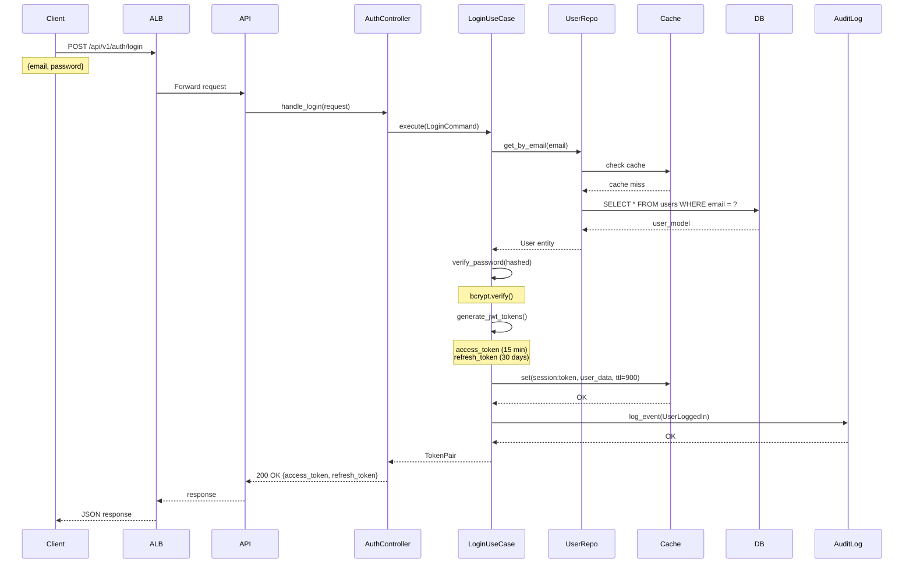

**Data Transformations**:

1. **Client Request** (JSON):

   ```json
   {
     "email": "user@example.com",
     "password": "SecurePass123!"
   }
   ```

2. **LoginCommand** (DTO):

   ```python
   LoginCommand(
       email="user@example.com",
       password="SecurePass123!"
   )
   ```

3. **Database Query**:

   ```sql
   SELECT user_id, email, password_hash, status, created_at
   FROM users
   WHERE email = 'user@example.com' AND status = 'ACTIVE'
   ```

4. **Domain Entity**:

   ```python
   User(
       user_id=UUID('...'),
       email=Email('user@example.com'),
       password_hash='$2b$12$...',
       status=UserStatus.ACTIVE
   )
   ```

5. **Response** (JSON):
   ```json
   {
     "access_token": "eyJhbGciOiJIUzI1NiIs...",
     "refresh_token": "eyJhbGciOiJIUzI1NiIs...",
     "token_type": "Bearer",
     "expires_in": 900
   }
   ```

**Performance Characteristics**:

- **p50**: 50ms
- **p95**: 120ms
- **p99**: 200ms
- **Database Queries**: 1 (cached after first access)
- **Cache Operations**: 2 (read + write)

---

### Token Validation (Middleware)

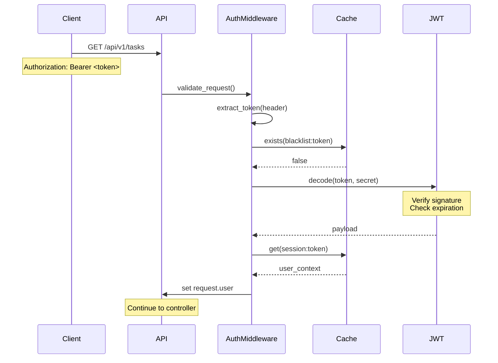

**Fast Path** (cached session):

- Cache check: 2ms
- JWT decode: 5ms
- **Total**: ~7ms overhead per request

---

## Task Creation Flow

### End-to-End Task Creation

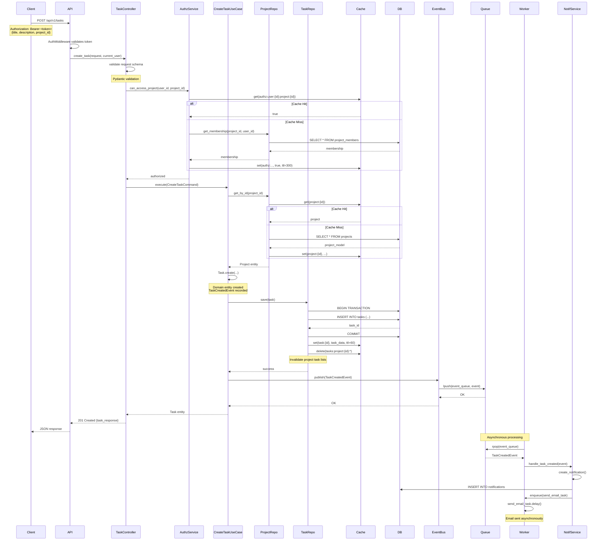

**Data Transformations**:

1. **HTTP Request**:

   ```json
   POST /api/v1/tasks
   Authorization: Bearer eyJhbGci...
   Content-Type: application/json

   {
     "title": "Implement user authentication",
     "description": "Add JWT-based authentication",
     "project_id": "123e4567-e89b-12d3-a456-426614174000",
     "assignee_id": null,
     "due_date": "2025-11-15T23:59:59Z",
     "priority": "HIGH"
   }
   ```

2. **CreateTaskCommand** (Application Layer):

   ```python
   CreateTaskCommand(
       title="Implement user authentication",
       description="Add JWT-based authentication",
       project_id=UUID('123e4567-e89b-12d3-a456-426614174000'),
       created_by=UUID('user-id-from-token'),
       assignee_id=None,
       due_date=datetime(2025, 11, 15, 23, 59, 59),
       priority=TaskPriority.HIGH
   )
   ```

3. **Domain Entity Creation**:

   ```python
   task = Task.create(
       title="Implement user authentication",
       description="Add JWT-based authentication",
       project_id=UUID('123e4567-...'),
       created_by=UUID('user-id-...')
   )
   # task.task_id generated (UUID)
   # task.status = TaskStatus.TODO
   # task.created_at = datetime.now()
   # task.domain_events = [TaskCreatedEvent(...)]
   ```

4. **Database Insert**:

   ```sql
   INSERT INTO tasks (
       task_id, title, description, project_id,
       created_by, status, priority, due_date, created_at
   ) VALUES (
       '456e7890-e89b-12d3-a456-426614174001',
       'Implement user authentication',
       'Add JWT-based authentication',
       '123e4567-e89b-12d3-a456-426614174000',
       'user-id-from-token',
       'TODO',
       'HIGH',
       '2025-11-15 23:59:59',
       '2025-10-30 14:23:45'
   )
   ```

5. **Domain Event**:

   ```python
   TaskCreatedEvent(
       aggregate_id=UUID('456e7890-...'),
       task_id=UUID('456e7890-...'),
       title="Implement user authentication",
       project_id=UUID('123e4567-...'),
       created_by=UUID('user-id-...'),
       occurred_at=datetime.now()
   )
   ```

6. **HTTP Response**:

   ```json
   HTTP/1.1 201 Created
   Content-Type: application/json

   {
     "task_id": "456e7890-e89b-12d3-a456-426614174001",
     "title": "Implement user authentication",
     "description": "Add JWT-based authentication",
     "status": "TODO",
     "priority": "HIGH",
     "project_id": "123e4567-e89b-12d3-a456-426614174000",
     "created_by": "user-id-from-token",
     "assignee_id": null,
     "due_date": "2025-11-15T23:59:59Z",
     "created_at": "2025-10-30T14:23:45Z",
     "updated_at": "2025-10-30T14:23:45Z"
   }
   ```

**Performance Characteristics**:

- **Synchronous Path** (API response):
  - Authorization check: 5-10ms (cached)
  - Project lookup: 5-10ms (cached)
  - Task creation: 20-30ms (domain logic)
  - Database insert: 10-20ms
  - Cache operations: 5-10ms
  - **Total p95**: <100ms
- **Asynchronous Path** (event processing):
  - Event publish: 5ms
  - Worker pickup: 50-200ms (queue polling)
  - Notification creation: 20-50ms
  - Email delivery: 1-3 seconds (external service)

---

## Task Assignment Flow

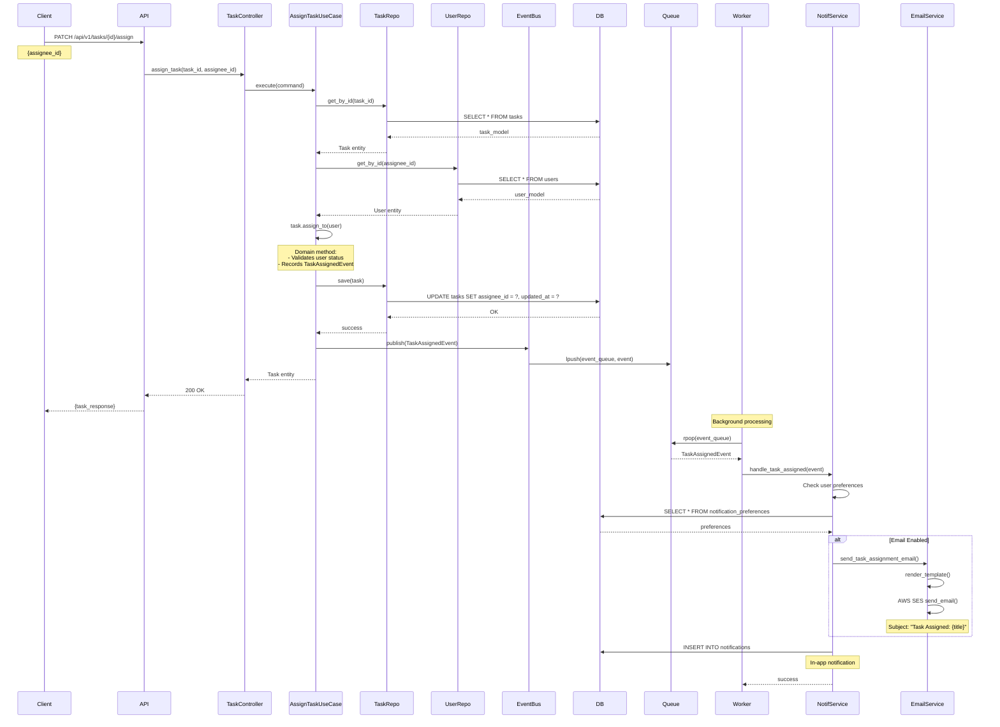

**Key Points**:

- **Synchronous**: Client gets immediate confirmation
- **Asynchronous**: Email sent in background (non-blocking)
- **User Preferences**: Notification channels configurable per user

---

## Notification Delivery Flow

### Multi-Channel Notification

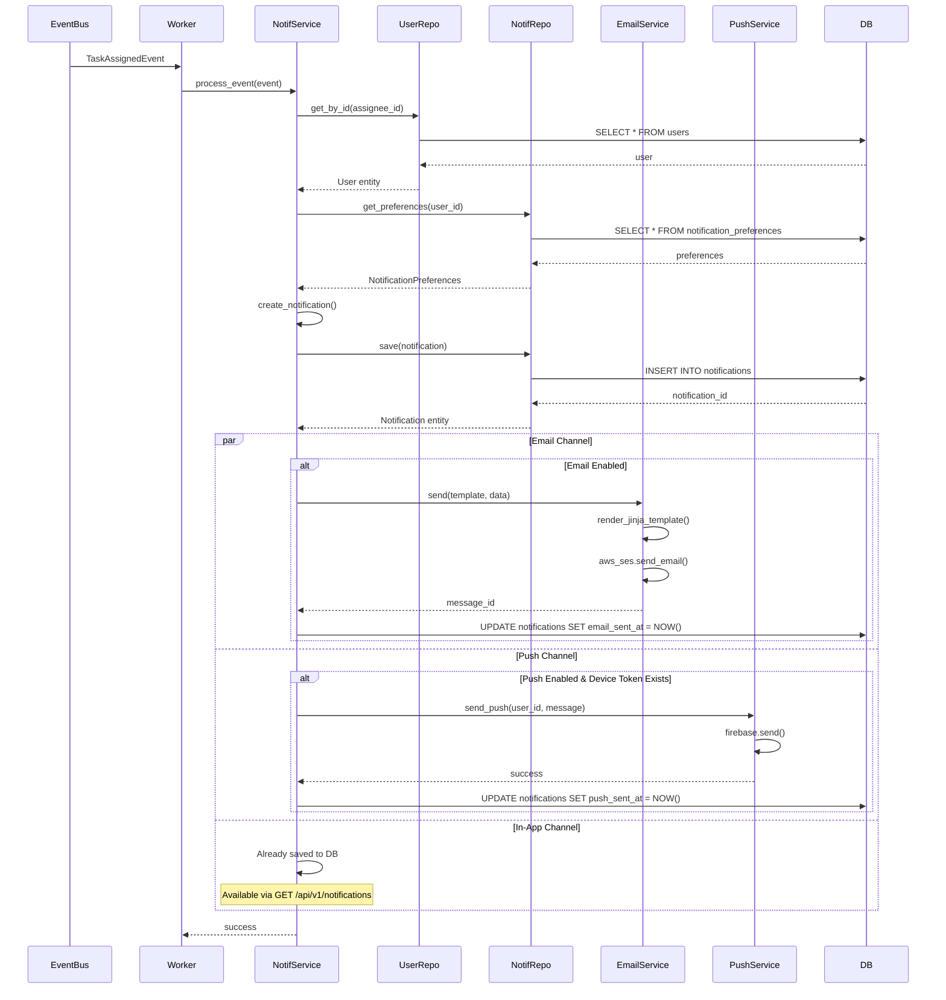

**Notification Channels**:

| Channel     | Delivery Method          | Latency     | Retry Logic                    |
| ----------- | ------------------------ | ----------- | ------------------------------ |
| **In-App**  | Database insert          | Immediate   | N/A (persistent)               |
| **Email**   | AWS SES                  | 1-3 seconds | 3 retries, exponential backoff |
| **Push**    | Firebase Cloud Messaging | 500ms-2s    | 3 retries, exponential backoff |
| **Webhook** | HTTP POST                | 1-5 seconds | 5 retries, exponential backoff |

**User Preferences**:

```python
class NotificationPreferences:
    user_id: UUID
    email_enabled: bool = True
    push_enabled: bool = True
    email_digest: bool = True  # Daily digest
    email_frequency: str = "IMMEDIATE"  # or "DIGEST", "DISABLED"
    channels: Dict[str, ChannelConfig] = {
        "task_assigned": {"email": True, "push": True, "in_app": True},
        "task_completed": {"email": False, "push": True, "in_app": True},
        "comment_added": {"email": False, "push": False, "in_app": True},
        "due_date_reminder": {"email": True, "push": True, "in_app": True}
    }
```

---

## Daily Digest Flow (Scheduled)

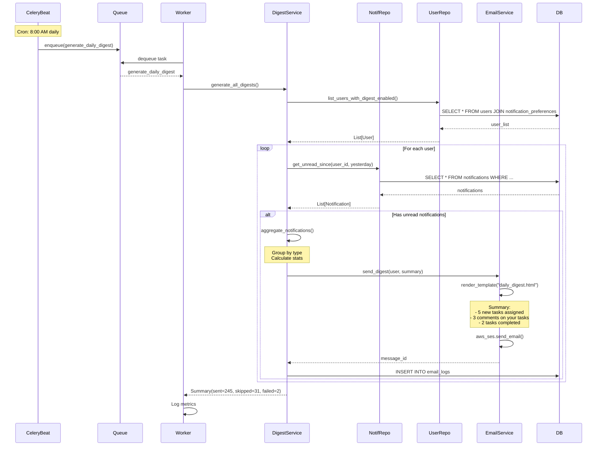

**Digest Email Structure**:

```html
<!DOCTYPE html>
<html>
  <head>
    <title>Your Daily Update</title>
  </head>
  <body>
    <h1>Good morning, {{user.name}}!</h1>

    <section>
      <h2>📋 Tasks (5 new)</h2>
      <ul>
        <li>
          <strong>High Priority:</strong> Implement authentication (Due: Today)
        </li>
        <li>Fix bug in user profile (Due: Tomorrow)</li>
        <!-- ... -->
      </ul>
    </section>

    <section>
      <h2>💬 Comments (3 new)</h2>
      <ul>
        <li>@john commented on "Implement authentication"</li>
        <!-- ... -->
      </ul>
    </section>

    <section>
      <h2>✅ Completed (2 tasks)</h2>
      <ul>
        <li>Design mockups - by @sarah</li>
        <!-- ... -->
      </ul>
    </section>

    <footer>
      <a href="{{app_url}}/notifications">View all notifications</a>
      <a href="{{app_url}}/settings/notifications">Manage preferences</a>
    </footer>
  </body>
</html>
```

---

## Project Creation Flow

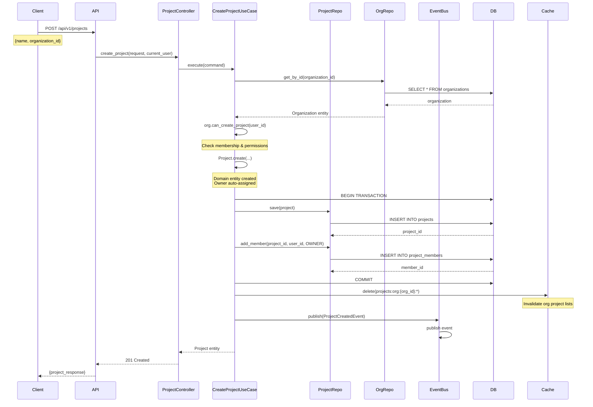

**Transaction Boundary**:

```python
@transactional
def execute(self, command: CreateProjectCommand) -> Project:
    # All database operations within this method
    # are part of a single transaction

    org = self.org_repo.get_by_id(command.organization_id)

    project = Project.create(
        name=command.name,
        organization_id=command.organization_id
    )

    self.project_repo.save(project)  # INSERT INTO projects
    self.project_repo.add_member(
        project.project_id,
        command.created_by,
        ProjectRole.OWNER
    )  # INSERT INTO project_members

    # Both operations commit together or rollback together

    return project
```

---

## Error Handling Flow

### Validation Error

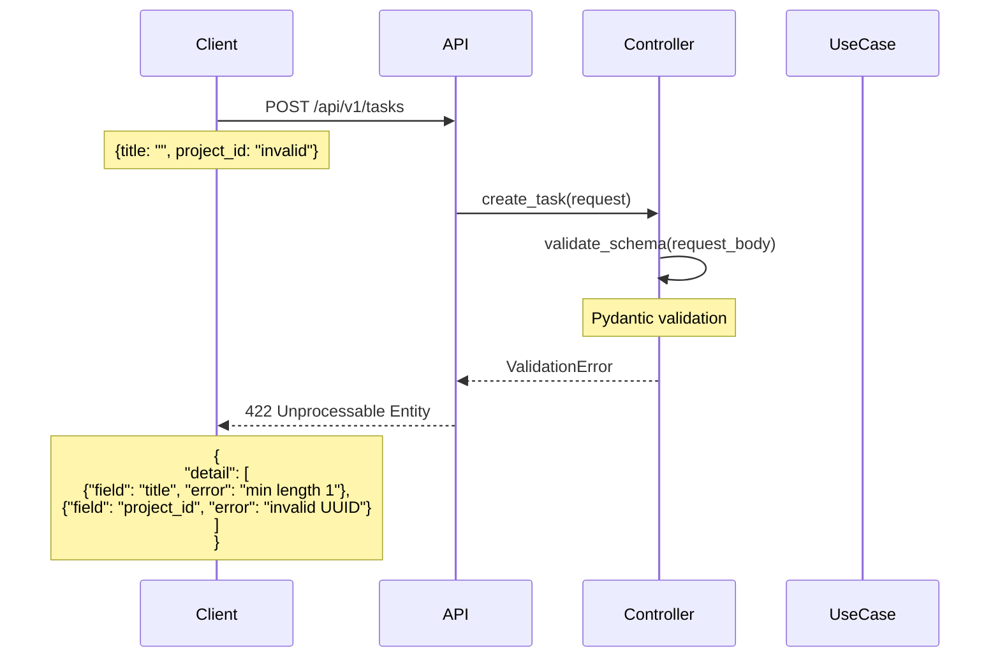

### Business Logic Error

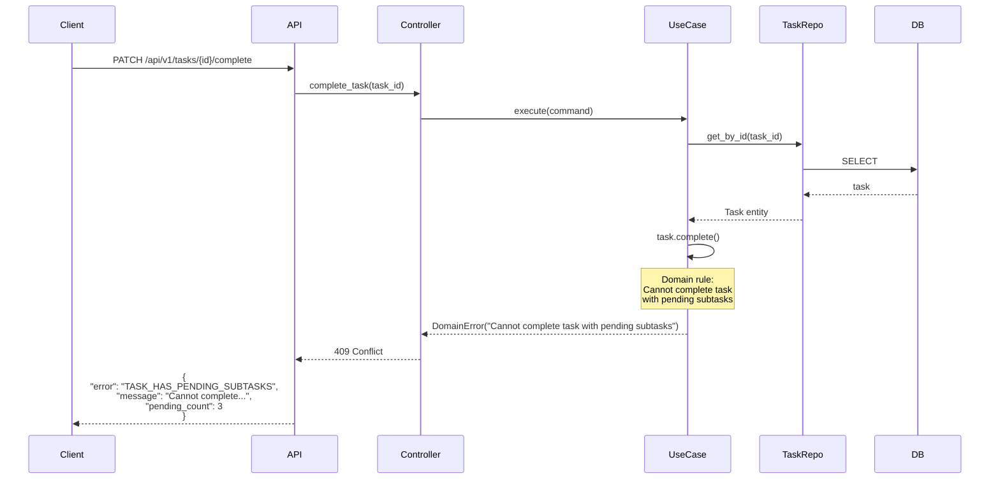

### Infrastructure Error with Retry

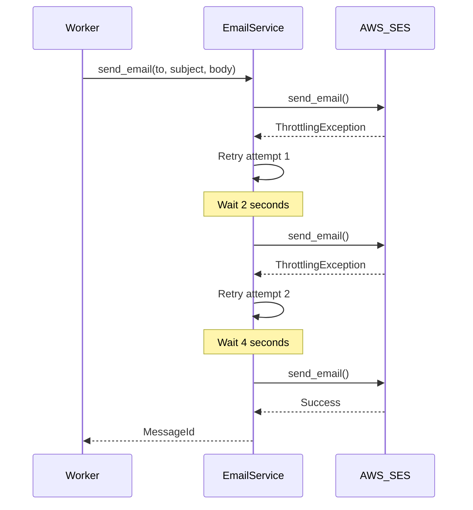

---

## Performance Optimization Patterns

### Cache-Aside Pattern

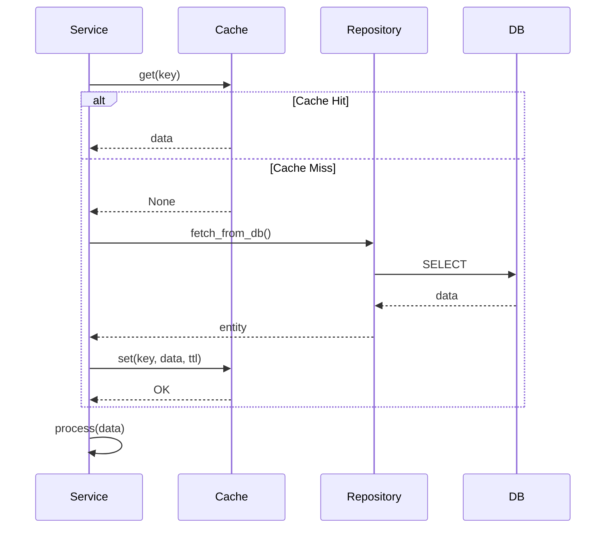

### Write-Through Cache

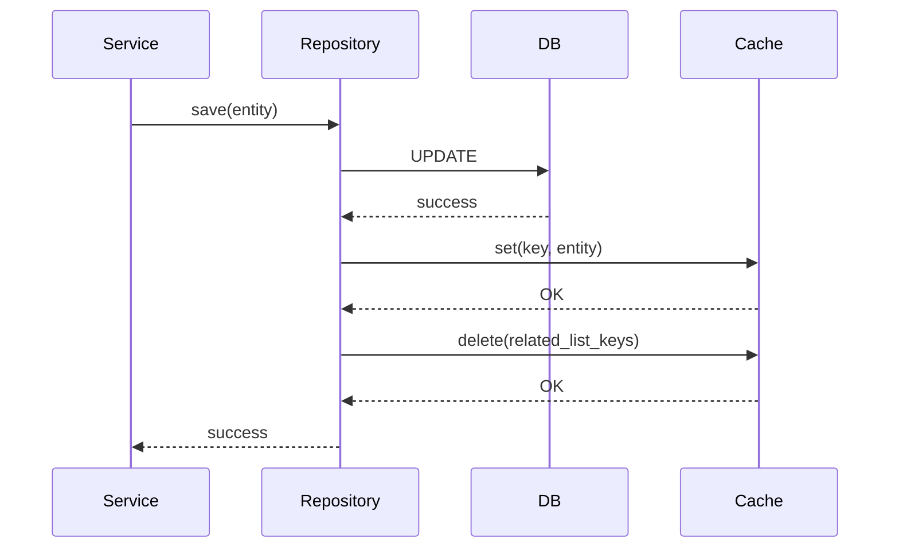

### Database Query Optimization

**Before** (N+1 Query Problem):

```python
# Fetch project
project = project_repo.get_by_id(project_id)  # 1 query

# Fetch tasks (N queries - BAD!)
for task_id in project.task_ids:
    task = task_repo.get_by_id(task_id)  # N queries
    tasks.append(task)
```

**After** (Eager Loading):

```python
# Fetch project with tasks in one query
project = project_repo.get_by_id_with_tasks(project_id)  # 1 query with JOIN
```

**SQL**:

```sql
-- Optimized query
SELECT
    p.project_id, p.name, p.created_at,
    t.task_id, t.title, t.status, t.priority
FROM projects p
LEFT JOIN tasks t ON t.project_id = p.project_id
WHERE p.project_id = ?
```

---

## Data Consistency Patterns

### Eventual Consistency (Event-Driven)

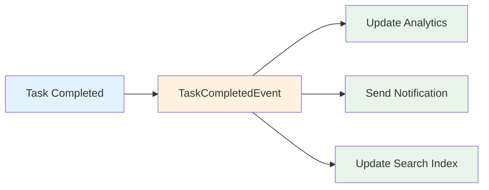

**Characteristics**:

- Task completion happens immediately (strong consistency)
- Analytics, notifications, search updates happen asynchronously (eventual consistency)
- Acceptable delay: <5 seconds
- Retry on failure ensures eventual consistency

### Strong Consistency (Transaction)

```python
@transactional
def transfer_task(self, task_id: UUID, from_project: UUID, to_project: UUID):
    # All operations are atomic
    task = self.task_repo.get_by_id(task_id)
    task.transfer_to_project(to_project)

    self.task_repo.save(task)  # UPDATE tasks SET project_id = ?

    # Update project statistics in same transaction
    self.project_repo.decrement_task_count(from_project)
    self.project_repo.increment_task_count(to_project)

    # Commit or rollback all together
```

---

## Related Documents

- [System Architecture Overview](./diagrams/01-system-overview.md)
- [Component Interactions](./components.md)
- [Layer Responsibilities](./layers.md)
- [API Design Guidelines](./api-design.md)
- [Performance Tuning](./observability/performance.md)
- [Error Handling Patterns](./error-handling.md)

---

**Last Reviewed**: 2025-10-30  
**Next Review**: 2026-01-30 (Quarterly)
