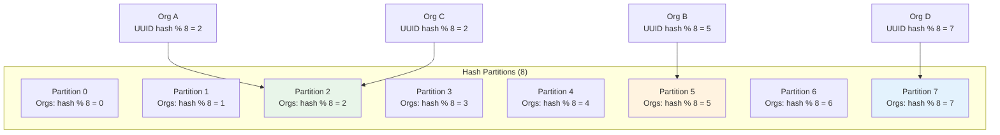
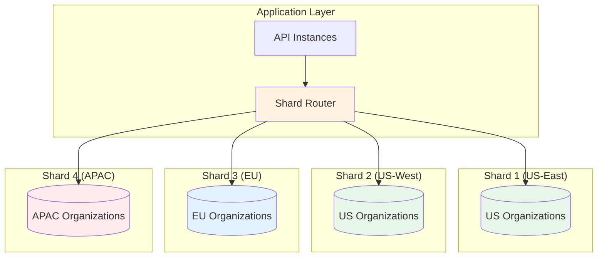

# Data Partitioning Strategy

**Version**: 1.0.0  
**Last Updated**: 2025-10-30  
**Status**: Active

## Overview

This document defines data partitioning strategies for the Task Management System to manage data growth, improve query performance, and enable horizontal scalability. Partitioning distributes data across multiple physical storage units while maintaining logical access patterns.

---

## Partitioning Principles

### Core Principles

1. **Access Pattern Alignment**: Partition by most common query patterns
2. **Tenant Isolation**: Separate organization data for security and performance
3. **Time-Based Archival**: Archive old data to reduce working set size
4. **Balanced Distribution**: Avoid hotspots and uneven data distribution
5. **Query Locality**: Minimize cross-partition queries

---

## Partitioning Strategies

### 1. Organization-Based Partitioning (User Data)

**Rationale**: Users belong to organizations; queries are typically scoped by organization.

**Tables**: `users`, `organizations`, `organization_members`, `roles`

**Partition Key**: `organization_id`

**Schema**:

```sql
-- Partitioned users table
CREATE TABLE users (
    user_id UUID PRIMARY KEY,
    organization_id UUID NOT NULL,
    email VARCHAR(255) NOT NULL,
    name VARCHAR(255) NOT NULL,
    status VARCHAR(50) NOT NULL,
    created_at TIMESTAMP NOT NULL,
    updated_at TIMESTAMP NOT NULL,
    INDEX idx_org_id (organization_id),
    INDEX idx_email (email),
    INDEX idx_status (status, organization_id)
) PARTITION BY HASH(organization_id) PARTITIONS 8;
```

**Benefits**:

- ✅ Tenant isolation (each org has separate partition)
- ✅ Efficient org-scoped queries
- ✅ Easy data deletion (drop partition for org)
- ✅ Scalable with organization growth

**Query Patterns**:

```python
# ✅ Efficient: Single partition scan
users = db.query(User).filter_by(organization_id=org_id).all()

# ❌ Inefficient: Full table scan across all partitions
all_users = db.query(User).all()

# ✅ Efficient: Partition + secondary index
user = db.query(User).filter_by(
    organization_id=org_id,
    email=email
).first()
```

**Partition Distribution**:



---

### 2. Project-Based Partitioning (Task Data)

**Rationale**: Tasks belong to projects; queries are typically scoped by project.

**Tables**: `tasks`, `comments`, `attachments`, `task_history`

**Partition Key**: `project_id`

**Schema**:

```sql
-- Partitioned tasks table
CREATE TABLE tasks (
    task_id UUID PRIMARY KEY,
    project_id UUID NOT NULL,
    title VARCHAR(500) NOT NULL,
    description TEXT,
    status VARCHAR(50) NOT NULL,
    priority VARCHAR(50) NOT NULL,
    assignee_id UUID,
    created_by UUID NOT NULL,
    created_at TIMESTAMP NOT NULL,
    updated_at TIMESTAMP NOT NULL,
    due_date TIMESTAMP,
    completed_at TIMESTAMP,
    INDEX idx_project_id (project_id),
    INDEX idx_status (project_id, status),
    INDEX idx_assignee (project_id, assignee_id),
    INDEX idx_created_at (project_id, created_at DESC)
) PARTITION BY HASH(project_id) PARTITIONS 16;

-- Partitioned comments table
CREATE TABLE comments (
    comment_id UUID PRIMARY KEY,
    task_id UUID NOT NULL,
    project_id UUID NOT NULL,  -- Denormalized for partitioning
    author_id UUID NOT NULL,
    content TEXT NOT NULL,
    created_at TIMESTAMP NOT NULL,
    updated_at TIMESTAMP NOT NULL,
    INDEX idx_task_id (project_id, task_id),
    INDEX idx_author (project_id, author_id),
    FOREIGN KEY (task_id) REFERENCES tasks(task_id)
) PARTITION BY HASH(project_id) PARTITIONS 16;
```

**Benefits**:

- ✅ Co-locate related data (tasks + comments in same partition)
- ✅ Efficient project-scoped queries
- ✅ Balanced distribution (projects are similar size)
- ✅ Support for project archival

**Query Patterns**:

```python
# ✅ Efficient: Single partition scan
tasks = db.query(Task).filter_by(project_id=project_id).all()

# ✅ Efficient: Partition + status filter
open_tasks = db.query(Task).filter_by(
    project_id=project_id,
    status='TODO'
).all()

# ✅ Efficient: Comments for task in same partition
comments = db.query(Comment).filter_by(
    project_id=project_id,
    task_id=task_id
).all()

# ❌ Avoid: Cross-partition query for user tasks
user_tasks = db.query(Task).filter_by(assignee_id=user_id).all()
# Solution: Use task_assignments materialized view
```

**Denormalization for Partitioning**:

```python
class Comment:
    """Comment entity with denormalized project_id"""

    comment_id: UUID
    task_id: UUID
    project_id: UUID  # Denormalized from Task for partitioning
    content: str

    @staticmethod
    def create(task: Task, content: str, author_id: UUID) -> 'Comment':
        return Comment(
            comment_id=uuid4(),
            task_id=task.task_id,
            project_id=task.project_id,  # Copy from parent task
            content=content,
            author_id=author_id
        )
```

---

### 3. Time-Based Partitioning (Audit Logs)

**Rationale**: Audit logs grow continuously; old data accessed infrequently.

**Tables**: `audit_logs`, `event_store`

**Partition Key**: `created_at` (monthly partitions)

**Schema**:

```sql
-- Partitioned audit logs table
CREATE TABLE audit_logs (
    log_id UUID PRIMARY KEY,
    organization_id UUID NOT NULL,
    user_id UUID,
    event_type VARCHAR(100) NOT NULL,
    resource_type VARCHAR(100) NOT NULL,
    resource_id UUID,
    action VARCHAR(50) NOT NULL,
    ip_address VARCHAR(45),
    user_agent TEXT,
    metadata JSONB,
    created_at TIMESTAMP NOT NULL,
    INDEX idx_org_created (organization_id, created_at DESC),
    INDEX idx_user_created (user_id, created_at DESC),
    INDEX idx_resource (resource_type, resource_id, created_at DESC)
) PARTITION BY RANGE (created_at) (
    PARTITION p_2025_10 VALUES LESS THAN ('2025-11-01'),
    PARTITION p_2025_11 VALUES LESS THAN ('2025-12-01'),
    PARTITION p_2025_12 VALUES LESS THAN ('2026-01-01'),
    PARTITION p_2026_01 VALUES LESS THAN ('2026-02-01')
    -- Add new partitions monthly via automated script
);
```

**Benefits**:

- ✅ Fast queries on recent data (single partition)
- ✅ Easy archival (move old partitions to S3)
- ✅ Fast deletion (drop old partitions)
- ✅ Predictable growth (one partition per month)

**Automated Partition Management**:

```python
class PartitionManager:
    """Manage time-based partitions"""

    def create_next_month_partition(self, table: str = 'audit_logs') -> None:
        """Create partition for next month"""
        next_month = datetime.now().replace(day=1) + timedelta(days=32)
        next_month = next_month.replace(day=1)
        partition_name = f"p_{next_month.strftime('%Y_%m')}"

        following_month = next_month + timedelta(days=32)
        following_month = following_month.replace(day=1)

        sql = f"""
        ALTER TABLE {table}
        ADD PARTITION (
            PARTITION {partition_name}
            VALUES LESS THAN ('{following_month.strftime('%Y-%m-%d')}')
        );
        """

        self.db.execute(sql)
        logger.info(f"Created partition {partition_name} for {table}")

    def archive_old_partitions(
        self,
        table: str = 'audit_logs',
        retention_months: int = 12
    ) -> None:
        """Archive partitions older than retention period"""
        cutoff_date = datetime.now() - timedelta(days=retention_months * 30)
        cutoff_month = cutoff_date.replace(day=1)

        # Get partitions older than cutoff
        old_partitions = self._get_partitions_before(table, cutoff_month)

        for partition_name in old_partitions:
            # 1. Export to S3
            self._export_partition_to_s3(table, partition_name)

            # 2. Verify export
            if self._verify_s3_export(table, partition_name):
                # 3. Drop partition
                self.db.execute(f"ALTER TABLE {table} DROP PARTITION {partition_name}")
                logger.info(f"Archived and dropped partition {partition_name}")
            else:
                logger.error(f"Failed to verify S3 export for {partition_name}")

    def _export_partition_to_s3(self, table: str, partition: str) -> None:
        """Export partition data to S3"""
        s3_path = f"s3://audit-archive/{table}/{partition}/"

        sql = f"""
        SELECT * FROM {table} PARTITION ({partition})
        INTO OUTFILE S3 '{s3_path}'
        FORMAT PARQUET
        COMPRESSION SNAPPY;
        """

        self.db.execute(sql)
```

**Query Patterns**:

```python
# ✅ Efficient: Query recent data (single partition)
recent_logs = db.query(AuditLog).filter(
    AuditLog.created_at >= datetime.now() - timedelta(days=7)
).all()

# ✅ Efficient: Query specific month (single partition)
october_logs = db.query(AuditLog).filter(
    AuditLog.created_at >= datetime(2025, 10, 1),
    AuditLog.created_at < datetime(2025, 11, 1)
).all()

# ❌ Inefficient: Query all time (all partitions)
all_logs = db.query(AuditLog).all()

# ✅ Better: Query with date range
filtered_logs = db.query(AuditLog).filter(
    AuditLog.created_at >= start_date,
    AuditLog.created_at < end_date
).all()
```

**Partition Retention Policy**:

| Partition Age   | Storage           | Cost | Access Pattern        |
| --------------- | ----------------- | ---- | --------------------- |
| **0-3 months**  | RDS (hot)         | $$$  | Frequent queries      |
| **3-12 months** | RDS (warm)        | $$   | Compliance queries    |
| **12+ months**  | S3 Glacier (cold) | $    | Rare, compliance only |

---

### 4. Composite Partitioning (Event Store)

**Rationale**: Events queried by both aggregate and time; support replay and archival.

**Table**: `event_store`

**Partition Keys**: `aggregate_id` (hash) + `occurred_at` (range)

**Schema**:

```sql
-- Composite partitioned event store
CREATE TABLE event_store (
    event_id UUID PRIMARY KEY,
    aggregate_id UUID NOT NULL,
    aggregate_type VARCHAR(100) NOT NULL,
    event_type VARCHAR(100) NOT NULL,
    event_data JSONB NOT NULL,
    event_version INT NOT NULL,
    occurred_at TIMESTAMP NOT NULL,
    INDEX idx_aggregate (aggregate_id, occurred_at),
    INDEX idx_type_time (aggregate_type, occurred_at)
) PARTITION BY HASH(aggregate_id) PARTITIONS 8
  SUBPARTITION BY RANGE(occurred_at) (
      SUBPARTITION sp_2025_10 VALUES LESS THAN ('2025-11-01'),
      SUBPARTITION sp_2025_11 VALUES LESS THAN ('2025-12-01'),
      SUBPARTITION sp_2025_12 VALUES LESS THAN ('2026-01-01')
  );
```

**Benefits**:

- ✅ Efficient aggregate replay (single hash partition)
- ✅ Time-based archival (drop old subpartitions)
- ✅ Balanced distribution (hash by aggregate)
- ✅ Support for event sourcing patterns

---

## Materialized Views for Cross-Partition Queries

### Problem: User Task List (Cross-Partition)

**Issue**: Tasks partitioned by `project_id`, but users need "my tasks" across all projects.

**Solution**: Materialized view with different partitioning strategy.

**Schema**:

```sql
-- Materialized view partitioned by user_id
CREATE TABLE task_assignments_mv (
    task_id UUID NOT NULL,
    project_id UUID NOT NULL,
    assignee_id UUID NOT NULL,
    task_title VARCHAR(500) NOT NULL,
    status VARCHAR(50) NOT NULL,
    priority VARCHAR(50) NOT NULL,
    due_date TIMESTAMP,
    updated_at TIMESTAMP NOT NULL,
    PRIMARY KEY (assignee_id, task_id),
    INDEX idx_assignee_status (assignee_id, status),
    INDEX idx_assignee_due (assignee_id, due_date)
) PARTITION BY HASH(assignee_id) PARTITIONS 16;
```

**Refresh Strategy**:

```python
class MaterializedViewRefresher:
    """Refresh materialized views on data changes"""

    def refresh_task_assignment(self, task: Task) -> None:
        """Update task_assignments_mv when task changes"""

        if task.assignee_id:
            # Upsert into materialized view
            self.db.execute("""
                INSERT INTO task_assignments_mv (
                    task_id, project_id, assignee_id,
                    task_title, status, priority, due_date, updated_at
                ) VALUES (
                    :task_id, :project_id, :assignee_id,
                    :title, :status, :priority, :due_date, :updated_at
                )
                ON DUPLICATE KEY UPDATE
                    task_title = VALUES(task_title),
                    status = VALUES(status),
                    priority = VALUES(priority),
                    due_date = VALUES(due_date),
                    updated_at = VALUES(updated_at)
            """, {
                'task_id': task.task_id,
                'project_id': task.project_id,
                'assignee_id': task.assignee_id,
                'title': task.title,
                'status': task.status,
                'priority': task.priority,
                'due_date': task.due_date,
                'updated_at': task.updated_at
            })
        else:
            # Remove from materialized view if unassigned
            self.db.execute(
                "DELETE FROM task_assignments_mv WHERE task_id = :task_id",
                {'task_id': task.task_id}
            )
```

**Event-Driven Refresh**:

```python
class TaskEventHandler:
    """Handle task events and update materialized views"""

    def handle_task_assigned(self, event: TaskAssignedEvent) -> None:
        task = self.task_repo.get_by_id(event.task_id)
        self.mv_refresher.refresh_task_assignment(task)

    def handle_task_updated(self, event: TaskUpdatedEvent) -> None:
        task = self.task_repo.get_by_id(event.task_id)
        self.mv_refresher.refresh_task_assignment(task)

    def handle_task_completed(self, event: TaskCompletedEvent) -> None:
        task = self.task_repo.get_by_id(event.task_id)
        self.mv_refresher.refresh_task_assignment(task)
```

**Query Performance**:

```python
# ✅ Fast: Single partition query on materialized view
my_tasks = db.query(TaskAssignmentMV).filter_by(
    assignee_id=user_id,
    status='TODO'
).all()  # ~10ms (single partition)

# ❌ Slow: Cross-partition query on main table
my_tasks = db.query(Task).filter_by(
    assignee_id=user_id
).all()  # ~500ms (scan all 16 partitions)
```

---

## Sharding Strategy (Future)

### When to Shard

**Triggers**:

- Single database instance reaches capacity (CPU, memory, IOPS)
- Query latency exceeds targets despite optimization
- Data size > 5 TB (practical limit for single instance)
- Regulatory requirements (data residency)

**Sharding Plan**:



**Shard Key**: `organization_id` (with region affinity)

**Shard Router**:

```python
class ShardRouter:
    """Route queries to appropriate database shard"""

    def __init__(self):
        self.shards = {
            'us-east-1': self._create_connection('us-east-1'),
            'us-west-2': self._create_connection('us-west-2'),
            'eu-west-1': self._create_connection('eu-west-1'),
            'ap-southeast-1': self._create_connection('ap-southeast-1'),
        }

        # Shard mapping cache
        self.org_shard_map = self._load_shard_map()

    def get_connection(self, organization_id: UUID) -> Connection:
        """Get database connection for organization"""
        shard = self.org_shard_map.get(organization_id)

        if not shard:
            # New organization - assign shard
            shard = self._assign_shard(organization_id)
            self.org_shard_map[organization_id] = shard

        return self.shards[shard]

    def _assign_shard(self, organization_id: UUID) -> str:
        """Assign organization to shard based on region and load"""
        # Get organization region preference
        org = self.get_organization_metadata(organization_id)

        # Find least-loaded shard in preferred region
        region_shards = self._get_shards_in_region(org.region)
        shard = min(region_shards, key=lambda s: self._get_shard_load(s))

        # Persist mapping
        self._save_shard_mapping(organization_id, shard)

        return shard
```

---

## Partition Monitoring

### Key Metrics

| Metric              | Target                 | Alert Threshold | Action                |
| ------------------- | ---------------------- | --------------- | --------------------- |
| **Partition Size**  | < 50 GB                | > 80 GB         | Add more partitions   |
| **Partition Count** | 8-32                   | > 64            | Consider sharding     |
| **Scan Efficiency** | > 90% single partition | < 70%           | Review query patterns |
| **Skew**            | < 20% variance         | > 50%           | Rebalance partitions  |

**Monitoring Query**:

```sql
-- Partition size distribution
SELECT
    PARTITION_NAME,
    TABLE_ROWS,
    DATA_LENGTH / 1024 / 1024 AS size_mb,
    INDEX_LENGTH / 1024 / 1024 AS index_mb,
    (DATA_LENGTH + INDEX_LENGTH) / 1024 / 1024 AS total_mb
FROM
    INFORMATION_SCHEMA.PARTITIONS
WHERE
    TABLE_SCHEMA = 'taskmanager'
    AND TABLE_NAME = 'tasks'
ORDER BY
    PARTITION_NAME;
```

**Python Monitoring**:

```python
class PartitionMonitor:
    """Monitor partition health and distribution"""

    def check_partition_balance(self, table: str) -> dict:
        """Check if partitions are balanced"""
        query = """
            SELECT
                PARTITION_NAME,
                TABLE_ROWS,
                DATA_LENGTH + INDEX_LENGTH AS total_bytes
            FROM INFORMATION_SCHEMA.PARTITIONS
            WHERE TABLE_SCHEMA = :schema
              AND TABLE_NAME = :table
        """

        partitions = self.db.execute(query, {
            'schema': 'taskmanager',
            'table': table
        }).fetchall()

        total_rows = sum(p['TABLE_ROWS'] for p in partitions)
        avg_rows = total_rows / len(partitions)

        # Calculate skew
        max_rows = max(p['TABLE_ROWS'] for p in partitions)
        min_rows = min(p['TABLE_ROWS'] for p in partitions)
        skew = (max_rows - min_rows) / avg_rows if avg_rows > 0 else 0

        if skew > 0.5:  # 50% skew
            logger.warning(f"Partition skew detected for {table}: {skew:.2%}")

        return {
            'table': table,
            'partition_count': len(partitions),
            'total_rows': total_rows,
            'avg_rows_per_partition': avg_rows,
            'skew': skew,
            'balanced': skew < 0.2
        }
```

---

## Best Practices

### DO ✅

1. **Partition by Most Common Query Pattern**: Align with access patterns
2. **Include Partition Key in WHERE Clause**: Enable partition pruning
3. **Monitor Partition Distribution**: Detect and fix skew early
4. **Automate Partition Management**: Scripts for creating/archiving partitions
5. **Test Query Performance**: Validate partition strategy with realistic data
6. **Document Partition Strategy**: Clear documentation for developers

### DON'T ❌

1. **Don't Over-Partition**: Too many partitions = overhead
2. **Don't Partition Small Tables**: < 100 GB tables don't need partitioning
3. **Don't Ignore Partition Key**: Queries without partition key scan all partitions
4. **Don't Use Sequential Keys**: Creates hotspots in hash partitioning
5. **Don't Forget Indexes**: Partitioning ≠ indexing; both needed

---

## Migration Strategy

### Phase 1: Add Partitioning to Existing Tables

```sql
-- 1. Create new partitioned table
CREATE TABLE tasks_new LIKE tasks;
ALTER TABLE tasks_new PARTITION BY HASH(project_id) PARTITIONS 16;

-- 2. Copy data in batches
INSERT INTO tasks_new
SELECT * FROM tasks
WHERE created_at >= '2025-01-01' AND created_at < '2025-02-01';
-- Repeat for each month

-- 3. Switch tables (fast operation)
RENAME TABLE tasks TO tasks_old, tasks_new TO tasks;

-- 4. Verify and drop old table
DROP TABLE tasks_old;
```

### Phase 2: Update Application Code

```python
# Add partition key to all queries
tasks = db.query(Task).filter_by(
    project_id=project_id  # Always include partition key
).all()
```

### Phase 3: Monitor and Optimize

- Track query performance
- Adjust partition count if needed
- Add materialized views for cross-partition queries

---

## Related Documents

- [Scalability Patterns](./scalability.md)
- [Database Optimization](./database-optimization.md)
- [Performance Targets](./performance.md)
- [Capacity Planning](./capacity-planning.md)
- [Bounded Contexts](./bounded-contexts.md)

---

**Last Reviewed**: 2025-10-30  
**Next Review**: 2026-01-30 (Quarterly)
