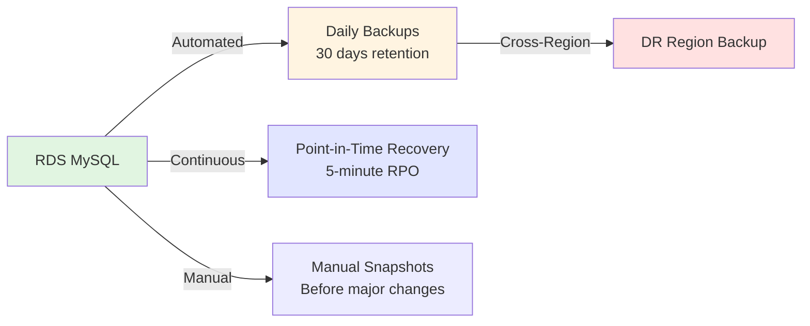
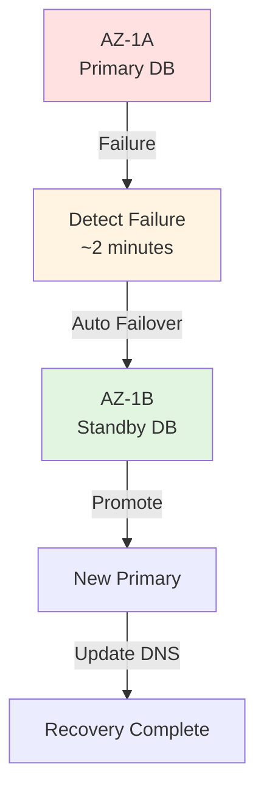

# Disaster Recovery & Business Continuity

**Version**: 1.0.0  
**Last Updated**: 2025-10-30  
**Status**: Active

## Overview

This document defines the disaster recovery (DR) and business continuity plan for the Task Management System, covering backup strategies, recovery procedures, RTO/RPO targets, and incident response protocols for various disaster scenarios.

---

## Recovery Objectives

### RTO and RPO Targets

| Data Type             | RPO (Max Data Loss) | RTO (Max Downtime) | Strategy                     |
| --------------------- | ------------------- | ------------------ | ---------------------------- |
| **User Data**         | 5 minutes           | 1 hour             | RDS automated backups + PITR |
| **Task Data**         | 5 minutes           | 1 hour             | RDS automated backups + PITR |
| **Attachments**       | 1 hour              | 2 hours            | S3 cross-region replication  |
| **Cache Data**        | Acceptable loss     | 15 minutes         | Redis rebuild from DB        |
| **Application State** | Acceptable loss     | 15 minutes         | ECS task restart             |
| **Audit Logs**        | 0 (no loss)         | 24 hours           | CloudWatch Logs → S3 archive |

**Overall System Targets**:

- **RPO**: 5 minutes (database point-in-time recovery)
- **RTO**: 1 hour (full system recovery)

---

## Backup Strategy

### Database Backups



**Automated Backups**:

```hcl
resource "aws_db_instance" "main" {
  # Automated backup configuration
  backup_retention_period   = 30  # 30 days
  backup_window             = "03:00-04:00"  # UTC

  # Enable point-in-time recovery
  enabled_cloudwatch_logs_exports = ["error", "slowquery", "audit"]

  # Backup encryption
  storage_encrypted = true
  kms_key_id        = aws_kms_key.rds.arn

  # Snapshot on deletion
  skip_final_snapshot       = false
  final_snapshot_identifier = "${var.environment}-final-${formatdate("YYYYMMDD", timestamp())}"
}
```

**Cross-Region Backup Replication**:

```python
# Lambda function: backup-replicator
import boto3
from datetime import datetime

rds_client = boto3.client('rds', region_name='us-east-1')
rds_dr = boto3.client('rds', region_name='us-west-2')

def lambda_handler(event, context):
    """Replicate RDS snapshot to DR region"""

    # Get latest automated backup
    snapshots = rds_client.describe_db_snapshots(
        DBInstanceIdentifier='production-taskmanager-db',
        SnapshotType='automated',
        MaxRecords=1
    )

    snapshot = snapshots['DBSnapshots'][0]
    snapshot_arn = snapshot['DBSnapshotArn']

    # Copy to DR region
    dr_snapshot_id = f"dr-copy-{datetime.utcnow().strftime('%Y%m%d-%H%M%S')}"

    rds_dr.copy_db_snapshot(
        SourceDBSnapshotIdentifier=snapshot_arn,
        TargetDBSnapshotIdentifier=dr_snapshot_id,
        KmsKeyId='arn:aws:kms:us-west-2:123456789012:key/xxx',
        CopyTags=True,
        Tags=[
            {'Key': 'Type', 'Value': 'disaster-recovery'},
            {'Key': 'SourceRegion', 'Value': 'us-east-1'}
        ]
    )

    return {'status': 'success', 'dr_snapshot_id': dr_snapshot_id}
```

**Backup Schedule**:

```yaml
# CloudWatch Events schedule
- Event: "Daily Backup Verification"
  Schedule: "cron(0 5 * * ? *)" # 5 AM UTC daily
  Action: Verify latest backup exists and is restorable

- Event: "Weekly DR Snapshot"
  Schedule: "cron(0 6 ? * SUN *)" # Sundays at 6 AM UTC
  Action: Create manual snapshot + replicate to DR region

- Event: "Monthly Backup Audit"
  Schedule: "cron(0 7 1 * ? *)" # 1st of month, 7 AM UTC
  Action: Audit all backups, clean up old snapshots
```

### File Storage Backups

**S3 Cross-Region Replication**:

```hcl
resource "aws_s3_bucket" "attachments" {
  bucket = "taskmanager-attachments-prod"

  versioning {
    enabled = true
  }

  replication_configuration {
    role = aws_iam_role.replication.arn

    rules {
      id       = "replicate-all"
      status   = "Enabled"
      priority = 1

      destination {
        bucket        = aws_s3_bucket.attachments_dr.arn
        storage_class = "STANDARD_IA"

        # Replicate delete markers
        replication_time {
          status  = "Enabled"
          minutes = 15
        }
      }
    }
  }

  lifecycle_rule {
    id      = "archive-old-versions"
    enabled = true

    noncurrent_version_transition {
      days          = 30
      storage_class = "GLACIER"
    }

    noncurrent_version_expiration {
      days = 90
    }
  }
}
```

### Redis Cache Backups

**ElastiCache Snapshot Configuration**:

```hcl
resource "aws_elasticache_replication_group" "main" {
  replication_group_id       = "taskmanager-cache"
  replication_group_description = "Task Manager Redis Cache"

  # Automatic backup
  snapshot_retention_limit = 7  # 7 days
  snapshot_window         = "02:00-03:00"

  # Backup to S3
  snapshot_name           = "taskmanager-redis-backup"

  # Multi-AZ for HA
  automatic_failover_enabled = true
  multi_az_enabled          = true
}
```

**Note**: Redis cache is rebuilt from database on failure (acceptable data loss).

---

## Disaster Scenarios & Recovery Procedures

### Scenario 1: Single Availability Zone Failure

**Impact**: Low (automatic failover)  
**RTO**: 5 minutes  
**RPO**: 0 (no data loss)



**Automatic Recovery** (RDS Multi-AZ):

- RDS detects primary failure (~60-90 seconds)
- Automatically promotes standby to primary
- DNS updates to new endpoint (~60 seconds)
- Application reconnects automatically (connection pool retry)

**Monitoring**:

```python
# CloudWatch Alarm: RDS Failover
{
  "AlarmName": "RDS-Failover-Detected",
  "MetricName": "DatabaseConnections",
  "Namespace": "AWS/RDS",
  "Statistic": "Sum",
  "Period": 60,
  "EvaluationPeriods": 2,
  "Threshold": 0,
  "ComparisonOperator": "LessThanThreshold",
  "AlarmActions": ["arn:aws:sns:us-east-1:123456789012:oncall-team"]
}
```

### Scenario 2: Entire Region Failure

**Impact**: High (manual failover required)  
**RTO**: 1-2 hours  
**RPO**: 5 minutes (last backup)

**Recovery Procedure**:

```bash
#!/bin/bash
# scripts/dr-failover-region.sh

set -e

DR_REGION="us-west-2"
PRIMARY_REGION="us-east-1"

echo "🚨 DISASTER RECOVERY: Region Failover"
echo "Primary Region: ${PRIMARY_REGION} → DR Region: ${DR_REGION}"

# 1. Verify primary region is down
echo "Step 1: Verify primary region failure..."
aws ec2 describe-instances --region ${PRIMARY_REGION} 2>&1 || echo "✅ Confirmed: Primary region unavailable"

# 2. Get latest DR snapshot
echo "Step 2: Identify latest DR backup..."
LATEST_SNAPSHOT=$(aws rds describe-db-snapshots \
  --region ${DR_REGION} \
  --query 'DBSnapshots | sort_by(@, &SnapshotCreateTime)[-1].DBSnapshotIdentifier' \
  --output text)

echo "Latest snapshot: ${LATEST_SNAPSHOT}"

# 3. Restore database in DR region
echo "Step 3: Restore database in DR region..."
aws rds restore-db-instance-from-db-snapshot \
  --region ${DR_REGION} \
  --db-instance-identifier dr-taskmanager-db \
  --db-snapshot-identifier ${LATEST_SNAPSHOT} \
  --db-instance-class db.r6g.xlarge \
  --multi-az \
  --publicly-accessible false

# Wait for DB to be available
echo "Waiting for database to be available (10-15 minutes)..."
aws rds wait db-instance-available \
  --region ${DR_REGION} \
  --db-instance-identifier dr-taskmanager-db

# 4. Restore Redis cache (empty - will rebuild)
echo "Step 4: Create Redis cluster in DR region..."
aws elasticache create-replication-group \
  --region ${DR_REGION} \
  --replication-group-id dr-taskmanager-cache \
  --replication-group-description "DR Redis Cache" \
  --cache-node-type cache.r7g.large \
  --engine redis \
  --num-cache-clusters 3 \
  --automatic-failover-enabled

# 5. Deploy ECS services
echo "Step 5: Deploy ECS services in DR region..."
cd infrastructure/terraform/environments/dr
terraform init
terraform apply -var-file=dr.tfvars -auto-approve

# 6. Update Route53 (failover to DR)
echo "Step 6: Update DNS to DR region..."
aws route53 change-resource-record-sets \
  --hosted-zone-id Z1234567890ABC \
  --change-batch '{
    "Changes": [{
      "Action": "UPSERT",
      "ResourceRecordSet": {
        "Name": "taskmanager.com",
        "Type": "A",
        "AliasTarget": {
          "HostedZoneId": "Z0987654321XYZ",
          "DNSName": "dr-alb.us-west-2.elb.amazonaws.com",
          "EvaluateTargetHealth": true
        }
      }
    }]
  }'

# 7. Run database migrations
echo "Step 7: Run database migrations..."
aws ecs run-task \
  --region ${DR_REGION} \
  --cluster dr-taskmanager \
  --task-definition taskmanager-migrations \
  --launch-type FARGATE \
  --network-configuration '{
    "awsvpcConfiguration": {
      "subnets": ["subnet-xxx", "subnet-yyy"],
      "securityGroups": ["sg-xxx"],
      "assignPublicIp": "DISABLED"
    }
  }'

# 8. Verify services
echo "Step 8: Verify services are healthy..."
curl -f https://taskmanager.com/health || exit 1

echo "✅ DR Failover Complete"
echo "⏰ Total time: $(date)"
echo "📊 Next: Monitor dashboards, notify users"
```

**Post-Failover Checklist**:

```markdown
## DR Failover Checklist

### Immediate Actions (0-15 minutes)

- [x] Verify primary region is unreachable
- [x] Activate incident response team
- [x] Notify leadership and stakeholders
- [x] Initiate DR failover procedure

### Recovery Actions (15-60 minutes)

- [x] Restore database from latest snapshot
- [x] Restore Redis cache (empty)
- [x] Deploy ECS services in DR region
- [x] Update Route53 DNS to DR region
- [x] Run database migrations
- [x] Verify health checks passing

### Validation (60-90 minutes)

- [x] Test user authentication
- [x] Test task creation/retrieval
- [x] Test API endpoints
- [x] Verify background workers processing
- [x] Check monitoring dashboards

### Communication (Ongoing)

- [x] Update status page: "Service degraded - operating from DR region"
- [x] Notify customers via email
- [x] Post updates every 30 minutes
- [x] Document timeline and actions taken
```

### Scenario 3: Database Corruption

**Impact**: Medium  
**RTO**: 30 minutes  
**RPO**: 5 minutes (PITR)

**Recovery Procedure**:

```bash
#!/bin/bash
# scripts/dr-restore-pitr.sh

set -e

TARGET_TIME=${1}  # "2025-10-30T14:30:00Z"

echo "🔧 Point-in-Time Recovery to: ${TARGET_TIME}"

# 1. Create snapshot of current state (for rollback)
echo "Step 1: Create snapshot of current state..."
CURRENT_SNAPSHOT="pre-pitr-$(date +%Y%m%d-%H%M%S)"
aws rds create-db-snapshot \
  --db-instance-identifier production-taskmanager-db \
  --db-snapshot-identifier ${CURRENT_SNAPSHOT}

# 2. Restore to point in time
echo "Step 2: Restore database to ${TARGET_TIME}..."
aws rds restore-db-instance-to-point-in-time \
  --source-db-instance-identifier production-taskmanager-db \
  --target-db-instance-identifier restored-taskmanager-db \
  --restore-time ${TARGET_TIME} \
  --db-instance-class db.r6g.xlarge \
  --multi-az

# Wait for restore
echo "Waiting for restore to complete (15-20 minutes)..."
aws rds wait db-instance-available \
  --db-instance-identifier restored-taskmanager-db

# 3. Verify restored data
echo "Step 3: Verify restored data..."
RESTORED_ENDPOINT=$(aws rds describe-db-instances \
  --db-instance-identifier restored-taskmanager-db \
  --query 'DBInstances[0].Endpoint.Address' \
  --output text)

# Run verification queries
mysql -h ${RESTORED_ENDPOINT} -u admin -p -e "
  SELECT COUNT(*) as user_count FROM users;
  SELECT COUNT(*) as task_count FROM tasks;
  SELECT MAX(created_at) as last_task FROM tasks;
"

# 4. Switch application to restored database
read -p "⚠️  Switch to restored database? (yes/no): " CONFIRM
if [ "$CONFIRM" != "yes" ]; then
  echo "Restore cancelled. Restored DB kept for investigation."
  exit 1
fi

# Update Secrets Manager
aws secretsmanager update-secret \
  --secret-id taskmanager/production/database-url \
  --secret-string "postgresql://admin:xxx@${RESTORED_ENDPOINT}:5432/taskmanager"

# Restart ECS services to pick up new connection
aws ecs update-service \
  --cluster production-taskmanager \
  --service api \
  --force-new-deployment

echo "✅ PITR Recovery Complete"
```

### Scenario 4: Accidental Data Deletion

**Impact**: Medium  
**RTO**: 1 hour  
**RPO**: Varies (depends on when deletion occurred)

**Recovery Options**:

1. **Database-level recovery**:

```sql
-- If soft-delete is enabled
UPDATE tasks
SET deleted_at = NULL,
    updated_at = NOW()
WHERE id IN (SELECT id FROM tasks WHERE deleted_at > '2025-10-30 14:00:00');

-- If hard-delete, restore from backup
-- Use PITR to time before deletion
```

2. **Application-level recovery** (audit log replay):

```python
# Restore from audit logs
from domain.audit import AuditLogRepository

async def restore_deleted_tasks(deleted_after: datetime):
    """Restore tasks deleted after a specific time"""

    audit_repo = AuditLogRepository()

    # Find all DELETE events after timestamp
    delete_events = await audit_repo.find_events(
        event_type="TASK_DELETED",
        timestamp_after=deleted_after
    )

    for event in delete_events:
        # Recreate task from audit log data
        task_data = event.data_before  # State before deletion
        task = Task.restore_from_audit(task_data)
        await task_repo.save(task)

        print(f"Restored task {task.id}: {task.title}")
```

### Scenario 5: Security Breach / Ransomware

**Impact**: Critical  
**RTO**: 2-4 hours  
**RPO**: 5 minutes

**Response Procedure**:

```markdown
## Security Incident Response

### Phase 1: Containment (0-15 minutes)

1. **Isolate affected systems**

   - Disable affected user accounts
   - Revoke API keys and tokens
   - Block suspicious IP addresses at WAF
   - Scale down compromised ECS tasks

2. **Preserve evidence**

   - Create snapshots of affected instances
   - Export CloudWatch logs
   - Capture network traffic (VPC Flow Logs)

3. **Activate incident response team**
   - Security lead
   - DevOps engineer
   - Legal counsel (if data breach)

### Phase 2: Investigation (15-60 minutes)

1. **Analyze breach**

   - Review CloudTrail logs
   - Check GuardDuty findings
   - Review application logs for suspicious activity
   - Identify compromised resources

2. **Assess impact**
   - What data was accessed?
   - Was data exfiltrated?
   - Were backups compromised?

### Phase 3: Eradication (60-120 minutes)

1. **Remove threat**

   - Terminate compromised instances
   - Rotate all secrets and credentials
   - Patch vulnerabilities
   - Update security groups

2. **Restore from clean backups**
   - Use backup from before breach
   - Verify backup integrity
   - Restore to isolated environment first

### Phase 4: Recovery (120-180 minutes)

1. **Rebuild infrastructure**

   - Deploy from known-good IaC templates
   - Use clean AMIs/container images
   - Apply all security patches

2. **Restore data**

   - Restore database from clean backup
   - Verify data integrity
   - Re-encrypt all data with new keys

3. **Verify security**
   - Run security scans
   - Penetration testing
   - Monitor for suspicious activity

### Phase 5: Post-Incident (Ongoing)

1. **Notification**

   - Notify affected customers (GDPR/CCPA)
   - File required breach reports
   - Update status page

2. **Post-mortem**
   - Document timeline
   - Root cause analysis
   - Implement preventive measures
```

---

## Backup Verification & Testing

### Automated Backup Testing

```python
# Lambda: backup-verification
import boto3
import pymysql
from datetime import datetime

def lambda_handler(event, context):
    """Verify backup by attempting restore"""

    rds = boto3.client('rds')

    # Get latest automated backup
    snapshots = rds.describe_db_snapshots(
        DBInstanceIdentifier='production-taskmanager-db',
        SnapshotType='automated',
        MaxRecords=1
    )

    snapshot = snapshots['DBSnapshots'][0]
    snapshot_id = snapshot['DBSnapshotIdentifier']

    # Restore to test instance
    test_db_id = f"backup-test-{datetime.utcnow().strftime('%Y%m%d')}"

    try:
        rds.restore_db_instance_from_db_snapshot(
            DBInstanceIdentifier=test_db_id,
            DBSnapshotIdentifier=snapshot_id,
            DBInstanceClass='db.t3.micro',  # Cheap for testing
            PubliclyAccessible=False
        )

        # Wait for available
        waiter = rds.get_waiter('db_instance_available')
        waiter.wait(DBInstanceIdentifier=test_db_id)

        # Get endpoint
        instance = rds.describe_db_instances(
            DBInstanceIdentifier=test_db_id
        )['DBInstances'][0]
        endpoint = instance['Endpoint']['Address']

        # Test connection and basic queries
        conn = pymysql.connect(
            host=endpoint,
            user='admin',
            password=get_secret('db-password'),
            database='taskmanager'
        )

        cursor = conn.cursor()
        cursor.execute("SELECT COUNT(*) FROM users")
        user_count = cursor.fetchone()[0]

        cursor.execute("SELECT COUNT(*) FROM tasks")
        task_count = cursor.fetchone()[0]

        conn.close()

        # Cleanup test instance
        rds.delete_db_instance(
            DBInstanceIdentifier=test_db_id,
            SkipFinalSnapshot=True
        )

        # Report success
        return {
            'status': 'success',
            'snapshot_id': snapshot_id,
            'user_count': user_count,
            'task_count': task_count,
            'verified_at': datetime.utcnow().isoformat()
        }

    except Exception as e:
        # Alert on failure
        sns = boto3.client('sns')
        sns.publish(
            TopicArn='arn:aws:sns:us-east-1:123456789012:backup-alerts',
            Subject='❌ Backup Verification Failed',
            Message=f"Failed to verify backup {snapshot_id}: {str(e)}"
        )
        raise
```

### Quarterly DR Drill

**Schedule**: Every 3 months  
**Duration**: 4 hours  
**Participants**: DevOps, Engineering, Product

**Drill Procedure**:

```markdown
## Q4 2025 Disaster Recovery Drill

**Date**: 2025-10-30  
**Scenario**: Region failure (us-east-1 unavailable)  
**Participants**: Alice (DevOps), Bob (Engineering), Carol (Product)

### Objectives

- [ ] Validate DR runbook
- [ ] Measure actual RTO/RPO
- [ ] Identify improvement areas
- [ ] Train team on procedures

### Timeline

| Time  | Action                                    | Owner | Status |
| ----- | ----------------------------------------- | ----- | ------ |
| 14:00 | Kickoff meeting                           | Alice | ✅     |
| 14:05 | Simulate region failure (disable Route53) | Alice | ✅     |
| 14:10 | Execute DR failover script                | Bob   | ✅     |
| 14:35 | Database restored in DR region            | Bob   | ✅     |
| 14:50 | ECS services deployed                     | Alice | ✅     |
| 15:05 | DNS updated to DR region                  | Alice | ✅     |
| 15:10 | Verify application functionality          | Carol | ✅     |
| 15:30 | Failback to primary region                | Alice | ✅     |
| 16:00 | Debrief and lessons learned               | All   | ✅     |

### Metrics

- **Actual RTO**: 65 minutes (target: 60 minutes)
- **Actual RPO**: 3 minutes (target: 5 minutes)
- **Data Loss**: None

### Lessons Learned

1. ✅ DR script worked as expected
2. ⚠️ Database restore slower than expected (need larger instance for restore)
3. ⚠️ DNS propagation took 10 minutes (consider shorter TTL)
4. ✅ Team familiar with procedures

### Action Items

- [ ] Update DR runbook with actual timings
- [ ] Reduce Route53 TTL from 60s to 30s
- [ ] Use db.r6g.xlarge for faster restore
- [ ] Schedule next drill for Q1 2026
```

---

## Monitoring & Alerting

### Backup Monitoring

```yaml
# CloudWatch Alarms
alarms:
  - name: "RDS-No-Recent-Backup"
    metric: "RDS Backup Age"
    threshold: 25 hours # Should backup daily
    action: "Alert on-call team"

  - name: "S3-Replication-Lag"
    metric: "S3 Replication Time"
    threshold: 30 minutes
    action: "Alert DevOps team"

  - name: "Backup-Verification-Failed"
    metric: "Lambda Errors"
    function: "backup-verification"
    threshold: 1 error
    action: "Alert on-call + page manager"
```

### DR Dashboard

```python
# Grafana dashboard: Disaster Recovery Status
{
  "title": "Disaster Recovery Status",
  "panels": [
    {
      "title": "Last Successful Backup",
      "query": "rds_last_backup_timestamp",
      "alert": "warning if > 25 hours"
    },
    {
      "title": "Backup Size Trend",
      "query": "rds_backup_size_bytes",
      "visualization": "time_series"
    },
    {
      "title": "DR Region Status",
      "query": "aws_rds_db_instance_available{region='us-west-2'}",
      "alert": "critical if DR resources missing"
    },
    {
      "title": "Cross-Region Replication Lag",
      "query": "s3_replication_lag_seconds",
      "alert": "warning if > 1800 (30 min)"
    },
    {
      "title": "Last DR Test",
      "query": "dr_test_timestamp",
      "alert": "warning if > 90 days"
    }
  ]
}
```

---

## Cost Optimization

### Backup Storage Costs

| Item                    | Monthly Cost   | Notes                               |
| ----------------------- | -------------- | ----------------------------------- |
| **RDS Backups**         | $30            | 30 days × ~100 GB × $0.01/GB        |
| **DR Region Snapshots** | $15            | Weekly snapshots × 4 weeks          |
| **S3 Versioning**       | $40            | ~500 GB attachments × $0.08/GB (IA) |
| **Glacier Archive**     | $10            | Old logs × $0.004/GB                |
| **CloudWatch Logs**     | $20            | 30-day retention                    |
| **Total**               | **$115/month** | ~2% of infrastructure cost          |

**Optimization Strategies**:

1. Lifecycle policies for old backups → Glacier
2. Delete backups older than retention period
3. Use Intelligent-Tiering for S3
4. Compress CloudWatch Logs exports

---

## Compliance & Audit

### Backup Compliance Requirements

| Regulation  | Requirement                         | Implementation             |
| ----------- | ----------------------------------- | -------------------------- |
| **SOC 2**   | Regular backups tested quarterly    | Automated DR drills        |
| **GDPR**    | Data recoverable within 72 hours    | 1-hour RTO target          |
| **HIPAA**   | Encrypted backups, 6-year retention | KMS encryption, S3 Glacier |
| **PCI DSS** | Backup media physically protected   | AWS data center compliance |

### Audit Trail

```sql
-- Backup audit log
CREATE TABLE backup_audit (
    id BIGSERIAL PRIMARY KEY,
    backup_type VARCHAR(50) NOT NULL,  -- 'automated', 'manual', 'snapshot'
    backup_id VARCHAR(255) NOT NULL,
    source_db VARCHAR(255) NOT NULL,
    destination VARCHAR(255),
    status VARCHAR(50) NOT NULL,  -- 'success', 'failed'
    size_bytes BIGINT,
    duration_seconds INT,
    initiated_by VARCHAR(255),
    initiated_at TIMESTAMP NOT NULL DEFAULT NOW(),
    completed_at TIMESTAMP,
    error_message TEXT,

    INDEX idx_backup_timestamp (initiated_at DESC),
    INDEX idx_backup_status (status)
);
```

---

## Best Practices

### DO ✅

1. **Automate backups** - no manual intervention
2. **Test restores regularly** - quarterly DR drills
3. **Monitor backup health** - automated verification
4. **Encrypt backups** - KMS encryption at rest
5. **Replicate to DR region** - cross-region redundancy
6. **Document procedures** - runbooks for all scenarios
7. **Maintain audit trail** - log all backup/restore operations
8. **Set retention policies** - balance cost vs compliance
9. **Test failover** - don't wait for real disaster
10. **Measure RTO/RPO** - validate against targets

### DON'T ❌

1. **Don't skip backup testing** - untested backups are useless
2. **Don't store backups in same region only** - region failure risk
3. **Don't ignore backup failures** - investigate immediately
4. **Don't manually delete backups** - use lifecycle policies
5. **Don't assume RDS backups are enough** - test restore process
6. **Don't forget to rotate encryption keys** - security best practice
7. **Don't skip documentation** - team needs clear procedures
8. **Don't ignore compliance requirements** - audit failures are costly

---

## Related Documents

- [Infrastructure as Code](./infrastructure-as-code.md) - Terraform DR configuration
- [Environment Management](./environments.md) - DR environment setup
- [ECS Deployment](./ecs-deployment.md) - Service deployment procedures
- [Monitoring & Alerting](../observability/alerting.md) - DR monitoring
- [Incident Response](../observability/incident-response.md) - Security incidents

---

**Last Reviewed**: 2025-10-30  
**Next Review**: 2026-01-30 (Quarterly)  
**Next DR Drill**: 2026-01-15  
**Maintainer**: DevOps Team  
**On-Call**: +1-555-0123 (PagerDuty)
