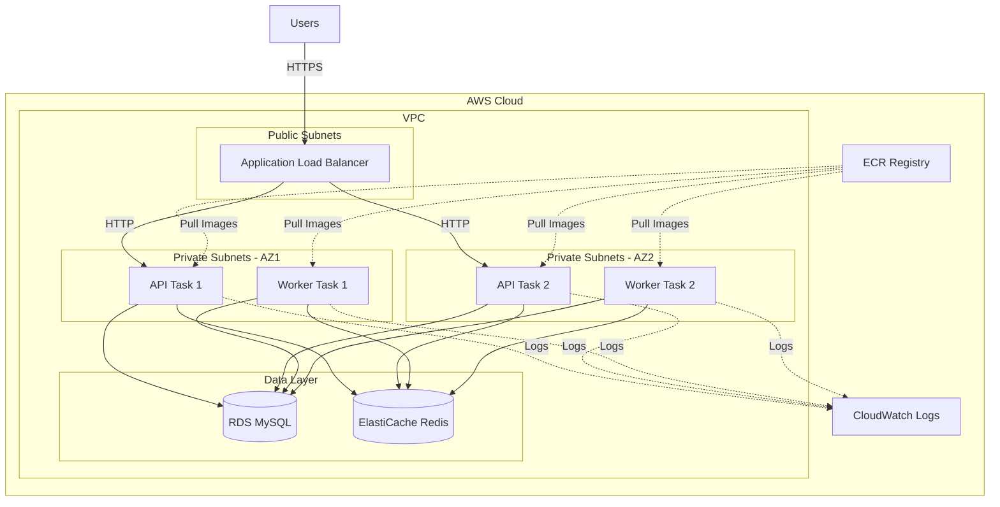
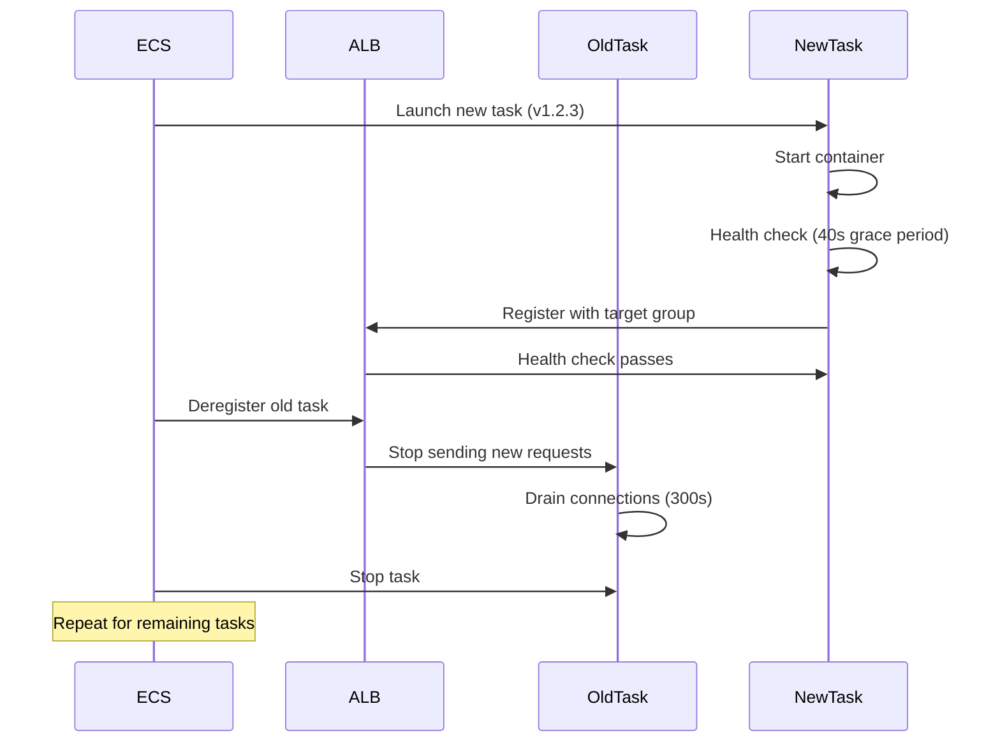
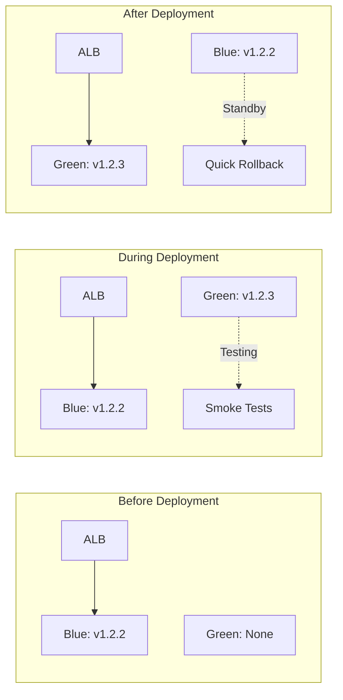
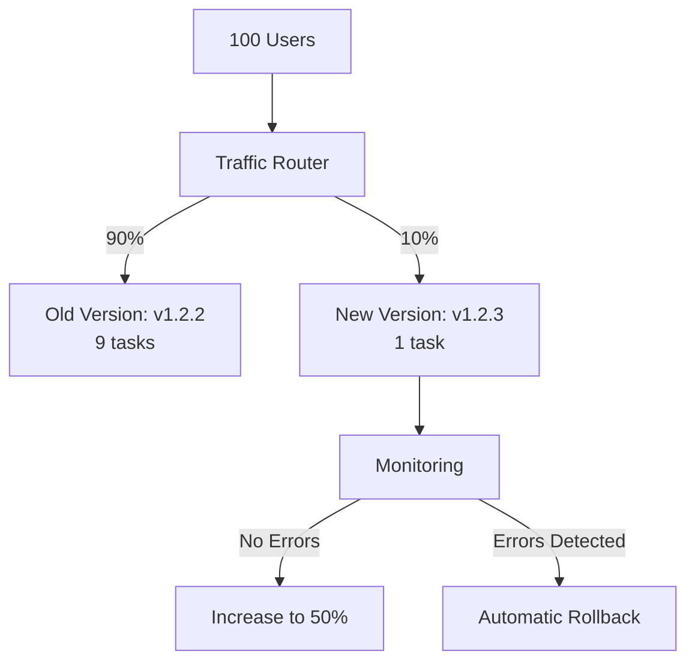

# ECS Deployment Strategy

**Version**: 1.0.0  
**Last Updated**: 2025-10-30  
**Status**: Active

## Overview

This document defines the deployment strategy for the Task Management System on Amazon ECS (Elastic Container Service), covering task definitions, service configuration, deployment strategies, scaling policies, and operational procedures.

---

## Architecture Overview



---

## ECS Cluster Configuration

### Cluster Setup

```bash
# Create ECS cluster (Fargate only)
aws ecs create-cluster \
  --cluster-name taskmanager-prod \
  --capacity-providers FARGATE FARGATE_SPOT \
  --default-capacity-provider-strategy \
    capacityProvider=FARGATE,weight=1,base=2 \
    capacityProvider=FARGATE_SPOT,weight=4 \
  --settings name=containerInsights,value=enabled
```

**Capacity Providers**:

- **FARGATE**: Guaranteed capacity, higher cost (base=2 for critical tasks)
- **FARGATE_SPOT**: 70% cost savings, may be interrupted (weight=4 for majority)

### Cluster Settings

```json
{
  "clusterName": "taskmanager-prod",
  "settings": [
    {
      "name": "containerInsights",
      "value": "enabled"
    }
  ],
  "configuration": {
    "executeCommandConfiguration": {
      "kmsKeyId": "arn:aws:kms:us-east-1:123456789012:key/xxx",
      "logging": "OVERRIDE",
      "logConfiguration": {
        "cloudWatchLogGroupName": "/aws/ecs/execute-command",
        "cloudWatchEncryptionEnabled": true
      }
    }
  }
}
```

---

## Task Definitions

### API Task Definition

```json
{
  "family": "taskmanager-api",
  "networkMode": "awsvpc",
  "requiresCompatibilities": ["FARGATE"],
  "cpu": "1024",
  "memory": "2048",
  "executionRoleArn": "arn:aws:iam::123456789012:role/ecsTaskExecutionRole",
  "taskRoleArn": "arn:aws:iam::123456789012:role/ecsTaskRole",
  "containerDefinitions": [
    {
      "name": "api",
      "image": "123456789012.dkr.ecr.us-east-1.amazonaws.com/taskmanager-api:v1.2.3",
      "cpu": 1024,
      "memory": 2048,
      "essential": true,
      "portMappings": [
        {
          "containerPort": 8000,
          "protocol": "tcp"
        }
      ],
      "environment": [
        {
          "name": "ENVIRONMENT",
          "value": "production"
        },
        {
          "name": "PORT",
          "value": "8000"
        },
        {
          "name": "LOG_LEVEL",
          "value": "INFO"
        }
      ],
      "secrets": [
        {
          "name": "DATABASE_URL",
          "valueFrom": "arn:aws:secretsmanager:us-east-1:123456789012:secret:taskmanager/database-url"
        },
        {
          "name": "REDIS_URL",
          "valueFrom": "arn:aws:secretsmanager:us-east-1:123456789012:secret:taskmanager/redis-url"
        },
        {
          "name": "JWT_SECRET_KEY",
          "valueFrom": "arn:aws:secretsmanager:us-east-1:123456789012:secret:taskmanager/jwt-secret"
        }
      ],
      "logConfiguration": {
        "logDriver": "awslogs",
        "options": {
          "awslogs-group": "/aws/ecs/taskmanager-api",
          "awslogs-region": "us-east-1",
          "awslogs-stream-prefix": "api"
        }
      },
      "healthCheck": {
        "command": [
          "CMD-SHELL",
          "curl -f http://localhost:8000/health || exit 1"
        ],
        "interval": 30,
        "timeout": 10,
        "retries": 3,
        "startPeriod": 40
      },
      "linuxParameters": {
        "capabilities": {
          "drop": ["ALL"]
        }
      },
      "readonlyRootFilesystem": false,
      "user": "1000:1000"
    }
  ],
  "tags": [
    {
      "key": "Environment",
      "value": "production"
    },
    {
      "key": "Application",
      "value": "taskmanager"
    },
    {
      "key": "Component",
      "value": "api"
    }
  ]
}
```

### Worker Task Definition

```json
{
  "family": "taskmanager-worker",
  "networkMode": "awsvpc",
  "requiresCompatibilities": ["FARGATE"],
  "cpu": "512",
  "memory": "1024",
  "executionRoleArn": "arn:aws:iam::123456789012:role/ecsTaskExecutionRole",
  "taskRoleArn": "arn:aws:iam::123456789012:role/ecsTaskRole",
  "containerDefinitions": [
    {
      "name": "worker",
      "image": "123456789012.dkr.ecr.us-east-1.amazonaws.com/taskmanager-worker:v1.2.3",
      "cpu": 512,
      "memory": 1024,
      "essential": true,
      "environment": [
        {
          "name": "ENVIRONMENT",
          "value": "production"
        },
        {
          "name": "CELERY_WORKER_CONCURRENCY",
          "value": "4"
        },
        {
          "name": "CELERY_WORKER_MAX_TASKS_PER_CHILD",
          "value": "1000"
        }
      ],
      "secrets": [
        {
          "name": "DATABASE_URL",
          "valueFrom": "arn:aws:secretsmanager:us-east-1:123456789012:secret:taskmanager/database-url"
        },
        {
          "name": "CELERY_BROKER_URL",
          "valueFrom": "arn:aws:secretsmanager:us-east-1:123456789012:secret:taskmanager/celery-broker"
        }
      ],
      "logConfiguration": {
        "logDriver": "awslogs",
        "options": {
          "awslogs-group": "/aws/ecs/taskmanager-worker",
          "awslogs-region": "us-east-1",
          "awslogs-stream-prefix": "worker"
        }
      },
      "healthCheck": {
        "command": [
          "CMD-SHELL",
          "celery -A taskmanager.celery inspect ping -d celery@$HOSTNAME || exit 1"
        ],
        "interval": 60,
        "timeout": 10,
        "retries": 3,
        "startPeriod": 30
      },
      "linuxParameters": {
        "capabilities": {
          "drop": ["ALL"]
        }
      },
      "user": "1001:1001"
    }
  ]
}
```

### Resource Sizing

| Service        | CPU       | Memory | Rationale                              |
| -------------- | --------- | ------ | -------------------------------------- |
| **API**        | 1 vCPU    | 2 GB   | FastAPI + database connections         |
| **Worker**     | 0.5 vCPU  | 1 GB   | Background tasks, lower resource needs |
| **Migrations** | 0.25 vCPU | 512 MB | One-time execution, minimal needs      |

**Fargate Pricing** (US East 1):

- vCPU: $0.04048 per hour
- Memory: $0.004445 per GB per hour

**Cost Calculation** (API task):

```
API per hour = (1 vCPU × $0.04048) + (2 GB × $0.004445)
             = $0.04048 + $0.00889
             = $0.04937/hour
             = $35.54/month per task

5 API tasks × $35.54 = $177.70/month
10 Worker tasks × $17.77 = $177.70/month
Total: ~$355/month for compute
```

---

## Service Configuration

### API Service

```json
{
  "serviceName": "taskmanager-api",
  "cluster": "taskmanager-prod",
  "taskDefinition": "taskmanager-api:42",
  "desiredCount": 5,
  "launchType": "FARGATE",
  "platformVersion": "LATEST",
  "networkConfiguration": {
    "awsvpcConfiguration": {
      "subnets": [
        "subnet-xxx-private-us-east-1a",
        "subnet-yyy-private-us-east-1b"
      ],
      "securityGroups": ["sg-xxx-api"],
      "assignPublicIp": "DISABLED"
    }
  },
  "loadBalancers": [
    {
      "targetGroupArn": "arn:aws:elasticloadbalancing:us-east-1:123456789012:targetgroup/api-prod/xxx",
      "containerName": "api",
      "containerPort": 8000
    }
  ],
  "healthCheckGracePeriodSeconds": 60,
  "deploymentConfiguration": {
    "deploymentCircuitBreaker": {
      "enable": true,
      "rollback": true
    },
    "maximumPercent": 200,
    "minimumHealthyPercent": 100
  },
  "enableExecuteCommand": true,
  "propagateTags": "SERVICE",
  "tags": [
    {
      "key": "Environment",
      "value": "production"
    }
  ]
}
```

**Key Configuration**:

- **desiredCount: 5**: Run 5 API tasks (distributed across 2 AZs)
- **maximumPercent: 200**: During deployment, can run up to 10 tasks (2× desired)
- **minimumHealthyPercent: 100**: Always maintain at least 5 healthy tasks
- **deploymentCircuitBreaker**: Automatically rollback failed deployments

### Worker Service

```json
{
  "serviceName": "taskmanager-worker",
  "cluster": "taskmanager-prod",
  "taskDefinition": "taskmanager-worker:28",
  "desiredCount": 10,
  "launchType": "FARGATE",
  "platformVersion": "LATEST",
  "networkConfiguration": {
    "awsvpcConfiguration": {
      "subnets": [
        "subnet-xxx-private-us-east-1a",
        "subnet-yyy-private-us-east-1b"
      ],
      "securityGroups": ["sg-yyy-worker"],
      "assignPublicIp": "DISABLED"
    }
  },
  "deploymentConfiguration": {
    "deploymentCircuitBreaker": {
      "enable": true,
      "rollback": true
    },
    "maximumPercent": 150,
    "minimumHealthyPercent": 50
  },
  "enableExecuteCommand": true
}
```

**Key Configuration**:

- **desiredCount: 10**: More workers than API tasks (background processing)
- **minimumHealthyPercent: 50**: Can drop to 5 tasks during deployment (less critical than API)
- **maximumPercent: 150**: Can run up to 15 tasks during deployment

---

## Deployment Strategies

### Rolling Deployment (Default)

**How it works**:

1. ECS launches new tasks with updated task definition
2. New tasks pass health checks
3. ECS drains connections from old tasks
4. Old tasks are stopped
5. Process repeats until all tasks updated



**Configuration**:

```json
{
  "deploymentConfiguration": {
    "maximumPercent": 200,
    "minimumHealthyPercent": 100
  }
}
```

**Timeline** (5 tasks, replace 2 at a time):

```
T+0:   [v1] [v1] [v1] [v1] [v1]              (5 old)
T+1:   [v1] [v1] [v1] [v1] [v1] [v2] [v2]    (Start 2 new)
T+2:   [v1] [v1] [v1] [v2] [v2]              (Stop 2 old)
T+3:   [v1] [v1] [v1] [v2] [v2] [v2] [v2]    (Start 2 new)
T+4:   [v1] [v2] [v2] [v2] [v2]              (Stop 2 old)
T+5:   [v1] [v2] [v2] [v2] [v2] [v2]         (Start 1 new)
T+6:   [v2] [v2] [v2] [v2] [v2]              (Stop last old)
```

**Advantages**:

- ✅ Zero downtime
- ✅ Gradual rollout (detect issues early)
- ✅ Simple configuration

**Disadvantages**:

- ❌ Slower deployment (~10-15 minutes)
- ❌ Mixed versions during deployment
- ❌ Requires 2× capacity

---

### Blue-Green Deployment

**How it works**:

1. Deploy complete new environment (green)
2. Run tests against green environment
3. Switch traffic from blue to green
4. Keep blue for quick rollback



**Implementation with CodeDeploy**:

```yaml
# appspec.yml
version: 0.0
Resources:
  - TargetService:
      Type: AWS::ECS::Service
      Properties:
        TaskDefinition: "taskmanager-api:43"
        LoadBalancerInfo:
          ContainerName: "api"
          ContainerPort: 8000
        PlatformVersion: "LATEST"

Hooks:
  - BeforeInstall: "LambdaFunctionToValidateBeforeInstall"
  - AfterInstall: "LambdaFunctionToValidateAfterInstall"
  - AfterAllowTestTraffic: "LambdaFunctionToValidateAfterTestTraffic"
  - BeforeAllowTraffic: "LambdaFunctionToValidateBeforeAllowingTraffic"
  - AfterAllowTraffic: "LambdaFunctionToValidateAfterAllowingTraffic"
```

**Traffic Shifting**:

```json
{
  "deploymentConfigName": "CodeDeployDefault.ECSLinear10PercentEvery3Minutes",
  "trafficRoutingConfig": {
    "type": "TimeBasedLinear",
    "timeBasedLinear": {
      "linearPercentage": 10,
      "linearInterval": 3
    }
  },
  "autoRollbackConfiguration": {
    "enabled": true,
    "events": ["DEPLOYMENT_FAILURE", "DEPLOYMENT_STOP_ON_ALARM"]
  },
  "alarmConfiguration": {
    "alarms": [
      {
        "name": "api-error-rate-alarm"
      },
      {
        "name": "api-latency-alarm"
      }
    ],
    "enabled": true
  }
}
```

**Traffic Shift Options**:

- **Linear10PercentEvery3Minutes**: 10% every 3 min (30 min total)
- **Linear10PercentEvery1Minute**: 10% every 1 min (10 min total)
- **Canary10Percent5Minutes**: 10% for 5 min, then 90% (fast with validation)
- **AllAtOnce**: Immediate switch (risky)

**Advantages**:

- ✅ Fast rollback (switch back to blue)
- ✅ Testing on production-like environment
- ✅ Clear separation between versions
- ✅ Can validate before full traffic switch

**Disadvantages**:

- ❌ Requires 2× capacity during deployment
- ❌ More complex setup (CodeDeploy)
- ❌ Higher cost during deployment

---

### Canary Deployment

**How it works**:

1. Deploy new version to small subset (10%)
2. Monitor metrics for issues
3. Gradually increase traffic to new version
4. Rollback if issues detected



**Implementation**:

```python
# Lambda function for canary validation
import boto3

def lambda_handler(event, context):
    """
    Validate canary deployment health
    Returns: Success or Failure
    """
    cloudwatch = boto3.client('cloudwatch')

    # Check error rate
    error_rate = get_metric(
        cloudwatch,
        'http_requests_total',
        'status_code',
        '5xx'
    )

    if error_rate > 1.0:  # > 1% errors
        return {'status': 'FAILURE', 'reason': 'High error rate'}

    # Check latency
    p95_latency = get_metric(
        cloudwatch,
        'http_request_duration_seconds',
        'quantile',
        '0.95'
    )

    if p95_latency > 0.5:  # > 500ms
        return {'status': 'FAILURE', 'reason': 'High latency'}

    return {'status': 'SUCCESS'}
```

**Advantages**:

- ✅ Early issue detection (before full rollout)
- ✅ Minimal blast radius (only 10% affected)
- ✅ Automatic rollback on issues
- ✅ Gradual confidence building

**Disadvantages**:

- ❌ Slower deployment (incremental)
- ❌ Requires robust monitoring
- ❌ More complex orchestration

---

## Auto Scaling

### Target Tracking Scaling (API)

```json
{
  "serviceNamespace": "ecs",
  "resourceId": "service/taskmanager-prod/taskmanager-api",
  "scalableDimension": "ecs:service:DesiredCount",
  "minCapacity": 5,
  "maxCapacity": 50,
  "targetTrackingScalingPolicies": [
    {
      "policyName": "cpu-scaling",
      "targetValue": 70.0,
      "predefinedMetricSpecification": {
        "predefinedMetricType": "ECSServiceAverageCPUUtilization"
      },
      "scaleOutCooldown": 60,
      "scaleInCooldown": 300
    },
    {
      "policyName": "memory-scaling",
      "targetValue": 80.0,
      "predefinedMetricSpecification": {
        "predefinedMetricType": "ECSServiceAverageMemoryUtilization"
      },
      "scaleOutCooldown": 60,
      "scaleInCooldown": 300
    },
    {
      "policyName": "alb-request-count",
      "targetValue": 1000.0,
      "predefinedMetricSpecification": {
        "predefinedMetricType": "ALBRequestCountPerTarget"
      },
      "scaleOutCooldown": 60,
      "scaleInCooldown": 300
    }
  ]
}
```

**Scaling Behavior**:

- **Scale Out**: When CPU > 70% OR Memory > 80% OR Requests > 1000/target
- **Scale In**: When all metrics below target for 5 minutes
- **Cooldown**: 60s scale out, 300s scale in (prevent flapping)

### Step Scaling (Worker)

```json
{
  "policyName": "queue-length-scaling",
  "policyType": "StepScaling",
  "metricAggregationType": "Average",
  "adjustmentType": "PercentChangeInCapacity",
  "stepAdjustments": [
    {
      "metricIntervalLowerBound": 0,
      "metricIntervalUpperBound": 100,
      "scalingAdjustment": 10
    },
    {
      "metricIntervalLowerBound": 100,
      "metricIntervalUpperBound": 500,
      "scalingAdjustment": 30
    },
    {
      "metricIntervalLowerBound": 500,
      "scalingAdjustment": 50
    }
  ],
  "minAdjustmentMagnitude": 1
}
```

**Scaling Logic**:

- Queue 0-100: +10% capacity
- Queue 100-500: +30% capacity
- Queue > 500: +50% capacity

**CloudWatch Alarm**:

```json
{
  "alarmName": "worker-queue-length-high",
  "metricName": "celery_queue_length",
  "namespace": "TaskManager",
  "statistic": "Average",
  "period": 60,
  "evaluationPeriods": 2,
  "threshold": 100,
  "comparisonOperator": "GreaterThanThreshold",
  "alarmActions": [
    "arn:aws:autoscaling:us-east-1:123456789012:scalingPolicy:xxx"
  ]
}
```

---

## Deployment Process

### Pre-Deployment Checklist

- [ ] Code reviewed and approved
- [ ] Tests passing (unit, integration, e2e)
- [ ] Docker image built and scanned (no critical vulnerabilities)
- [ ] Image pushed to ECR
- [ ] Database migrations tested in staging
- [ ] Rollback plan prepared
- [ ] Monitoring dashboards ready
- [ ] On-call engineer notified

### Deployment Steps

**1. Run Database Migrations** (if needed):

```bash
# Run as one-time ECS task
aws ecs run-task \
  --cluster taskmanager-prod \
  --task-definition taskmanager-migrations:5 \
  --launch-type FARGATE \
  --network-configuration '{
    "awsvpcConfiguration": {
      "subnets": ["subnet-xxx"],
      "securityGroups": ["sg-xxx"],
      "assignPublicIp": "DISABLED"
    }
  }'

# Wait for completion
aws ecs wait tasks-stopped --cluster taskmanager-prod --tasks <task-arn>
```

**2. Update Task Definition**:

```bash
# Register new task definition
aws ecs register-task-definition \
  --cli-input-json file://task-definition-api.json

# Get new revision number
TASK_DEF_ARN=$(aws ecs describe-task-definition \
  --task-definition taskmanager-api \
  --query 'taskDefinition.taskDefinitionArn' \
  --output text)
```

**3. Update Service**:

```bash
# Update service with new task definition
aws ecs update-service \
  --cluster taskmanager-prod \
  --service taskmanager-api \
  --task-definition ${TASK_DEF_ARN} \
  --force-new-deployment

# Monitor deployment
aws ecs wait services-stable \
  --cluster taskmanager-prod \
  --services taskmanager-api
```

**4. Verify Deployment**:

```bash
# Check service status
aws ecs describe-services \
  --cluster taskmanager-prod \
  --services taskmanager-api \
  --query 'services[0].{Desired:desiredCount,Running:runningCount,Pending:pendingCount}'

# Check task health
aws ecs list-tasks \
  --cluster taskmanager-prod \
  --service-name taskmanager-api \
  --desired-status RUNNING

# Test API health
curl -f https://api.taskmanager.com/health

# Check metrics
# Open Grafana: API Performance dashboard
# Verify: Error rate, latency, request count
```

**5. Monitor for 15 Minutes**:

```bash
# Watch CloudWatch Logs
aws logs tail /aws/ecs/taskmanager-api --follow

# Watch metrics in Grafana
# - Error rate (should be < 0.1%)
# - P95 latency (should be < 200ms)
# - Request rate (should be normal)
```

### Automated Deployment Script

```bash
#!/bin/bash
# scripts/deploy.sh

set -euo pipefail

CLUSTER="taskmanager-prod"
SERVICE="taskmanager-api"
IMAGE_TAG=${1:-latest}

echo "🚀 Deploying ${SERVICE}:${IMAGE_TAG}"

# 1. Run migrations
echo "📊 Running database migrations..."
MIGRATION_TASK=$(aws ecs run-task \
  --cluster ${CLUSTER} \
  --task-definition taskmanager-migrations \
  --launch-type FARGATE \
  --query 'tasks[0].taskArn' \
  --output text)

aws ecs wait tasks-stopped --cluster ${CLUSTER} --tasks ${MIGRATION_TASK}

EXIT_CODE=$(aws ecs describe-tasks \
  --cluster ${CLUSTER} \
  --tasks ${MIGRATION_TASK} \
  --query 'tasks[0].containers[0].exitCode' \
  --output text)

if [ "$EXIT_CODE" != "0" ]; then
  echo "❌ Migrations failed with exit code ${EXIT_CODE}"
  exit 1
fi

echo "✅ Migrations completed successfully"

# 2. Update task definition with new image
echo "📝 Updating task definition..."
TASK_DEF=$(aws ecs describe-task-definition \
  --task-definition ${SERVICE} \
  --query 'taskDefinition')

NEW_TASK_DEF=$(echo $TASK_DEF | jq \
  --arg IMAGE "123456789012.dkr.ecr.us-east-1.amazonaws.com/${SERVICE}:${IMAGE_TAG}" \
  '.containerDefinitions[0].image = $IMAGE')

aws ecs register-task-definition --cli-input-json "$NEW_TASK_DEF" > /dev/null

# 3. Update service
echo "🔄 Updating service..."
aws ecs update-service \
  --cluster ${CLUSTER} \
  --service ${SERVICE} \
  --task-definition ${SERVICE} \
  --force-new-deployment > /dev/null

# 4. Wait for stable
echo "⏳ Waiting for deployment to stabilize..."
aws ecs wait services-stable --cluster ${CLUSTER} --services ${SERVICE}

# 5. Verify
echo "✅ Deployment complete!"
echo "🔍 Verifying health..."

RUNNING=$(aws ecs describe-services \
  --cluster ${CLUSTER} \
  --services ${SERVICE} \
  --query 'services[0].runningCount' \
  --output text)

DESIRED=$(aws ecs describe-services \
  --cluster ${CLUSTER} \
  --services ${SERVICE} \
  --query 'services[0].desiredCount' \
  --output text)

if [ "$RUNNING" == "$DESIRED" ]; then
  echo "✅ All tasks running: ${RUNNING}/${DESIRED}"
else
  echo "⚠️  Tasks mismatch: ${RUNNING}/${DESIRED}"
  exit 1
fi

echo "🎉 Deployment successful!"
```

---

## Rollback Procedures

### Automatic Rollback

**Circuit Breaker**:

```json
{
  "deploymentCircuitBreaker": {
    "enable": true,
    "rollback": true
  }
}
```

**Triggers**:

- Tasks fail to start (crash loop)
- Health checks fail repeatedly
- Tasks stuck in PENDING state

### Manual Rollback

**Option 1: Revert to Previous Task Definition**:

```bash
# List recent task definitions
aws ecs list-task-definitions \
  --family-prefix taskmanager-api \
  --sort DESC \
  --max-items 5

# Rollback to previous version
PREVIOUS_TD="taskmanager-api:42"  # Previous stable version

aws ecs update-service \
  --cluster taskmanager-prod \
  --service taskmanager-api \
  --task-definition ${PREVIOUS_TD} \
  --force-new-deployment
```

**Option 2: Use Automated Script**:

```bash
./scripts/rollback.sh taskmanager-api
```

**Rollback Script**:

```bash
#!/bin/bash
# scripts/rollback.sh

set -euo pipefail

SERVICE=${1}
CLUSTER="taskmanager-prod"

# Get current task definition
CURRENT_TD=$(aws ecs describe-services \
  --cluster ${CLUSTER} \
  --services ${SERVICE} \
  --query 'services[0].taskDefinition' \
  --output text | cut -d'/' -f2)

echo "Current task definition: ${CURRENT_TD}"

# Get previous task definition
PREVIOUS_TD=$(aws ecs list-task-definitions \
  --family-prefix ${SERVICE} \
  --sort DESC \
  --max-items 2 \
  --query 'taskDefinitionArns[1]' \
  --output text | cut -d'/' -f2)

echo "Rolling back to: ${PREVIOUS_TD}"

# Confirm
read -p "Proceed with rollback? (y/N): " -n 1 -r
echo
if [[ ! $REPLY =~ ^[Yy]$ ]]; then
  echo "Rollback cancelled"
  exit 1
fi

# Execute rollback
aws ecs update-service \
  --cluster ${CLUSTER} \
  --service ${SERVICE} \
  --task-definition ${PREVIOUS_TD} \
  --force-new-deployment

echo "✅ Rollback initiated. Monitoring..."

aws ecs wait services-stable --cluster ${CLUSTER} --services ${SERVICE}

echo "🎉 Rollback complete!"
```

---

## Monitoring & Observability

### Service-Level Metrics

```promql
# Deployment in progress
ecs_service_deployment_in_progress{service="taskmanager-api"}

# Desired vs running count
ecs_service_desired_count{service="taskmanager-api"}
ecs_service_running_count{service="taskmanager-api"}

# Deployment duration
ecs_deployment_duration_seconds{service="taskmanager-api"}
```

### Task-Level Metrics

```promql
# Task CPU utilization
ecs_task_cpu_utilization{cluster="taskmanager-prod",service="taskmanager-api"}

# Task memory utilization
ecs_task_memory_utilization{cluster="taskmanager-prod",service="taskmanager-api"}

# Task count by status
ecs_task_count{cluster="taskmanager-prod",service="taskmanager-api",status="RUNNING"}
```

### CloudWatch Container Insights

**Enabled Metrics**:

- CPU utilization (task and container level)
- Memory utilization (task and container level)
- Network (bytes in/out)
- Storage (read/write)

**Dashboard Widgets**:

```json
{
  "type": "metric",
  "properties": {
    "metrics": [
      ["AWS/ECS", "CPUUtilization", { "stat": "Average" }],
      [".", "MemoryUtilization", { "stat": "Average" }]
    ],
    "period": 300,
    "region": "us-east-1",
    "title": "ECS Service Metrics"
  }
}
```

---

## Best Practices

### DO ✅

1. **Use Fargate** for serverless container management
2. **Enable Circuit Breaker** for automatic rollback
3. **Set health check grace period** (60s for API startup)
4. **Use Secrets Manager** for sensitive configuration
5. **Enable Container Insights** for detailed metrics
6. **Run migrations** before deploying application changes
7. **Test in staging** before production deployment
8. **Monitor during deployment** (15-30 minutes)
9. **Use canary/blue-green** for critical deployments
10. **Tag task definitions** with version and commit SHA

### DON'T ❌

1. **Don't skip pre-deployment checks** (tests, migrations)
2. **Don't deploy during peak hours** (unless urgent)
3. **Don't ignore health check failures**
4. **Don't set minimumHealthyPercent < 100** for critical services
5. **Don't disable circuit breaker** (automatic rollback protection)
6. **Don't use mutable image tags** (e.g., `latest`)
7. **Don't forget to update worker** after API changes
8. **Don't skip rollback testing** (practice rollbacks)

---

## Related Documents

- [Container Architecture](./container-architecture.md) - Docker image specifications
- [CI/CD Pipeline](./ci-cd-pipeline.md) - Automated deployment workflows
- [Infrastructure as Code](./infrastructure-as-code.md) - Terraform for ECS infrastructure
- [Runbooks](../observability/runbooks/README.md) - Operational procedures
- [Incident Response](../observability/incident-response.md) - Deployment incident handling

---

**Last Reviewed**: 2025-10-30  
**Next Review**: 2026-01-30 (Quarterly)  
**Maintainer**: DevOps Team
