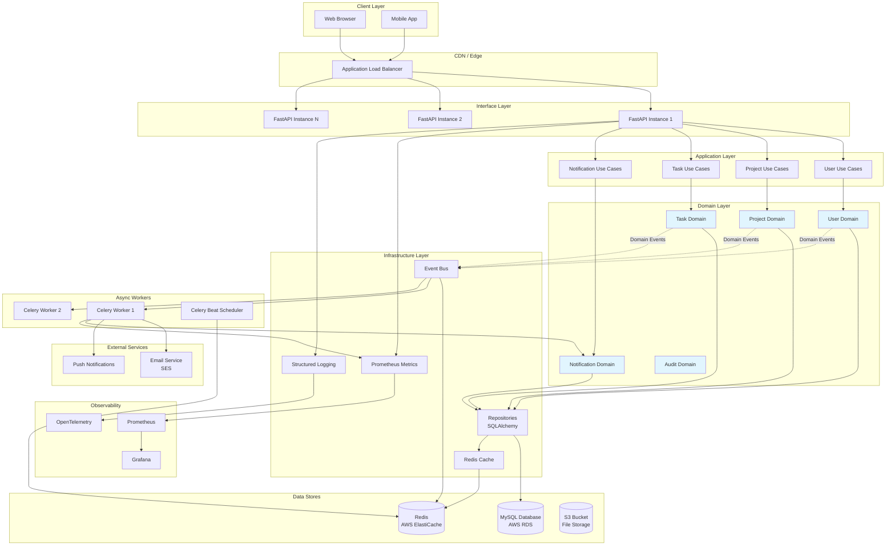
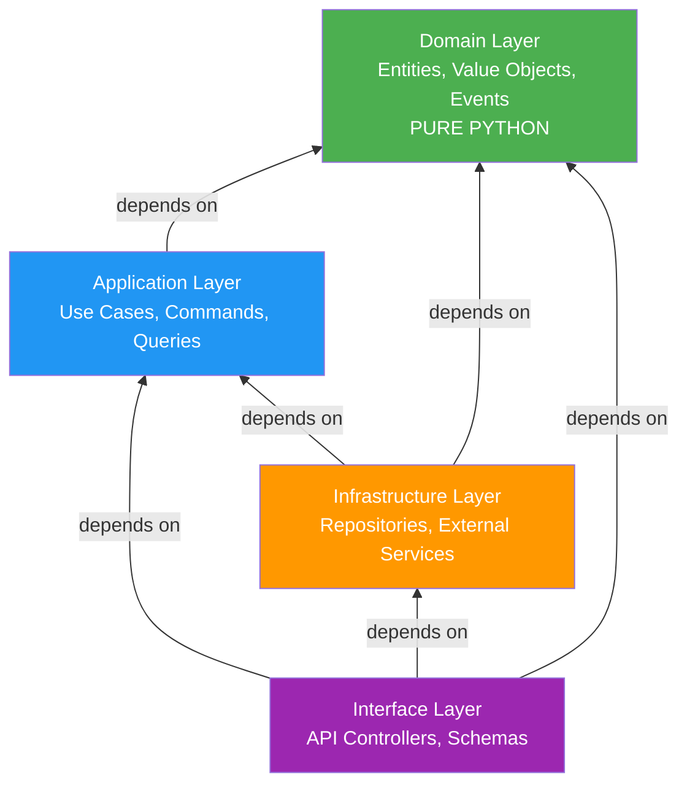
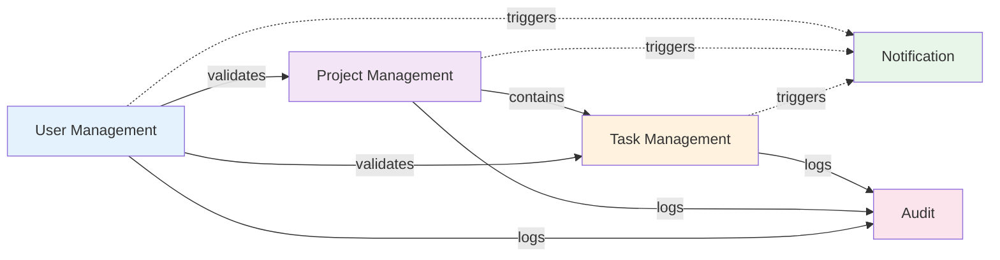
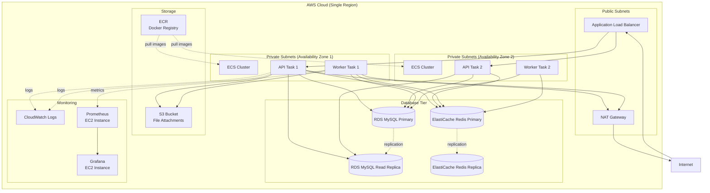
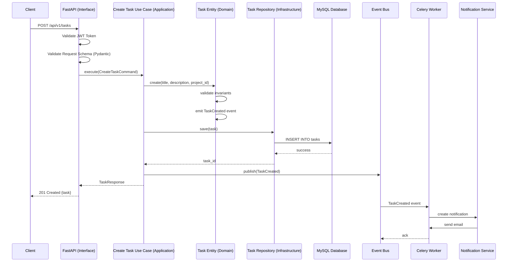
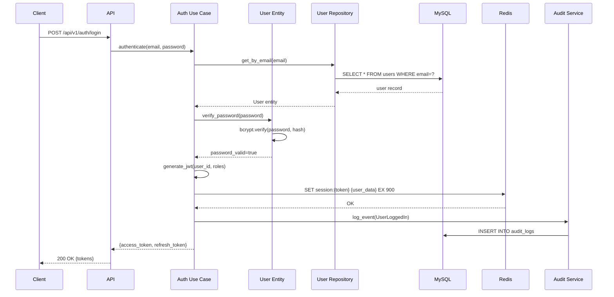
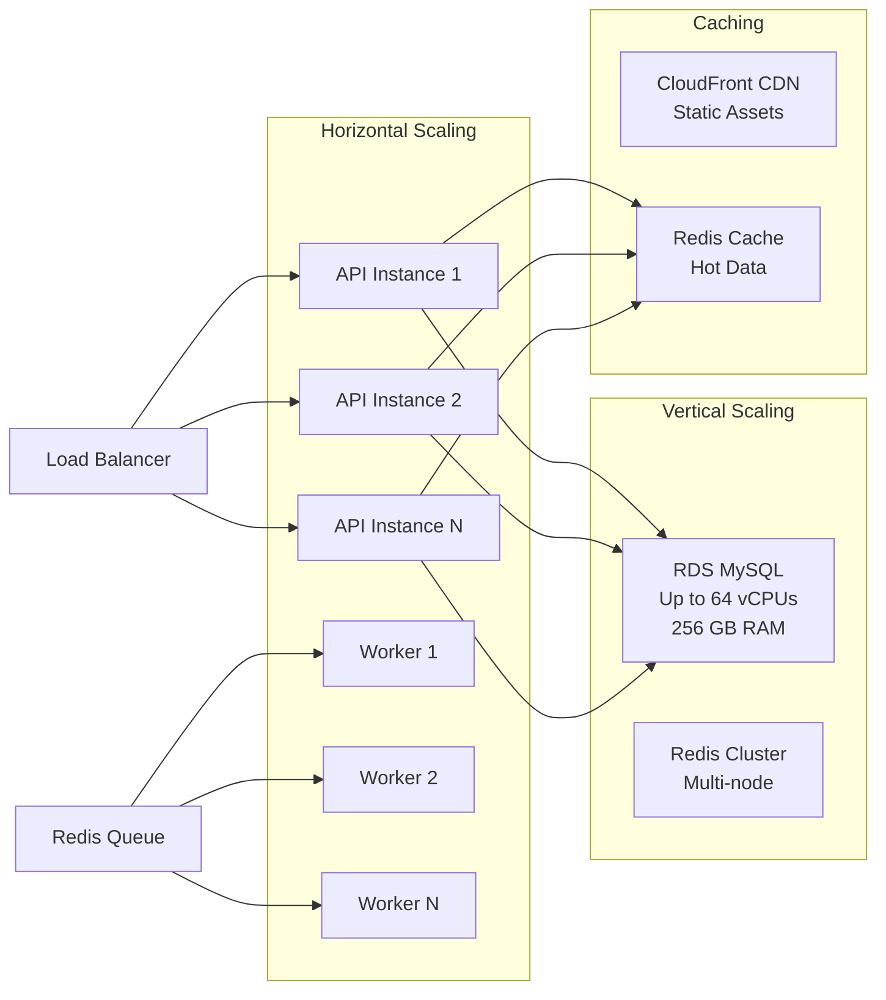

# System Architecture Overview

**Version**: 1.0.0  
**Last Updated**: 2025-10-30  
**Status**: Active

## Purpose

This document provides visual representations of the system architecture, showing how components interact, how data flows through the system, and how the architecture scales. All diagrams use Mermaid format for easy rendering on GitHub and documentation platforms.

---

## High-Level System Architecture

This diagram shows the complete system architecture across all layers, from client applications through to data stores and external services.

**Key Components**:

- **Interface Layer**: FastAPI instances handling HTTP requests, horizontally scaled
- **Application Layer**: Use cases orchestrating business operations
- **Domain Layer**: Pure business logic with zero external dependencies
- **Infrastructure Layer**: Technical implementations (database, cache, events)
- **Async Workers**: Celery workers for background processing
- **Data Stores**: MySQL (primary), Redis (cache/broker), S3 (files)
- **Observability**: Prometheus, Grafana, OpenTelemetry for monitoring

---

## Clean Architecture Layer Dependencies

This diagram illustrates the dependency rule: dependencies always point inward toward the domain layer.

**Dependency Rules**:

1. **Domain Layer** (Core): No external dependencies, pure Python
2. **Application Layer**: Depends only on Domain
3. **Infrastructure Layer**: Depends on Domain and Application
4. **Interface Layer**: Depends on all other layers

**See Also**: [Layer Responsibilities](../layers.md), [ADR-001: Clean Architecture](../decisions/adr-001-clean-architecture.md)

---

## Bounded Context Relationships

This diagram shows how the five bounded contexts interact with each other.

**Integration Patterns**:

- **Solid lines** (→): Synchronous validation/queries
- **Dotted lines** (-.->): Asynchronous domain events
- **User Management**: Central authority for authentication and authorization
- **Project Management**: Validates project membership
- **Task Management**: Core workflow engine
- **Notification**: Event subscriber for all contexts
- **Audit**: Event subscriber for compliance logging

**See Also**: [Bounded Contexts](../bounded-contexts.md), [ADR-003: Bounded Contexts](../decisions/adr-003-bounded-contexts.md)

---

## Deployment Architecture (AWS ECS)

This diagram shows the production deployment architecture on AWS with high availability and multi-AZ setup.

**Infrastructure Highlights**:

- **Multi-AZ Deployment**: Services deployed across two availability zones
- **Load Balancing**: ALB distributes traffic across API instances
- **Database Replication**: Primary-replica setup for read scaling
- **Redis Replication**: Automatic failover with replica nodes
- **Private Subnets**: Application and database tiers in private networks
- **NAT Gateway**: Outbound internet access for private instances
- **Container Registry**: ECR for Docker image storage
- **Monitoring**: CloudWatch for logs, Prometheus/Grafana for metrics

**See Also**: [Deployment Strategy](../deployment/README.md), [ADR-002: Technology Stack](../decisions/adr-002-technology-stack.md)

---

## Request Flow - Task Creation

This sequence diagram shows the complete flow when a user creates a new task.

**Flow Steps**:

1. **Authentication**: API validates JWT token from request headers
2. **Validation**: Pydantic validates request body schema
3. **Use Case**: Application layer executes CreateTaskCommand
4. **Domain Logic**: Task entity validates business rules
5. **Persistence**: Repository saves task to MySQL database
6. **Event Publishing**: TaskCreated event published to Redis
7. **Response**: API returns 201 Created with task details
8. **Async Processing**: Celery worker consumes event
9. **Notification**: Worker triggers notification creation and email delivery

**See Also**: [Data Flows](../data-flows.md), [API Design](../api-design.md)

---

## Data Flow - User Authentication

This sequence diagram shows the authentication flow with JWT token generation.

**Security Measures**:

- **Password Hashing**: Bcrypt with salt for secure password storage
- **JWT Tokens**: Short-lived access tokens (15 min), long-lived refresh tokens (30 days)
- **Session Cache**: Redis stores session data for quick validation
- **Audit Logging**: All login attempts logged for security monitoring

**See Also**: [Security Architecture](../security/README.md), [Authentication](../security/authentication.md)

---

## Scaling Strategy

This diagram illustrates horizontal and vertical scaling capabilities.

**Scaling Strategies**:

### Horizontal Scaling

- **API Instances**: Add more FastAPI containers as load increases
- **Worker Instances**: Add more Celery workers for background processing
- **Stateless Design**: All instances are identical and interchangeable

### Vertical Scaling

- **Database**: RDS MySQL can scale up to 64 vCPUs and 256 GB RAM
- **Redis Cluster**: Multi-node setup for increased capacity

### Caching

- **CDN**: CloudFront for static assets (images, CSS, JS)
- **Redis Cache**: Hot data caching reduces database load
- **Cache Strategies**: Write-through, TTL-based expiration

**See Also**: [Scalability Patterns](../scalability.md), [Performance Targets](../performance.md)

---

## Diagram Legend

### Line Types

- **Solid lines** (→): Synchronous dependencies/calls
- **Dotted lines** (-.->): Asynchronous events
- **Bidirectional** (↔): Request-response pattern

### Color Coding

- **Blue boxes**: Domain layer (pure business logic)
- **Orange boxes**: Infrastructure layer (technical concerns)
- **Purple boxes**: Interface layer (API, external facing)
- **Green boxes**: External services (email, push, etc.)
- **Gray boxes**: Data stores (databases, caches)

### Component Types

- **Cylinders** (🗄️): Databases and data stores
- **Rectangles**: Services and components
- **Rounded rectangles**: Layers and boundaries

---

## Architecture Principles

### 1. Stateless API Design

All API instances are stateless and identical, enabling:

- Horizontal scaling without session affinity
- Rolling deployments with zero downtime
- Automatic failover and recovery

### 2. Event-Driven Integration

Bounded contexts communicate via domain events:

- Loose coupling between contexts
- Resilience to temporary service unavailability
- Audit trail of all significant state changes

### 3. Caching Strategy

Multi-tier caching reduces database load:

- Redis for frequently accessed data
- CloudFront for static assets
- Application-level caching where appropriate

### 4. Async Processing

Long-running tasks handled asynchronously:

- Email sending via Celery workers
- Report generation in background
- Webhook delivery without blocking requests

### 5. High Availability

Multi-AZ deployment ensures uptime:

- Load balancer across multiple zones
- Database replication for failover
- Redis replication for cache resilience

---

## Performance Characteristics

| Metric                  | Target        | Actual Capability         |
| ----------------------- | ------------- | ------------------------- |
| API Response Time (p95) | < 500ms       | < 100ms (typical)         |
| Database Query (p95)    | < 100ms       | < 50ms (indexed queries)  |
| Concurrent Users        | 1,000+        | 10,000+ (with scaling)    |
| API Throughput          | 1,000 req/s   | 20,000+ req/s (per core)  |
| Worker Processing       | 100 tasks/min | 1,000+ tasks/min (scaled) |

**See Also**: [Performance Targets](../performance.md), [Capacity Planning](../capacity-planning.md)

---

## Related Documents

- [Layer Responsibilities](../layers.md) - Detailed layer descriptions
- [Bounded Contexts](../bounded-contexts.md) - Domain model details
- [Component Interactions](../components.md) - Component-level architecture
- [Data Flows](../data-flows.md) - Additional sequence diagrams
- [Technology Choices](../technology-choices.md) - Technology decisions
- [Deployment Strategy](../deployment/README.md) - Deployment details
- [Scalability Patterns](../scalability.md) - Scaling strategies

---

**Last Reviewed**: 2025-10-30  
**Next Review**: 2026-01-30 (Quarterly)
