# Layer Responsibilities

**Version**: 1.0.0  
**Last Updated**: 2025-10-30  
**Status**: Active

## Overview

This document defines the responsibilities, rules, and patterns for each layer in the Clean Architecture model. The architecture consists of four concentric layers, with dependencies always pointing inward toward the domain core.

---

## The Four Layers

```mermaid
graph BT
    DOMAIN[🟢 Domain Layer<br/>Business Logic]
    APP[🔵 Application Layer<br/>Use Cases]
    INFRA[🟠 Infrastructure Layer<br/>Technical Details]
    INTERFACE[🟣 Interface Layer<br/>External Facing]

    APP -->|depends on| DOMAIN
    INFRA -->|depends on| APP
    INFRA -->|depends on| DOMAIN
    INTERFACE -->|depends on| APP
    INTERFACE -->|depends on| INFRA
    INTERFACE -->|depends on| DOMAIN

    style DOMAIN fill:#4caf50,color:#fff
    style APP fill:#2196f3,color:#fff
    style INFRA fill:#ff9800,color:#fff
    style INTERFACE fill:#9c27b0,color:#fff
```



---

## 1. Domain Layer (Core)

**Location**: `src/domain/`  
**Color**: 🟢 Green  
**Depends On**: Nothing (pure Python)

### Purpose

Contains the core business logic and domain model. This layer is the heart of the application and remains completely independent of any frameworks, databases, or external services.

### Responsibilities

✅ **What Belongs Here**:

- **Entities**: Objects with unique identity (User, Project, Task)
- **Value Objects**: Immutable objects defined by attributes (Email, Money, TaskStatus)
- **Aggregates**: Consistency boundaries around related entities
- **Domain Events**: Significant state changes (UserRegistered, TaskCompleted)
- **Repository Interfaces**: Abstract definitions of data access (no implementations)
- **Domain Services**: Business logic that doesn't naturally fit in entities
- **Business Rules**: All invariants and validation logic
- **Domain Exceptions**: Business rule violations

❌ **What Does NOT Belong Here**:

- Database access (SQL, ORM models)
- HTTP requests or responses
- Framework-specific code (FastAPI, Django)
- External service calls (email, payment APIs)
- Infrastructure concerns (caching, logging)

### Example: User Entity

```python
# src/domain/users/entities/user.py
from dataclasses import dataclass
from datetime import datetime
from uuid import UUID
from typing import List

from ..value_objects import Email, PasswordHash
from ..events import UserRegistered, UserLoggedIn


@dataclass
class User:
    """User aggregate root - manages user identity and authentication."""

    user_id: UUID
    email: Email
    password_hash: PasswordHash
    full_name: str
    status: 'UserStatus'
    created_at: datetime
    updated_at: datetime

    # Domain events (not persisted)
    _events: List['DomainEvent'] = None

    def __post_init__(self):
        self._events = []

    @classmethod
    def create(cls, email: Email, password: str, full_name: str) -> 'User':
        """Factory method for creating new users with validation."""
        # Validate business rules
        if len(full_name) < 2:
            raise ValueError("Full name must be at least 2 characters")

        # Create password hash
        password_hash = PasswordHash.from_plain_text(password)

        # Create user
        user = cls(
            user_id=UUID.uuid4(),
            email=email,
            password_hash=password_hash,
            full_name=full_name,
            status=UserStatus.ACTIVE,
            created_at=datetime.utcnow(),
            updated_at=datetime.utcnow()
        )

        # Emit domain event
        user._events.append(UserRegistered(
            user_id=user.user_id,
            email=user.email.value,
            occurred_at=datetime.utcnow()
        ))

        return user

    def verify_password(self, password: str) -> bool:
        """Verify password against stored hash."""
        is_valid = self.password_hash.verify(password)

        if is_valid:
            self._events.append(UserLoggedIn(
                user_id=self.user_id,
                occurred_at=datetime.utcnow()
            ))

        return is_valid

    def change_password(self, old_password: str, new_password: str) -> None:
        """Change password with validation."""
        if not self.verify_password(old_password):
            raise ValueError("Current password is incorrect")

        self.password_hash = PasswordHash.from_plain_text(new_password)
        self.updated_at = datetime.utcnow()
```

### Example: Email Value Object

```python
# src/domain/users/value_objects/email.py
import re
from dataclasses import dataclass


@dataclass(frozen=True)
class Email:
    """Email value object with validation."""

    value: str

    def __post_init__(self):
        # Validate email format
        if not self._is_valid_email(self.value):
            raise ValueError(f"Invalid email format: {self.value}")

        # Normalize (lowercase)
        object.__setattr__(self, 'value', self.value.lower())

    @staticmethod
    def _is_valid_email(email: str) -> bool:
        pattern = r'^[a-zA-Z0-9._%+-]+@[a-zA-Z0-9.-]+\.[a-zA-Z]{2,}$'
        return re.match(pattern, email) is not None

    def __str__(self) -> str:
        return self.value
```

### Example: Repository Interface

```python
# src/domain/users/repositories.py
from abc import ABC, abstractmethod
from typing import Optional, List
from uuid import UUID

from .entities import User
from .value_objects import Email


class UserRepository(ABC):
    """Repository interface - defines contract for data access."""

    @abstractmethod
    def get_by_id(self, user_id: UUID) -> Optional[User]:
        """Retrieve user by ID."""
        pass

    @abstractmethod
    def get_by_email(self, email: Email) -> Optional[User]:
        """Retrieve user by email."""
        pass

    @abstractmethod
    def save(self, user: User) -> None:
        """Save user (create or update)."""
        pass

    @abstractmethod
    def delete(self, user_id: UUID) -> None:
        """Delete user by ID."""
        pass

    @abstractmethod
    def list_by_organization(self, org_id: UUID) -> List[User]:
        """List all users in an organization."""
        pass
```

### Rules

1. **Zero External Dependencies**: No imports from infrastructure, application, or interface layers
2. **Pure Python**: Only standard library and domain-specific code
3. **Framework Agnostic**: No FastAPI, SQLAlchemy, or other framework imports
4. **Testable in Isolation**: All tests run without databases or external services
5. **Rich Domain Model**: Business logic in entities, not in services
6. **Immutable Value Objects**: Use frozen dataclasses or properties
7. **Clear Invariants**: Validate business rules in entity methods

---

## 2. Application Layer

**Location**: `src/application/`  
**Color**: 🔵 Blue  
**Depends On**: Domain Layer only

### Purpose

Orchestrates use cases by coordinating domain entities, repositories, and domain services. Contains application-specific business rules that don't belong in the domain.

### Responsibilities

✅ **What Belongs Here**:

- **Use Cases**: Application-specific workflows (RegisterUserUseCase, CreateTaskUseCase)
- **Commands**: Write operations (CreateTaskCommand, AssignTaskCommand)
- **Queries**: Read operations (GetTasksByProjectQuery, GetUserProfileQuery)
- **DTOs**: Data Transfer Objects for use case inputs/outputs
- **Application Services**: Coordinate multiple domain operations
- **Transaction Management**: Define transactional boundaries
- **Authorization Logic**: Permission checks using domain data

❌ **What Does NOT Belong Here**:

- Database implementation details (SQL, ORM)
- HTTP request/response handling
- External API calls (implementation)
- Framework-specific code

### Example: Create Task Use Case

```python
# src/application/tasks/commands/create_task.py
from dataclasses import dataclass
from datetime import date
from uuid import UUID
from typing import Optional

from src.domain.tasks.entities import Task
from src.domain.tasks.repositories import TaskRepository
from src.domain.projects.repositories import ProjectRepository
from src.domain.users.repositories import UserRepository
from .dtos import CreateTaskDTO, TaskResponseDTO


@dataclass
class CreateTaskCommand:
    """Command for creating a new task."""
    title: str
    description: Optional[str]
    project_id: UUID
    assigned_to_user_id: Optional[UUID]
    priority: str
    due_date: Optional[date]
    created_by_user_id: UUID


class CreateTaskUseCase:
    """Use case for creating a new task."""

    def __init__(
        self,
        task_repository: TaskRepository,
        project_repository: ProjectRepository,
        user_repository: UserRepository
    ):
        self._task_repo = task_repository
        self._project_repo = project_repository
        self._user_repo = user_repository

    def execute(self, command: CreateTaskCommand) -> TaskResponseDTO:
        """Execute the create task use case."""
        # 1. Validate project exists
        project = self._project_repo.get_by_id(command.project_id)
        if not project:
            raise ValueError(f"Project {command.project_id} not found")

        # 2. Validate user has access to project
        creator = self._user_repo.get_by_id(command.created_by_user_id)
        if not self._project_repo.is_member(command.project_id, command.created_by_user_id):
            raise PermissionError("User does not have access to this project")

        # 3. If assigning, validate assignee has access
        if command.assigned_to_user_id:
            if not self._project_repo.is_member(command.project_id, command.assigned_to_user_id):
                raise ValueError("Cannot assign task to user outside project")

        # 4. Create task entity (domain logic)
        task = Task.create(
            title=command.title,
            description=command.description,
            project_id=command.project_id,
            created_by_user_id=command.created_by_user_id,
            priority=command.priority
        )

        # 5. Assign if specified
        if command.assigned_to_user_id:
            task.assign_to(command.assigned_to_user_id)

        # 6. Set due date if specified
        if command.due_date:
            task.set_due_date(command.due_date)

        # 7. Save task
        self._task_repo.save(task)

        # 8. Return DTO
        return TaskResponseDTO.from_entity(task)
```

### Example: Query Handler

```python
# src/application/tasks/queries/get_tasks_by_project.py
from dataclasses import dataclass
from uuid import UUID
from typing import List

from src.domain.tasks.repositories import TaskRepository
from .dtos import TaskListItemDTO


@dataclass
class GetTasksByProjectQuery:
    """Query for retrieving tasks by project."""
    project_id: UUID
    user_id: UUID  # For authorization
    status_filter: Optional[str] = None
    assignee_filter: Optional[UUID] = None


class GetTasksByProjectQueryHandler:
    """Handler for retrieving tasks by project."""

    def __init__(self, task_repository: TaskRepository):
        self._task_repo = task_repository

    def handle(self, query: GetTasksByProjectQuery) -> List[TaskListItemDTO]:
        """Execute the query."""
        # Get tasks with filters
        tasks = self._task_repo.list_by_project(
            project_id=query.project_id,
            status=query.status_filter,
            assignee_id=query.assignee_filter
        )

        # Convert to DTOs
        return [TaskListItemDTO.from_entity(task) for task in tasks]
```

### Rules

1. **Orchestration Only**: Use cases coordinate domain objects, don't contain business logic
2. **Thin Layer**: Keep simple, delegate to domain entities
3. **Transactional Boundaries**: Define transaction scope (usually one use case = one transaction)
4. **No Framework Dependencies**: No FastAPI, no SQLAlchemy ORM models
5. **Use DTOs**: Don't expose domain entities to outer layers
6. **Authorization Here**: Check permissions using domain data

---

## 3. Infrastructure Layer

**Location**: `src/infrastructure/`  
**Color**: 🟠 Orange  
**Depends On**: Domain + Application layers

### Purpose

Provides technical implementations for interfaces defined in domain and application layers. Handles all external concerns like databases, file systems, external APIs, and messaging.

### Responsibilities

✅ **What Belongs Here**:

- **Repository Implementations**: SQLAlchemy, Redis implementations
- **ORM Models**: SQLAlchemy declarative models
- **Database Migrations**: Alembic migration scripts
- **External Service Adapters**: Email, payment, push notification clients
- **Message Bus**: Event publishing and subscription
- **Caching**: Redis cache implementations
- **File Storage**: S3 or local file storage
- **Observability**: Logging, metrics, tracing implementations

❌ **What Does NOT Belong Here**:

- Business logic (belongs in domain)
- HTTP request handling (belongs in interface)
- Use case orchestration (belongs in application)

### Example: SQLAlchemy Repository Implementation

```python
# src/infrastructure/persistence/sqlalchemy/repositories/user_repository.py
from typing import Optional, List
from uuid import UUID
from sqlalchemy.orm import Session

from src.domain.users.entities import User
from src.domain.users.value_objects import Email
from src.domain.users.repositories import UserRepository
from ..models import UserModel  # ORM model
from ..mappers import UserMapper  # Entity <-> ORM mapper


class SqlAlchemyUserRepository(UserRepository):
    """SQLAlchemy implementation of UserRepository."""

    def __init__(self, session: Session):
        self._session = session
        self._mapper = UserMapper()

    def get_by_id(self, user_id: UUID) -> Optional[User]:
        """Retrieve user by ID."""
        model = self._session.query(UserModel).filter_by(user_id=user_id).first()
        return self._mapper.to_entity(model) if model else None

    def get_by_email(self, email: Email) -> Optional[User]:
        """Retrieve user by email."""
        model = self._session.query(UserModel).filter_by(email=str(email)).first()
        return self._mapper.to_entity(model) if model else None

    def save(self, user: User) -> None:
        """Save user (create or update)."""
        # Check if exists
        existing = self._session.query(UserModel).filter_by(user_id=user.user_id).first()

        if existing:
            # Update
            self._mapper.update_model(existing, user)
        else:
            # Create
            model = self._mapper.to_model(user)
            self._session.add(model)

        self._session.flush()  # Ensure DB constraints are checked

    def delete(self, user_id: UUID) -> None:
        """Delete user by ID."""
        self._session.query(UserModel).filter_by(user_id=user_id).delete()

    def list_by_organization(self, org_id: UUID) -> List[User]:
        """List all users in an organization."""
        models = (
            self._session.query(UserModel)
            .join(UserModel.organizations)
            .filter_by(organization_id=org_id)
            .all()
        )
        return [self._mapper.to_entity(model) for model in models]
```

### Example: ORM Model

```python
# src/infrastructure/persistence/sqlalchemy/models/user.py
from sqlalchemy import Column, String, DateTime, Enum
from sqlalchemy.dialects.postgresql import UUID as PG_UUID
from sqlalchemy.orm import relationship
import uuid

from .base import Base


class UserModel(Base):
    """SQLAlchemy ORM model for users table."""

    __tablename__ = 'users'

    user_id = Column(PG_UUID(as_uuid=True), primary_key=True, default=uuid.uuid4)
    email = Column(String(255), unique=True, nullable=False, index=True)
    password_hash = Column(String(255), nullable=False)
    full_name = Column(String(255), nullable=False)
    status = Column(Enum('ACTIVE', 'SUSPENDED', 'DELETED', name='user_status'), nullable=False)
    created_at = Column(DateTime, nullable=False)
    updated_at = Column(DateTime, nullable=False)
    last_login_at = Column(DateTime, nullable=True)

    # Relationships
    organizations = relationship('OrganizationMemberModel', back_populates='user')
```

### Example: Event Bus Implementation

```python
# src/infrastructure/messaging/redis_event_bus.py
import json
from typing import Callable, Dict, List
import redis

from src.domain.common.events import DomainEvent


class RedisEventBus:
    """Redis-based event bus for domain events."""

    def __init__(self, redis_client: redis.Redis):
        self._redis = redis_client
        self._handlers: Dict[str, List[Callable]] = {}

    def publish(self, event: DomainEvent) -> None:
        """Publish event to Redis."""
        channel = f"events.{event.__class__.__name__}"
        payload = json.dumps({
            'event_type': event.__class__.__name__,
            'data': event.to_dict(),
            'occurred_at': event.occurred_at.isoformat()
        })
        self._redis.publish(channel, payload)

    def subscribe(self, event_type: str, handler: Callable[[DomainEvent], None]) -> None:
        """Subscribe handler to event type."""
        if event_type not in self._handlers:
            self._handlers[event_type] = []
        self._handlers[event_type].append(handler)

    def start_listening(self) -> None:
        """Start listening for events (blocking)."""
        pubsub = self._redis.pubsub()
        pubsub.psubscribe('events.*')

        for message in pubsub.listen():
            if message['type'] == 'pmessage':
                self._handle_message(message['data'])

    def _handle_message(self, data: bytes) -> None:
        """Handle incoming event message."""
        payload = json.loads(data)
        event_type = payload['event_type']

        if event_type in self._handlers:
            for handler in self._handlers[event_type]:
                try:
                    handler(payload)
                except Exception as e:
                    # Log error, don't crash listener
                    print(f"Error handling event {event_type}: {e}")
```

### Rules

1. **Implement Domain Interfaces**: Repositories must implement domain interfaces
2. **Map Between Layers**: Use mappers to convert ORM ↔ Domain entities
3. **No Business Logic**: Pure technical implementations
4. **Error Handling**: Translate infrastructure errors to domain exceptions
5. **Dependency Injection**: Accept dependencies via constructor

---

## 4. Interface Layer

**Location**: `src/interface/`  
**Color**: 🟣 Purple  
**Depends On**: All other layers

### Purpose

Handles external interactions via APIs, CLIs, or other interfaces. Translates external requests to application commands/queries and application responses to external formats.

### Responsibilities

✅ **What Belongs Here**:

- **API Controllers**: FastAPI route handlers
- **Request/Response Schemas**: Pydantic models for HTTP
- **Middleware**: Authentication, logging, error handling
- **Dependency Injection**: Wire up repositories and use cases
- **Input Validation**: HTTP-level validation (Pydantic)
- **Serialization**: Convert DTOs to JSON
- **CLI Commands**: Command-line interface (if applicable)

❌ **What Does NOT Belong Here**:

- Business logic (belongs in domain/application)
- Database queries (belongs in infrastructure)
- Complex data transformations

### Example: API Controller

```python
# src/interface/api/v1/tasks/routes.py
from fastapi import APIRouter, Depends, HTTPException, status
from uuid import UUID

from src.application.tasks.commands import CreateTaskCommand, CreateTaskUseCase
from src.application.tasks.queries import GetTasksByProjectQuery, GetTasksByProjectQueryHandler
from ..dependencies import get_task_repository, get_current_user
from .schemas import CreateTaskRequest, TaskResponse, TaskListResponse


router = APIRouter(prefix="/tasks", tags=["tasks"])


@router.post("/", response_model=TaskResponse, status_code=status.HTTP_201_CREATED)
async def create_task(
    request: CreateTaskRequest,
    current_user: User = Depends(get_current_user),
    task_repo: TaskRepository = Depends(get_task_repository),
    project_repo: ProjectRepository = Depends(get_project_repository),
    user_repo: UserRepository = Depends(get_user_repository)
):
    """Create a new task."""
    # Build command
    command = CreateTaskCommand(
        title=request.title,
        description=request.description,
        project_id=request.project_id,
        assigned_to_user_id=request.assigned_to_user_id,
        priority=request.priority,
        due_date=request.due_date,
        created_by_user_id=current_user.user_id
    )

    # Execute use case
    use_case = CreateTaskUseCase(task_repo, project_repo, user_repo)

    try:
        result = use_case.execute(command)
        return TaskResponse.from_dto(result)
    except ValueError as e:
        raise HTTPException(status_code=400, detail=str(e))
    except PermissionError as e:
        raise HTTPException(status_code=403, detail=str(e))


@router.get("/project/{project_id}", response_model=TaskListResponse)
async def get_tasks_by_project(
    project_id: UUID,
    status_filter: Optional[str] = None,
    current_user: User = Depends(get_current_user),
    task_repo: TaskRepository = Depends(get_task_repository)
):
    """Get all tasks for a project."""
    # Build query
    query = GetTasksByProjectQuery(
        project_id=project_id,
        user_id=current_user.user_id,
        status_filter=status_filter
    )

    # Execute query
    handler = GetTasksByProjectQueryHandler(task_repo)
    tasks = handler.handle(query)

    return TaskListResponse(tasks=[TaskResponse.from_dto(t) for t in tasks])
```

### Example: Request/Response Schemas

```python
# src/interface/api/v1/tasks/schemas.py
from pydantic import BaseModel, Field
from uuid import UUID
from datetime import date
from typing import Optional


class CreateTaskRequest(BaseModel):
    """Request schema for creating a task."""
    title: str = Field(..., min_length=1, max_length=200)
    description: Optional[str] = Field(None, max_length=5000)
    project_id: UUID
    assigned_to_user_id: Optional[UUID] = None
    priority: str = Field(..., pattern="^(LOW|MEDIUM|HIGH|URGENT)$")
    due_date: Optional[date] = None

    class Config:
        json_schema_extra = {
            "example": {
                "title": "Implement user authentication",
                "description": "Add JWT-based authentication to API",
                "project_id": "550e8400-e29b-41d4-a716-446655440000",
                "priority": "HIGH",
                "due_date": "2025-11-15"
            }
        }


class TaskResponse(BaseModel):
    """Response schema for a task."""
    task_id: UUID
    title: str
    description: Optional[str]
    project_id: UUID
    status: str
    priority: str
    created_at: str

    @classmethod
    def from_dto(cls, dto):
        """Convert from application DTO."""
        return cls(
            task_id=dto.task_id,
            title=dto.title,
            description=dto.description,
            project_id=dto.project_id,
            status=dto.status,
            priority=dto.priority,
            created_at=dto.created_at.isoformat()
        )
```

### Rules

1. **HTTP Concerns Only**: Request/response handling, status codes, headers
2. **Thin Controllers**: Delegate to application layer immediately
3. **Input Validation**: Use Pydantic for schema validation
4. **Error Translation**: Convert domain exceptions to HTTP status codes
5. **No Business Logic**: Controllers orchestrate, don't implement logic
6. **Dependency Injection**: Use FastAPI's `Depends()` for wiring

---

## Layer Communication Patterns

### Inward Dependency Rule

```
Interface → Application → Domain
Interface → Infrastructure → Application → Domain
Infrastructure → Domain
```

**NEVER**:

```
Domain → Application  ❌
Domain → Infrastructure  ❌
Application → Interface  ❌
```

### Data Flow Patterns

#### Write Operation (Command)

```
HTTP Request → Controller → Use Case → Domain Entity → Repository → Database
                                      ↓
                                Domain Event → Event Bus → Workers
```

#### Read Operation (Query)

```
HTTP Request → Controller → Query Handler → Repository → Database
                                          ↓
                                    Cache (optional)
```

---

## Testing by Layer

| Layer          | Test Type         | Dependencies      | Speed  |
| -------------- | ----------------- | ----------------- | ------ |
| Domain         | Unit Tests        | None              | < 1ms  |
| Application    | Unit Tests        | Mock Repositories | < 10ms |
| Infrastructure | Integration Tests | Test Database     | ~100ms |
| Interface      | Contract Tests    | Real HTTP         | ~100ms |

**See Also**: [Testing Strategy](../technology-choices.md#10-testing-strategy)

---

## Common Anti-Patterns

### ❌ Anti-Pattern 1: Business Logic in Controllers

```python
# BAD: Business logic in controller
@router.post("/tasks")
async def create_task(request: CreateTaskRequest):
    if len(request.title) < 3:  # ❌ Validation belongs in domain
        raise HTTPException(400, "Title too short")

    task = TaskModel(  # ❌ Direct ORM access
        title=request.title,
        status="TODO"
    )
    db.add(task)
    db.commit()
```

✅ **Correct**: Delegate to use case, use domain entity

### ❌ Anti-Pattern 2: Domain Entities with Framework Dependencies

```python
# BAD: FastAPI dependency in domain
from fastapi import HTTPException  # ❌

class Task:
    def assign_to(self, user_id: UUID):
        if not self._validate_assignee(user_id):
            raise HTTPException(403, "Invalid assignee")  # ❌
```

✅ **Correct**: Use domain exceptions, translate in interface layer

### ❌ Anti-Pattern 3: Repository Implementation in Application

```python
# BAD: SQL in use case
class CreateTaskUseCase:
    def execute(self, command):
        db.execute("INSERT INTO tasks ...")  # ❌ Direct SQL
```

✅ **Correct**: Use repository interface, implementation in infrastructure

---

## Related Documents

- [System Architecture Overview](./diagrams/01-system-overview.md)
- [Bounded Contexts](./bounded-contexts.md)
- [Component Interactions](./components.md)
- [ADR-001: Clean Architecture](./decisions/adr-001-clean-architecture.md)
- [Technology Choices](./technology-choices.md)

---

**Last Reviewed**: 2025-10-30  
**Next Review**: 2026-01-30 (Quarterly)
