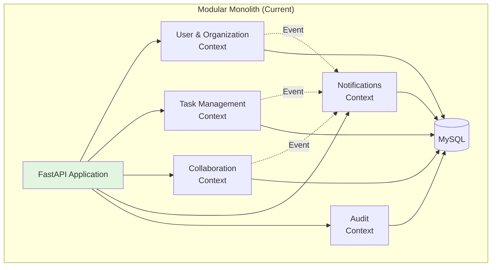
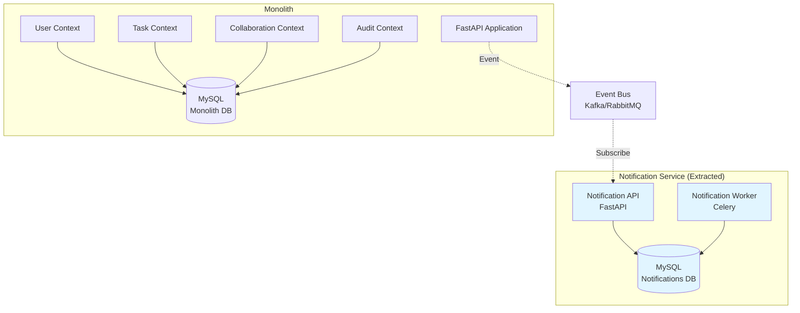
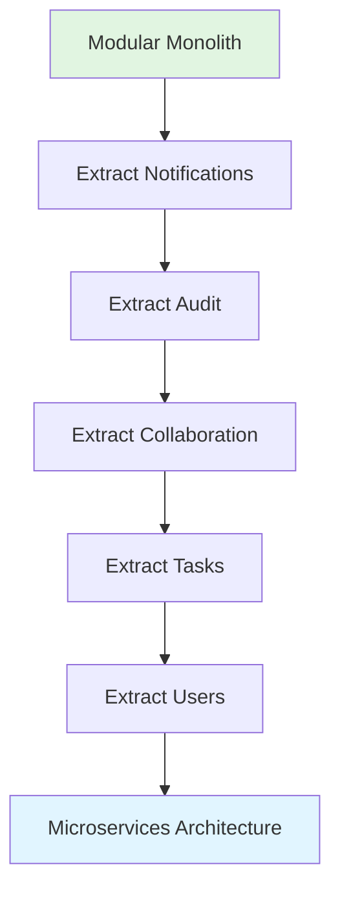
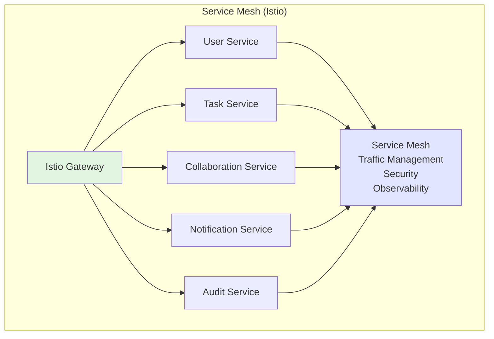
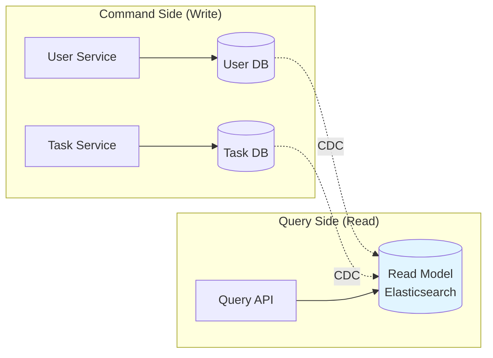
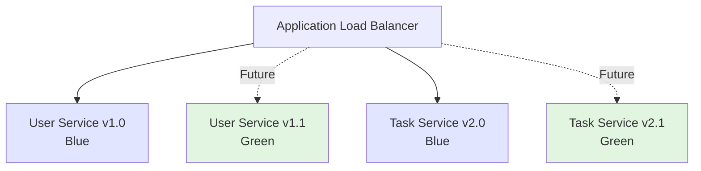

# Migration Guide: Monolith to Microservices

**Version**: 1.0.0  
**Last Updated**: 2025-10-30  
**Status**: Active

## Overview

This guide outlines the strategy for evolving the Task Management System from a **modular monolith** to **microservices**, when and if needed. The current architecture is designed with bounded contexts that serve as natural service boundaries.

**Current State**: Modular Monolith (recommended for 0-100K users)  
**Future State**: Microservices (optional, for 100K+ users or specific needs)

---

## When to Consider Microservices

### ⚠️ Warning: Don't Migrate Too Early

**Microservices add complexity**. Only migrate when you have a specific need:

### Valid Reasons to Migrate

✅ **Different Scaling Needs**

- Example: Notifications need 10x more resources than Task Management
- Solution: Extract Notifications to independent service with its own scaling

✅ **Independent Deployment**

- Example: Need to deploy Notifications updates without affecting Task Management
- Solution: Separate services with independent CI/CD pipelines

✅ **Technology Diversity**

- Example: Real-time features need Node.js/WebSockets, but core is Python
- Solution: Extract real-time service in Node.js

✅ **Team Autonomy**

- Example: 3+ teams stepping on each other in monolith codebase
- Solution: Each team owns their service(s)

✅ **Performance Isolation**

- Example: Heavy reporting queries slow down API responses
- Solution: Extract Analytics service with read replicas

### ❌ Invalid Reasons (Don't Migrate For These)

- ❌ "Microservices are more modern" - not inherently better
- ❌ "Everyone else is doing it" - not a technical reason
- ❌ "It will make things faster" - usually makes things slower
- ❌ "Easier to scale" - monoliths scale fine to 100K+ users
- ❌ "Resume-driven development" - not a business reason

---

## Migration Strategy

### Phase 1: Validate Bounded Contexts (Current State)

**Goal**: Ensure contexts are truly independent before extracting.



**Checklist**:

- [x] Bounded contexts defined (5 contexts)
- [x] Clear boundaries documented
- [x] Communication via events or service interfaces
- [ ] No direct database access across contexts
- [ ] Context-specific tables identified
- [ ] Shared data minimal

**Current Issues to Fix**:

1. **Shared Database**: All contexts use same MySQL database
2. **Direct Calls**: Some contexts call others directly (not via events)
3. **Shared Models**: Some domain models used across contexts

**Actions**:

```python
# ❌ Current: Direct dependency
class CompleteTaskUseCase:
    def execute(self, task_id: TaskId):
        task.complete()
        # Direct call to another context
        self._notification_service.send(task_id)  # Tight coupling

# ✅ Target: Event-driven
class CompleteTaskUseCase:
    def execute(self, task_id: TaskId):
        task.complete()
        # Publish event (loose coupling)
        self._event_bus.publish(TaskCompletedEvent(task_id))

# Notification context listens
class TaskCompletedHandler:
    def handle(self, event: TaskCompletedEvent):
        self._notification_service.send(event.task_id)
```

---

### Phase 2: Extract First Service (Notifications)

**Why Notifications First**:

- ✅ Loosely coupled (listens to events)
- ✅ Independent scaling needs
- ✅ No critical path (can fail without breaking core)
- ✅ Simple domain model
- ✅ Good learning experience



#### Step 1: Database Separation

**Extract notification tables**:

```sql
-- Create new notifications database
CREATE DATABASE taskmanager_notifications;

-- Copy notification tables
CREATE TABLE taskmanager_notifications.notifications
  AS SELECT * FROM taskmanager.notifications;

CREATE TABLE taskmanager_notifications.notification_preferences
  AS SELECT * FROM taskmanager.notification_preferences;

-- Add foreign keys to user_id (reference to monolith)
-- Note: Cross-database foreign keys not enforced
```

**Handle shared data** (users):

```python
# Option 1: Read-only replica of user data
class NotificationService:
    async def send(self, user_id: UserId):
        # Read user from local cache (synced from monolith)
        user = await self._user_cache.get(user_id)
        await self._email_sender.send(user.email, ...)

# Option 2: API call to monolith for user data
class NotificationService:
    async def send(self, user_id: UserId):
        # Call monolith API
        user = await self._monolith_api.get_user(user_id)
        await self._email_sender.send(user.email, ...)
```

#### Step 2: Deploy Service

**Create notification service**:

```python
# notifications-service/main.py
from fastapi import FastAPI

app = FastAPI(title="Notification Service")

@app.post("/notifications")
async def create_notification(notification: NotificationDTO):
    # Handle notification creation
    pass

@app.get("/health")
async def health():
    return {"status": "healthy"}
```

**Deploy to ECS**:

```yaml
# Task definition for notification service
{
  "family": "notification-service",
  "cpu": "512",
  "memory": "1024",
  "networkMode": "awsvpc",
  "containerDefinitions":
    [
      {
        "name": "notification-api",
        "image": "xxx.dkr.ecr.us-east-1.amazonaws.com/notification-service:latest",
        "portMappings": [{ "containerPort": 8000 }],
        "environment":
          [
            { "name": "DATABASE_URL", "value": "mysql://...notifications" },
            { "name": "EVENT_BUS_URL", "value": "kafka://..." },
          ],
      },
    ],
}
```

#### Step 3: Event Bus Integration

**Setup Kafka**:

```hcl
# terraform/modules/kafka/main.tf
resource "aws_msk_cluster" "event_bus" {
  cluster_name           = "taskmanager-events"
  kafka_version          = "3.5.1"
  number_of_broker_nodes = 3

  broker_node_group_info {
    instance_type   = "kafka.m5.large"
    client_subnets  = var.private_subnet_ids
    security_groups = [aws_security_group.kafka.id]
  }
}
```

**Monolith publishes events**:

```python
# monolith/infrastructure/events/kafka_publisher.py
class KafkaEventPublisher(EventPublisher):
    def __init__(self, kafka_producer: KafkaProducer):
        self._producer = kafka_producer

    async def publish(self, event: DomainEvent):
        await self._producer.send(
            topic="task-events",
            value=event.to_json(),
            key=str(event.aggregate_id)
        )

# monolith/application/use_cases/complete_task.py
class CompleteTaskUseCase:
    async def execute(self, task_id: TaskId):
        task = await self._task_repo.get_by_id(task_id)
        task.complete()
        await self._task_repo.save(task)

        # Publish event
        event = TaskCompletedEvent(
            task_id=task.id,
            completed_at=task.completed_at,
            completed_by=task.assigned_to
        )
        await self._event_publisher.publish(event)
```

**Notification service subscribes**:

```python
# notifications-service/consumers/task_events.py
class TaskEventConsumer:
    async def consume(self):
        async for message in self._kafka_consumer:
            event = TaskCompletedEvent.from_json(message.value)
            await self._notification_handler.handle(event)
```

#### Step 4: Dual-Write Transition

**Run both for safety**:

```python
class CompleteTaskUseCase:
    async def execute(self, task_id: TaskId):
        task.complete()
        await self._task_repo.save(task)

        # Dual write: Both old and new
        try:
            # New: Event bus
            await self._event_publisher.publish(event)
        except Exception as e:
            log.error(f"Event publish failed: {e}")
            # Fallback to old method
            await self._old_notification_service.send(task_id)
```

**Monitor both paths**:

```python
# Metrics
event_publish_success.inc()
event_publish_failure.inc()
old_path_used.inc()

# After 2 weeks of success, remove old path
```

#### Step 5: Cutover

**Remove old code**:

```python
# Before
class CompleteTaskUseCase:
    def __init__(self, ..., old_notification_service):
        self._old_notification_service = old_notification_service

# After
class CompleteTaskUseCase:
    def __init__(self, ..., event_publisher):
        self._event_publisher = event_publisher
        # old_notification_service removed
```

**Drop old tables** (after 30 days):

```sql
-- Archive old data first
CREATE TABLE notifications_archive AS SELECT * FROM notifications;

-- Drop from monolith
DROP TABLE notifications;
DROP TABLE notification_preferences;
```

---

### Phase 3: Extract Remaining Services

**Order of extraction** (based on dependency):

1. ✅ **Notifications** (done in Phase 2)
2. **Audit & Compliance** (similar to notifications, event-driven)
3. **Collaboration & Comments** (some task dependencies)
4. **Task Management** (core domain, extract later)
5. **User & Organization** (foundational, extract last)



**Timeline**: 6-12 months for full migration (1-2 services per quarter)

---

### Phase 4: Service Mesh (Optional)

**When needed**: 5+ services with complex communication



**Benefits**:

- ✅ Automatic service discovery
- ✅ Load balancing
- ✅ Circuit breaking
- ✅ Distributed tracing
- ✅ mTLS between services

**Cost**: Additional complexity, learning curve

---

## Data Management Strategies

### Strategy 1: Database per Service

**Recommended**: Each service owns its data

```sql
-- User Service
CREATE DATABASE taskmanager_users;

-- Task Service
CREATE DATABASE taskmanager_tasks;

-- Notification Service
CREATE DATABASE taskmanager_notifications;

-- Audit Service
CREATE DATABASE taskmanager_audit;
```

**Pros**:

- ✅ True service independence
- ✅ Different databases if needed (MySQL, PostgreSQL, MongoDB)
- ✅ Easier to scale independently

**Cons**:

- ⚠️ No joins across services
- ⚠️ Distributed transactions complex
- ⚠️ Data duplication

### Strategy 2: Shared Database (Avoid)

**Not recommended**: Services share database

**Pros**:

- ✅ Easy to query across contexts
- ✅ ACID transactions

**Cons**:

- ❌ Tight coupling (not true microservices)
- ❌ Schema changes affect all services
- ❌ Database becomes bottleneck

### Strategy 3: CQRS with Shared Read Model

**Advanced**: Command side separate, query side shared



**When needed**: Complex cross-service queries

---

## Communication Patterns

### Pattern 1: Synchronous (REST/gRPC)

**Use for**: Request-response, immediate result needed

```python
# Task service calls User service
class TaskService:
    async def create_task(self, task_data: TaskData):
        # Validate user exists
        user = await self._user_service_client.get_user(task_data.user_id)

        if not user:
            raise UserNotFoundError()

        task = Task.create(task_data)
        await self._task_repo.save(task)
        return task
```

**Pros**:

- ✅ Simple to understand
- ✅ Immediate response
- ✅ Easy to debug

**Cons**:

- ⚠️ Tight coupling
- ⚠️ Cascading failures
- ⚠️ Higher latency

### Pattern 2: Asynchronous (Events)

**Use for**: Notifications, eventual consistency acceptable

```python
# Task service publishes event
class TaskService:
    async def complete_task(self, task_id: TaskId):
        task.complete()
        await self._task_repo.save(task)

        # Publish event (fire and forget)
        await self._event_bus.publish(TaskCompletedEvent(task_id))

# Notification service listens
class NotificationService:
    async def handle_task_completed(self, event: TaskCompletedEvent):
        # Process asynchronously
        await self._send_notification(event.task_id)
```

**Pros**:

- ✅ Loose coupling
- ✅ Services independent
- ✅ Resilient to failures

**Cons**:

- ⚠️ Eventual consistency
- ⚠️ Harder to debug
- ⚠️ Need event infrastructure (Kafka)

### Pattern 3: API Gateway

**Use for**: External clients, unified API

```python
# API Gateway (FastAPI)
@router.get("/tasks/{task_id}")
async def get_task_with_details(task_id: str):
    # Aggregate from multiple services
    task = await task_service_client.get_task(task_id)
    user = await user_service_client.get_user(task.user_id)
    comments = await collab_service_client.get_comments(task_id)

    return TaskDetailDTO(
        task=task,
        user=user,
        comments=comments
    )
```

---

## Deployment Strategy

### Blue-Green per Service



**Independent deployment**: Each service versioned separately

---

## Monitoring Changes

### Distributed Tracing

**Add trace context propagation**:

```python
# Service A
import opentelemetry.trace as trace

tracer = trace.get_tracer(__name__)

@router.post("/tasks")
async def create_task(request: Request):
    # Extract trace context from headers
    ctx = extract_trace_context(request.headers)

    with tracer.start_as_current_span("create_task", context=ctx):
        # Call Service B
        await user_service.get_user(user_id)  # Propagates trace

# Service B receives trace context
@router.get("/users/{user_id}")
async def get_user(user_id: str, request: Request):
    ctx = extract_trace_context(request.headers)
    with tracer.start_as_current_span("get_user", context=ctx):
        return await user_repo.get_by_id(user_id)
```

**View in Jaeger**: See complete request flow across services

---

## Testing Strategy

### Contract Testing

**Use Pact** for service contracts:

```python
# Consumer (Task Service) defines expectation
@pact.given("user exists")
@pact.upon_receiving("a request for user details")
@pact.with_request(method="GET", path="/users/123")
@pact.will_respond_with(status=200, body={
    "id": "123",
    "name": "Alice"
})
def test_get_user():
    user = await user_service_client.get_user("123")
    assert user.name == "Alice"

# Provider (User Service) verifies contract
@pact.verify_provider("UserService")
def test_provider_honors_contract():
    # Verify User Service implements the contract
    pass
```

---

## Rollback Strategy

**If migration fails**:

1. **Keep monolith running** during migration
2. **Dual-write** to both monolith and service
3. **Feature flags** to route traffic
4. **Monitor closely** for 30 days
5. **Easy rollback**: Route back to monolith

```python
# Feature flag for routing
if feature_flags.is_enabled("use_notification_service", user_id):
    await notification_service.send(notification)
else:
    await monolith_notification.send(notification)  # Fallback
```

---

## Success Metrics

**Measure migration success**:

| Metric                    | Monolith        | Target (Microservices)         |
| ------------------------- | --------------- | ------------------------------ |
| **Deployment frequency**  | Weekly          | Multiple per day (per service) |
| **Lead time for changes** | 2-5 days        | Hours                          |
| **MTTR**                  | 30-60 min       | 15-30 min                      |
| **Service availability**  | 99.9%           | 99.9% per service              |
| **Team autonomy**         | Shared codebase | Independent services           |

---

## Related Documents

- **[Bounded Contexts](./bounded-contexts.md)** - Service boundaries
- **[Scalability](./scalability.md)** - When to scale
- **[ECS Deployment](./deployment/ecs-deployment.md)** - Deployment strategy
- **[Observability](./observability/)** - Distributed tracing

---

**Last Reviewed**: 2025-10-30  
**Next Review**: 2026-04-30 (Semi-annual)  
**Maintainer**: Architecture Team  
**Status**: Planning - Not actively migrating
