# Architecture Documentation Navigation

**Version**: 1.0.0  
**Last Updated**: 2025-10-30  
**Status**: Active

## Overview

This document provides visual navigation guides for the architecture documentation, showing how different documents relate to each other and recommended reading paths for different roles.

---

## Complete Documentation Map

---

## Learning Paths by Role

### Developer Path

**Goal**: Understand architecture to build features effectively

**Reading List**:

1. [Quickstart Guide](./quickstart.md) - 15 min
2. [Layers](./layers.md) - 30 min
3. [Components](./components.md) - 30 min
4. [Bounded Contexts](./bounded-contexts.md) - 45 min
5. [API Design](./api-design.md) - 30 min
6. [Data Flows](./data-flows.md) - 30 min
7. [Logging](./observability/logging.md) - 20 min

**Total Time**: ~3.5 hours

---

### DevOps Engineer Path

**Goal**: Deploy and operate the system in production

**Reading List**:

1. [System Overview](./diagrams/01-system-overview.md) - 20 min
2. [Container Architecture](./deployment/container-architecture.md) - 45 min
3. [ECS Deployment](./deployment/ecs-deployment.md) - 60 min
4. [CI/CD Pipeline](./deployment/ci-cd-pipeline.md) - 45 min
5. [Environment Management](./deployment/environments.md) - 45 min
6. [Infrastructure as Code](./deployment/infrastructure-as-code.md) - 45 min
7. [Disaster Recovery](./deployment/disaster-recovery.md) - 45 min
8. [Monitoring (Dashboards, Alerting, Runbooks)](./observability/) - 60 min

**Total Time**: ~6 hours

---

### Security Engineer Path

**Goal**: Validate security architecture and compliance

**Reading List**:

1. [Security README](./security/README.md) - 10 min
2. [Authentication](./security/authentication.md) - 45 min
3. [Authorization](./security/authorization.md) - 45 min
4. [Data Protection](./security/data-protection.md) - 45 min
5. [OWASP Compliance](./security/owasp-compliance.md) - 60 min
6. [Audit Logging](./security/audit-logging.md) - 30 min
7. [Defense in Depth](./security/defense-in-depth.md) - 30 min

**Total Time**: ~4.5 hours

---

### Architect Path

**Goal**: Understand complete architecture and design decisions

**Reading List**:

1. [README.md](./README.md) - 15 min
2. All ADRs ([ADR-001](./decisions/adr-001-clean-architecture.md), [002](./decisions/adr-002-technology-stack.md), [003](./decisions/adr-003-bounded-contexts.md)) - 90 min
3. [System Overview](./diagrams/01-system-overview.md) - 30 min
4. [Bounded Contexts](./bounded-contexts.md) - 45 min
5. [Scalability](./scalability.md) + [Performance](./performance.md) + [Capacity Planning](./capacity-planning.md) - 120 min
6. All Security docs - 120 min
7. Observability overview - 60 min
8. Deployment overview - 90 min

**Total Time**: ~10 hours (comprehensive)

---

### Product Manager Path

**Goal**: Understand system capabilities and constraints

**Reading List**:

1. [Quickstart Guide](./quickstart.md) - 15 min
2. [Bounded Contexts](./bounded-contexts.md) - 30 min (feature domains)
3. [Capacity Planning](./capacity-planning.md) - 30 min (cost projections)
4. [Performance Targets](./performance.md) - 20 min (SLAs)
5. [Incident Response](./observability/incident-response.md) - 15 min

**Total Time**: ~2 hours

---

## Document Relationships

### Core Documents Hub

```mermaid
graph TB
    README[README.md<br/>📖 Central Hub]

    README --> Foundation[Foundation Layer]
    README --> ADRs[Architecture Decisions]
    README --> Scale[Scalability]
    README --> Sec[Security]
    README --> Obs[Observability]
    README --> Deploy[Deployment]

    Foundation --> Layers[Layers]
    Foundation --> Components[Components]
    Foundation --> Contexts[Bounded Contexts]

    Layers -.References.-> Components
    Components -.References.-> Contexts
    Contexts -.Implements.-> ADRs

    Scale -.Uses.-> Components
    Scale -.References.-> Contexts

    Sec -.Protects.-> Layers
    Sec -.Audits.-> Contexts

    Obs -.Monitors.-> Components
    Obs -.Traces.-> DataFlows[Data Flows]

    Deploy -.Deploys.-> Components
    Deploy -.Isolates.-> Envs[Environments]

    style README fill:#e1f5e1,stroke:#333,stroke-width:4px
    style Foundation fill:#fff4e1
    style Scale fill:#e1e5ff
    style Sec fill:#ffe1e1
    style Obs fill:#f5e1ff
    style Deploy fill:#e1f5ff
```

---

## Implementation Dependencies

### Document Build Order

**Dependency Rules**:

1. **Setup** documents can be created first (no dependencies)
2. **Foundation** and **ADRs** must exist before implementation docs
3. **Implementation docs** (Scale, Security, Observability, Deployment) can be created in parallel
4. **Cross-cutting docs** (Data Flows, API Design) reference multiple areas

---

## Documentation Categories

### By Abstraction Level

---

## Cross-Cutting Concerns Map

### Security Touchpoints

### Observability Touchpoints

---

## Quick Reference Cards

### New Developer Onboarding (Day 1-5)

| Day       | Focus                 | Documents                           | Time    |
| --------- | --------------------- | ----------------------------------- | ------- |
| **Day 1** | Architecture Overview | README, Quickstart, Glossary        | 2 hours |
| **Day 2** | Clean Architecture    | Layers, Components, ADR-001         | 3 hours |
| **Day 3** | Domain Model          | Bounded Contexts, Data Flows        | 3 hours |
| **Day 4** | API & Integration     | API Design, Authentication, Caching | 3 hours |
| **Day 5** | Operations            | Logging, Metrics, Deployment        | 2 hours |

**Total**: 13 hours of reading over 5 days

---

### Pre-Production Checklist

Review these documents before going to production:

```mermaid
graph TB
    Start{Production Ready?}

    Start --> Sec[Security: All 7 docs reviewed?]
    Sec -->|Yes| Obs[Observability: Monitoring setup?]
    Sec -->|No| SecFix[Review Security docs]

    Obs -->|Yes| Deploy[Deployment: IaC + DR ready?]
    Obs -->|No| ObsFix[Setup Monitoring]

    Deploy -->|Yes| Perf[Performance: Load tested?]
    Deploy -->|No| DeployFix[Complete Deployment]

    Perf -->|Yes| Ready[✅ Production Ready]
    Perf -->|No| PerfFix[Run Load Tests]

    style Start fill:#fff4e1
    style Ready fill:#e1f5e1
    style SecFix fill:#ffe1e1
    style ObsFix fill:#ffe1e1
    style DeployFix fill:#ffe1e1
    style PerfFix fill:#ffe1e1
```

**Required Documents**:

- ✅ All Security documents (Authentication, Authorization, Data Protection, Audit Logging, OWASP, Defense in Depth)
- ✅ Observability setup (Logging, Metrics, Tracing, Dashboards, Alerting)
- ✅ Deployment ready (Containers, ECS, CI/CD, Environments, IaC, Disaster Recovery)
- ✅ Performance validated (Performance targets, Load test results against targets)

---

## Document Update Flow

```mermaid
graph TB
    Change[Architecture Change]

    Change --> Impact{Impact Analysis}

    Impact --> Foundation[Foundation Change?]
    Impact --> Feature[Feature Change?]
    Impact --> Ops[Operational Change?]

    Foundation --> UpdateADR[Update/Create ADR]
    UpdateADR --> UpdateCore[Update Core Docs]
    UpdateCore --> UpdateDependent[Update Dependent Docs]

    Feature --> UpdateContext[Update Bounded Context]
    UpdateContext --> UpdateAPI[Update API Design]
    UpdateAPI --> UpdateFlows[Update Data Flows]

    Ops --> UpdateDeploy[Update Deployment Docs]
    UpdateDeploy --> UpdateRunbooks[Update Runbooks]
    UpdateRunbooks --> UpdateMonitoring[Update Monitoring]

    UpdateDependent --> Review[Review All Changes]
    UpdateFlows --> Review
    UpdateMonitoring --> Review

    Review --> UpdateTOC[Update Table of Contents]
    UpdateTOC --> Done[✅ Documentation Updated]

    style Change fill:#fff4e1
    style Done fill:#e1f5e1
```

---

## Navigation Best Practices

### For Reading

1. **Start with your role's learning path** (see above)
2. **Follow "Related Documents" links** at bottom of each document
3. **Use Table of Contents** for comprehensive overview
4. **Search by keyword** if looking for specific topic

### For Contributing

1. **Check document dependencies** before updating
2. **Update cross-references** when adding new documents
3. **Add entry to Table of Contents**
4. **Update navigation.md** if adding new category
5. **Follow document template** (see any existing doc)

### For Reviewing

1. **Use learning paths** to review by role
2. **Check cross-references** are accurate
3. **Verify diagrams render** correctly
4. **Validate code examples** are up-to-date

---

## Related Documents

- **[README.md](./README.md)** - Main architecture documentation index
- **[Table of Contents](./TABLE_OF_CONTENTS.md)** - Complete document listing
- **[Quickstart Guide](./quickstart.md)** - Getting started guide
- **[Glossary](./glossary.md)** - Key terms and definitions

---

**Last Reviewed**: 2025-10-30  
**Next Review**: 2026-01-30 (Quarterly)  
**Maintainer**: Architecture Team  
**Feedback**: Submit documentation feedback via GitHub Issues
