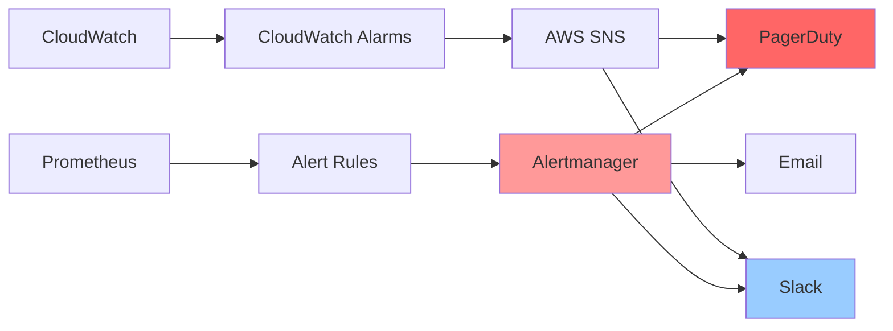

# Alerting Architecture

**Version**: 1.0.0  
**Last Updated**: 2025-10-30  
**Status**: Active

## Overview

This document defines the comprehensive alerting architecture for the Task Management System, covering alert definitions, severity levels, escalation policies, on-call rotations, and notification channels. Effective alerting enables rapid incident response and minimizes service disruptions.

---

## Alerting Principles

### 1. Alert on Symptoms, Not Causes

❌ **Bad**: Alert on high CPU usage  
✅ **Good**: Alert on high request latency (symptom) caused by high CPU (cause)

### 2. Actionable Alerts Only

Every alert must have:

- Clear description of the problem
- Impact assessment
- Runbook link for resolution
- Severity level

### 3. Minimize Alert Fatigue

- No alerts for INFO-level events
- Aggregate related alerts
- Use appropriate thresholds
- Tune alert sensitivity

---

## Alert Severity Levels

| Level             | Description                              | Response Time    | Notification      | Example                             |
| ----------------- | ---------------------------------------- | ---------------- | ----------------- | ----------------------------------- |
| **P1 - Critical** | Service down or severe degradation       | Immediate (24/7) | PagerDuty         | API unavailable, database down      |
| **P2 - High**     | Significant impact, degraded performance | < 15 minutes     | PagerDuty         | High error rate, slow responses     |
| **P3 - Medium**   | Moderate impact, potential escalation    | < 1 hour         | Slack #alerts     | Elevated error rate, disk space low |
| **P4 - Low**      | Minor issue, informational               | < 4 hours        | Slack #monitoring | Deprecated API usage, cert expiring |

---

## Alert Definitions

### Application Alerts

#### 1. High Error Rate

**Severity**: P2 (High)

```yaml
alert: HighErrorRate
expr: |
  (
    sum(rate(http_requests_total{status=~"5.."}[5m]))
    /
    sum(rate(http_requests_total[5m]))
  ) > 0.01
for: 5m
labels:
  severity: high
  component: api
annotations:
  summary: "High error rate detected"
  description: "Error rate is {{ $value | humanizePercentage }} (threshold: 1%)"
  runbook: "https://docs.taskmanager.com/runbooks/high-error-rate"
  impact: "Users experiencing failures, potential data loss"
```

#### 2. Slow Response Time

**Severity**: P2 (High)

```yaml
alert: SlowResponseTime
expr: |
  histogram_quantile(0.95,
    sum(rate(http_request_duration_seconds_bucket[5m])) by (le)
  ) > 1.0
for: 10m
labels:
  severity: high
  component: api
annotations:
  summary: "API response time degraded"
  description: "P95 latency is {{ $value }}s (threshold: 1s)"
  runbook: "https://docs.taskmanager.com/runbooks/slow-response"
```

#### 3. API Unavailable

**Severity**: P1 (Critical)

```yaml
alert: APIUnavailable
expr: |
  sum(up{job="taskmanager-api"}) == 0
for: 1m
labels:
  severity: critical
  component: api
annotations:
  summary: "API service is down"
  description: "No healthy API instances available"
  runbook: "https://docs.taskmanager.com/runbooks/api-unavailable"
  impact: "Complete service outage - all users affected"
```

### Database Alerts

#### 4. Database Connection Pool Exhausted

**Severity**: P1 (Critical)

```yaml
alert: DatabaseConnectionPoolExhausted
expr: |
  db_connection_pool_active >= db_connection_pool_size
for: 2m
labels:
  severity: critical
  component: database
annotations:
  summary: "Database connection pool exhausted"
  description: "All {{ $value }} connections in use"
  runbook: "https://docs.taskmanager.com/runbooks/db-pool-exhausted"
```

#### 5. Slow Database Queries

**Severity**: P3 (Medium)

```yaml
alert: SlowDatabaseQueries
expr: |
  histogram_quantile(0.95,
    sum(rate(db_query_duration_seconds_bucket[5m])) by (le)
  ) > 0.1
for: 15m
labels:
  severity: medium
  component: database
annotations:
  summary: "Database queries are slow"
  description: "P95 query time is {{ $value }}s (threshold: 100ms)"
  runbook: "https://docs.taskmanager.com/runbooks/slow-queries"
```

#### 6. High Database CPU

**Severity**: P2 (High)

```yaml
alert: HighDatabaseCPU
expr: |
  aws_rds_cpuutilization_average > 80
for: 10m
labels:
  severity: high
  component: database
annotations:
  summary: "RDS CPU utilization high"
  description: "CPU at {{ $value }}% (threshold: 80%)"
  runbook: "https://docs.taskmanager.com/runbooks/high-db-cpu"
```

### Cache Alerts

#### 7. Low Cache Hit Ratio

**Severity**: P3 (Medium)

```yaml
alert: LowCacheHitRatio
expr: |
  (
    sum(rate(cache_hits_total[5m]))
    /
    (sum(rate(cache_hits_total[5m])) + sum(rate(cache_misses_total[5m])))
  ) < 0.7
for: 15m
labels:
  severity: medium
  component: cache
annotations:
  summary: "Cache hit ratio below threshold"
  description: "Hit ratio is {{ $value | humanizePercentage }} (threshold: 70%)"
  runbook: "https://docs.taskmanager.com/runbooks/low-cache-hit-ratio"
```

#### 8. Redis Memory High

**Severity**: P2 (High)

```yaml
alert: RedisMemoryHigh
expr: |
  aws_elasticache_database_memory_usage_percentage_average > 90
for: 5m
labels:
  severity: high
  component: cache
annotations:
  summary: "Redis memory usage critical"
  description: "Memory at {{ $value }}% (threshold: 90%)"
  runbook: "https://docs.taskmanager.com/runbooks/redis-memory-high"
```

### Infrastructure Alerts

#### 9. ECS Service Unhealthy

**Severity**: P1 (Critical)

```yaml
alert: ECSServiceUnhealthy
expr: |
  aws_ecs_running_task_count < aws_ecs_desired_task_count
for: 5m
labels:
  severity: critical
  component: infrastructure
annotations:
  summary: "ECS service has unhealthy tasks"
  description: "Running: {{ $value }}, Desired: {{ $labels.desired }}"
  runbook: "https://docs.taskmanager.com/runbooks/ecs-unhealthy"
```

#### 10. High Container CPU

**Severity**: P3 (Medium)

```yaml
alert: HighContainerCPU
expr: |
  aws_ecs_cpuutilization_average > 80
for: 15m
labels:
  severity: medium
  component: infrastructure
annotations:
  summary: "Container CPU usage high"
  description: "CPU at {{ $value }}% (threshold: 80%)"
  runbook: "https://docs.taskmanager.com/runbooks/high-container-cpu"
```

### Background Job Alerts

#### 11. High Celery Queue Length

**Severity**: P2 (High)

```yaml
alert: HighCeleryQueueLength
expr: |
  celery_queue_length > 1000
for: 10m
labels:
  severity: high
  component: worker
annotations:
  summary: "Celery queue backlog detected"
  description: "{{ $value }} tasks in queue (threshold: 1000)"
  runbook: "https://docs.taskmanager.com/runbooks/celery-backlog"
```

#### 12. Celery Worker Down

**Severity**: P2 (High)

```yaml
alert: CeleryWorkerDown
expr: |
  sum(up{job="taskmanager-worker"}) == 0
for: 5m
labels:
  severity: high
  component: worker
annotations:
  summary: "No Celery workers available"
  description: "All workers are down"
  runbook: "https://docs.taskmanager.com/runbooks/worker-down"
```

### Security Alerts

#### 13. High Failed Login Rate

**Severity**: P2 (High)

```yaml
alert: HighFailedLoginRate
expr: |
  rate(user_logins_total{status="failed"}[5m]) > 10
for: 5m
labels:
  severity: high
  component: security
annotations:
  summary: "Potential brute force attack"
  description: "{{ $value }} failed logins/sec (threshold: 10)"
  runbook: "https://docs.taskmanager.com/runbooks/brute-force"
  security_team: true
```

#### 14. Unauthorized Access Attempts

**Severity**: P3 (Medium)

```yaml
alert: UnauthorizedAccessAttempts
expr: |
  rate(http_requests_total{status="403"}[5m]) > 5
for: 10m
labels:
  severity: medium
  component: security
annotations:
  summary: "High rate of authorization failures"
  description: "{{ $value }} 403 responses/sec (threshold: 5)"
  runbook: "https://docs.taskmanager.com/runbooks/unauthorized-access"
```

### Business Metric Alerts

#### 15. Task Creation Rate Drop

**Severity**: P3 (Medium)

```yaml
alert: TaskCreationRateDrop
expr: |
  (
    rate(tasks_created_total[1h])
    <
    rate(tasks_created_total[1h] offset 24h) * 0.5
  )
for: 30m
labels:
  severity: medium
  component: business
annotations:
  summary: "Task creation rate dropped significantly"
  description: "Current rate is 50% lower than 24h ago"
  runbook: "https://docs.taskmanager.com/runbooks/usage-drop"
```

---

## Alerting Stack

### Architecture



### Prometheus Alertmanager Configuration

```yaml
# alertmanager.yml
global:
  resolve_timeout: 5m
  pagerduty_url: "https://events.pagerduty.com/v2/enqueue"
  slack_api_url: "https://hooks.slack.com/services/..."

route:
  receiver: "default"
  group_by: ["alertname", "severity"]
  group_wait: 30s
  group_interval: 5m
  repeat_interval: 4h

  routes:
    # Critical alerts → PagerDuty immediately
    - match:
        severity: critical
      receiver: "pagerduty-critical"
      group_wait: 0s
      repeat_interval: 15m

    # High severity → PagerDuty
    - match:
        severity: high
      receiver: "pagerduty-high"
      repeat_interval: 1h

    # Medium severity → Slack
    - match:
        severity: medium
      receiver: "slack-alerts"
      repeat_interval: 4h

    # Low severity → Email
    - match:
        severity: low
      receiver: "email-team"
      repeat_interval: 24h

    # Security alerts → Security team
    - match:
        security_team: "true"
      receiver: "security-team"
      group_wait: 0s

receivers:
  - name: "default"
    slack_configs:
      - channel: "#monitoring"
        title: "Alert: {{ .GroupLabels.alertname }}"
        text: "{{ range .Alerts }}{{ .Annotations.description }}{{ end }}"

  - name: "pagerduty-critical"
    pagerduty_configs:
      - service_key: "<pagerduty-critical-key>"
        severity: "critical"
        description: "{{ .GroupLabels.alertname }}: {{ .Annotations.summary }}"

  - name: "pagerduty-high"
    pagerduty_configs:
      - service_key: "<pagerduty-high-key>"
        severity: "error"

  - name: "slack-alerts"
    slack_configs:
      - channel: "#alerts"
        title: "{{ .GroupLabels.severity }}: {{ .GroupLabels.alertname }}"
        text: |
          {{ range .Alerts }}
          *Summary:* {{ .Annotations.summary }}
          *Description:* {{ .Annotations.description }}
          *Runbook:* {{ .Annotations.runbook }}
          {{ end }}

  - name: "security-team"
    pagerduty_configs:
      - service_key: "<pagerduty-security-key>"
    slack_configs:
      - channel: "#security-alerts"

  - name: "email-team"
    email_configs:
      - to: "eng-team@taskmanager.com"
        from: "alerts@taskmanager.com"
        smarthost: "smtp.gmail.com:587"
        auth_username: "alerts@taskmanager.com"
        auth_password: "<password>"

inhibit_rules:
  # Inhibit low/medium alerts if critical alert firing
  - source_match:
      severity: "critical"
    target_match:
      severity: "medium|low"
    equal: ["alertname"]

  # Inhibit database alerts if database is down
  - source_match:
      alertname: "DatabaseDown"
    target_match_re:
      alertname: "SlowDatabaseQueries|HighDatabaseCPU"
```

---

## On-Call Rotation

### Schedule

**Primary On-Call**:

- Rotation: Weekly (Monday 9am - Monday 9am)
- Handoff: Monday morning sync meeting
- Coverage: 24/7

**Secondary On-Call**:

- Escalation after 15 minutes
- Backup for primary

**Rotation Calendar** (Example):

| Week   | Primary | Secondary |
| ------ | ------- | --------- |
| Week 1 | Alice   | Bob       |
| Week 2 | Bob     | Charlie   |
| Week 3 | Charlie | David     |
| Week 4 | David   | Alice     |

### PagerDuty Integration

```yaml
Escalation Policy:
  Level 1:
    - Notify: Primary On-Call
    - Timeout: 15 minutes

  Level 2:
    - Notify: Secondary On-Call
    - Timeout: 15 minutes

  Level 3:
    - Notify: Engineering Manager
    - Timeout: 30 minutes

  Level 4:
    - Notify: CTO
```

---

## Notification Channels

### 1. PagerDuty

**Use for**: P1 (Critical), P2 (High) alerts

**Configuration**:

- Critical: Immediate notification (phone call + SMS + push)
- High: Push notification + SMS
- Auto-escalation after 15 minutes
- Acknowledgment required

### 2. Slack

**Use for**: P3 (Medium), P4 (Low) alerts

**Channels**:

- `#alerts`: All P3 alerts
- `#monitoring`: All P4 alerts, informational
- `#security-alerts`: Security-related alerts
- `#on-call`: On-call team coordination

**Bot Configuration**:

```python
@slack_bot.command("/ack")
def acknowledge_alert(alert_id: str):
    """Acknowledge alert from Slack"""
    alertmanager.acknowledge(alert_id)
    return f"Alert {alert_id} acknowledged"

@slack_bot.command("/silence")
def silence_alert(alert_id: str, duration: str):
    """Silence alert for specified duration"""
    alertmanager.silence(alert_id, duration)
    return f"Alert {alert_id} silenced for {duration}"
```

### 3. Email

**Use for**: Low priority alerts, daily summaries

**Templates**:

- Daily summary: Aggregated alerts from past 24 hours
- Weekly report: Trends, most frequent alerts
- Monthly review: SLO compliance, incident summary

---

## Alert Lifecycle

### 1. Firing

Alert condition met and persists beyond `for` duration

```
[Prometheus] → [Alertmanager] → [Notification Channel]
```

### 2. Pending

Alert condition met but within `for` duration (grace period)

### 3. Acknowledged

On-call engineer acknowledges receipt (stops escalation)

```
[PagerDuty/Slack] → [Acknowledge] → Stop notifications
```

### 4. Resolved

Alert condition no longer true

```
[Prometheus] → [Alertmanager] → Send resolution notification
```

### 5. Silenced

Temporarily suppressed (maintenance window, known issue)

```
[Alertmanager UI/API] → [Create Silence] → Suppress for duration
```

---

## Alert Tuning

### Reducing False Positives

1. **Adjust thresholds** based on baseline metrics
2. **Increase `for` duration** to filter transient issues
3. **Use rate() instead of instant values** for smoother data
4. **Add conditions** to exclude known scenarios

**Example**:

❌ **Before** (too noisy):

```yaml
expr: http_requests_total{status="500"} > 0
for: 1m
```

✅ **After** (properly tuned):

```yaml
expr: |
  (
    rate(http_requests_total{status="500"}[5m]) > 0.01
    AND
    rate(http_requests_total[5m]) > 10
  )
for: 5m
```

### Testing Alerts

```bash
# Manually trigger alert for testing
curl -X POST http://alertmanager:9093/api/v1/alerts -d '[
  {
    "labels": {
      "alertname": "TestAlert",
      "severity": "critical"
    },
    "annotations": {
      "summary": "Test alert - please ignore"
    }
  }
]'

# Validate alert rules
promtool check rules alert-rules.yml

# Unit test alert rules
promtool test rules alert-rules-test.yml
```

---

## Maintenance Windows

### Silencing Alerts

```yaml
# Create silence for deployment window
silence:
  matchers:
    - name: "severity"
      value: "medium|high"
      isRegex: true
    - name: "component"
      value: "api"
  startsAt: "2025-10-30T02:00:00Z"
  endsAt: "2025-10-30T03:00:00Z"
  createdBy: "alice@taskmanager.com"
  comment: "Scheduled deployment: v1.2.0"
```

**Automation**:

```python
def create_maintenance_silence(component: str, duration_minutes: int):
    """Create maintenance silence via Alertmanager API"""
    silence = {
        "matchers": [{"name": "component", "value": component}],
        "startsAt": datetime.utcnow().isoformat() + "Z",
        "endsAt": (datetime.utcnow() + timedelta(minutes=duration_minutes)).isoformat() + "Z",
        "createdBy": "automation@taskmanager.com",
        "comment": f"Automated maintenance window - {component}"
    }

    response = requests.post(
        "http://alertmanager:9093/api/v2/silences",
        json=silence
    )

    return response.json()
```

---

## Alerting Metrics

**Monitor alerting system health**:

```promql
# Alert firing rate
rate(alertmanager_alerts{state="firing"}[5m])

# Alert notification failures
rate(alertmanager_notifications_failed_total[5m])

# Time to acknowledge alerts (P50, P95)
histogram_quantile(0.95,
  rate(alert_acknowledgment_duration_seconds_bucket[1h])
)

# Alerts per severity
sum(ALERTS) by (severity)
```

---

## Best Practices

### DO ✅

1. **Alert on user-facing symptoms** (latency, errors, availability)
2. **Include runbook links** in all alert annotations
3. **Use appropriate severity levels** based on impact
4. **Test alert rules** before deploying to production
5. **Review and tune alerts** regularly (monthly)
6. **Document false positive resolutions**
7. **Aggregate related alerts** to reduce noise

### DON'T ❌

1. **Don't alert on metrics that don't require action**
2. **Don't use arbitrary thresholds** (use percentiles, baselines)
3. **Don't create alerts without runbooks**
4. **Don't ignore alert fatigue** (tune or remove noisy alerts)
5. **Don't alert on predicted issues** (use monitoring dashboards)
6. **Don't bypass on-call rotation** (respect the schedule)
7. **Don't silence alerts indefinitely** (max 24 hours)

---

## Related Documents

- [Metrics](./metrics.md) - Metrics used in alert definitions
- [Logging](./logging.md) - Logs for alert investigation
- [Incident Response](./incident-response.md) - What to do when alert fires
- [Runbooks](./runbooks/README.md) - Step-by-step remediation guides
- [Health Checks](./health-checks.md) - Service health monitoring

---

**Last Reviewed**: 2025-10-30  
**Next Review**: 2026-01-30 (Quarterly)
