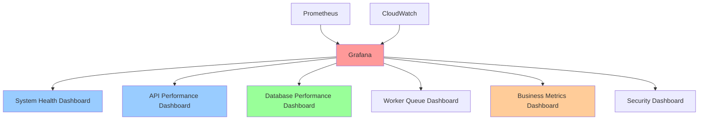

# Monitoring Dashboards

**Version**: 1.0.0  
**Last Updated**: 2025-10-30  
**Status**: Active

## Overview

This document defines the monitoring dashboard architecture for the Task Management System using Grafana. Comprehensive dashboards provide real-time visibility into system health, performance, and business metrics, enabling proactive issue detection and data-driven decisions.

---

## Dashboard Architecture



---

## Dashboard 1: System Health Overview

**Purpose**: High-level system health and availability  
**Audience**: Engineering team, management  
**Refresh**: 30 seconds

### Layout

```
┌─────────────────────────────────────────────────────────────┐
│ System Health Overview                          Last 24h    │
├─────────────────────────────────────────────────────────────┤
│ ┌──────────┐ ┌──────────┐ ┌──────────┐ ┌──────────┐       │
│ │Uptime    │ │Requests  │ │Error Rate│ │Latency   │       │
│ │99.95%    │ │1.2M      │ │0.08%     │ │145ms P95 │       │
│ └──────────┘ └──────────┘ └──────────┘ └──────────┘       │
├─────────────────────────────────────────────────────────────┤
│ Request Rate (req/sec)                                      │
│ ┌─────────────────────────────────────────────────────────┐ │
│ │       /\    /\         /\                               │ │
│ │      /  \  /  \       /  \        [Line Graph]          │ │
│ │     /    \/    \     /    \                             │ │
│ └─────────────────────────────────────────────────────────┘ │
├─────────────────────────────────────────────────────────────┤
│ Error Rate by Status Code                                   │
│ ┌─────────────────────────────────────────────────────────┐ │
│ │ 500: ████ 45/min                                        │ │
│ │ 502: ██ 12/min                                          │ │
│ │ 503: █ 3/min                                            │ │
│ └─────────────────────────────────────────────────────────┘ │
├─────────────────────────────────────────────────────────────┤
│ Service Status                                              │
│ ┌────────────┬────────────┬────────────┬────────────┐      │
│ │ API: ✅    │ Worker: ✅ │ Database:✅│ Cache: ✅  │      │
│ │ 6/6 healthy│ 4/4 healthy│ Connected  │ Connected  │      │
│ └────────────┴────────────┴────────────┴────────────┘      │
└─────────────────────────────────────────────────────────────┘
```

### Panels

#### 1.1 Uptime (Stat Panel)

```promql
# Availability (percentage of successful requests)
(
  sum(rate(http_requests_total{status!~"5.."}[24h]))
  /
  sum(rate(http_requests_total[24h]))
) * 100
```

**Thresholds**:

- Green: ≥ 99.9%
- Yellow: 99.0% - 99.9%
- Red: < 99.0%

#### 1.2 Total Requests (Stat Panel)

```promql
# Total requests in last 24 hours
sum(increase(http_requests_total[24h]))
```

#### 1.3 Error Rate (Stat Panel)

```promql
# Error rate percentage
(
  sum(rate(http_requests_total{status=~"5.."}[5m]))
  /
  sum(rate(http_requests_total[5m]))
) * 100
```

**Thresholds**:

- Green: < 0.1%
- Yellow: 0.1% - 1%
- Red: > 1%

#### 1.4 P95 Latency (Stat Panel)

```promql
# 95th percentile latency
histogram_quantile(0.95,
  sum(rate(http_request_duration_seconds_bucket[5m])) by (le)
) * 1000
```

**Thresholds**:

- Green: < 200ms
- Yellow: 200ms - 500ms
- Red: > 500ms

#### 1.5 Request Rate (Time Series)

```promql
# Requests per second
sum(rate(http_requests_total[5m]))
```

#### 1.6 Error Rate by Status (Bar Gauge)

```promql
# Errors per minute by status code
sum(rate(http_requests_total{status=~"5.."}[5m]) * 60) by (status)
```

#### 1.7 Service Status (Status History)

```promql
# API service health
up{job="taskmanager-api"}

# Worker service health
up{job="taskmanager-worker"}

# Database connection
aws_rds_database_connections_average > 0

# Redis connection
redis_up == 1
```

---

## Dashboard 2: API Performance

**Purpose**: Detailed API performance metrics  
**Audience**: Backend engineers, on-call  
**Refresh**: 10 seconds

### Key Panels

#### 2.1 Request Latency Percentiles (Time Series)

```promql
# P50, P95, P99 latency over time
histogram_quantile(0.50, sum(rate(http_request_duration_seconds_bucket[5m])) by (le)) * 1000 or
histogram_quantile(0.95, sum(rate(http_request_duration_seconds_bucket[5m])) by (le)) * 1000 or
histogram_quantile(0.99, sum(rate(http_request_duration_seconds_bucket[5m])) by (le)) * 1000
```

**Legend**: P50 (green), P95 (yellow), P99 (red)

#### 2.2 Requests by Endpoint (Bar Chart)

```promql
# Top 10 endpoints by request rate
topk(10, sum(rate(http_requests_total[5m])) by (endpoint))
```

#### 2.3 Slowest Endpoints (Table)

```promql
# Top 10 slowest endpoints (P95 latency)
topk(10,
  histogram_quantile(0.95,
    sum(rate(http_request_duration_seconds_bucket[5m])) by (endpoint, le)
  )
)
```

**Columns**: Endpoint, P95 Latency, Request Rate, Error Rate

#### 2.4 Error Rate by Endpoint (Heatmap)

```promql
# Errors per endpoint over time
sum(rate(http_requests_total{status=~"5.."}[5m])) by (endpoint)
```

#### 2.5 Active Requests (Gauge)

```promql
# Currently processing requests
sum(http_requests_in_progress) by (endpoint)
```

#### 2.6 Request Size Distribution (Histogram)

```promql
# Request size distribution
sum(rate(http_request_size_bytes_bucket[5m])) by (le)
```

#### 2.7 Response Size Distribution (Histogram)

```promql
# Response size distribution
sum(rate(http_response_size_bytes_bucket[5m])) by (le)
```

---

## Dashboard 3: Database Performance

**Purpose**: Database health and query performance  
**Audience**: Backend engineers, DBAs  
**Refresh**: 30 seconds

### Key Panels

#### 3.1 Query Performance (Time Series)

```promql
# P95 query latency by operation
histogram_quantile(0.95,
  sum(rate(db_query_duration_seconds_bucket[5m])) by (operation, le)
) * 1000
```

**Legend**: SELECT, INSERT, UPDATE, DELETE

#### 3.2 Connection Pool Status (Gauge)

```promql
# Active connections
db_connection_pool_active

# Idle connections
db_connection_pool_idle

# Pool size
db_connection_pool_size
```

**Visualization**: Gauge with max = pool size

#### 3.3 Slow Queries (Table)

```promql
# Queries over 100ms
count by (table, operation) (
  rate(db_query_duration_seconds_bucket{le="0.1"}[5m]) == 0
)
```

#### 3.4 Database CPU Utilization (Time Series)

```promql
# RDS CPU percentage
aws_rds_cpuutilization_average{dbinstance_identifier="taskmanager-prod"}
```

**Thresholds**: 80% (warning), 90% (critical)

#### 3.5 Database Connections (Time Series)

```promql
# Active connections to RDS
aws_rds_database_connections_average
```

#### 3.6 Query Rate by Table (Stacked Graph)

```promql
# Queries per second by table
sum(rate(db_queries_total[5m])) by (table)
```

#### 3.7 Replication Lag (Stat Panel)

```promql
# Read replica lag in seconds
aws_rds_replica_lag_seconds
```

**Thresholds**: < 5s (green), 5-30s (yellow), > 30s (red)

---

## Dashboard 4: Worker Queue Performance

**Purpose**: Background job processing metrics  
**Audience**: Backend engineers  
**Refresh**: 30 seconds

### Key Panels

#### 4.1 Queue Length (Time Series)

```promql
# Tasks in queue by queue name
celery_queue_length
```

**Thresholds**: < 100 (green), 100-1000 (yellow), > 1000 (red)

#### 4.2 Task Processing Rate (Time Series)

```promql
# Tasks completed per second
sum(rate(celery_tasks_total{status="success"}[5m])) by (task_name)
```

#### 4.3 Task Success Rate (Stat Panel)

```promql
# Percentage of successful tasks
(
  sum(rate(celery_tasks_total{status="success"}[5m]))
  /
  sum(rate(celery_tasks_total[5m]))
) * 100
```

#### 4.4 Task Duration by Type (Heatmap)

```promql
# Task execution time distribution
sum(rate(celery_task_duration_seconds_bucket[5m])) by (task_name, le)
```

#### 4.5 Failed Tasks (Table)

```promql
# Tasks failed in last hour
topk(10,
  sum(increase(celery_tasks_total{status="failure"}[1h])) by (task_name)
)
```

#### 4.6 Worker Status (Status History)

```promql
# Worker availability
up{job="taskmanager-worker"}
```

#### 4.7 Tasks in Progress (Gauge)

```promql
# Currently executing tasks
sum(celery_tasks_in_progress) by (task_name)
```

---

## Dashboard 5: Business Metrics

**Purpose**: Product and business KPIs  
**Audience**: Product team, management  
**Refresh**: 5 minutes

### Key Panels

#### 5.1 Active Users (Stat Panel)

```promql
# Users active in last 24 hours
active_users
```

#### 5.2 Tasks Created Today (Stat Panel)

```promql
# Total tasks created today
sum(increase(tasks_created_total[24h]))
```

#### 5.3 Tasks Completed Today (Stat Panel)

```promql
# Total tasks completed today
sum(increase(tasks_completed_total[24h]))
```

#### 5.4 Task Completion Rate (Gauge)

```promql
# Percentage of tasks completed vs created
(
  sum(increase(tasks_completed_total[24h]))
  /
  sum(increase(tasks_created_total[24h]))
) * 100
```

#### 5.5 Task Creation Trend (Time Series)

```promql
# Tasks created per hour (7-day trend)
sum(rate(tasks_created_total[1h]) * 3600) by (organization_id)
```

#### 5.6 Average Task Completion Time (Time Series)

```promql
# Average hours to complete task by priority
rate(task_completion_duration_hours_sum[1h])
/
rate(task_completion_duration_hours_count[1h])
```

#### 5.7 Tasks by Status (Pie Chart)

```promql
# Current task distribution
sum(tasks_by_status) by (status)
```

#### 5.8 Top Organizations by Activity (Bar Chart)

```promql
# Most active organizations by request volume
topk(10,
  sum(rate(http_requests_total[24h])) by (organization_id)
)
```

#### 5.9 User Logins (Time Series)

```promql
# Login rate per hour
sum(rate(user_logins_total[1h]) * 3600) by (auth_method)
```

---

## Dashboard 6: Security Monitoring

**Purpose**: Security events and anomalies  
**Audience**: Security team, on-call  
**Refresh**: 1 minute

### Key Panels

#### 6.1 Failed Login Attempts (Time Series)

```promql
# Failed logins per minute
sum(rate(user_logins_total{status="failed"}[5m]) * 60)
```

**Alert Threshold**: > 10/minute

#### 6.2 Permission Denied Events (Time Series)

```promql
# Authorization failures
sum(rate(http_requests_total{status="403"}[5m]))
```

#### 6.3 Failed Logins by User (Table)

```promql
# Top users with failed login attempts
topk(10,
  sum(increase(user_logins_total{status="failed"}[1h])) by (user_id)
)
```

#### 6.4 Unauthorized Access Attempts (Heatmap)

```promql
# 403 responses by endpoint
sum(rate(http_requests_total{status="403"}[5m])) by (endpoint)
```

#### 6.5 Security Events by Type (Bar Chart)

```promql
# Security event distribution
sum(increase(security_events_total[1h])) by (event_type)
```

---

## Dashboard Configuration

### Grafana Data Sources

```yaml
datasources:
  - name: Prometheus
    type: prometheus
    url: http://prometheus:9090
    access: proxy
    isDefault: true

  - name: CloudWatch
    type: cloudwatch
    jsonData:
      authType: credentials
      defaultRegion: us-east-1
```

### Dashboard Variables

```yaml
# Organization selector
organization_id:
  type: query
  query: label_values(http_requests_total, organization_id)
  multi: true
  includeAll: true

# Environment selector
environment:
  type: custom
  options: [production, staging, development]
  current: production

# Time range
time_range:
  type: interval
  options: [5m, 15m, 1h, 6h, 24h, 7d]
  auto: true
```

### Annotations

```yaml
annotations:
  - name: Deployments
    datasource: Prometheus
    expr: changes(app_version[5m]) > 0
    iconColor: blue
    tags: [deployment]

  - name: Alerts
    datasource: Alertmanager
    tags: [alert, critical]
    iconColor: red

  - name: Incidents
    datasource: PagerDuty API
    tags: [incident]
    iconColor: orange
```

---

## Dashboard Best Practices

### Design Principles

1. **Most Important Metrics First**: Place critical metrics at the top
2. **Logical Grouping**: Group related panels together
3. **Consistent Colors**: Use color scheme consistently across dashboards
4. **Appropriate Visualizations**: Match chart type to data type
5. **Clear Labels**: Use descriptive panel titles and legends

### Performance Optimization

1. **Limit Time Range**: Default to last 24 hours, not "all time"
2. **Use Recording Rules**: Pre-aggregate complex queries
3. **Reasonable Refresh Rates**: Don't refresh every second
4. **Query Optimization**: Use rate() instead of irate() for stability
5. **Panel Limits**: Keep dashboards under 20 panels

### Access Control

```yaml
Dashboard Permissions:
  System Health: All engineers (view)
  API Performance: Backend team (edit)
  Database Performance: Backend + DBA (edit)
  Business Metrics: All staff (view)
  Security: Security team (edit)
```

---

## Dashboard as Code

### Provisioning (Terraform)

```hcl
resource "grafana_dashboard" "system_health" {
  config_json = file("dashboards/system-health.json")
  folder      = grafana_folder.monitoring.id
  overwrite   = true
}

resource "grafana_folder" "monitoring" {
  title = "Task Manager Monitoring"
}
```

### Export/Import

```bash
# Export dashboard
curl -H "Authorization: Bearer $GRAFANA_API_KEY" \
  http://grafana:3000/api/dashboards/uid/system-health \
  | jq '.dashboard' > system-health.json

# Import dashboard
curl -X POST -H "Authorization: Bearer $GRAFANA_API_KEY" \
  -H "Content-Type: application/json" \
  -d @system-health.json \
  http://grafana:3000/api/dashboards/db
```

---

## Related Documents

- [Metrics](./metrics.md) - Metrics definitions and collection
- [Alerting](./alerting.md) - Alert rules based on dashboard metrics
- [Logging](./logging.md) - Log correlation with metrics
- [Incident Response](./incident-response.md) - Using dashboards during incidents

---

**Last Reviewed**: 2025-10-30  
**Next Review**: 2026-01-30 (Quarterly)
