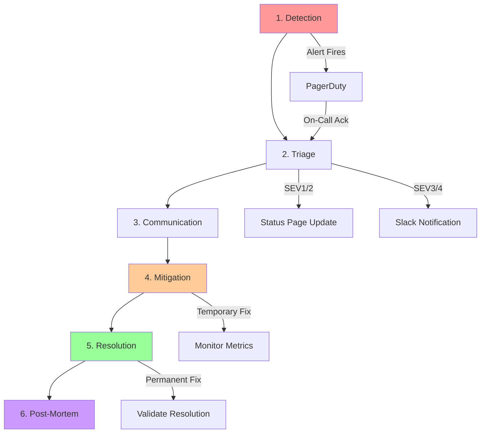

# Incident Response

**Version**: 1.0.0  
**Last Updated**: 2025-10-30  
**Status**: Active

## Overview

This document defines the incident response framework for the Task Management System, covering detection, triage, resolution, and post-mortem processes. The goal is to minimize service disruptions through rapid detection (MTTD < 5 minutes) and recovery (MTTR < 30 minutes).

---

## Incident Management Objectives

| Metric                              | Target       | Purpose                                     |
| ----------------------------------- | ------------ | ------------------------------------------- |
| **MTTD** (Mean Time to Detect)      | < 5 minutes  | How quickly we discover incidents           |
| **MTTA** (Mean Time to Acknowledge) | < 2 minutes  | How quickly on-call responds                |
| **MTTR** (Mean Time to Recovery)    | < 30 minutes | How quickly service is restored             |
| **MTTF** (Mean Time to Fix)         | < 4 hours    | How quickly root cause is permanently fixed |

---

## Incident Severity Classification

### SEV1 - Critical

**Definition**: Complete service outage or severe degradation affecting all users

**Examples**:

- API completely unavailable
- Database down
- Data loss or corruption
- Security breach

**Response**:

- **Notification**: PagerDuty (phone + SMS)
- **Response Time**: Immediate (24/7)
- **Escalation**: After 15 minutes
- **Communication**: Status page updated immediately
- **Post-Mortem**: Required within 48 hours

**SLA Impact**: Counts against 99.9% availability SLO

---

### SEV2 - High

**Definition**: Significant degradation affecting subset of users or functionality

**Examples**:

- High error rate (> 5%)
- Severe performance degradation (P95 > 1s)
- Background jobs not processing
- Single AZ failure

**Response**:

- **Notification**: PagerDuty (push + SMS)
- **Response Time**: < 15 minutes
- **Escalation**: After 30 minutes
- **Communication**: Status page updated within 15 minutes
- **Post-Mortem**: Required within 1 week

**SLA Impact**: May count against SLO depending on duration

---

### SEV3 - Medium

**Definition**: Limited impact affecting small subset of users

**Examples**:

- Elevated error rate (1-5%)
- Performance degradation (P95: 500ms-1s)
- Non-critical feature unavailable
- Elevated resource usage

**Response**:

- **Notification**: Slack #alerts
- **Response Time**: < 1 hour
- **Escalation**: After 4 hours
- **Communication**: Internal only
- **Post-Mortem**: Optional

**SLA Impact**: No impact on SLO

---

### SEV4 - Low

**Definition**: Minimal impact, informational

**Examples**:

- Minor performance issue
- Deprecated API usage warning
- Certificate expiring (30+ days)

**Response**:

- **Notification**: Slack #monitoring
- **Response Time**: < 4 hours (business hours)
- **Escalation**: None
- **Communication**: None
- **Post-Mortem**: Not required

---

## Incident Response Workflow



---

## Phase 1: Detection

### Automated Detection

**Primary Sources**:

1. **Prometheus Alerts** → Alertmanager → PagerDuty
2. **CloudWatch Alarms** → SNS → PagerDuty
3. **Synthetic Monitoring** (Pingdom, DataDog)
4. **Error Tracking** (Sentry)

**Detection Checklist**:

- ✅ Alert fired in monitoring system
- ✅ Dashboard shows anomaly
- ✅ Logs show errors
- ✅ User reports via support

### Manual Detection

**Sources**:

- Customer support tickets
- Social media mentions
- Internal team reports
- Scheduled health checks

---

## Phase 2: Triage

### Initial Assessment (< 2 minutes)

**On-Call Actions**:

1. **Acknowledge** alert in PagerDuty
2. **Check dashboards** (System Health, API Performance)
3. **Determine severity** (SEV1/2/3/4)
4. **Assess scope** (all users, single org, single feature)
5. **Create incident** in incident management system

### Incident Commander Assignment

**SEV1/SEV2**: Incident Commander assigned immediately

**Responsibilities**:

- Coordinate response team
- Make decisions on mitigation approaches
- Communicate with stakeholders
- Drive incident to resolution

### Team Assembly

**Core Responders**:

- On-call engineer (primary)
- Incident Commander (SEV1/2)
- Secondary on-call (if escalated)

**Domain Experts** (as needed):

- Database Administrator
- Security Engineer
- Network Engineer
- Product Manager

---

## Phase 3: Communication

### Internal Communication

**Slack Channels**:

- `#incident-response`: Primary incident coordination
- `#on-call`: On-call team discussion
- `#engineering`: Broader team awareness

**Incident Slack Thread**:

```
🚨 INCIDENT: SEV2 - High API Error Rate
Detected: 2025-10-30 14:23 UTC
Incident Commander: @alice
Impact: 5% of requests failing on task creation
Status: Investigating

Updates will be posted here every 15 minutes
```

### External Communication (SEV1/SEV2)

**Status Page** (status.taskmanager.com):

```
🔴 Major Service Disruption
Investigating - 2025-10-30 14:25 UTC

We are currently investigating elevated error rates affecting
task creation. Users may experience failures when creating new tasks.

Update (14:40 UTC): Issue identified with database connection pool.
Implementing fix.

Update (14:55 UTC): Fix deployed. Monitoring for stability.

Resolved (15:10 UTC): Service restored. All systems operational.
```

**Email Notification** (for SEV1):

- Subject: "[Action Required] Service Disruption - Task Manager"
- Sent to: All organization admins
- Content: Impact, estimated resolution time, workarounds

---

## Phase 4: Mitigation

### Immediate Actions

**Goal**: Restore service ASAP (even if temporary)

**Common Mitigations**:

1. **Restart Service**

   ```bash
   # Restart ECS service
   aws ecs update-service --cluster prod --service api --force-new-deployment
   ```

2. **Scale Up Resources**

   ```bash
   # Increase task count
   aws ecs update-service --cluster prod --service api --desired-count 10
   ```

3. **Rollback Deployment**

   ```bash
   # Rollback to previous version
   ./scripts/rollback.sh v1.2.0
   ```

4. **Toggle Feature Flag**

   ```bash
   # Disable problematic feature
   aws dynamodb put-item --table-name feature-flags \
     --item '{"feature": {"S": "new-task-ui"}, "enabled": {"BOOL": false}}'
   ```

5. **Failover Database**

   ```bash
   # Promote read replica
   aws rds promote-read-replica --db-instance-identifier taskmanager-replica
   ```

6. **Clear Cache**
   ```bash
   # Flush Redis cache
   redis-cli FLUSHALL
   ```

### Mitigation Decision Tree

```
Is service completely down?
├─ YES → Restart service / Rollback deployment
└─ NO → Is it a performance issue?
    ├─ YES → Scale up resources
    └─ NO → Is it affecting all users?
        ├─ YES → Disable feature / Rollback
        └─ NO → Investigate specific tenant
```

---

## Phase 5: Resolution

### Root Cause Analysis

**Investigation Steps**:

1. **Check Recent Changes**

   ```bash
   # Recent deployments
   git log --since="2 hours ago" --oneline

   # Recent configuration changes
   git log infra/ --since="2 hours ago"
   ```

2. **Review Logs**

   ```sql
   -- CloudWatch Insights query
   fields @timestamp, level, message, context.user_id
   | filter level = "ERROR"
   | filter @timestamp > ago(1h)
   | sort @timestamp desc
   | limit 100
   ```

3. **Analyze Traces**

   - Open Jaeger UI
   - Search for slow/failed traces
   - Identify bottleneck spans

4. **Check Metrics**
   - Database query performance
   - Cache hit ratio
   - Connection pool utilization
   - Memory/CPU usage

### Permanent Fix

**Implementation**:

1. Develop fix in hotfix branch
2. Test in staging environment
3. Deploy to production with monitoring
4. Validate fix resolves issue
5. Monitor for 30 minutes

**Validation Checklist**:

- ✅ Metrics returned to baseline
- ✅ Alerts resolved
- ✅ No errors in logs
- ✅ Synthetic tests passing
- ✅ Customer reports stopped

---

## Phase 6: Post-Mortem

### Post-Mortem Meeting

**Timing**: Within 48 hours (SEV1/2), 1 week (SEV3)

**Attendees**:

- Incident Commander
- On-call engineers
- Relevant team leads
- Product Manager (if customer-facing)

**Duration**: 60 minutes

### Post-Mortem Template

```markdown
# Incident Post-Mortem: [Title]

**Date**: 2025-10-30  
**Severity**: SEV2  
**Duration**: 47 minutes  
**Incident Commander**: Alice Smith  
**Responders**: Bob Jones, Charlie Brown

---

## Executive Summary

Brief description of incident, impact, and resolution.

---

## Timeline

**14:23 UTC** - Alert fired: High API error rate  
**14:25 UTC** - On-call acknowledged, began investigation  
**14:28 UTC** - Severity upgraded to SEV2  
**14:30 UTC** - Incident Commander assigned  
**14:35 UTC** - Root cause identified: Database connection pool exhausted  
**14:40 UTC** - Mitigation: Increased pool size from 20 to 50  
**14:42 UTC** - Error rate decreased  
**14:50 UTC** - Monitoring confirms stability  
**15:10 UTC** - Incident marked as resolved

---

## Impact

- **Users Affected**: ~5% of active users
- **Requests Failed**: ~2,500 task creation requests
- **Downtime**: No complete outage, degraded performance
- **Revenue Impact**: Minimal (no payment failures)

---

## Root Cause

Database connection pool configured with 20 connections, insufficient for
current load. Traffic spike during peak hours exhausted pool, causing
new requests to timeout waiting for available connection.

---

## Contributing Factors

1. Connection pool size not adjusted after recent traffic growth
2. No alerting on connection pool utilization
3. Load testing did not simulate sustained peak load

---

## Resolution

**Immediate** (Mitigation):

- Increased connection pool size to 50

**Permanent** (Fix):

- Implemented connection pool monitoring
- Added CloudWatch alarm for pool utilization > 80%
- Updated capacity planning docs with connection pool sizing

---

## Action Items

| Action                        | Owner   | Due Date   | Status         |
| ----------------------------- | ------- | ---------- | -------------- |
| Add connection pool metric    | Bob     | 2025-11-02 | ✅ Done        |
| Create CloudWatch alarm       | Alice   | 2025-11-02 | ✅ Done        |
| Review other resource limits  | Charlie | 2025-11-05 | 🔄 In Progress |
| Update load testing scenarios | Alice   | 2025-11-10 | ⏳ Planned     |
| Document pool sizing formula  | Bob     | 2025-11-10 | ⏳ Planned     |

---

## Lessons Learned

**What Went Well**:

- Alert fired within 2 minutes of issue
- On-call responded quickly (acknowledged in 2 minutes)
- Root cause identified within 12 minutes
- Mitigation applied quickly

**What Went Wrong**:

- No proactive monitoring of connection pool
- Capacity planning didn't account for sustained peak load
- No warning before pool exhaustion

**Where We Got Lucky**:

- Issue occurred during business hours (US timezone)
- Senior engineer was on-call
- Database didn't crash, only connection pool exhausted

---

## Follow-Up

Next review: 2025-11-15  
Action items will be tracked in: JIRA-1234
```

### Blameless Post-Mortems

**Principles**:

1. **Focus on Systems**: Not individuals
2. **Assume Good Intent**: Everyone did their best with available information
3. **Learn and Improve**: Extract actionable improvements
4. **Share Knowledge**: Distribute learnings across team

**Avoid**:

- ❌ "Why didn't you..."
- ❌ "You should have..."
- ❌ Finger-pointing

**Use**:

- ✅ "What prevented us from..."
- ✅ "How can we improve..."
- ✅ Systems thinking

---

## Incident Metrics

### Track and Report

```promql
# Incident count by severity
sum(incidents_total) by (severity)

# Mean time to detect
avg(incident_time_to_detect_seconds)

# Mean time to acknowledge
avg(incident_time_to_acknowledge_seconds)

# Mean time to recovery
avg(incident_time_to_recovery_seconds)

# Incidents per month
increase(incidents_total[30d])
```

### Monthly Report

**Metrics**:

- Total incidents (by severity)
- MTTD, MTTA, MTTR averages
- SLO compliance
- Top incident categories
- Action items completed

---

## Incident Management Tools

### Primary Tools

1. **PagerDuty**: Alert routing, on-call schedules
2. **Slack**: Team communication, incident threads
3. **Statuspage.io**: External status updates
4. **Confluence**: Post-mortem documentation
5. **Jira**: Action item tracking

### Incident Management Platform

**Consider**: PagerDuty Incident Response, Opsgenie, VictorOps

**Features**:

- Automated incident creation
- Stakeholder notifications
- Timeline tracking
- Post-mortem templates
- Action item management

---

## On-Call Runbooks

See [Runbooks](./runbooks/README.md) for detailed procedures:

- [High Error Rate](./runbooks/high-error-rate.md)
- [API Unavailable](./runbooks/api-unavailable.md)
- [Database Issues](./runbooks/database-issues.md)
- [Deployment Rollback](./runbooks/deployment-rollback.md)

---

## Best Practices

### DO ✅

1. **Acknowledge alerts quickly** (< 2 minutes)
2. **Communicate frequently** (every 15-30 minutes)
3. **Focus on mitigation first**, root cause second
4. **Document timeline** as incident unfolds
5. **Conduct blameless post-mortems**
6. **Complete action items** from post-mortems
7. **Practice incident response** (game days)

### DON'T ❌

1. **Don't delay acknowledgment** (even if still investigating)
2. **Don't go silent** (communicate even if no progress)
3. **Don't skip post-mortems** (learning opportunity)
4. **Don't blame individuals** (focus on systems)
5. **Don't deploy fixes without testing** (may make it worse)
6. **Don't forget to update status page**
7. **Don't ignore action items** (track to completion)

---

## Related Documents

- [Alerting](./alerting.md) - Alert definitions and escalation
- [Runbooks](./runbooks/README.md) - Step-by-step remediation procedures
- [Dashboards](./dashboards.md) - Monitoring dashboards for investigation
- [Logging](./logging.md) - Log analysis during incidents
- [Metrics](./metrics.md) - Metrics for incident detection

---

**Last Reviewed**: 2025-10-30  
**Next Review**: 2026-01-30 (Quarterly)
