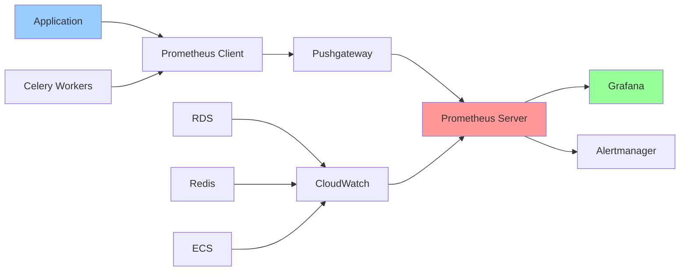

# Metrics Architecture

**Version**: 1.0.0  
**Last Updated**: 2025-10-30  
**Status**: Active

## Overview

This document defines the comprehensive metrics architecture for the Task Management System, covering application metrics, business metrics, infrastructure metrics, and operational KPIs. The metrics system enables performance monitoring, capacity planning, alerting, and data-driven decision making.

---

## Metrics Framework

### Metrics Collection Stack



### Metrics Types

| Type          | Purpose                        | Example                        | Aggregation         |
| ------------- | ------------------------------ | ------------------------------ | ------------------- |
| **Counter**   | Monotonically increasing value | `http_requests_total`          | rate(), increase()  |
| **Gauge**     | Current value (up/down)        | `active_users`, `memory_usage` | avg(), max(), min() |
| **Histogram** | Distribution of values         | `request_duration_seconds`     | quantile(), avg()   |
| **Summary**   | Pre-calculated quantiles       | `request_size_bytes`           | quantile()          |

---

## Application Metrics

### HTTP Request Metrics

**Prometheus Format**:

```python
from prometheus_client import Counter, Histogram, Gauge
import time

# Request counter
http_requests_total = Counter(
    'http_requests_total',
    'Total HTTP requests',
    ['method', 'endpoint', 'status']
)

# Request duration histogram
http_request_duration_seconds = Histogram(
    'http_request_duration_seconds',
    'HTTP request duration in seconds',
    ['method', 'endpoint'],
    buckets=[0.01, 0.05, 0.1, 0.5, 1.0, 2.0, 5.0]
)

# Request size
http_request_size_bytes = Histogram(
    'http_request_size_bytes',
    'HTTP request size in bytes',
    ['method', 'endpoint'],
    buckets=[100, 500, 1000, 5000, 10000, 50000]
)

# Response size
http_response_size_bytes = Histogram(
    'http_response_size_bytes',
    'HTTP response size in bytes',
    ['method', 'endpoint'],
    buckets=[100, 500, 1000, 5000, 10000, 50000]
)

# Active requests gauge
http_requests_in_progress = Gauge(
    'http_requests_in_progress',
    'Number of HTTP requests currently being processed',
    ['method', 'endpoint']
)
```

**Implementation**:

```python
from fastapi import Request
import time

@app.middleware("http")
async def metrics_middleware(request: Request, call_next):
    """Collect HTTP metrics for all requests"""
    method = request.method
    endpoint = request.url.path

    # Track in-progress requests
    http_requests_in_progress.labels(method=method, endpoint=endpoint).inc()

    # Measure request duration
    start_time = time.time()

    try:
        response = await call_next(request)
        status = response.status_code

        # Record metrics
        http_requests_total.labels(
            method=method,
            endpoint=endpoint,
            status=status
        ).inc()

        duration = time.time() - start_time
        http_request_duration_seconds.labels(
            method=method,
            endpoint=endpoint
        ).observe(duration)

        return response

    finally:
        http_requests_in_progress.labels(method=method, endpoint=endpoint).dec()
```

### Database Metrics

```python
from prometheus_client import Counter, Histogram, Gauge

# Query counter
db_queries_total = Counter(
    'db_queries_total',
    'Total database queries',
    ['operation', 'table', 'status']
)

# Query duration
db_query_duration_seconds = Histogram(
    'db_query_duration_seconds',
    'Database query duration in seconds',
    ['operation', 'table'],
    buckets=[0.001, 0.005, 0.01, 0.05, 0.1, 0.5, 1.0]
)

# Connection pool metrics
db_connection_pool_size = Gauge(
    'db_connection_pool_size',
    'Database connection pool size'
)

db_connection_pool_active = Gauge(
    'db_connection_pool_active',
    'Active database connections'
)

db_connection_pool_idle = Gauge(
    'db_connection_pool_idle',
    'Idle database connections'
)

# Transaction metrics
db_transactions_total = Counter(
    'db_transactions_total',
    'Total database transactions',
    ['status']  # committed, rolled_back
)
```

**Implementation with SQLAlchemy**:

```python
from sqlalchemy import event
from sqlalchemy.engine import Engine
import time

@event.listens_for(Engine, "before_cursor_execute")
def before_cursor_execute(conn, cursor, statement, parameters, context, executemany):
    """Track query start time"""
    context._query_start_time = time.time()

@event.listens_for(Engine, "after_cursor_execute")
def after_cursor_execute(conn, cursor, statement, parameters, context, executemany):
    """Record query metrics"""
    duration = time.time() - context._query_start_time

    # Extract operation type (SELECT, INSERT, UPDATE, DELETE)
    operation = statement.strip().split()[0].upper()

    # Extract table name (simplified)
    table = extract_table_name(statement)

    db_queries_total.labels(
        operation=operation,
        table=table,
        status='success'
    ).inc()

    db_query_duration_seconds.labels(
        operation=operation,
        table=table
    ).observe(duration)

def update_connection_pool_metrics(engine):
    """Update connection pool metrics periodically"""
    pool = engine.pool
    db_connection_pool_size.set(pool.size())
    db_connection_pool_active.set(pool.checkedout())
    db_connection_pool_idle.set(pool.size() - pool.checkedout())
```

### Cache Metrics

```python
from prometheus_client import Counter, Histogram

# Cache operations
cache_operations_total = Counter(
    'cache_operations_total',
    'Total cache operations',
    ['operation', 'status']  # get, set, delete | hit, miss, error
)

# Cache hit ratio
cache_hits_total = Counter(
    'cache_hits_total',
    'Total cache hits',
    ['cache_type']  # session, permission, project, task
)

cache_misses_total = Counter(
    'cache_misses_total',
    'Total cache misses',
    ['cache_type']
)

# Cache operation duration
cache_operation_duration_seconds = Histogram(
    'cache_operation_duration_seconds',
    'Cache operation duration in seconds',
    ['operation'],
    buckets=[0.0001, 0.0005, 0.001, 0.005, 0.01, 0.05]
)
```

**Implementation**:

```python
from redis import Redis
import time

class InstrumentedRedisCache:
    """Redis cache with Prometheus instrumentation"""

    def __init__(self, redis_client: Redis):
        self.redis = redis_client

    def get(self, key: str, cache_type: str = "default"):
        """Get value from cache with metrics"""
        start = time.time()

        try:
            value = self.redis.get(key)

            if value:
                cache_hits_total.labels(cache_type=cache_type).inc()
                cache_operations_total.labels(
                    operation='get',
                    status='hit'
                ).inc()
            else:
                cache_misses_total.labels(cache_type=cache_type).inc()
                cache_operations_total.labels(
                    operation='get',
                    status='miss'
                ).inc()

            cache_operation_duration_seconds.labels(
                operation='get'
            ).observe(time.time() - start)

            return value

        except Exception as e:
            cache_operations_total.labels(
                operation='get',
                status='error'
            ).inc()
            raise

    def set(self, key: str, value: any, ttl: int = 300):
        """Set value in cache with metrics"""
        start = time.time()

        try:
            self.redis.setex(key, ttl, value)
            cache_operations_total.labels(
                operation='set',
                status='success'
            ).inc()

            cache_operation_duration_seconds.labels(
                operation='set'
            ).observe(time.time() - start)

        except Exception as e:
            cache_operations_total.labels(
                operation='set',
                status='error'
            ).inc()
            raise
```

### Background Job Metrics

```python
from prometheus_client import Counter, Histogram, Gauge

# Celery task metrics
celery_tasks_total = Counter(
    'celery_tasks_total',
    'Total Celery tasks',
    ['task_name', 'status']  # success, failure, retry
)

celery_task_duration_seconds = Histogram(
    'celery_task_duration_seconds',
    'Celery task duration in seconds',
    ['task_name'],
    buckets=[0.1, 0.5, 1.0, 5.0, 10.0, 30.0, 60.0, 300.0]
)

celery_tasks_in_progress = Gauge(
    'celery_tasks_in_progress',
    'Number of Celery tasks currently executing',
    ['task_name']
)

# Queue metrics
celery_queue_length = Gauge(
    'celery_queue_length',
    'Number of tasks in queue',
    ['queue']
)
```

**Implementation**:

```python
from celery import Task
from celery.signals import task_prerun, task_postrun, task_failure
import time

class InstrumentedTask(Task):
    """Celery task with Prometheus instrumentation"""

    def __call__(self, *args, **kwargs):
        task_name = self.name

        celery_tasks_in_progress.labels(task_name=task_name).inc()
        start_time = time.time()

        try:
            result = super().__call__(*args, **kwargs)

            celery_tasks_total.labels(
                task_name=task_name,
                status='success'
            ).inc()

            duration = time.time() - start_time
            celery_task_duration_seconds.labels(
                task_name=task_name
            ).observe(duration)

            return result

        except Exception as e:
            celery_tasks_total.labels(
                task_name=task_name,
                status='failure'
            ).inc()
            raise

        finally:
            celery_tasks_in_progress.labels(task_name=task_name).dec()

# Use instrumented task as base
@app.task(base=InstrumentedTask)
def send_notification_email(user_id: str, template: str):
    # Task implementation
    pass
```

---

## Business Metrics

### Task Metrics

```python
from prometheus_client import Counter, Gauge, Histogram

# Task lifecycle
tasks_created_total = Counter(
    'tasks_created_total',
    'Total tasks created',
    ['organization_id', 'project_id']
)

tasks_completed_total = Counter(
    'tasks_completed_total',
    'Total tasks completed',
    ['organization_id', 'project_id']
)

tasks_deleted_total = Counter(
    'tasks_deleted_total',
    'Total tasks deleted',
    ['organization_id', 'project_id']
)

# Task states
tasks_by_status = Gauge(
    'tasks_by_status',
    'Number of tasks by status',
    ['organization_id', 'status']  # TODO, IN_PROGRESS, COMPLETED, ARCHIVED
)

# Task completion time
task_completion_duration_hours = Histogram(
    'task_completion_duration_hours',
    'Hours from task creation to completion',
    ['organization_id', 'priority'],
    buckets=[1, 4, 8, 24, 72, 168, 720]  # 1h, 4h, 8h, 1d, 3d, 1w, 1m
)

# Task assignment
tasks_assigned_total = Counter(
    'tasks_assigned_total',
    'Total tasks assigned',
    ['organization_id', 'assignee_id']
)

# Overdue tasks
tasks_overdue = Gauge(
    'tasks_overdue',
    'Number of overdue tasks',
    ['organization_id', 'priority']
)
```

**Recording Business Metrics**:

```python
class TaskMetricsService:
    """Service for recording task-related metrics"""

    def record_task_created(self, task: Task):
        """Record task creation"""
        tasks_created_total.labels(
            organization_id=str(task.organization_id),
            project_id=str(task.project_id)
        ).inc()

        # Update status gauge
        self._update_status_gauge(task.organization_id)

    def record_task_completed(self, task: Task):
        """Record task completion"""
        tasks_completed_total.labels(
            organization_id=str(task.organization_id),
            project_id=str(task.project_id)
        ).inc()

        # Calculate completion duration
        duration_hours = (task.completed_at - task.created_at).total_seconds() / 3600
        task_completion_duration_hours.labels(
            organization_id=str(task.organization_id),
            priority=str(task.priority)
        ).observe(duration_hours)

        # Update status gauge
        self._update_status_gauge(task.organization_id)

    def _update_status_gauge(self, organization_id: UUID):
        """Update task status gauge from database"""
        counts = db.query(
            Task.status, func.count(Task.task_id)
        ).filter_by(
            organization_id=organization_id
        ).group_by(Task.status).all()

        for status, count in counts:
            tasks_by_status.labels(
                organization_id=str(organization_id),
                status=status
            ).set(count)
```

### User Activity Metrics

```python
from prometheus_client import Counter, Gauge

# User sessions
user_logins_total = Counter(
    'user_logins_total',
    'Total user logins',
    ['organization_id', 'auth_method']  # jwt, oauth_google, oauth_github
)

user_logouts_total = Counter(
    'user_logouts_total',
    'Total user logouts',
    ['organization_id']
)

# Active users
active_users = Gauge(
    'active_users',
    'Number of active users (last 24 hours)',
    ['organization_id']
)

concurrent_users = Gauge(
    'concurrent_users',
    'Number of concurrent users (active sessions)',
    ['organization_id']
)

# User actions
user_actions_total = Counter(
    'user_actions_total',
    'Total user actions',
    ['organization_id', 'action_type']  # create, update, delete, view
)
```

### Project Metrics

```python
from prometheus_client import Counter, Gauge

# Project lifecycle
projects_created_total = Counter(
    'projects_created_total',
    'Total projects created',
    ['organization_id']
)

projects_archived_total = Counter(
    'projects_archived_total',
    'Total projects archived',
    ['organization_id']
)

# Project activity
projects_active = Gauge(
    'projects_active',
    'Number of active projects',
    ['organization_id']
)

project_members = Gauge(
    'project_members',
    'Number of members per project',
    ['organization_id', 'project_id']
)
```

### Organization Metrics

```python
from prometheus_client import Counter, Gauge

# Organization growth
organizations_created_total = Counter(
    'organizations_created_total',
    'Total organizations created'
)

# Organization size
organization_users = Gauge(
    'organization_users',
    'Number of users per organization',
    ['organization_id']
)

organization_projects = Gauge(
    'organization_projects',
    'Number of projects per organization',
    ['organization_id']
)

organization_storage_bytes = Gauge(
    'organization_storage_bytes',
    'Storage used by organization in bytes',
    ['organization_id']
)
```

---

## Infrastructure Metrics

### ECS Container Metrics

**CloudWatch Container Insights**:

```yaml
Metrics:
  CPU:
    - CPUUtilization (%)
    - CPUReservation (%)

  Memory:
    - MemoryUtilization (%)
    - MemoryReservation (%)

  Network:
    - NetworkRxBytes
    - NetworkTxBytes

  Tasks:
    - RunningTaskCount
    - PendingTaskCount
    - DesiredTaskCount
```

### RDS Database Metrics

**CloudWatch RDS Metrics**:

```yaml
Performance:
  - DatabaseConnections (count)
  - CPUUtilization (%)
  - FreeableMemory (bytes)
  - ReadLatency (seconds)
  - WriteLatency (seconds)
  - ReadThroughput (bytes/sec)
  - WriteThroughput (bytes/sec)
  - ReadIOPS (count/sec)
  - WriteIOPS (count/sec)

Storage:
  - FreeStorageSpace (bytes)
  - BurstBalance (%)

Replication:
  - ReplicaLag (seconds)
```

### ElastiCache Redis Metrics

```yaml
Performance:
  - CPUUtilization (%)
  - EngineCPUUtilization (%)
  - NetworkBytesIn (bytes)
  - NetworkBytesOut (bytes)
  - CacheHits (count)
  - CacheMisses (count)
  - CurrConnections (count)

Memory:
  - BytesUsedForCache (bytes)
  - DatabaseMemoryUsagePercentage (%)
  - EvictionCount (count)

Commands:
  - GetTypeCmds (count)
  - SetTypeCmds (count)
  - KeyBasedCmds (count)
```

---

## Metrics Exposition

### Prometheus Metrics Endpoint

```python
from fastapi import FastAPI
from prometheus_client import generate_latest, CONTENT_TYPE_LATEST

app = FastAPI()

@app.get("/metrics")
async def metrics():
    """
    Expose Prometheus metrics endpoint
    This endpoint is scraped by Prometheus server
    """
    return Response(
        content=generate_latest(),
        media_type=CONTENT_TYPE_LATEST
    )
```

### Metrics Scraping Configuration

**Prometheus `prometheus.yml`**:

```yaml
global:
  scrape_interval: 15s
  evaluation_interval: 15s

scrape_configs:
  - job_name: "taskmanager-api"
    ec2_sd_configs:
      - region: us-east-1
        port: 8000
        filters:
          - name: tag:Service
            values: ["taskmanager-api"]
    relabel_configs:
      - source_labels: [__meta_ec2_tag_Environment]
        target_label: environment
      - source_labels: [__meta_ec2_private_ip]
        target_label: instance
        replacement: "${1}:8000"
    metrics_path: /metrics

  - job_name: "taskmanager-worker"
    static_configs:
      - targets: ["worker-1:9091", "worker-2:9091"]
    metrics_path: /metrics

  - job_name: "cloudwatch"
    static_configs:
      - targets: ["localhost:9106"]
    # CloudWatch Exporter for RDS, ElastiCache, ECS metrics
```

### CloudWatch Exporter

**Export CloudWatch metrics to Prometheus**:

```yaml
# cloudwatch_exporter.yml
region: us-east-1
metrics:
  - aws_namespace: AWS/RDS
    aws_metric_name: DatabaseConnections
    aws_dimensions: [DBInstanceIdentifier]
    aws_statistics: [Average]

  - aws_namespace: AWS/RDS
    aws_metric_name: CPUUtilization
    aws_dimensions: [DBInstanceIdentifier]
    aws_statistics: [Average]

  - aws_namespace: AWS/ElastiCache
    aws_metric_name: CacheHits
    aws_dimensions: [CacheClusterId]
    aws_statistics: [Sum]

  - aws_namespace: AWS/ECS
    aws_metric_name: CPUUtilization
    aws_dimensions: [ServiceName, ClusterName]
    aws_statistics: [Average]
```

---

## Metrics Visualization

### Grafana Dashboards

#### Dashboard 1: Application Overview

**Panels**:

- Request rate (req/sec) by endpoint
- Request duration (P50, P95, P99)
- Error rate (errors/sec)
- Active users (last 24 hours)
- Tasks created today
- Database query performance

**PromQL Queries**:

```promql
# Request rate
rate(http_requests_total[5m])

# P95 latency
histogram_quantile(0.95, rate(http_request_duration_seconds_bucket[5m]))

# Error rate
rate(http_requests_total{status=~"5.."}[5m])

# Cache hit ratio
sum(rate(cache_hits_total[5m])) /
(sum(rate(cache_hits_total[5m])) + sum(rate(cache_misses_total[5m])))
```

#### Dashboard 2: Business Metrics

**Panels**:

- Tasks created (daily)
- Tasks completed (daily)
- Task completion rate (%)
- Average completion time by priority
- Overdue tasks count
- Active projects by organization

**PromQL Queries**:

```promql
# Tasks created today
increase(tasks_created_total[24h])

# Task completion rate
(increase(tasks_completed_total[24h]) / increase(tasks_created_total[24h])) * 100

# Average completion time (hours)
rate(task_completion_duration_hours_sum[24h]) /
rate(task_completion_duration_hours_count[24h])
```

#### Dashboard 3: Infrastructure Health

**Panels**:

- ECS CPU utilization (%)
- ECS memory utilization (%)
- RDS connections count
- RDS CPU utilization (%)
- Redis memory usage (%)
- Redis cache hit ratio (%)

**PromQL Queries**:

```promql
# Database connections
aws_rds_database_connections_average{dbinstance_identifier="taskmanager-prod"}

# Redis cache hit ratio
aws_elasticache_cache_hits_sum /
(aws_elasticache_cache_hits_sum + aws_elasticache_cache_misses_sum)
```

---

## Performance SLIs & SLOs

### Service Level Indicators (SLIs)

| SLI                       | Target  | Measurement                                                          |
| ------------------------- | ------- | -------------------------------------------------------------------- |
| **Availability**          | 99.9%   | `sum(http_requests_total{status!~"5.."}) / sum(http_requests_total)` |
| **Request Latency (P95)** | < 200ms | `histogram_quantile(0.95, http_request_duration_seconds)`            |
| **Request Latency (P99)** | < 500ms | `histogram_quantile(0.99, http_request_duration_seconds)`            |
| **Error Rate**            | < 0.1%  | `rate(http_requests_total{status=~"5.."}[5m])`                       |
| **Database Query (P95)**  | < 50ms  | `histogram_quantile(0.95, db_query_duration_seconds)`                |

### Error Budget

**99.9% availability = 43 minutes downtime per month**

```promql
# Error budget remaining
1 - (
  sum(rate(http_requests_total{status=~"5.."}[30d])) /
  sum(rate(http_requests_total[30d]))
) / 0.001
```

**Alert when error budget < 10%**:

```yaml
- alert: ErrorBudgetLow
  expr: |
    (1 - (sum(rate(http_requests_total{status=~"5.."}[30d])) / 
          sum(rate(http_requests_total[30d]))) / 0.001) < 0.1
  for: 5m
  annotations:
    summary: "Error budget below 10%"
```

---

## Metrics Retention

### Prometheus Retention

```yaml
Prometheus Server:
  Retention Time: 15 days
  Retention Size: 50 GB

  Downsampling:
    - Raw data: 15 days
    - 5m aggregation: 90 days (via recording rules)
    - 1h aggregation: 1 year (via recording rules)
```

### Long-Term Storage (Thanos/Cortex)

```yaml
S3 Storage:
  Retention: 2 years
  Compression: Snappy
  Format: Prometheus TSDB blocks

  Downsampling:
    - 5m resolution: 90 days
    - 1h resolution: 2 years
```

---

## Recording Rules

**Pre-compute expensive queries**:

```yaml
# prometheus-rules.yml
groups:
  - name: request_metrics
    interval: 30s
    rules:
      - record: job:http_requests:rate5m
        expr: sum(rate(http_requests_total[5m])) by (job, endpoint)

      - record: job:http_request_duration_seconds:p95
        expr: histogram_quantile(0.95, rate(http_request_duration_seconds_bucket[5m]))

      - record: job:http_request_duration_seconds:p99
        expr: histogram_quantile(0.99, rate(http_request_duration_seconds_bucket[5m]))

  - name: business_metrics
    interval: 5m
    rules:
      - record: org:tasks_created:rate1h
        expr: sum(rate(tasks_created_total[1h])) by (organization_id)

      - record: org:tasks_completed:rate1h
        expr: sum(rate(tasks_completed_total[1h])) by (organization_id)

      - record: org:task_completion_rate
        expr: |
          sum(rate(tasks_completed_total[24h])) by (organization_id) /
          sum(rate(tasks_created_total[24h])) by (organization_id)
```

---

## Best Practices

### DO ✅

1. **Use consistent naming** (Prometheus naming conventions)
2. **Add labels for dimensions** (organization_id, project_id)
3. **Use histograms for latency** (not averages)
4. **Pre-aggregate with recording rules** for dashboards
5. **Monitor SLIs continuously** (availability, latency, errors)
6. **Set up alerts based on SLOs** (not arbitrary thresholds)
7. **Use cardinality limits** (avoid high-cardinality labels)

### DON'T ❌

1. **Don't use high-cardinality labels** (user_id, request_id)
2. **Don't create too many metrics** (focus on actionable metrics)
3. **Don't hardcode thresholds** (use percentiles)
4. **Don't ignore metric cardinality** (monitor memory usage)
5. **Don't forget to clean up old metrics** (set retention policies)
6. **Don't expose sensitive data** in metric labels
7. **Don't use gauges for counters** (use appropriate types)

### Metric Naming Convention

```
<namespace>_<subsystem>_<name>_<unit>

Examples:
- http_requests_total (counter)
- http_request_duration_seconds (histogram)
- db_connection_pool_size (gauge)
- tasks_created_total (counter)
- task_completion_duration_hours (histogram)
```

---

## Related Documents

- [Logging](./logging.md) - Structured logging architecture
- [Tracing](./tracing.md) - Distributed tracing with OpenTelemetry
- [Alerting](./alerting.md) - Alert definitions and escalation
- [Health Checks](./health-checks.md) - Service health endpoints
- [Performance](../performance.md) - Performance targets and SLOs

---

**Last Reviewed**: 2025-10-30  
**Next Review**: 2026-01-30 (Quarterly)
