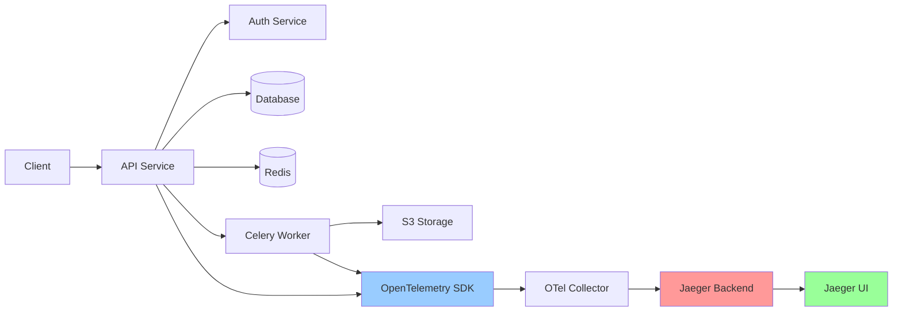

# Distributed Tracing Architecture

**Version**: 1.0.0  
**Last Updated**: 2025-10-30  
**Status**: Active

## Overview

This document defines the distributed tracing architecture for the Task Management System using OpenTelemetry. Distributed tracing provides end-to-end visibility into request flows across services, enabling performance analysis, dependency mapping, and root cause analysis for complex distributed systems.

---

## Tracing Concepts

### Key Components



### Tracing Terminology

| Term                | Definition                | Example                                                   |
| ------------------- | ------------------------- | --------------------------------------------------------- |
| **Trace**           | Complete request journey  | User creates task → DB insert → Cache update → Email sent |
| **Span**            | Single operation unit     | Database query, HTTP request, function call               |
| **Trace Context**   | Correlation identifiers   | `trace_id`, `span_id`, `parent_span_id`                   |
| **Span Attributes** | Key-value metadata        | `http.method=POST`, `db.statement=INSERT`                 |
| **Span Events**     | Point-in-time occurrences | Exception thrown, cache miss, retry attempt               |

### Trace Structure

```
Trace ID: 4bf92f3577b34da6a3ce929d0e0e4736

├─ Span: POST /api/v1/tasks (120ms)
│  ├─ Span: authorize_request (15ms)
│  │  └─ Span: redis.get permission_cache (2ms)
│  ├─ Span: CreateTaskUseCase.execute (95ms)
│  │  ├─ Span: validate_task (5ms)
│  │  ├─ Span: db.insert tasks (45ms)
│  │  ├─ Span: db.update projects (15ms)
│  │  └─ Span: redis.delete task_cache (3ms)
│  └─ Span: enqueue_notification (10ms)
│     └─ Span: celery.apply_async (8ms)
```

---

## OpenTelemetry Implementation

### Installation

```bash
# Install OpenTelemetry packages
pip install opentelemetry-api
pip install opentelemetry-sdk
pip install opentelemetry-instrumentation-fastapi
pip install opentelemetry-instrumentation-sqlalchemy
pip install opentelemetry-instrumentation-redis
pip install opentelemetry-instrumentation-requests
pip install opentelemetry-exporter-jaeger
```

### Configuration

```python
from opentelemetry import trace
from opentelemetry.sdk.trace import TracerProvider
from opentelemetry.sdk.trace.export import BatchSpanProcessor
from opentelemetry.exporter.jaeger.thrift import JaegerExporter
from opentelemetry.sdk.resources import Resource
from opentelemetry.instrumentation.fastapi import FastAPIInstrumentor
from opentelemetry.instrumentation.sqlalchemy import SQLAlchemyInstrumentor
from opentelemetry.instrumentation.redis import RedisInstrumentor

# Configure resource attributes
resource = Resource.create({
    "service.name": "taskmanager-api",
    "service.version": "1.0.0",
    "deployment.environment": "production",
    "service.instance.id": os.environ.get("HOSTNAME", "unknown")
})

# Create tracer provider
tracer_provider = TracerProvider(resource=resource)

# Configure Jaeger exporter
jaeger_exporter = JaegerExporter(
    agent_host_name=os.environ.get("JAEGER_AGENT_HOST", "localhost"),
    agent_port=int(os.environ.get("JAEGER_AGENT_PORT", 6831)),
)

# Add batch span processor
tracer_provider.add_span_processor(
    BatchSpanProcessor(jaeger_exporter)
)

# Set global tracer provider
trace.set_tracer_provider(tracer_provider)

# Get tracer instance
tracer = trace.get_tracer(__name__)

def configure_tracing(app: FastAPI, engine):
    """
    Configure OpenTelemetry instrumentation for FastAPI app
    """
    # Auto-instrument FastAPI
    FastAPIInstrumentor.instrument_app(app)

    # Auto-instrument SQLAlchemy
    SQLAlchemyInstrumentor().instrument(
        engine=engine,
        enable_commenter=True,  # Add trace context to SQL comments
        skip_dep_check=True
    )

    # Auto-instrument Redis
    RedisInstrumentor().instrument()
```

### Manual Span Creation

```python
from opentelemetry import trace
from opentelemetry.trace import Status, StatusCode

tracer = trace.get_tracer(__name__)

class CreateTaskUseCase:
    """Use case with manual tracing"""

    async def execute(self, request: CreateTaskRequest, user: User) -> Task:
        """
        Create a new task with distributed tracing
        """
        # Create span for use case execution
        with tracer.start_as_current_span(
            "CreateTaskUseCase.execute",
            attributes={
                "user.id": str(user.user_id),
                "organization.id": str(user.organization_id),
                "project.id": str(request.project_id),
            }
        ) as span:
            try:
                # Step 1: Validate task
                with tracer.start_as_current_span("validate_task") as validation_span:
                    self._validate_task(request, user)
                    validation_span.set_attribute("validation.passed", True)

                # Step 2: Create domain entity
                with tracer.start_as_current_span("create_task_entity") as entity_span:
                    task = Task(
                        task_id=uuid4(),
                        project_id=request.project_id,
                        title=request.title,
                        description=request.description,
                        organization_id=user.organization_id,
                        created_by=user.user_id
                    )
                    entity_span.set_attribute("task.id", str(task.task_id))

                # Step 3: Save to database
                with tracer.start_as_current_span("save_task") as save_span:
                    saved_task = await task_repository.save(task)
                    save_span.set_attribute("db.operation", "INSERT")
                    save_span.set_attribute("db.table", "tasks")

                # Step 4: Invalidate cache
                with tracer.start_as_current_span("invalidate_cache") as cache_span:
                    await cache.delete(f"project:{request.project_id}:tasks")
                    cache_span.set_attribute("cache.key", f"project:{request.project_id}:tasks")

                # Step 5: Enqueue notification
                with tracer.start_as_current_span("enqueue_notification") as notify_span:
                    await self._enqueue_notification(saved_task)
                    notify_span.set_attribute("notification.type", "task_created")

                span.set_status(Status(StatusCode.OK))
                span.set_attribute("task.created", True)

                return saved_task

            except Exception as e:
                # Record exception in span
                span.record_exception(e)
                span.set_status(Status(StatusCode.ERROR, str(e)))
                span.set_attribute("error", True)
                span.set_attribute("error.type", type(e).__name__)
                raise
```

### Span Attributes

**Standard attributes following OpenTelemetry Semantic Conventions**:

```python
# HTTP attributes
span.set_attribute("http.method", "POST")
span.set_attribute("http.url", "/api/v1/tasks")
span.set_attribute("http.status_code", 201)
span.set_attribute("http.request_content_length", 1024)
span.set_attribute("http.response_content_length", 512)

# Database attributes
span.set_attribute("db.system", "mysql")
span.set_attribute("db.name", "taskmanager")
span.set_attribute("db.statement", "INSERT INTO tasks (...) VALUES (...)")
span.set_attribute("db.operation", "INSERT")
span.set_attribute("db.sql.table", "tasks")

# Cache attributes
span.set_attribute("cache.system", "redis")
span.set_attribute("cache.operation", "get")
span.set_attribute("cache.key", "permission:user:123")
span.set_attribute("cache.hit", True)

# Messaging attributes (Celery)
span.set_attribute("messaging.system", "celery")
span.set_attribute("messaging.destination", "emails")
span.set_attribute("messaging.operation", "send")
span.set_attribute("messaging.message_id", "task-123")

# Custom business attributes
span.set_attribute("task.id", str(task_id))
span.set_attribute("task.priority", 3)
span.set_attribute("user.id", str(user_id))
span.set_attribute("organization.id", str(org_id))
```

### Span Events

**Record significant events within a span**:

```python
from datetime import datetime

# Record cache miss event
span.add_event(
    "cache_miss",
    attributes={
        "cache.key": cache_key,
        "cache.type": "permission"
    }
)

# Record retry event
span.add_event(
    "retry_attempt",
    attributes={
        "retry.attempt": 2,
        "retry.max_attempts": 3,
        "retry.reason": "DatabaseConnectionError"
    }
)

# Record validation failure
span.add_event(
    "validation_failed",
    attributes={
        "validation.field": "due_date",
        "validation.error": "Must be in future"
    }
)

# Record exception
try:
    result = await expensive_operation()
except Exception as e:
    span.record_exception(e)
    span.add_event(
        "exception_caught",
        attributes={
            "exception.type": type(e).__name__,
            "exception.message": str(e),
            "exception.handled": True
        }
    )
```

---

## Context Propagation

### HTTP Headers (W3C Trace Context)

**Propagate trace context across service boundaries**:

```python
from opentelemetry.propagate import inject, extract
from opentelemetry.trace.propagation.tracecontext import TraceContextTextMapPropagator

propagator = TraceContextTextMapPropagator()

# Outgoing HTTP request (inject context)
import httpx

async def call_external_service(url: str, data: dict):
    """Make HTTP request with trace context propagation"""
    headers = {}

    # Inject trace context into headers
    inject(headers)

    async with httpx.AsyncClient() as client:
        response = await client.post(
            url,
            json=data,
            headers=headers  # Include: traceparent, tracestate
        )

    return response

# Incoming HTTP request (extract context)
@app.middleware("http")
async def trace_context_middleware(request: Request, call_next):
    """Extract trace context from incoming request headers"""
    # Extract context from headers
    ctx = extract(request.headers)

    # Set as current context
    token = context.attach(ctx)

    try:
        response = await call_next(request)
        return response
    finally:
        context.detach(token)
```

**Headers format**:

```
traceparent: 00-4bf92f3577b34da6a3ce929d0e0e4736-00f067aa0ba902b7-01
             ^^ ^^ trace_id                       ^^ span_id         ^^ flags
             version

tracestate: vendor1=value1,vendor2=value2
```

### Database Query Context

**Add trace context to SQL queries as comments**:

```sql
-- traceparent='00-4bf92f3577b34da6a3ce929d0e0e4736-00f067aa0ba902b7-01'
SELECT * FROM tasks WHERE project_id = '...' AND status = 'TODO';
```

**Enabled via SQLAlchemy instrumentation**:

```python
SQLAlchemyInstrumentor().instrument(
    engine=engine,
    enable_commenter=True  # Adds trace context to SQL comments
)
```

### Celery Task Context

**Propagate context to background tasks**:

```python
from opentelemetry import context
from opentelemetry.propagate import inject, extract

# Serialize context when enqueuing task
def enqueue_with_context(task_name: str, *args, **kwargs):
    """Enqueue Celery task with trace context"""
    carrier = {}
    inject(carrier)  # Inject current context

    # Pass context as task header
    task.apply_async(
        args=args,
        kwargs=kwargs,
        headers={"trace_context": carrier}
    )

# Deserialize context when executing task
@app.task
def send_notification_email(user_id: str, template: str):
    """Celery task that extracts trace context"""
    # Get trace context from task headers
    carrier = current_task.request.get("trace_context", {})

    # Extract and set context
    ctx = extract(carrier)
    token = context.attach(ctx)

    try:
        # Task execution (child span of original trace)
        with tracer.start_as_current_span("send_notification_email") as span:
            span.set_attribute("user.id", user_id)
            span.set_attribute("template", template)

            # Send email logic
            send_email(user_id, template)

    finally:
        context.detach(token)
```

---

## Sampling Strategies

### Head-Based Sampling

**Sample decisions made at trace creation**:

```python
from opentelemetry.sdk.trace.sampling import (
    TraceIdRatioBased,
    ParentBasedTraceIdRatio,
    ALWAYS_ON,
    ALWAYS_OFF
)

# Sample 10% of traces
sampler = TraceIdRatioBased(0.1)

# Sample 100% of traces with errors (via custom sampler)
class ErrorAwaresampler(Sampler):
    """Sample all traces with errors, 10% of success traces"""

    def should_sample(self, context, trace_id, name, kind, attributes, links, trace_state):
        # Always sample if status code >= 500
        if attributes and attributes.get("http.status_code", 0) >= 500:
            return SamplingResult(Decision.RECORD_AND_SAMPLE)

        # Sample 10% of other traces
        return TraceIdRatioBased(0.1).should_sample(
            context, trace_id, name, kind, attributes, links, trace_state
        )

tracer_provider = TracerProvider(sampler=ErrorAwareSampler())
```

### Environment-Specific Sampling

```python
import os

def get_sampler():
    """Get sampler based on environment"""
    env = os.environ.get("ENVIRONMENT", "production")

    if env == "development":
        return ALWAYS_ON  # 100% sampling in dev
    elif env == "staging":
        return TraceIdRatioBased(0.5)  # 50% in staging
    else:  # production
        return TraceIdRatioBased(0.1)  # 10% in production

tracer_provider = TracerProvider(sampler=get_sampler())
```

---

## Trace Analysis

### Common Queries

**Jaeger UI Queries**:

```
# Find slow requests (>1 second)
http.method=POST duration:>1s

# Find requests with errors
http.status_code>=500

# Find requests for specific user
user.id=usr_123abc

# Find requests to specific endpoint
http.url=/api/v1/tasks

# Find database queries >100ms
db.operation AND duration:>100ms

# Find traces with cache misses
cache.hit=false
```

### Trace Visualization

**Example trace breakdown**:

```
Total Duration: 235ms

├─ POST /api/v1/tasks (235ms) ─ API Gateway
│  │
│  ├─ authenticate_request (25ms) ─ Auth Middleware
│  │  └─ redis.get session (3ms)
│  │
│  ├─ authorize_request (15ms) ─ Authorization
│  │  └─ redis.get permission_cache (2ms)
│  │
│  ├─ CreateTaskUseCase.execute (180ms) ─ Application Layer
│  │  │
│  │  ├─ validate_task (10ms) ─ Domain Layer
│  │  │
│  │  ├─ db.insert tasks (120ms) ⚠️ SLOW ─ Database
│  │  │  └─ db.connection.acquire (50ms) ⚠️ Pool wait
│  │  │
│  │  ├─ db.update projects (30ms) ─ Database
│  │  │
│  │  └─ redis.delete task_cache (5ms) ─ Cache
│  │
│  └─ enqueue_notification (15ms) ─ Background Jobs
│     └─ celery.apply_async (12ms)
```

**Analysis**:

- 🔍 **Root cause**: Database connection pool exhaustion (50ms wait)
- 📊 **Impact**: 120ms DB insert (should be <50ms)
- 🎯 **Action**: Increase connection pool size or optimize query

---

## Jaeger Deployment

### Docker Compose (Development)

```yaml
version: "3.8"

services:
  jaeger:
    image: jaegertracing/all-in-one:latest
    environment:
      - COLLECTOR_ZIPKIN_HOST_PORT=:9411
    ports:
      - "5775:5775/udp" # Zipkin compact thrift
      - "6831:6831/udp" # Jaeger compact thrift
      - "6832:6832/udp" # Jaeger binary thrift
      - "5778:5778" # Config endpoint
      - "16686:16686" # UI
      - "14268:14268" # Collector HTTP
      - "14250:14250" # Collector gRPC
      - "9411:9411" # Zipkin compatible
```

### Production Deployment (AWS ECS)

```yaml
Jaeger Components:
  Jaeger Collector:
    - Receives spans from applications
    - ECS Service (3 tasks for HA)
    - Behind internal ALB
    - Writes to Elasticsearch

  Jaeger Query:
    - Serves Jaeger UI
    - Reads from Elasticsearch
    - Public ALB (authenticated)

  Elasticsearch:
    - AWS OpenSearch Service
    - 3-node cluster for HA
    - 7-day retention
    - Automatic snapshots to S3

  Jaeger Agent:
    - Sidecar container in each ECS task
    - Buffers and forwards spans
    - No external dependencies
```

**ECS Task Definition**:

```json
{
  "family": "taskmanager-api",
  "containerDefinitions": [
    {
      "name": "api",
      "image": "taskmanager-api:latest",
      "environment": [
        {
          "name": "JAEGER_AGENT_HOST",
          "value": "localhost"
        },
        {
          "name": "JAEGER_AGENT_PORT",
          "value": "6831"
        }
      ]
    },
    {
      "name": "jaeger-agent",
      "image": "jaegertracing/jaeger-agent:latest",
      "environment": [
        {
          "name": "COLLECTOR_HOST_PORT",
          "value": "jaeger-collector.internal:14250"
        }
      ],
      "portMappings": [
        {
          "containerPort": 6831,
          "protocol": "udp"
        }
      ]
    }
  ]
}
```

---

## Performance Considerations

### Overhead

| Operation               | Latency Overhead | Memory Overhead            |
| ----------------------- | ---------------- | -------------------------- |
| **Span creation**       | 1-5 μs           | 1-2 KB per span            |
| **Attribute addition**  | 0.1-0.5 μs       | 50-100 bytes per attribute |
| **Context propagation** | 2-10 μs          | 500 bytes                  |
| **Span export (async)** | Negligible       | Batched in background      |

### Optimization Tips

1. **Use sampling** to reduce trace volume (10-20% in production)
2. **Limit span attributes** to essential data (10-15 per span)
3. **Avoid high-cardinality attributes** (no user IDs, request IDs)
4. **Use batch exporter** (default: 512 spans per batch)
5. **Set reasonable timeouts** (export timeout: 30s)
6. **Monitor exporter queue** (alert if >1000 pending spans)

---

## Best Practices

### DO ✅

1. **Create spans for significant operations** (use cases, DB queries, external calls)
2. **Add meaningful attributes** (business context, not just technical)
3. **Propagate context across boundaries** (HTTP, Celery, gRPC)
4. **Record exceptions in spans** using `span.record_exception()`
5. **Use semantic conventions** for standard attributes
6. **Sample appropriately** (100% in dev, 10-20% in prod)
7. **Monitor trace completeness** (alert on dropped spans)

### DON'T ❌

1. **Don't create spans for trivial operations** (simple getters, validation)
2. **Don't add PII to span attributes** (emails, passwords, tokens)
3. **Don't use high-cardinality attributes** (user_id in span name)
4. **Don't create too many spans** (>50 per trace)
5. **Don't block on span export** (always use async exporter)
6. **Don't ignore sampling** (100% sampling is expensive)
7. **Don't forget to close spans** (use context managers)

### Example: Bad vs Good Tracing

❌ **Bad**:

```python
# Too many trivial spans
span1 = tracer.start_span("get_user_id")
user_id = user.user_id
span1.end()

span2 = tracer.start_span("check_if_admin")
is_admin = "ADMIN" in user.roles
span2.end()
```

✅ **Good**:

```python
# Single meaningful span
with tracer.start_as_current_span(
    "authorize_user",
    attributes={
        "user.id": str(user.user_id),
        "user.role": user.primary_role,
        "permission.required": "task:create"
    }
) as span:
    has_permission = authorization_service.check(user, "task:create")
    span.set_attribute("authorization.granted", has_permission)
```

---

## Related Documents

- [Logging](./logging.md) - Structured logging with trace correlation
- [Metrics](./metrics.md) - Prometheus metrics for quantitative analysis
- [Alerting](./alerting.md) - Alerts based on trace anomalies
- [Performance](../performance.md) - Performance targets and optimization

---

**Last Reviewed**: 2025-10-30  
**Next Review**: 2026-01-30 (Quarterly)
