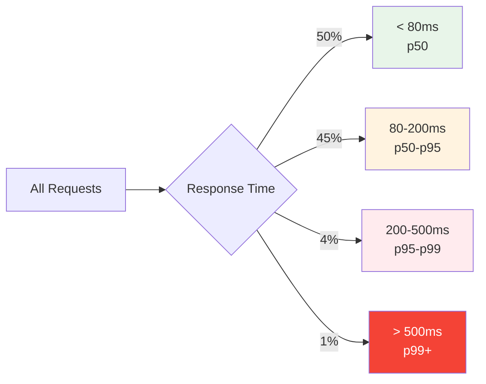

# Performance Targets

**Version**: 1.0.0  
**Last Updated**: 2025-10-30  
**Status**: Active

## Overview

This document defines performance targets, benchmarks, and service level objectives (SLOs) for the Task Management System. These targets guide architecture decisions, capacity planning, and performance optimization efforts.

---

## Performance Philosophy

### Core Principles

1. **User-Centric**: Optimize for perceived performance, not just technical metrics
2. **Percentile-Based**: Use p95/p99 instead of averages (outliers matter)
3. **Proactive Monitoring**: Alert before users notice issues
4. **Continuous Improvement**: Regularly review and tighten targets
5. **Cost-Aware**: Balance performance with infrastructure costs

---

## Service Level Objectives (SLOs)

### Availability

| Service            | Target SLO | Downtime Budget  | Measurement            |
| ------------------ | ---------- | ---------------- | ---------------------- |
| **API Service**    | 99.9%      | 43.8 min/month   | HTTP 200/2xx responses |
| **Authentication** | 99.95%     | 21.9 min/month   | Successful login rate  |
| **Database**       | 99.99%     | 4.38 min/month   | AWS RDS uptime         |
| **Cache (Redis)**  | 99.9%      | 43.8 min/month   | AWS ElastiCache uptime |
| **Workers**        | 99.5%      | 3.65 hours/month | Task completion rate   |

**Availability Calculation**:

```
Availability = (Total Time - Downtime) / Total Time × 100%

Example (99.9%):
Monthly = 30 days × 24 hours = 720 hours
Downtime = 720 × 0.001 = 0.72 hours = 43.2 minutes
```

### Latency (Response Time)

**API Endpoints**:

| Endpoint Type                     | p50 (Median) | p95   | p99   | Max   | Notes                         |
| --------------------------------- | ------------ | ----- | ----- | ----- | ----------------------------- |
| **Authentication**                | 50ms         | 120ms | 200ms | 500ms | JWT validation + Redis lookup |
| **Read Operations (GET)**         | 80ms         | 200ms | 500ms | 1s    | Cached queries                |
| **Write Operations (POST/PATCH)** | 120ms        | 300ms | 800ms | 2s    | Database writes + events      |
| **List Operations**               | 150ms        | 400ms | 1s    | 3s    | Pagination required           |
| **Search Operations**             | 200ms        | 600ms | 1.5s  | 5s    | Full-text search              |
| **File Upload**                   | 500ms        | 2s    | 5s    | 30s   | Depends on file size          |

**Target Distribution**:



**Latency Breakdown**:

```
┌─────────────────────────────────────────────────────────┐
│ Target API Response Time: 200ms (p95)                   │
├─────────────────────────────────────────────────────────┤
│ Network (client → ALB)              :  20ms (10%)       │
│ ALB routing                         :  5ms  (2.5%)      │
│ Authentication middleware           :  10ms (5%)        │
│ Authorization check                 :  15ms (7.5%)      │
│ Business logic execution            :  30ms (15%)       │
│ Database query                      :  60ms (30%)       │
│ Cache operations                    :  10ms (5%)        │
│ Event publishing                    :  5ms  (2.5%)      │
│ Response serialization              :  20ms (10%)       │
│ Network (ALB → client)              :  25ms (12.5%)     │
├─────────────────────────────────────────────────────────┤
│ TOTAL                               : 200ms (100%)      │
└─────────────────────────────────────────────────────────┘
```

---

## Database Performance

### Query Performance Targets

| Query Type                   | p50   | p95   | p99   | Max   | Notes                     |
| ---------------------------- | ----- | ----- | ----- | ----- | ------------------------- |
| **Primary Key Lookup**       | 5ms   | 10ms  | 20ms  | 50ms  | Single row by ID          |
| **Simple Filter (indexed)**  | 10ms  | 30ms  | 50ms  | 100ms | WHERE with indexed column |
| **Join (2 tables)**          | 20ms  | 50ms  | 100ms | 300ms | Well-indexed foreign keys |
| **Complex Query (3+ joins)** | 50ms  | 150ms | 300ms | 1s    | Pre-aggregated preferred  |
| **Full-text Search**         | 100ms | 300ms | 800ms | 3s    | Elasticsearch preferred   |
| **Aggregation**              | 80ms  | 200ms | 500ms | 2s    | Cached where possible     |

**Query Optimization Thresholds**:

```python
class QueryPerformanceMonitor:
    """Monitor and alert on slow queries"""

    THRESHOLDS = {
        'WARN': 100,   # Log warning if query > 100ms
        'ERROR': 500,  # Log error if query > 500ms
        'CRITICAL': 1000  # Alert if query > 1s
    }

    def measure_query(self, query: str, params: dict) -> float:
        start = time.time()
        result = self.execute(query, params)
        duration = (time.time() - start) * 1000  # Convert to ms

        if duration > self.THRESHOLDS['CRITICAL']:
            logger.critical(f"Slow query detected: {duration:.2f}ms", extra={
                'query': query,
                'duration_ms': duration,
                'threshold': 'CRITICAL'
            })
            self.alert_ops_team(query, duration)

        elif duration > self.THRESHOLDS['ERROR']:
            logger.error(f"Slow query: {duration:.2f}ms", extra={
                'query': query,
                'duration_ms': duration
            })

        elif duration > self.THRESHOLDS['WARN']:
            logger.warning(f"Slow query: {duration:.2f}ms", extra={
                'query': query,
                'duration_ms': duration
            })

        return duration
```

### Database Connection Pool

| Metric                  | Target   | Alert Threshold | Action                          |
| ----------------------- | -------- | --------------- | ------------------------------- |
| **Pool Utilization**    | < 70%    | > 80%           | Scale up instances or pool size |
| **Wait Time**           | < 10ms   | > 50ms          | Increase pool size              |
| **Connection Lifetime** | < 1 hour | > 2 hours       | Verify pool recycling           |
| **Failed Connections**  | < 0.1%   | > 1%            | Check database health           |

**Pool Configuration**:

```python
# SQLAlchemy pool settings
DATABASE_POOL_CONFIG = {
    'pool_size': 10,           # Base pool size per instance
    'max_overflow': 20,        # Additional connections during spikes
    'pool_timeout': 30,        # Wait 30s for connection
    'pool_recycle': 3600,      # Recycle after 1 hour
    'pool_pre_ping': True,     # Verify before use
}

# Calculate total connections
API_INSTANCES = 10
WORKER_INSTANCES = 8
TOTAL_CONNECTIONS = (API_INSTANCES + WORKER_INSTANCES) × (pool_size + max_overflow)
                  = 18 × 30 = 540 connections

# MySQL max_connections should be 2x total
MYSQL_MAX_CONNECTIONS = 1200  # 540 × 2 with headroom
```

---

## Cache Performance

### Redis Performance Targets

| Operation          | p50  | p95  | p99   | Max   | Notes                |
| ------------------ | ---- | ---- | ----- | ----- | -------------------- |
| **GET (hit)**      | 1ms  | 3ms  | 5ms   | 10ms  | Single key lookup    |
| **GET (miss)**     | 1ms  | 3ms  | 5ms   | 10ms  | Same as hit (NULL)   |
| **SET**            | 1ms  | 3ms  | 5ms   | 10ms  | Single key write     |
| **MGET (10 keys)** | 2ms  | 5ms  | 10ms  | 20ms  | Batch get            |
| **MSET (10 keys)** | 2ms  | 5ms  | 10ms  | 20ms  | Batch set            |
| **DELETE**         | 1ms  | 3ms  | 5ms   | 10ms  | Single key delete    |
| **KEYS (pattern)** | 10ms | 50ms | 100ms | 500ms | Avoid in production! |

**Cache Hit Rate Targets**:

| Data Type             | Target Hit Rate | Current | Notes                   |
| --------------------- | --------------- | ------- | ----------------------- |
| **User Sessions**     | > 95%           | 98%     | Hot data, high TTL      |
| **User Profiles**     | > 90%           | 92%     | Frequently accessed     |
| **Project Metadata**  | > 85%           | 87%     | Medium access frequency |
| **Task Lists**        | > 80%           | 82%     | Frequently invalidated  |
| **Permission Checks** | > 90%           | 91%     | Hot data, 5-min TTL     |

**Hit Rate Calculation**:

```python
class CacheMetrics:
    def calculate_hit_rate(self, period: str = '1h') -> float:
        hits = self.prometheus.query(
            f'sum(increase(cache_hits_total[{period}]))'
        )
        misses = self.prometheus.query(
            f'sum(increase(cache_misses_total[{period}]))'
        )

        total = hits + misses
        hit_rate = (hits / total) * 100 if total > 0 else 0

        return hit_rate

    def alert_on_low_hit_rate(self):
        hit_rate = self.calculate_hit_rate('5m')

        if hit_rate < 70:
            logger.error(f"Cache hit rate critically low: {hit_rate:.1f}%")
            # Check for:
            # 1. Cache eviction (memory pressure)
            # 2. TTL too aggressive
            # 3. Invalid cache warming
            # 4. Cold start after deployment
```

---

## Background Job Performance

### Celery Task Targets

| Task Type             | p50   | p95 | p99  | Max  | SLO         |
| --------------------- | ----- | --- | ---- | ---- | ----------- |
| **Email Delivery**    | 1s    | 3s  | 10s  | 30s  | 99% success |
| **Push Notification** | 500ms | 2s  | 5s   | 15s  | 99% success |
| **Report Generation** | 5s    | 15s | 30s  | 2min | 95% success |
| **Data Cleanup**      | 10s   | 30s | 1min | 5min | 95% success |
| **Webhook Delivery**  | 2s    | 5s  | 15s  | 60s  | 90% success |

**Queue Depth Targets**:

| Queue             | Target Depth | Alert Threshold | Max Depth | Action                       |
| ----------------- | ------------ | --------------- | --------- | ---------------------------- |
| **High Priority** | < 10         | > 50            | 100       | Scale workers immediately    |
| **Default**       | < 100        | > 500           | 1000      | Scale workers                |
| **Low Priority**  | < 500        | > 2000          | 5000      | Monitor, scale if persistent |

**Task Retry Strategy**:

```python
RETRY_POLICIES = {
    'email_delivery': {
        'max_retries': 3,
        'retry_backoff': True,
        'retry_backoff_max': 600,  # 10 minutes
        'retry_jitter': True,
    },
    'webhook_delivery': {
        'max_retries': 5,
        'retry_backoff': True,
        'retry_backoff_max': 1800,  # 30 minutes
    },
    'report_generation': {
        'max_retries': 2,
        'retry_backoff': False,
        'retry_delay': 300,  # 5 minutes
    }
}
```

---

## Throughput Targets

### Request Throughput

| Metric                     | Current | Phase 1 (10K users) | Phase 2 (50K users) | Phase 3 (100K users) |
| -------------------------- | ------- | ------------------- | ------------------- | -------------------- |
| **API Requests/sec**       | 50      | 500                 | 2,500               | 5,000                |
| **Database Queries/sec**   | 500     | 2,000               | 10,000              | 20,000               |
| **Cache Operations/sec**   | 200     | 2,000               | 10,000              | 20,000               |
| **Background Jobs/min**    | 100     | 1,000               | 5,000               | 10,000               |
| **WebSocket Messages/sec** | 10      | 100                 | 500                 | 1,000                |

**Peak vs Average**:

```
Peak Traffic = Average × 3-5x (during business hours)

Example:
- Average: 500 req/s
- Peak (9am-5pm): 2,000 req/s
- Design for: 2,500 req/s (25% headroom)
```

### Concurrent Users

| Phase       | Active Users | Concurrent Sessions | Peak Concurrent | Notes              |
| ----------- | ------------ | ------------------- | --------------- | ------------------ |
| **Launch**  | 1,000        | 100                 | 250             | MVP, single tenant |
| **Phase 1** | 10,000       | 1,000               | 2,500           | Multi-tenant       |
| **Phase 2** | 50,000       | 5,000               | 12,500          | Regional scaling   |
| **Phase 3** | 100,000      | 10,000              | 25,000          | Global scaling     |

**Concurrency Calculation**:

```python
def calculate_concurrent_users(
    total_users: int,
    active_ratio: float = 0.3,  # 30% active daily
    peak_ratio: float = 0.2      # 20% of active users concurrent at peak
) -> dict:
    """Calculate concurrent user capacity needs"""

    daily_active = int(total_users * active_ratio)
    peak_concurrent = int(daily_active * peak_ratio)

    # Add 25% headroom for traffic spikes
    design_capacity = int(peak_concurrent * 1.25)

    return {
        'total_users': total_users,
        'daily_active': daily_active,
        'peak_concurrent': peak_concurrent,
        'design_capacity': design_capacity
    }

# Example: 100K users
capacity = calculate_concurrent_users(100_000)
# {
#     'total_users': 100000,
#     'daily_active': 30000,
#     'peak_concurrent': 6000,
#     'design_capacity': 7500
# }
```

---

## Resource Utilization Targets

### Compute (ECS Tasks)

| Resource     | Target Utilization | Alert Threshold | Scale Trigger   | Notes                      |
| ------------ | ------------------ | --------------- | --------------- | -------------------------- |
| **CPU**      | 60-70%             | > 80%           | > 75% for 5 min | Efficient use of resources |
| **Memory**   | 60-70%             | > 85%           | > 80% for 5 min | Leave room for spikes      |
| **Network**  | < 50%              | > 80%           | > 70% sustained | Rare bottleneck            |
| **Disk I/O** | < 60%              | > 80%           | > 75% sustained | Logs and temp files        |

**Auto-Scaling Policy**:

```yaml
ecs_autoscaling:
  api_service:
    min_tasks: 2
    max_tasks: 20
    target_cpu_utilization: 70%
    target_memory_utilization: 75%
    scale_up:
      cooldown: 60s
      step: +2 tasks
    scale_down:
      cooldown: 300s
      step: -1 task

  celery_workers:
    min_tasks: 2
    max_tasks: 16
    target_queue_depth: 100 messages
    scale_up:
      cooldown: 30s
      step: +2 tasks
    scale_down:
      cooldown: 600s
      step: -1 task
```

### Database (RDS)

| Metric               | Target | Alert Threshold | Action                                |
| -------------------- | ------ | --------------- | ------------------------------------- |
| **CPU Utilization**  | < 60%  | > 80%           | Scale instance vertically             |
| **Memory**           | < 70%  | > 85%           | Scale instance or optimize queries    |
| **IOPS**             | < 70%  | > 85%           | Increase provisioned IOPS             |
| **Storage**          | < 80%  | > 90%           | Increase storage (auto-scaling)       |
| **Connection Count** | < 60%  | > 80%           | Increase max_connections or pool size |
| **Replication Lag**  | < 1s   | > 5s            | Check primary load, network           |

### Cache (ElastiCache)

| Metric                 | Target   | Alert Threshold | Action                            |
| ---------------------- | -------- | --------------- | --------------------------------- |
| **Memory Utilization** | < 75%    | > 90%           | Scale instance or adjust eviction |
| **CPU Utilization**    | < 60%    | > 80%           | Scale instance vertically         |
| **Network**            | < 50%    | > 80%           | Rare issue, check query patterns  |
| **Evictions**          | < 10/min | > 100/min       | Increase memory or reduce TTL     |
| **Cache Hit Rate**     | > 85%    | < 70%           | Review cache strategy             |

---

## Performance Testing

### Load Testing Scenarios

| Scenario        | Virtual Users | Duration | Success Criteria                    |
| --------------- | ------------- | -------- | ----------------------------------- |
| **Baseline**    | 100           | 10 min   | p95 < 200ms, 0 errors               |
| **Normal Load** | 1,000         | 30 min   | p95 < 300ms, < 0.1% errors          |
| **Peak Load**   | 2,500         | 15 min   | p95 < 500ms, < 1% errors            |
| **Stress Test** | 5,000         | 10 min   | Graceful degradation, no crashes    |
| **Spike Test**  | 0→5,000→0     | 20 min   | Recovery within 2 min               |
| **Endurance**   | 1,000         | 4 hours  | No memory leaks, stable performance |

**Locust Load Test Example**:

```python
from locust import HttpUser, task, between

class TaskManagementUser(HttpUser):
    wait_time = between(1, 3)  # 1-3 seconds between requests

    def on_start(self):
        # Login and get token
        response = self.client.post("/api/v1/auth/login", json={
            "email": "user@example.com",
            "password": "password"
        })
        self.token = response.json()["access_token"]
        self.headers = {"Authorization": f"Bearer {self.token}"}

    @task(3)  # 30% of requests
    def list_tasks(self):
        self.client.get(
            "/api/v1/tasks",
            headers=self.headers,
            name="/tasks [LIST]"
        )

    @task(2)  # 20% of requests
    def get_task(self):
        self.client.get(
            "/api/v1/tasks/123e4567-e89b-12d3-a456-426614174000",
            headers=self.headers,
            name="/tasks/:id [GET]"
        )

    @task(1)  # 10% of requests
    def create_task(self):
        self.client.post(
            "/api/v1/tasks",
            json={
                "title": "Load test task",
                "project_id": "456e7890-e89b-12d3-a456-426614174001"
            },
            headers=self.headers,
            name="/tasks [CREATE]"
        )
```

---

## Performance Monitoring

### Key Metrics (RED Method)

**Rate**:

- Requests per second (by endpoint, status code)
- Query per second (by database, query type)
- Cache operations per second

**Errors**:

- HTTP 5xx error rate (target < 0.1%)
- HTTP 4xx error rate (target < 5%)
- Database errors (target < 0.01%)
- Task failures (target < 1%)

**Duration**:

- API response time (p50, p95, p99)
- Database query time (p50, p95, p99)
- Cache operation time (p50, p95, p99)

### Prometheus Queries

```promql
# API request rate (requests per second)
rate(http_requests_total[5m])

# API error rate (percentage)
sum(rate(http_requests_total{status=~"5.."}[5m]))
/
sum(rate(http_requests_total[5m])) * 100

# API response time (p95)
histogram_quantile(0.95, rate(http_request_duration_seconds_bucket[5m]))

# Database query rate
rate(database_queries_total[5m])

# Cache hit rate
sum(rate(cache_hits_total[5m]))
/
(sum(rate(cache_hits_total[5m])) + sum(rate(cache_misses_total[5m]))) * 100
```

---

## Performance Budget

### Page/API Weight Budget

| Resource                 | Budget           | Current | Status |
| ------------------------ | ---------------- | ------- | ------ |
| **API Response Size**    | < 100 KB         | 45 KB   | ✅     |
| **API Response Time**    | < 500ms (p95)    | 280ms   | ✅     |
| **Database Query Count** | < 5 per request  | 3       | ✅     |
| **Cache Lookups**        | < 10 per request | 6       | ✅     |
| **Memory per Request**   | < 50 MB          | 32 MB   | ✅     |

---

## Related Documents

- [Scalability Patterns](./scalability.md)
- [Caching Strategy](./caching.md)
- [Database Optimization](./database-optimization.md)
- [Observability Metrics](./observability/metrics.md)
- [Capacity Planning](./capacity-planning.md)

---

**Last Reviewed**: 2025-10-30  
**Next Review**: 2026-01-30 (Quarterly)
