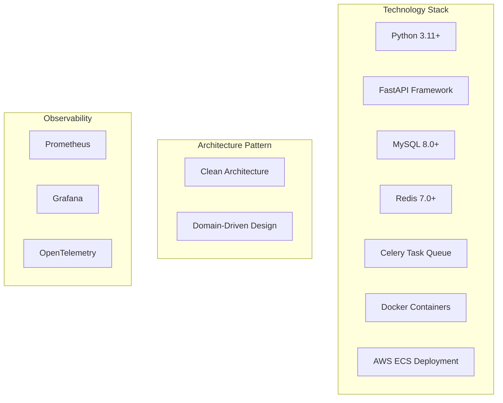
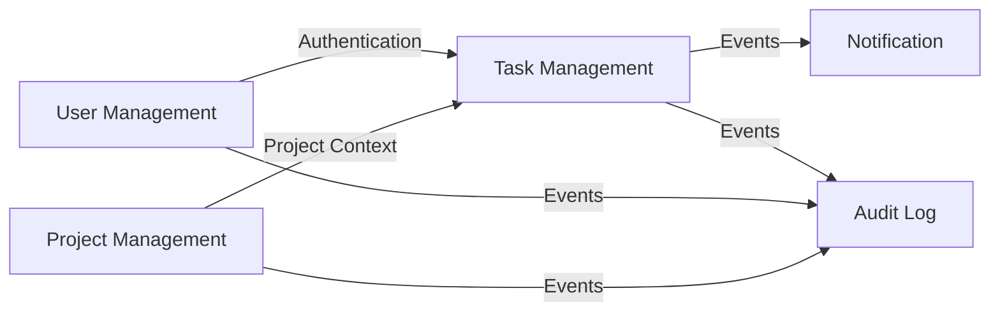

# Quickstart Guide

**Version**: 1.0.0  
**Last Updated**: 2025-10-30  
**Status**: Active

## Overview

Welcome to the Task Management System architecture documentation! This guide provides a quick introduction to the system architecture, key concepts, and how to navigate the documentation.

---

## Architecture at a Glance



**Core Principles**:

- 🏛️ **Clean Architecture**: Separation of concerns, dependency inversion
- 📚 **Domain-Driven Design**: Business-focused domain modeling
- 🔒 **Security-First**: JWT authentication, RBAC authorization
- 📊 **Observability**: Comprehensive metrics, logs, and tracing
- 🧪 **Test-Driven**: >90% code coverage target

---

## Quick Navigation

### 🎯 Getting Started (Start Here!)

1. **[System Overview](./diagrams/01-system-overview.md)**: Visual architecture diagrams
2. **[Layer Responsibilities](./layers.md)**: Understanding the 4 architecture layers
3. **[Bounded Contexts](./bounded-contexts.md)**: Domain model and business contexts
4. **[API Design Guidelines](./api-design.md)**: RESTful API conventions

### 📚 Deep Dives

| Topic                      | Document                                         | When to Read                               |
| -------------------------- | ------------------------------------------------ | ------------------------------------------ |
| **Technology Choices**     | [technology-choices.md](./technology-choices.md) | Understanding why we chose each technology |
| **Component Interactions** | [components.md](./components.md)                 | How system components communicate          |
| **Data Flows**             | [data-flows.md](./data-flows.md)                 | End-to-end request/response flows          |
| **Architecture Decisions** | [decisions/](./decisions/)                       | Historical context for major decisions     |

### 🔧 For Developers

- **Domain Models**: [bounded-contexts.md](./bounded-contexts.md#domain-entities)
- **Use Case Patterns**: [layers.md](./layers.md#application-layer)
- **Repository Interfaces**: [layers.md](./layers.md#infrastructure-layer)
- **API Endpoints**: [api-design.md](./api-design.md#api-endpoint-inventory)
- **Testing Guidelines**: [.github/instructions/unit-and-integration-tests.instructions.md](../../.github/instructions/unit-and-integration-tests.instructions.md)

### 🏗️ For Architects

- **System Diagrams**: [diagrams/01-system-overview.md](./diagrams/01-system-overview.md)
- **ADRs**: [decisions/adr-001-clean-architecture.md](./decisions/adr-001-clean-architecture.md)
- **Technology Stack**: [technology-choices.md](./technology-choices.md)
- **Bounded Context Boundaries**: [bounded-contexts.md](./bounded-contexts.md#context-boundaries)

### ☁️ For DevOps Engineers

- **Deployment Architecture**: [diagrams/01-system-overview.md](./diagrams/01-system-overview.md#aws-deployment-architecture)
- **Scaling Strategy**: [diagrams/01-system-overview.md](./diagrams/01-system-overview.md#horizontal-scaling-strategy)
- **Observability Setup**: [observability/README.md](./observability/README.md) _(to be created)_
- **Infrastructure as Code**: [deployment/README.md](./deployment/README.md) _(to be created)_

---

## Architecture Fundamentals

### Clean Architecture Layers

```
┌─────────────────────────────────────────────────────────┐
│              Interface Layer (API/CLI)                  │
│  FastAPI controllers, Pydantic schemas, HTTP handlers   │
├─────────────────────────────────────────────────────────┤
│          Infrastructure Layer (External)                │
│  SQLAlchemy repos, Redis cache, Celery workers, AWS    │
├─────────────────────────────────────────────────────────┤
│         Application Layer (Use Cases)                   │
│  Commands, Queries, Application Services, DTOs          │
├─────────────────────────────────────────────────────────┤
│           Domain Layer (Core Business Logic)            │
│  Entities, Value Objects, Domain Events (PURE PYTHON)   │
└─────────────────────────────────────────────────────────┘
```

**Dependency Rule**: ⬆️ Dependencies point INWARD only

- **Domain Layer**: Zero external dependencies (pure Python)
- **Application Layer**: Depends only on domain
- **Infrastructure Layer**: Implements domain interfaces
- **Interface Layer**: Depends on application and infrastructure

📖 **Learn More**: [layers.md](./layers.md)

### Five Bounded Contexts



| Context                | Responsibility                       | Key Entities                         |
| ---------------------- | ------------------------------------ | ------------------------------------ |
| **User Management**    | Users, organizations, authentication | User, Organization, Role             |
| **Project Management** | Projects, membership, labels         | Project, ProjectMember, Label        |
| **Task Management**    | Tasks, comments, attachments         | Task, Comment, Attachment            |
| **Notification**       | Multi-channel notifications          | Notification, NotificationPreference |
| **Audit**              | Security and compliance logs         | AuditLog                             |

📖 **Learn More**: [bounded-contexts.md](./bounded-contexts.md)

### Key Architectural Decisions

| ADR                                                      | Decision                 | Rationale                                             |
| -------------------------------------------------------- | ------------------------ | ----------------------------------------------------- |
| **[ADR-001](./decisions/adr-001-clean-architecture.md)** | Clean Architecture + DDD | Testability, maintainability, team scalability        |
| **[ADR-002](./decisions/adr-002-technology-stack.md)**   | Python + FastAPI + MySQL | Modern async, type safety, ACID compliance            |
| **[ADR-003](./decisions/adr-003-bounded-contexts.md)**   | 5 Bounded Contexts       | Clear boundaries, team autonomy, future microservices |

📖 **Learn More**: [decisions/](./decisions/)

---

## Technology Stack

### Core Technologies

| Category          | Technology           | Version | Purpose                              |
| ----------------- | -------------------- | ------- | ------------------------------------ |
| **Language**      | Python               | 3.11+   | Type hints, async/await, dataclasses |
| **Web Framework** | FastAPI              | 0.104+  | Async API, auto OpenAPI docs         |
| **Database**      | MySQL                | 8.0+    | ACID compliance, AWS RDS             |
| **ORM**           | SQLAlchemy           | 2.0+    | Database abstraction                 |
| **Cache/Broker**  | Redis                | 7.0+    | Session cache, message broker        |
| **Task Queue**    | Celery               | 5.3+    | Background job processing            |
| **Deployment**    | Docker + ECS         | Latest  | Container orchestration              |
| **Observability** | Prometheus + Grafana | Latest  | Metrics and dashboards               |

📖 **Learn More**: [technology-choices.md](./technology-choices.md)

### Development Tools

| Tool           | Purpose                      |
| -------------- | ---------------------------- |
| **pytest**     | Unit and integration testing |
| **ruff**       | Fast Python linter           |
| **black**      | Code formatting              |
| **mypy**       | Static type checking         |
| **alembic**    | Database migrations          |
| **pre-commit** | Git hooks for quality checks |

---

## Project Structure

```
src/
├── domain/                    # 🎯 Domain Layer (Pure Python)
│   ├── users/
│   │   ├── entities.py       # User, Organization
│   │   ├── value_objects.py  # Email, PhoneNumber
│   │   ├── events.py         # UserCreated, UserUpdated
│   │   └── repositories.py   # Abstract interfaces
│   ├── projects/
│   │   ├── entities.py       # Project, ProjectMember
│   │   └── repositories.py
│   └── tasks/
│       ├── entities.py       # Task, Comment
│       ├── value_objects.py  # TaskStatus, Priority
│       └── repositories.py
│
├── application/               # 🔧 Application Layer
│   ├── users/
│   │   ├── commands.py       # CreateUser, UpdateUser
│   │   ├── queries.py        # GetUserById, ListUsers
│   │   └── use_cases.py      # Use case implementations
│   ├── projects/
│   └── tasks/
│       ├── commands.py       # CreateTask, AssignTask
│       └── use_cases.py      # CreateTaskUseCase
│
├── infrastructure/            # 🏗️ Infrastructure Layer
│   ├── persistence/
│   │   ├── models.py         # SQLAlchemy ORM models
│   │   ├── repositories/
│   │   │   ├── user_repository.py
│   │   │   ├── project_repository.py
│   │   │   └── task_repository.py
│   │   └── migrations/       # Alembic migrations
│   ├── messaging/
│   │   ├── celery_app.py     # Celery configuration
│   │   ├── tasks.py          # Background tasks
│   │   └── event_bus.py      # Domain event publishing
│   ├── cache/
│   │   └── redis_cache.py    # Redis caching
│   └── observability/
│       ├── logging.py        # Structured logging
│       ├── metrics.py        # Prometheus metrics
│       └── tracing.py        # OpenTelemetry tracing
│
└── interface/                 # 🌐 Interface Layer
    ├── api/
    │   └── v1/
    │       ├── users/
    │       │   ├── router.py      # FastAPI router
    │       │   └── schemas.py     # Pydantic schemas
    │       ├── projects/
    │       └── tasks/
    │           ├── router.py
    │           └── schemas.py
    ├── dependencies.py        # Dependency injection
    └── main.py               # FastAPI app entry point
```

---

## Design Principles

### 1. Domain-Driven Design (DDD)

**Key Concepts**:

- **Entities**: Objects with unique identity (User, Task, Project)
- **Value Objects**: Immutable objects without identity (Email, Money, TaskStatus)
- **Aggregates**: Consistency boundaries (Task + Comments)
- **Domain Events**: State change notifications (TaskCreated, TaskAssigned)
- **Repositories**: Collection-like interfaces for entities

**Example**:

```python
# Domain Entity
class Task:
    def assign_to(self, user: User) -> None:
        if self.status == TaskStatus.COMPLETED:
            raise InvalidStateError("Cannot assign completed task")

        self.assignee_id = user.user_id
        self.record_event(TaskAssignedEvent(self.task_id, user.user_id))
```

📖 **Learn More**: [bounded-contexts.md](./bounded-contexts.md)

### 2. SOLID Principles

| Principle                 | Description                                 | Example                                                        |
| ------------------------- | ------------------------------------------- | -------------------------------------------------------------- |
| **S**ingle Responsibility | One class, one reason to change             | `TaskRepository` only handles task persistence                 |
| **O**pen/Closed           | Open for extension, closed for modification | Use inheritance/composition for new features                   |
| **L**iskov Substitution   | Subtypes must be substitutable              | Any `TaskRepository` implementation works                      |
| **I**nterface Segregation | Many specific interfaces > one general      | `UserReader` + `UserWriter` vs `UserRepository`                |
| **D**ependency Inversion  | Depend on abstractions                      | Use cases depend on repository interfaces, not implementations |

### 3. Test-Driven Development (TDD)

**Workflow**:

```
🔴 RED → 🟢 GREEN → 🔵 REFACTOR
```

1. **RED**: Write failing test
2. **GREEN**: Write minimal code to pass
3. **REFACTOR**: Improve code while keeping tests green

**Coverage Targets**:

- **Unit Tests**: 90%+ coverage
- **Integration Tests**: Critical paths
- **Contract Tests**: API contracts

📖 **Learn More**: [.github/instructions/unit-and-integration-tests.instructions.md](../../.github/instructions/unit-and-integration-tests.instructions.md)

---

## Performance Targets

| Metric                              | Target       | Monitoring                 |
| ----------------------------------- | ------------ | -------------------------- |
| **API Response Time (p95)**         | < 500ms      | Prometheus + Grafana       |
| **Database Query Time (p95)**       | < 100ms      | SQLAlchemy instrumentation |
| **Background Job Processing (p95)** | < 30 seconds | Celery metrics             |
| **Concurrent Users**                | 1,000+       | Load testing (Locust)      |
| **Availability (SLA)**              | 99.9%        | AWS CloudWatch             |

**Optimization Strategies**:

- ✅ Database query optimization (indexes, EXPLAIN)
- ✅ Redis caching (5-minute TTL for entities)
- ✅ Connection pooling (SQLAlchemy)
- ✅ Horizontal scaling (ECS auto-scaling)
- ✅ CDN for static assets (CloudFront)

📖 **Learn More**: [data-flows.md](./data-flows.md#performance-optimization-patterns)

---

## Security Requirements

### Authentication

**Method**: JWT (JSON Web Tokens) with OAuth2 Bearer scheme

**Token Types**:

- **Access Token**: 15-minute expiry, API authentication
- **Refresh Token**: 30-day expiry, obtain new access token

**Flow**:

```
Client → POST /api/v1/auth/login {email, password}
      ← {access_token, refresh_token}

Client → GET /api/v1/tasks (Authorization: Bearer <token>)
      ← 200 OK {tasks}

Token Expired → 401 Unauthorized
Client → POST /api/v1/auth/refresh {refresh_token}
      ← {new_access_token}
```

### Authorization

**Model**: Role-Based Access Control (RBAC)

**Roles**:

- **Owner**: Full control over resources
- **Admin**: Manage users and settings
- **Contributor**: Create and modify content
- **Viewer**: Read-only access

**Permission Checks**:

```python
@require_permission("task:write")
async def update_task(task_id: UUID, current_user: User):
    # Verified by middleware:
    # 1. User is authenticated
    # 2. User has "task:write" permission
    # 3. User can access this specific task
    pass
```

📖 **Learn More**: [api-design.md](./api-design.md#authentication--authorization)

---

## Development Workflow

### 1. Understand the Feature

- Read feature specification
- Identify affected bounded contexts
- Review domain model

### 2. Design the Solution

- Identify new domain entities/value objects
- Define use cases (commands/queries)
- Plan repository methods
- Design API endpoints

### 3. Write Tests First (TDD)

```python
# Test first
def test_create_task_with_valid_data():
    # Arrange
    command = CreateTaskCommand(title="Test task", project_id=uuid4())

    # Act
    task = use_case.execute(command)

    # Assert
    assert task.title == "Test task"
    assert task.status == TaskStatus.TODO
```

### 4. Implement Layers (Inside-Out)

**Order**:

1. **Domain**: Entities, value objects, events
2. **Application**: Use cases, commands, queries
3. **Infrastructure**: Repository implementations
4. **Interface**: API controllers, schemas

### 5. Verify & Review

- ✅ All tests pass (`pytest`)
- ✅ Code coverage >90% (`pytest --cov`)
- ✅ Linting passes (`ruff check`)
- ✅ Type checking passes (`mypy`)
- ✅ Constitution compliance (review checklist)

### 6. Deploy

- Push to feature branch
- CI/CD runs tests and linting
- Deploy to staging
- Run integration tests
- Deploy to production (after approval)

---

## Common Commands

### Development

```bash
# Install dependencies
pip install -r requirements.txt

# Run tests with coverage
pytest --cov=src --cov-report=html --cov-report=term

# Run linting
ruff check src/

# Run type checking
mypy src/

# Format code
black src/

# Run all quality checks
pre-commit run --all-files
```

### Local Environment

```bash
# Start local services (MySQL, Redis)
docker-compose up -d

# Run database migrations
alembic upgrade head

# Create new migration
alembic revision --autogenerate -m "Add tasks table"

# Start API server (development mode)
uvicorn src.interface.main:app --reload --host 0.0.0.0 --port 8000

# Start Celery worker
celery -A src.infrastructure.messaging.celery_app worker --loglevel=info

# Start Celery beat (scheduler)
celery -A src.infrastructure.messaging.celery_app beat --loglevel=info
```

### Testing

```bash
# Run all tests
pytest

# Run specific test file
pytest tests/unit/domain/test_task.py

# Run tests with specific marker
pytest -m "unit"  # Only unit tests
pytest -m "integration"  # Only integration tests

# Run tests in parallel
pytest -n auto

# Run tests with verbose output
pytest -v

# Run tests and stop on first failure
pytest -x
```

---

## Learning Resources

### Official Documentation

- **[Clean Architecture (Uncle Bob)](https://blog.cleancoder.com/uncle-bob/2012/08/13/the-clean-architecture.html)**: Core architectural pattern
- **[Domain-Driven Design (Eric Evans)](https://www.domainlanguage.com/ddd/)**: DDD principles and patterns
- **[FastAPI Documentation](https://fastapi.tiangolo.com/)**: Web framework guide
- **[SQLAlchemy Documentation](https://docs.sqlalchemy.org/)**: ORM and database toolkit
- **[Celery Documentation](https://docs.celeryq.dev/)**: Distributed task queue
- **[Prometheus Best Practices](https://prometheus.io/docs/practices/)**: Metrics and monitoring

### Internal Documentation

- **[Coding Style Python](../../.github/instructions/coding-style-python.instructions.md)**: Python style guide
- **[Object Calisthenics](../../.github/instructions/object-calisthenics.instructions.md)**: OOP best practices
- **[Security and OWASP](../../.github/instructions/security-and-owasp.instructions.md)**: Security guidelines
- **[Unit and Integration Tests](../../.github/instructions/unit-and-integration-tests.instructions.md)**: Testing best practices

---

## Getting Help

### Architecture Questions

- Review [System Overview](./diagrams/01-system-overview.md)
- Check [ADRs](./decisions/) for historical context
- Consult [technology-choices.md](./technology-choices.md) for technology rationale

### Implementation Questions

- Check [layers.md](./layers.md) for layer responsibilities
- Review [bounded-contexts.md](./bounded-contexts.md) for domain model
- See [components.md](./components.md) for component interactions

### API Questions

- Refer to [api-design.md](./api-design.md)
- Check OpenAPI docs at `/api/docs`
- Review [data-flows.md](./data-flows.md) for request/response flows

---

## Next Steps

### 👨‍💻 For New Developers

1. ✅ Read this quickstart guide
2. ✅ Study [System Overview](./diagrams/01-system-overview.md)
3. ✅ Understand [Layer Responsibilities](./layers.md)
4. ✅ Review [Bounded Contexts](./bounded-contexts.md)
5. ✅ Set up local environment (`docker-compose up`)
6. ✅ Run tests (`pytest`)
7. ✅ Implement your first feature (TDD workflow)

### 🏗️ For Architects

1. ✅ Review all [ADRs](./decisions/)
2. ✅ Study [technology-choices.md](./technology-choices.md)
3. ✅ Analyze [System Diagrams](./diagrams/01-system-overview.md)
4. ✅ Understand [Bounded Context Boundaries](./bounded-contexts.md#context-boundaries)
5. ✅ Plan new features with architecture principles

### ☁️ For DevOps Engineers

1. ✅ Review [AWS Deployment Architecture](./diagrams/01-system-overview.md#aws-deployment-architecture)
2. ✅ Understand [Scaling Strategy](./diagrams/01-system-overview.md#horizontal-scaling-strategy)
3. ✅ Set up observability stack (Prometheus, Grafana)
4. ✅ Configure CI/CD pipelines
5. ✅ Plan infrastructure as code (Terraform/CloudFormation)

---

## Document History

| Version | Date       | Changes                                               |
| ------- | ---------- | ----------------------------------------------------- |
| 1.0.0   | 2025-10-30 | Initial version with enhanced navigation and examples |

---

**Last Reviewed**: 2025-10-30  
**Next Review**: 2026-01-30 (Quarterly)
