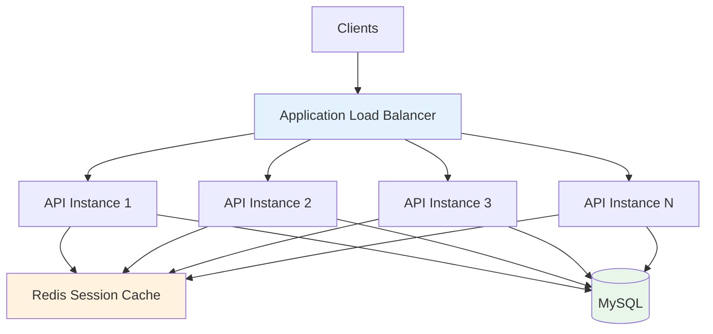
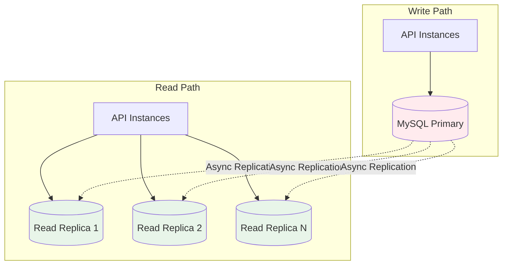
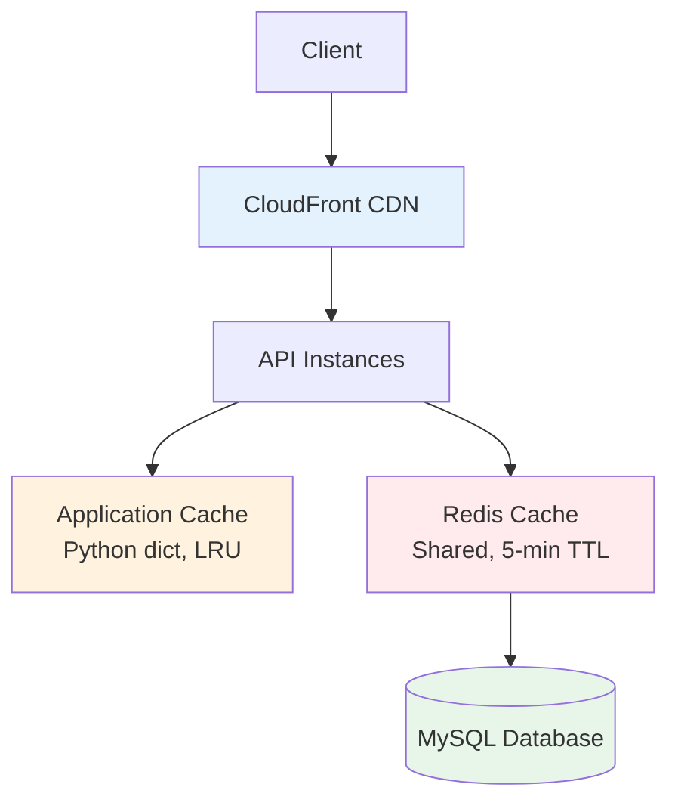
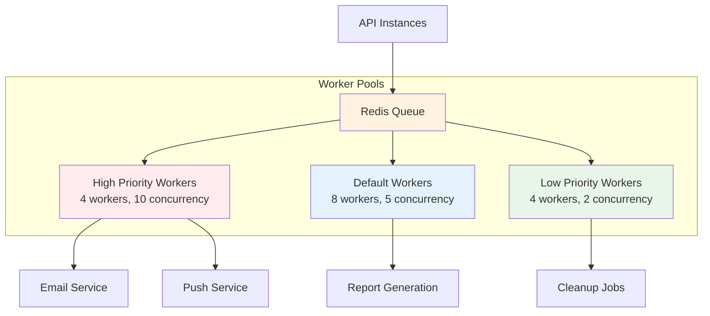

# Scalability Patterns

**Version**: 1.0.0  
**Last Updated**: 2025-10-30  
**Status**: Active

## Overview

This document defines scalability patterns and strategies for the Task Management System to handle growing user loads, data volumes, and concurrent operations without performance degradation. The architecture is designed to scale from 1,000 to 100,000+ users.

---

## Scalability Principles

### Core Principles

1. **Horizontal over Vertical**: Scale by adding instances rather than upgrading hardware
2. **Stateless Design**: Enable any instance to handle any request
3. **Eventual Consistency**: Accept temporary inconsistency for performance
4. **Async Processing**: Offload non-critical work to background jobs
5. **Caching First**: Cache aggressively with smart invalidation

---

## Horizontal Scaling

### Stateless API Design

**Principle**: API instances store no session state, enabling load balancing across any instance.

**Implementation**:



**Key Patterns**:

```python
# ❌ Bad: Stateful design (instance-specific state)
class TaskController:
    def __init__(self):
        self.user_cache = {}  # Instance-specific cache

    def get_tasks(self, user_id: UUID):
        if user_id not in self.user_cache:
            self.user_cache[user_id] = self.load_user(user_id)
        # This breaks if next request goes to different instance

# ✅ Good: Stateless design (shared cache)
class TaskController:
    def __init__(self, cache: RedisCache):
        self.cache = cache  # Shared across all instances

    def get_tasks(self, user_id: UUID):
        user = self.cache.get(f"user:{user_id}")
        if not user:
            user = self.load_user(user_id)
            self.cache.set(f"user:{user_id}", user, ttl=300)
```

**Auto-Scaling Configuration**:

```yaml
# ECS Service Auto-Scaling
scaling:
  min_instances: 2
  max_instances: 20
  target_cpu_utilization: 70%
  target_memory_utilization: 80%
  scale_up_cooldown: 60s
  scale_down_cooldown: 300s

  # Metrics-based scaling
  custom_metrics:
    - metric: RequestCount
      threshold: 10000
      action: scale_up
    - metric: ResponseTime_p95
      threshold: 500ms
      action: scale_up
```

**Load Balancing Strategy**:

| Strategy              | Use Case                   | Configuration   |
| --------------------- | -------------------------- | --------------- |
| **Round Robin**       | Default for stateless APIs | ALB default     |
| **Least Connections** | Variable request durations | ALB algorithm   |
| **Sticky Sessions**   | Legacy compatibility only  | Not recommended |

---

### Database Read Replicas

**Principle**: Separate read and write workloads to scale read capacity independently.

**Architecture**:



**Read/Write Splitting**:

```python
class DatabaseRouter:
    """Route queries to appropriate database"""

    def __init__(self, primary: Connection, replicas: List[Connection]):
        self._primary = primary
        self._replicas = replicas
        self._replica_index = 0

    def get_connection(self, operation: str) -> Connection:
        if operation in ['INSERT', 'UPDATE', 'DELETE']:
            return self._primary  # All writes to primary
        else:
            # Round-robin reads across replicas
            replica = self._replicas[self._replica_index]
            self._replica_index = (self._replica_index + 1) % len(self._replicas)
            return replica

# Repository implementation
class SqlAlchemyTaskRepository:
    def get_by_id(self, task_id: UUID) -> Optional[Task]:
        # Read from replica
        session = self.session_factory(bind=self.read_connection)
        model = session.query(TaskModel).filter_by(task_id=task_id).first()
        return self.mapper.to_entity(model) if model else None

    def save(self, task: Task) -> None:
        # Write to primary
        session = self.session_factory(bind=self.write_connection)
        model = self.mapper.to_model(task)
        session.add(model)
        session.commit()
```

**Replication Lag Handling**:

```python
class ConsistencyManager:
    """Handle read-after-write consistency"""

    def write_and_read(self, task: Task, user_id: UUID) -> Task:
        # 1. Write to primary
        self.task_repo.save(task)

        # 2. Store write timestamp
        self.cache.set(
            f"last_write:{user_id}:{task.task_id}",
            datetime.now(),
            ttl=5
        )

        # 3. Read from primary if recent write
        if self._has_recent_write(user_id, task.task_id):
            return self.task_repo.get_by_id_from_primary(task.task_id)
        else:
            return self.task_repo.get_by_id(task.task_id)  # Read from replica
```

**Scaling Strategy**:

| User Load      | Primary          | Read Replicas    | Total Capacity |
| -------------- | ---------------- | ---------------- | -------------- |
| 0-10K users    | 1x db.r5.large   | 0                | 1,000 QPS      |
| 10K-50K users  | 1x db.r5.xlarge  | 2x db.r5.large   | 5,000 QPS      |
| 50K-100K users | 1x db.r5.2xlarge | 4x db.r5.xlarge  | 15,000 QPS     |
| 100K+ users    | 1x db.r5.4xlarge | 6x db.r5.2xlarge | 30,000+ QPS    |

---

## Vertical Scaling

### Database Instance Sizing

**Principle**: Scale database resources when horizontal scaling reaches limits.

**RDS Instance Types**:

| Instance Type | vCPU | RAM    | Network       | Use Case       |
| ------------- | ---- | ------ | ------------- | -------------- |
| db.r5.large   | 2    | 16 GB  | Up to 10 Gbps | Dev/Test       |
| db.r5.xlarge  | 4    | 32 GB  | Up to 10 Gbps | 0-10K users    |
| db.r5.2xlarge | 8    | 64 GB  | Up to 10 Gbps | 10K-50K users  |
| db.r5.4xlarge | 16   | 128 GB | 10 Gbps       | 50K-100K users |
| db.r5.8xlarge | 32   | 256 GB | 10 Gbps       | 100K+ users    |

**Scaling Triggers**:

```python
class DatabaseMonitor:
    """Monitor database metrics and alert on thresholds"""

    def check_scaling_needs(self) -> Optional[str]:
        metrics = self.get_rds_metrics()

        # CPU utilization > 80% for 15 minutes
        if metrics.cpu_utilization > 80:
            return "SCALE_UP: CPU utilization high"

        # Connection count > 80% of max
        if metrics.connections / metrics.max_connections > 0.8:
            return "SCALE_UP: Connection pool exhausted"

        # Read IOPS > 80% of provisioned
        if metrics.read_iops / metrics.provisioned_iops > 0.8:
            return "SCALE_UP: IOPS limit reached"

        # Storage > 85% full
        if metrics.storage_used / metrics.storage_total > 0.85:
            return "SCALE_UP: Storage nearly full"

        return None
```

**Downtime-Free Scaling**:

```yaml
# Blue-Green Deployment for Database Upgrades
1. Create new RDS instance (larger size)
2. Set up replication from current primary
3. Wait for replication lag = 0
4. Switch application to new instance (DNS update)
5. Monitor for issues
6. Decommission old instance after 24 hours
```

---

## Caching Strategy

### Multi-Layer Caching



### Layer 1: Application Cache (In-Memory)

**Purpose**: Ultra-fast access for hot data (< 1ms)

**Implementation**:

```python
from functools import lru_cache
from typing import Optional

class ApplicationCache:
    """In-memory LRU cache per API instance"""

    @lru_cache(maxsize=1000)
    def get_user_permissions(self, user_id: UUID) -> List[str]:
        # Cache hot data in process memory
        return self.permission_service.get_permissions(user_id)

    # Cache automatically evicts least recently used items

# Usage
@app.middleware("http")
async def cache_user_context(request: Request, call_next):
    user_id = extract_user_id(request)
    if user_id:
        # Cached after first call
        request.state.permissions = app_cache.get_user_permissions(user_id)

    return await call_next(request)
```

**Characteristics**:

- ✅ Sub-millisecond access time
- ✅ No network overhead
- ❌ Not shared across instances
- ❌ Lost on instance restart

### Layer 2: Distributed Cache (Redis)

**Purpose**: Shared cache across all API instances (1-5ms)

**Cache Patterns**:

| Data Type         | TTL    | Eviction Policy       | Size Limit     |
| ----------------- | ------ | --------------------- | -------------- |
| User sessions     | 15 min | Time-based            | 10 MB/user     |
| User profiles     | 5 min  | Write-through         | 50 KB/user     |
| Project metadata  | 5 min  | Write-through         | 100 KB/project |
| Task lists        | 1 min  | Write-through + event | 500 KB/project |
| Permission checks | 5 min  | Event-based           | 10 KB/user     |
| API rate limits   | 1 min  | Time-based            | 1 KB/user      |

**Implementation**:

```python
class RedisCache:
    """Distributed cache with smart invalidation"""

    def get_task_list(self, project_id: UUID) -> Optional[List[TaskDTO]]:
        # Try cache first
        key = f"tasks:project:{project_id}"
        cached = self.redis.get(key)

        if cached:
            self.metrics.increment('cache_hit', tags=['resource:task_list'])
            return json.loads(cached)

        # Cache miss - load from database
        self.metrics.increment('cache_miss', tags=['resource:task_list'])
        tasks = self.task_repo.list_by_project(project_id)

        # Cache for 1 minute
        self.redis.setex(key, 60, json.dumps(tasks))

        return tasks

    def invalidate_task_list(self, project_id: UUID) -> None:
        """Invalidate on task create/update/delete"""
        key = f"tasks:project:{project_id}"
        self.redis.delete(key)
```

**Cache Invalidation Strategies**:

```python
# 1. Time-based (TTL)
redis.setex("user:123", 300, user_data)  # Expires after 5 minutes

# 2. Write-through (immediate update)
def update_user(user: User) -> None:
    db.update(user)
    cache.set(f"user:{user.id}", user, ttl=300)

# 3. Event-based (on domain events)
class TaskEventHandler:
    def handle_task_created(self, event: TaskCreatedEvent):
        # Invalidate project task list
        self.cache.delete(f"tasks:project:{event.project_id}")

        # Invalidate user task count
        self.cache.delete(f"tasks:user:{event.created_by}:count")

# 4. Pattern-based (bulk invalidation)
def invalidate_user_caches(user_id: UUID):
    pattern = f"user:{user_id}:*"
    keys = cache.keys(pattern)
    cache.delete(*keys)
```

### Cache Warming

**Purpose**: Pre-populate cache before traffic spike

```python
class CacheWarmer:
    """Pre-populate cache during deployment"""

    async def warm_caches(self) -> None:
        # 1. Active users (logged in last 24 hours)
        active_users = await self.user_repo.get_active_users(since=yesterday())

        for user in active_users:
            # Cache user profile
            self.cache.set(f"user:{user.id}", user, ttl=300)

            # Cache user permissions
            permissions = await self.authz.get_permissions(user.id)
            self.cache.set(f"permissions:{user.id}", permissions, ttl=300)

        # 2. Active projects (updated last 7 days)
        active_projects = await self.project_repo.get_active_projects(since=days_ago(7))

        for project in active_projects:
            # Cache project metadata
            self.cache.set(f"project:{project.id}", project, ttl=300)

            # Cache project task counts
            count = await self.task_repo.count_by_project(project.id)
            self.cache.set(f"project:{project.id}:task_count", count, ttl=60)
```

---

## Asynchronous Processing

### Celery Worker Scaling

**Architecture**:



**Queue Configuration**:

```python
# celery_config.py
from celery import Celery

app = Celery('tasks', broker='redis://localhost:6379/0')

# Queue routing
app.conf.task_routes = {
    'tasks.send_email': {'queue': 'high', 'priority': 10},
    'tasks.send_push_notification': {'queue': 'high', 'priority': 10},
    'tasks.generate_report': {'queue': 'default', 'priority': 5},
    'tasks.cleanup_old_data': {'queue': 'low', 'priority': 1},
}

# Worker auto-scaling
app.conf.worker_autoscaler = 'celery.worker.autoscale:Autoscaler'
app.conf.worker_max_tasks_per_child = 1000  # Restart worker after 1000 tasks
```

**Dynamic Scaling**:

```python
class WorkerScaler:
    """Scale workers based on queue depth"""

    def check_and_scale(self) -> None:
        queue_depths = self.get_queue_depths()

        for queue_name, depth in queue_depths.items():
            if depth > 1000:  # Queue backing up
                self.scale_up_workers(queue_name, factor=2)
            elif depth < 100:  # Queue nearly empty
                self.scale_down_workers(queue_name, factor=0.5)

    def scale_up_workers(self, queue: str, factor: float) -> None:
        current_count = self.get_worker_count(queue)
        new_count = min(int(current_count * factor), 20)  # Max 20 workers

        self.ecs_client.update_service(
            cluster='prod',
            service=f'{queue}-workers',
            desiredCount=new_count
        )

    def scale_down_workers(self, queue: str, factor: float) -> None:
        current_count = self.get_worker_count(queue)
        new_count = max(int(current_count * factor), 2)  # Min 2 workers

        self.ecs_client.update_service(
            cluster='prod',
            service=f'{queue}-workers',
            desiredCount=new_count
        )
```

### Task Retry Strategy

```python
@celery_app.task(
    bind=True,
    max_retries=3,
    default_retry_delay=60,  # 1 minute
    retry_backoff=True,
    retry_backoff_max=600,  # 10 minutes
    retry_jitter=True
)
def send_email(self, to: str, subject: str, body: str):
    try:
        email_service.send(to=to, subject=subject, body=body)
    except EmailServiceError as exc:
        # Exponential backoff: 1min, 2min, 4min
        raise self.retry(exc=exc, countdown=2 ** self.request.retries * 60)
```

---

## Database Optimization

### Connection Pooling

**Purpose**: Reuse database connections instead of creating new ones

```python
from sqlalchemy.pool import QueuePool

engine = create_engine(
    DATABASE_URL,
    poolclass=QueuePool,
    pool_size=10,              # Normal pool size
    max_overflow=20,           # Additional connections during spikes
    pool_timeout=30,           # Wait 30s for available connection
    pool_recycle=3600,         # Recycle connections after 1 hour
    pool_pre_ping=True,        # Verify connection before use
    echo_pool=True             # Log pool events
)

# Monitor pool health
def check_pool_health():
    pool = engine.pool

    metrics = {
        'size': pool.size(),
        'checked_in': pool.checkedin(),
        'checked_out': pool.checkedout(),
        'overflow': pool.overflow(),
        'utilization': pool.checkedout() / (pool.size() + pool.overflow())
    }

    if metrics['utilization'] > 0.8:
        logger.warning("Connection pool utilization high", extra=metrics)
```

### Query Optimization

**N+1 Query Problem**:

```python
# ❌ Bad: N+1 queries (1 + N)
def get_tasks_with_assignees(project_id: UUID) -> List[TaskDTO]:
    tasks = db.query(Task).filter_by(project_id=project_id).all()  # 1 query

    for task in tasks:
        task.assignee = db.query(User).filter_by(user_id=task.assignee_id).first()  # N queries

    return tasks

# ✅ Good: Single query with JOIN
def get_tasks_with_assignees(project_id: UUID) -> List[TaskDTO]:
    tasks = (
        db.query(Task)
        .options(joinedload(Task.assignee))  # Eager load
        .filter_by(project_id=project_id)
        .all()
    )
    return tasks  # 1 query total
```

---

## Scaling Metrics

### Key Performance Indicators

| Metric                      | Current | Target (1 year) | Scaling Plan                 |
| --------------------------- | ------- | --------------- | ---------------------------- |
| **Concurrent Users**        | 100     | 10,000          | Horizontal API scaling       |
| **API Requests/sec**        | 50      | 5,000           | Load balancer + auto-scaling |
| **Database QPS**            | 500     | 15,000          | Read replicas + caching      |
| **Task Queue Depth**        | < 100   | < 1,000         | Worker auto-scaling          |
| **Cache Hit Rate**          | 85%     | 95%             | Cache warming + tuning       |
| **API Response Time (p95)** | 200ms   | < 500ms         | Caching + optimization       |

---

## Related Documents

- [Performance Targets](./performance.md)
- [Caching Strategy](./caching.md)
- [Database Optimization](./database-optimization.md)
- [Capacity Planning](./capacity-planning.md)
- [System Architecture](./diagrams/01-system-overview.md)

---

**Last Reviewed**: 2025-10-30  
**Next Review**: 2026-01-30 (Quarterly)
