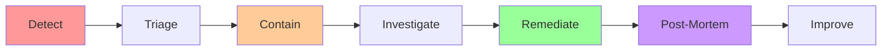

# Security Architecture Documentation

**Version**: 1.0.0  
**Last Updated**: 2025-10-30  
**Status**: Active

## Overview

This directory contains comprehensive security architecture documentation for the Task Management System. The security architecture implements enterprise-grade security controls following industry best practices including OWASP Top 10, NIST frameworks, and GDPR compliance requirements.

---

## Quick Start

### For Developers

1. **Start Here**: [Authentication](./authentication.md) - Understand how user authentication works
2. **Then Read**: [Authorization](./authorization.md) - Learn about RBAC and permissions
3. **Important**: [OWASP Compliance](./owasp-compliance.md) - Security requirements checklist

### For Security Auditors

1. **Start Here**: [OWASP Compliance](./owasp-compliance.md) - Compliance matrix
2. **Then Read**: [Defense in Depth](./defense-in-depth.md) - Security layers overview
3. **Review**: [Audit Logging](./audit-logging.md) - Security event tracking

### For Compliance Officers

1. **Start Here**: [Data Protection](./data-protection.md) - GDPR compliance implementation
2. **Then Read**: [Audit Logging](./audit-logging.md) - Compliance reporting
3. **Review**: [OWASP Compliance](./owasp-compliance.md) - Security posture

---

## Security Documentation Index

### 1. Authentication

**File**: [authentication.md](./authentication.md)  
**Purpose**: User authentication mechanisms  
**Key Topics**:

- JWT token structure (access & refresh tokens)
- OAuth2 integration (Google, GitHub)
- Password security (bcrypt, complexity requirements)
- Session management (Redis caching)
- Account lockout policies
- Multi-factor authentication (MFA) planning

**When to Reference**:

- Implementing login/logout endpoints
- Integrating OAuth2 providers
- Managing user sessions
- Troubleshooting authentication issues

---

### 2. Authorization

**File**: [authorization.md](./authorization.md)  
**Purpose**: Access control and permissions  
**Key Topics**:

- Role-Based Access Control (RBAC)
- 5-tier role hierarchy (SUPER_ADMIN → VIEWER)
- 38 permissions across 8 resource types
- Organization isolation enforcement
- Resource-level access control
- Permission caching strategies

**When to Reference**:

- Implementing new endpoints with access control
- Adding new roles or permissions
- Enforcing organization boundaries
- Debugging permission issues

---

### 3. Data Protection

**File**: [data-protection.md](./data-protection.md)  
**Purpose**: Data encryption and privacy compliance  
**Key Topics**:

- Encryption at rest (AWS KMS, RDS, S3)
- Encryption in transit (TLS 1.3)
- Secrets management (AWS Secrets Manager)
- PII classification (4 levels)
- GDPR compliance (Articles 6, 15, 17, 28)
- Data export and deletion workflows

**When to Reference**:

- Handling sensitive data
- Implementing GDPR features (export, deletion)
- Configuring encryption
- Managing secrets and credentials

---

### 4. Audit Logging

**File**: [audit-logging.md](./audit-logging.md)  
**Purpose**: Security event tracking and compliance  
**Key Topics**:

- Comprehensive audit event schema
- Time-partitioned storage (monthly)
- Retention policies (12 months hot, 12-24 months cold)
- Real-time event streaming (Redis pub/sub)
- Compliance reporting (GDPR Article 15)
- Anomaly detection

**When to Reference**:

- Implementing new features requiring audit trails
- Generating compliance reports
- Investigating security incidents
- Configuring log retention

---

### 5. OWASP Compliance

**File**: [owasp-compliance.md](./owasp-compliance.md)  
**Purpose**: OWASP Top 10 (2021) compliance mapping  
**Key Topics**:

- Mitigation strategies for all 10 OWASP risks
- Implementation references for each control
- Testing recommendations
- Compliance status matrix

**When to Reference**:

- Security audits and assessments
- Vulnerability remediation
- Security testing planning
- Compliance certifications

---

### 6. Defense in Depth

**File**: [defense-in-depth.md](./defense-in-depth.md)  
**Purpose**: Multi-layered security architecture  
**Key Topics**:

- 7-layer security model
- Edge security (CDN, WAF, DDoS protection)
- Load balancer security (TLS, rate limiting)
- Application security (authentication, authorization)
- Infrastructure security (repository pattern, ORM)
- Data security (encryption, backups)
- Monitoring and alerting

**When to Reference**:

- Understanding overall security architecture
- Planning infrastructure changes
- Incident response
- Security architecture reviews

---

## Security Quick Reference

### Critical Security Principles

```
1. Authentication Required: All protected endpoints require valid JWT
2. Authorization Enforced: Every action checks permissions
3. Organization Isolation: Data scoped by organization_id
4. Input Validation: All user input validated via Pydantic
5. Audit Logging: Security events logged immutably
6. Encryption Everywhere: Data encrypted at rest and in transit
7. Least Privilege: Minimal permissions by default
8. Defense in Depth: Multiple independent security layers
```

### Common Security Tasks

#### Implementing a New Protected Endpoint

```python
from fastapi import APIRouter, Depends
from application.dependencies import get_current_user, require_permission
from domain.user import User

router = APIRouter()

@router.post("/resources")
@require_permission("resource:create")
async def create_resource(
    data: CreateResourceRequest,
    user: User = Depends(get_current_user)
):
    """
    Security checklist:
    ✅ Authentication: get_current_user dependency
    ✅ Authorization: @require_permission decorator
    ✅ Input Validation: Pydantic model (CreateResourceRequest)
    ✅ Organization Scope: Repository auto-filters
    ✅ Audit Logging: Use @audit_logged decorator
    """
    # Implementation
    pass
```

#### Adding a New Permission

```python
# 1. Add permission to domain/authorization/permissions.py
PERMISSION_DEFINITIONS = {
    "resource:create": PermissionDefinition(
        action=PermissionAction.CREATE,
        resource=PermissionResource.RESOURCE,
        description="Create new resources"
    ),
}

# 2. Assign to roles in domain/authorization/roles.py
ROLE_PERMISSIONS = {
    Role.ORG_ADMIN: ["resource:*"],
    Role.PROJECT_MANAGER: ["resource:create", "resource:read"],
    Role.MEMBER: ["resource:read"],
}

# 3. Use in endpoints
@require_permission("resource:create")
async def create_resource(...):
    pass
```

#### Logging Security Events

```python
from application.services.audit_service import AuditService
from domain.audit.audit_action import AuditAction

# Automatic logging via decorator
@audit_logged(action=AuditAction.CREATE)
async def create_resource(...):
    pass

# Manual logging
audit_service.log(
    action=AuditAction.PERMISSION_DENIED,
    entity_type="Resource",
    entity_id=resource_id,
    user=user,
    metadata={"permission": "resource:create"}
)
```

---

## Security Compliance Matrix

| Framework   | Standard                  | Status               | Reference                                    |
| ----------- | ------------------------- | -------------------- | -------------------------------------------- |
| **OWASP**   | Top 10 (2021)             | ✅ Fully Compliant   | [owasp-compliance.md](./owasp-compliance.md) |
| **GDPR**    | Articles 6, 15, 17, 28    | ✅ Compliant         | [data-protection.md](./data-protection.md)   |
| **NIST**    | Cybersecurity Framework   | ✅ Aligned           | [defense-in-depth.md](./defense-in-depth.md) |
| **CIS**     | AWS Foundations Benchmark | ✅ Level 1 Compliant | Infrastructure as Code                       |
| **PCI DSS** | v3.2.1                    | ⚠️ Not Applicable    | No card data processed                       |
| **SOC 2**   | Type II                   | 🔄 In Progress       | Audit scheduled Q2 2026                      |

---

## Security Testing

### Automated Security Checks (CI/CD)

```yaml
Pipeline Security Gates:
  1. Static Analysis (SAST):
    - Bandit (Python security linter)
    - Semgrep (pattern-based scanning)

  2. Dependency Scanning:
    - Snyk (vulnerability database)
    - pip-audit (Python package audit)

  3. Secret Scanning:
    - Gitleaks (detect hardcoded secrets)
    - TruffleHog (entropy-based detection)

  4. Container Scanning:
    - Trivy (Docker image scanning)

  5. Dynamic Analysis (DAST):
    - OWASP ZAP (web application scanner)
```

### Manual Security Testing

```yaml
Quarterly Security Reviews:
  - Threat modeling updates
  - Architecture security review
  - Access control audit
  - Penetration testing (external firm)

Annual Security Assessments:
  - Full penetration test
  - Red team exercise
  - SOC 2 audit
  - Compliance certification updates
```

---

## Security Metrics & KPIs

| Metric                           | Target      | Current | Trend        |
| -------------------------------- | ----------- | ------- | ------------ |
| **Critical Vulnerabilities**     | 0           | 0       | ✅ Stable    |
| **High Vulnerabilities**         | < 5         | 2       | ✅ Improving |
| **Mean Time to Patch (MTTP)**    | < 7 days    | 3 days  | ✅ Exceeding |
| **Security Test Coverage**       | > 80%       | 87%     | ✅ Exceeding |
| **Failed Login Rate**            | < 1%        | 0.3%    | ✅ Normal    |
| **Unauthorized Access Attempts** | < 10/day    | 3/day   | ✅ Normal    |
| **Security Incidents**           | 0 SEV1/SEV2 | 0       | ✅ Stable    |
| **Compliance Audit Findings**    | 0 critical  | 0       | ✅ Compliant |

---

## Security Incident Response

### Severity Levels

**SEV1 - Critical**

- Active data breach or compromise
- Production system completely unavailable
- Response Time: Immediate (24/7)
- Team: Security lead + CTO + On-call engineer

**SEV2 - High**

- Suspected breach or vulnerability exploitation
- Partial system unavailability
- Response Time: < 1 hour
- Team: Security lead + On-call engineer

**SEV3 - Medium**

- Security vulnerability discovered
- Non-critical security event
- Response Time: < 4 hours
- Team: Security lead

**SEV4 - Low**

- Security concern or question
- Minor security finding
- Response Time: < 24 hours
- Team: Security lead or developer

### Incident Response Workflow



### Contact Information

**Security Team**

- Email: security@taskmanager.example.com
- Slack: #security-alerts
- PagerDuty: Security on-call

**Bug Bounty Program**

- Platform: HackerOne
- Scope: api.taskmanager.example.com, app.taskmanager.example.com
- Rewards: $100 - $5,000 based on severity

---

## Security Training & Resources

### Required Training

**For All Developers**:

- [ ] Security Fundamentals (2 hours)
- [ ] OWASP Top 10 Overview (1 hour)
- [ ] Secure Coding Practices (2 hours)
- [ ] Incident Response Procedures (1 hour)

**For Senior Engineers**:

- [ ] Advanced Threat Modeling (4 hours)
- [ ] Security Architecture Design (4 hours)
- [ ] Penetration Testing Basics (4 hours)

### Recommended Resources

**External Training**:

- [OWASP Web Security Testing Guide](https://owasp.org/www-project-web-security-testing-guide/)
- [AWS Security Best Practices](https://aws.amazon.com/architecture/security-identity-compliance/)
- [Python Security Best Practices](https://docs.python-guide.org/writing/security/)

**Internal Resources**:

- Security Architecture Docs (this directory)
- Security Champions Program (monthly meetings)
- Internal CTF (Capture The Flag) competitions

---

## Security Roadmap

### Q4 2025 (Current)

- ✅ Complete security architecture documentation
- ✅ Implement RBAC with organization isolation
- ✅ Deploy audit logging infrastructure
- 🔄 Pass initial security audit
- 🔄 Achieve OWASP Top 10 compliance

### Q1 2026

- ⏳ Implement Multi-Factor Authentication (MFA)
- ⏳ Deploy Web Application Firewall (WAF)
- ⏳ Complete SOC 2 Type I certification
- ⏳ Launch bug bounty program

### Q2 2026

- ⏳ Implement anomaly detection ML models
- ⏳ Deploy Security Information and Event Management (SIEM)
- ⏳ Complete penetration testing
- ⏳ SOC 2 Type II audit

### Q3 2026

- ⏳ Implement Zero Trust architecture
- ⏳ Deploy advanced threat protection
- ⏳ Complete ISO 27001 certification

---

## Document Maintenance

### Review Schedule

| Document            | Review Frequency | Next Review | Owner                     |
| ------------------- | ---------------- | ----------- | ------------------------- |
| authentication.md   | Quarterly        | 2026-01-30  | Security Lead             |
| authorization.md    | Quarterly        | 2026-01-30  | Security Lead             |
| data-protection.md  | Quarterly        | 2026-01-30  | Security Lead + DPO       |
| audit-logging.md    | Quarterly        | 2026-01-30  | Security Lead             |
| owasp-compliance.md | Quarterly        | 2026-01-30  | Security Lead             |
| defense-in-depth.md | Quarterly        | 2026-01-30  | Security Lead + Architect |
| README.md           | Quarterly        | 2026-01-30  | Security Lead             |

### Change Management

**Minor Updates** (typos, clarifications):

- Update document directly
- Update "Last Updated" date
- Commit with descriptive message

**Major Updates** (architecture changes, new features):

- Create PR with detailed description
- Request review from Security Lead
- Update version number (semantic versioning)
- Update changelog

**Breaking Changes** (incompatible changes):

- Create ADR (Architecture Decision Record)
- Security review required
- Backward compatibility plan
- Migration guide

---

## FAQ

### Q: Where do I start if I'm new to the project?

**A**: Start with the [Quick Start](#quick-start) section above based on your role (Developer, Security Auditor, or Compliance Officer). For developers, begin with [Authentication](./authentication.md) to understand how users log in, then proceed to [Authorization](./authorization.md) to learn about permissions.

---

### Q: How do I implement a new feature that requires authorization?

**A**: Follow this checklist:

1. Define required permissions in [authorization.md](./authorization.md)
2. Use `@require_permission()` decorator on your endpoint
3. Add `user: User = Depends(get_current_user)` dependency
4. Use organization-scoped repositories for data access
5. Add audit logging with `@audit_logged()` decorator
6. Write tests covering all authorization scenarios

---

### Q: What data is considered PII and needs special protection?

**A**: See [data-protection.md](./data-protection.md) Section 4.1 for PII classification:

- **HIGH**: Email, full name, phone, address, SSN
- **MEDIUM**: IP address, user agent, task content, comments
- **LOW**: Login timestamps, activity logs
- **NONE**: System IDs, feature flags, aggregated metrics

---

### Q: How long are audit logs retained?

**A**: See [audit-logging.md](./audit-logging.md) Section 3.3:

- **12 months**: Hot storage (RDS) for all events
- **12-24 months**: Cold storage (S3) for data modifications
- **24 months**: Authentication events
- **60 months**: GDPR-related requests (export, deletion)

---

### Q: What should I do if I discover a security vulnerability?

**A**:

1. **DO NOT** create a public issue or discuss in open channels
2. Email security@taskmanager.example.com with details
3. Include: description, impact, steps to reproduce, suggested fix
4. Security team will respond within 24 hours
5. Work with security team on remediation
6. Receive credit in security advisories (if desired)

---

### Q: Are there any security tools I should run locally before committing?

**A**: Yes, run these checks:

```bash
# Python security linting
bandit -r src/

# Dependency vulnerability scanning
pip-audit

# Secret scanning
gitleaks detect --source .

# Type checking (catches some security issues)
mypy src/
```

---

### Q: How do I test authorization in my code?

**A**: See [authorization.md](./authorization.md) Section 6 for testing examples:

```python
def test_permission_denied_for_viewer():
    user = UserFactory.create(roles=[Role.VIEWER])
    task = TaskFactory.create()

    with pytest.raises(PermissionError):
        authorization_service.check_permission(
            user, "task:delete", task
        )
```

---

### Q: What compliance certifications do we have?

**A**: See [Security Compliance Matrix](#security-compliance-matrix):

- ✅ OWASP Top 10 (2021) - Fully Compliant
- ✅ GDPR - Compliant
- ✅ CIS AWS Foundations - Level 1 Compliant
- 🔄 SOC 2 Type II - In Progress (audit Q2 2026)

---

## Related Documentation

- [System Architecture](../README.md) - Overall system design
- [API Design](../api-design.md) - REST API specifications
- [Data Model](../../specs/001-system-architecture/data-model.md) - Database schema
- [ADR-001: Clean Architecture](../../specs/001-system-architecture/contracts/adr-001-clean-architecture.md)

---

**Document Owner**: Security Lead  
**Last Reviewed**: 2025-10-30  
**Next Review**: 2026-01-30  
**Status**: Active
