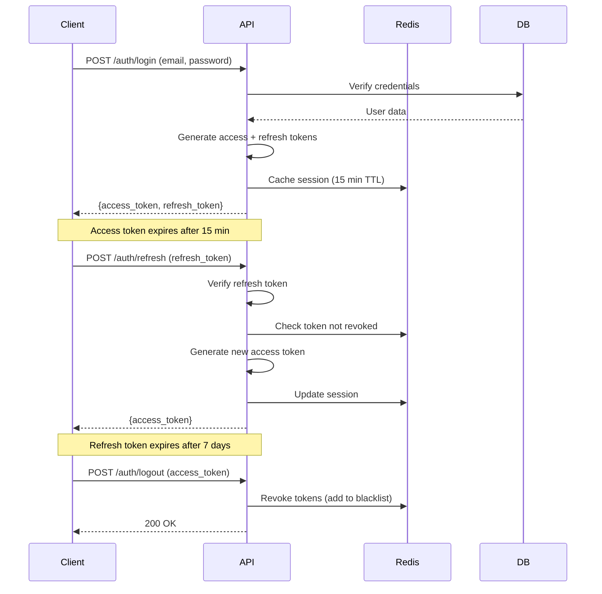
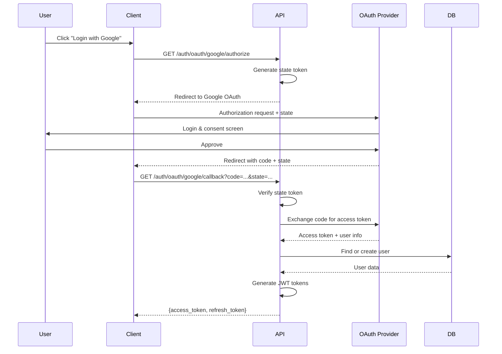

# Authentication

**Version**: 1.0.0  
**Last Updated**: 2025-10-30  
**Status**: Active

## Overview

This document defines authentication mechanisms for the Task Management System, including JWT-based authentication, OAuth2 integration, password security, session management, and future multi-factor authentication (MFA) support.

---

## Authentication Principles

### Core Principles

1. **Defense in Depth**: Multiple layers of authentication security
2. **Least Privilege**: Grant minimum necessary access
3. **Secure by Default**: Safe defaults, opt-in for relaxed security
4. **Zero Trust**: Verify every request, never assume trust
5. **Auditability**: Log all authentication events

---

## Authentication Flow

### Primary Authentication Methods

| Method               | Use Case            | Security Level       | Implementation Status |
| -------------------- | ------------------- | -------------------- | --------------------- |
| **Email + Password** | Standard login      | Medium (with bcrypt) | ✅ Production         |
| **OAuth2 (Google)**  | Social login        | High (delegated)     | ✅ Production         |
| **OAuth2 (GitHub)**  | Developer login     | High (delegated)     | ✅ Production         |
| **API Key**          | Programmatic access | Medium               | 🔄 Planned Phase 2    |
| **MFA (TOTP)**       | Enhanced security   | High                 | 🔄 Planned Phase 3    |
| **SSO (SAML)**       | Enterprise login    | High                 | 🔄 Planned Enterprise |

---

## JWT Token Authentication

### Token Structure

**Access Token** (short-lived, 15 minutes):

```json
{
  "header": {
    "alg": "HS256",
    "typ": "JWT"
  },
  "payload": {
    "sub": "user-uuid-123",
    "email": "user@example.com",
    "organization_id": "org-uuid-456",
    "roles": ["ORG_ADMIN", "PROJECT_MANAGER"],
    "permissions": ["project:create", "task:write", "user:read"],
    "iat": 1698675000,
    "exp": 1698675900,
    "jti": "token-id-789"
  },
  "signature": "HMACSHA256(...)"
}
```

**Refresh Token** (long-lived, 7 days):

```json
{
  "header": {
    "alg": "HS256",
    "typ": "JWT"
  },
  "payload": {
    "sub": "user-uuid-123",
    "type": "refresh",
    "iat": 1698675000,
    "exp": 1699279800,
    "jti": "refresh-token-id-999"
  },
  "signature": "HMACSHA256(...)"
}
```

### Token Lifecycle



### Implementation

```python
from datetime import datetime, timedelta
from typing import Optional
import jwt
from passlib.context import CryptContext
from uuid import uuid4

class AuthenticationService:
    """Handle JWT authentication"""

    def __init__(self, secret_key: str, redis_client):
        self.secret_key = secret_key
        self.redis = redis_client
        self.pwd_context = CryptContext(schemes=["bcrypt"], deprecated="auto")
        self.algorithm = "HS256"
        self.access_token_expire_minutes = 15
        self.refresh_token_expire_days = 7

    def create_access_token(self, user: User) -> str:
        """Generate JWT access token"""
        now = datetime.utcnow()

        payload = {
            "sub": str(user.user_id),
            "email": user.email,
            "organization_id": str(user.organization_id),
            "roles": user.roles,
            "permissions": user.get_permissions(),
            "iat": now,
            "exp": now + timedelta(minutes=self.access_token_expire_minutes),
            "jti": str(uuid4())
        }

        token = jwt.encode(payload, self.secret_key, algorithm=self.algorithm)

        # Cache session in Redis
        self._cache_session(token, user)

        return token

    def create_refresh_token(self, user: User) -> str:
        """Generate JWT refresh token"""
        now = datetime.utcnow()

        payload = {
            "sub": str(user.user_id),
            "type": "refresh",
            "iat": now,
            "exp": now + timedelta(days=self.refresh_token_expire_days),
            "jti": str(uuid4())
        }

        token = jwt.encode(payload, self.secret_key, algorithm=self.algorithm)

        # Store refresh token in database for revocation tracking
        self._store_refresh_token(user.user_id, payload["jti"], payload["exp"])

        return token

    def verify_access_token(self, token: str) -> Optional[dict]:
        """Verify and decode access token"""
        try:
            # Check Redis blacklist first (revoked tokens)
            if self._is_token_revoked(token):
                return None

            # Decode and verify token
            payload = jwt.decode(
                token,
                self.secret_key,
                algorithms=[self.algorithm]
            )

            return payload

        except jwt.ExpiredSignatureError:
            raise AuthenticationError("Token expired")
        except jwt.InvalidTokenError:
            raise AuthenticationError("Invalid token")

    def verify_refresh_token(self, token: str) -> Optional[dict]:
        """Verify refresh token and check revocation"""
        try:
            payload = jwt.decode(
                token,
                self.secret_key,
                algorithms=[self.algorithm]
            )

            if payload.get("type") != "refresh":
                raise AuthenticationError("Not a refresh token")

            # Check if refresh token was revoked
            if self._is_refresh_token_revoked(payload["jti"]):
                raise AuthenticationError("Refresh token revoked")

            return payload

        except jwt.ExpiredSignatureError:
            raise AuthenticationError("Refresh token expired")
        except jwt.InvalidTokenError:
            raise AuthenticationError("Invalid refresh token")

    def refresh_access_token(self, refresh_token: str) -> str:
        """Generate new access token from refresh token"""
        payload = self.verify_refresh_token(refresh_token)
        user_id = payload["sub"]

        # Load user from database
        user = self.user_repository.get_by_id(user_id)
        if not user or user.status != "ACTIVE":
            raise AuthenticationError("User not found or inactive")

        # Generate new access token
        return self.create_access_token(user)

    def revoke_tokens(self, access_token: str, user_id: str) -> None:
        """Revoke access token and all refresh tokens for user"""
        # Add access token to blacklist (expires with token TTL)
        token_ttl = self.access_token_expire_minutes * 60
        self.redis.setex(f"revoked:access:{access_token}", token_ttl, "1")

        # Revoke all refresh tokens for user
        self.redis.sadd(f"revoked:refresh:user:{user_id}", str(datetime.utcnow()))

    def _cache_session(self, token: str, user: User) -> None:
        """Cache user session in Redis"""
        session_key = f"session:{token}"
        session_data = {
            "user_id": str(user.user_id),
            "organization_id": str(user.organization_id),
            "email": user.email,
            "roles": user.roles,
            "permissions": user.get_permissions(),
            "last_activity": datetime.utcnow().isoformat()
        }

        ttl = self.access_token_expire_minutes * 60
        self.redis.setex(session_key, ttl, json.dumps(session_data))

    def _is_token_revoked(self, token: str) -> bool:
        """Check if access token is blacklisted"""
        return self.redis.exists(f"revoked:access:{token}")

    def _is_refresh_token_revoked(self, jti: str) -> bool:
        """Check if refresh token is revoked"""
        return self.db.query(RevokedToken).filter_by(jti=jti).first() is not None
```

---

## Password Authentication

### Password Security

**Hashing**: bcrypt with cost factor 12 (2^12 = 4096 rounds)

**Requirements**:

- Minimum 8 characters
- At least one uppercase letter
- At least one lowercase letter
- At least one digit
- At least one special character
- Not in common password list (top 10K)

### Implementation

```python
from passlib.context import CryptContext
import re

class PasswordService:
    """Password hashing and validation"""

    def __init__(self):
        self.pwd_context = CryptContext(
            schemes=["bcrypt"],
            deprecated="auto",
            bcrypt__rounds=12  # Cost factor
        )

    def hash_password(self, password: str) -> str:
        """Hash password with bcrypt"""
        self.validate_password(password)
        return self.pwd_context.hash(password)

    def verify_password(self, plain_password: str, hashed_password: str) -> bool:
        """Verify password against hash"""
        return self.pwd_context.verify(plain_password, hashed_password)

    def validate_password(self, password: str) -> None:
        """Validate password meets complexity requirements"""
        if len(password) < 8:
            raise ValidationError("Password must be at least 8 characters")

        if not re.search(r"[A-Z]", password):
            raise ValidationError("Password must contain uppercase letter")

        if not re.search(r"[a-z]", password):
            raise ValidationError("Password must contain lowercase letter")

        if not re.search(r"\d", password):
            raise ValidationError("Password must contain digit")

        if not re.search(r"[!@#$%^&*(),.?\":{}|<>]", password):
            raise ValidationError("Password must contain special character")

        # Check against common passwords
        if self._is_common_password(password):
            raise ValidationError("Password is too common")

    def _is_common_password(self, password: str) -> bool:
        """Check if password is in common password list"""
        # Load from file or cache
        common_passwords = self._load_common_passwords()
        return password.lower() in common_passwords
```

### Login Flow

```python
class LoginUseCase:
    """Handle user login"""

    def __init__(
        self,
        user_repository: UserRepository,
        auth_service: AuthenticationService,
        password_service: PasswordService,
        audit_service: AuditService
    ):
        self.user_repo = user_repository
        self.auth_service = auth_service
        self.password_service = password_service
        self.audit_service = audit_service

    def execute(self, email: str, password: str, ip_address: str) -> dict:
        """Authenticate user and return tokens"""
        # Find user by email
        user = self.user_repo.get_by_email(email)

        if not user:
            # Log failed attempt
            self.audit_service.log_failed_login(email, ip_address, "user_not_found")
            raise AuthenticationError("Invalid credentials")

        # Check if account is locked
        if self._is_account_locked(user):
            self.audit_service.log_failed_login(email, ip_address, "account_locked")
            raise AuthenticationError("Account locked due to too many failed attempts")

        # Verify password
        if not self.password_service.verify_password(password, user.password_hash):
            # Increment failed attempts
            self._increment_failed_attempts(user)
            self.audit_service.log_failed_login(email, ip_address, "invalid_password")
            raise AuthenticationError("Invalid credentials")

        # Check if user is active
        if user.status != "ACTIVE":
            self.audit_service.log_failed_login(email, ip_address, "user_inactive")
            raise AuthenticationError("Account is not active")

        # Reset failed attempts
        self._reset_failed_attempts(user)

        # Generate tokens
        access_token = self.auth_service.create_access_token(user)
        refresh_token = self.auth_service.create_refresh_token(user)

        # Update last login
        user.last_login_at = datetime.utcnow()
        self.user_repo.save(user)

        # Log successful login
        self.audit_service.log_successful_login(user, ip_address)

        return {
            "access_token": access_token,
            "refresh_token": refresh_token,
            "token_type": "bearer",
            "expires_in": 900  # 15 minutes
        }

    def _is_account_locked(self, user: User) -> bool:
        """Check if account is temporarily locked"""
        lock_key = f"login_lock:{user.user_id}"
        return self.redis.exists(lock_key)

    def _increment_failed_attempts(self, user: User) -> None:
        """Track failed login attempts"""
        attempts_key = f"login_attempts:{user.user_id}"
        attempts = int(self.redis.get(attempts_key) or 0)
        attempts += 1

        self.redis.setex(attempts_key, 3600, attempts)  # 1 hour TTL

        # Lock account after 5 failed attempts
        if attempts >= 5:
            lock_key = f"login_lock:{user.user_id}"
            self.redis.setex(lock_key, 1800, "1")  # Lock for 30 minutes

            # Send alert email
            self.notification_service.send_account_locked_alert(user)

    def _reset_failed_attempts(self, user: User) -> None:
        """Reset failed attempt counter"""
        attempts_key = f"login_attempts:{user.user_id}"
        self.redis.delete(attempts_key)
```

---

## OAuth2 Integration

### Supported Providers

- **Google**: OAuth 2.0 (OpenID Connect)
- **GitHub**: OAuth 2.0
- **Microsoft**: OAuth 2.0 (Azure AD) - Enterprise only

### OAuth2 Flow



### Implementation

```python
from authlib.integrations.starlette_client import OAuth

class OAuthService:
    """Handle OAuth2 authentication"""

    def __init__(self):
        self.oauth = OAuth()

        # Register Google provider
        self.oauth.register(
            name='google',
            client_id=settings.GOOGLE_CLIENT_ID,
            client_secret=settings.GOOGLE_CLIENT_SECRET,
            server_metadata_url='https://accounts.google.com/.well-known/openid-configuration',
            client_kwargs={'scope': 'openid email profile'}
        )

        # Register GitHub provider
        self.oauth.register(
            name='github',
            client_id=settings.GITHUB_CLIENT_ID,
            client_secret=settings.GITHUB_CLIENT_SECRET,
            authorize_url='https://github.com/login/oauth/authorize',
            access_token_url='https://github.com/login/oauth/access_token',
            client_kwargs={'scope': 'user:email'}
        )

    async def get_authorization_url(
        self,
        provider: str,
        redirect_uri: str
    ) -> tuple[str, str]:
        """Generate OAuth authorization URL"""
        client = self.oauth.create_client(provider)

        # Generate state token for CSRF protection
        state = secrets.token_urlsafe(32)

        # Store state in Redis (5 min TTL)
        self.redis.setex(f"oauth:state:{state}", 300, provider)

        # Generate authorization URL
        authorize_url = await client.create_authorization_url(
            redirect_uri=redirect_uri,
            state=state
        )

        return authorize_url['url'], state

    async def handle_callback(
        self,
        provider: str,
        code: str,
        state: str,
        redirect_uri: str
    ) -> User:
        """Handle OAuth callback and create/update user"""
        # Verify state token
        stored_provider = self.redis.get(f"oauth:state:{state}")
        if not stored_provider or stored_provider.decode() != provider:
            raise AuthenticationError("Invalid state token")

        # Delete state token (one-time use)
        self.redis.delete(f"oauth:state:{state}")

        # Exchange code for access token
        client = self.oauth.create_client(provider)
        token = await client.fetch_access_token(
            code=code,
            redirect_uri=redirect_uri
        )

        # Get user info from provider
        user_info = await client.parse_id_token(token)

        # Find or create user
        email = user_info.get('email')
        user = self.user_repo.get_by_email(email)

        if not user:
            # Create new user from OAuth data
            user = self._create_user_from_oauth(provider, user_info)
        else:
            # Link OAuth account if not already linked
            self._link_oauth_account(user, provider, user_info['sub'])

        return user

    def _create_user_from_oauth(self, provider: str, user_info: dict) -> User:
        """Create new user from OAuth data"""
        user = User(
            user_id=uuid4(),
            email=user_info['email'],
            full_name=user_info.get('name', user_info['email']),
            avatar_url=user_info.get('picture'),
            status="ACTIVE",
            email_verified=True,  # OAuth providers verify email
            oauth_provider=provider,
            oauth_provider_user_id=user_info['sub']
        )

        # Assign to default organization or create personal workspace
        organization = self._create_personal_organization(user)
        user.organization_id = organization.organization_id

        self.user_repo.save(user)
        self.audit_service.log_oauth_signup(user, provider)

        return user
```

---

## Session Management

### Session Storage

**Storage**: Redis (distributed cache)  
**TTL**: 15 minutes (refreshed on activity)  
**Revocation**: Immediate via blacklist

### Session Schema

```python
from dataclasses import dataclass
from datetime import datetime

@dataclass
class UserSession:
    user_id: str
    organization_id: str
    email: str
    roles: list[str]
    permissions: list[str]
    ip_address: str
    user_agent: str
    created_at: datetime
    last_activity: datetime

    def is_expired(self, ttl_minutes: int = 15) -> bool:
        """Check if session expired"""
        age = datetime.utcnow() - self.last_activity
        return age.total_seconds() > (ttl_minutes * 60)

    def refresh(self) -> None:
        """Update last activity timestamp"""
        self.last_activity = datetime.utcnow()
```

---

## Multi-Factor Authentication (MFA)

**Status**: 🔄 Planned for Phase 3

### TOTP (Time-Based One-Time Password)

**Implementation**:

- RFC 6238 compliant
- 6-digit codes
- 30-second validity window
- QR code enrollment
- Backup codes (10 single-use codes)

**Flow**:

1. User enables MFA in settings
2. System generates TOTP secret
3. User scans QR code with authenticator app
4. User verifies with first code
5. System saves encrypted secret
6. Future logins require TOTP code after password

---

## API Endpoints

### Authentication Endpoints

```python
from fastapi import APIRouter, Depends, HTTPException, status
from fastapi.security import HTTPBearer

router = APIRouter(prefix="/auth", tags=["authentication"])
security = HTTPBearer()

@router.post("/login")
async def login(credentials: LoginRequest) -> TokenResponse:
    """Authenticate with email and password"""
    try:
        tokens = login_use_case.execute(
            email=credentials.email,
            password=credentials.password,
            ip_address=request.client.host
        )
        return TokenResponse(**tokens)
    except AuthenticationError as e:
        raise HTTPException(status_code=401, detail=str(e))

@router.post("/refresh")
async def refresh_token(request: RefreshTokenRequest) -> TokenResponse:
    """Refresh access token"""
    try:
        access_token = auth_service.refresh_access_token(request.refresh_token)
        return TokenResponse(
            access_token=access_token,
            token_type="bearer",
            expires_in=900
        )
    except AuthenticationError as e:
        raise HTTPException(status_code=401, detail=str(e))

@router.post("/logout")
async def logout(credentials: HTTPAuthorizationCredentials = Depends(security)) -> dict:
    """Logout and revoke tokens"""
    token = credentials.credentials
    payload = auth_service.verify_access_token(token)
    auth_service.revoke_tokens(token, payload["sub"])
    return {"message": "Logged out successfully"}

@router.get("/oauth/{provider}/authorize")
async def oauth_authorize(provider: str, redirect_uri: str) -> dict:
    """Get OAuth authorization URL"""
    url, state = await oauth_service.get_authorization_url(provider, redirect_uri)
    return {"authorization_url": url, "state": state}

@router.get("/oauth/{provider}/callback")
async def oauth_callback(
    provider: str,
    code: str,
    state: str,
    redirect_uri: str
) -> TokenResponse:
    """Handle OAuth callback"""
    user = await oauth_service.handle_callback(provider, code, state, redirect_uri)
    access_token = auth_service.create_access_token(user)
    refresh_token = auth_service.create_refresh_token(user)

    return TokenResponse(
        access_token=access_token,
        refresh_token=refresh_token,
        token_type="bearer",
        expires_in=900
    )
```

---

## Security Best Practices

### DO ✅

1. **Use HTTPS Only**: Never transmit tokens over HTTP
2. **Short Access Token TTL**: 15 minutes maximum
3. **Rotate Refresh Tokens**: Generate new refresh token on refresh
4. **Hash Passwords**: bcrypt with cost factor ≥ 12
5. **Rate Limit Login**: 5 attempts per 15 minutes
6. **Log All Authentication Events**: Failed logins, token refreshes, logouts
7. **Validate Token on Every Request**: Never trust client-provided data
8. **Store Tokens Securely**: HttpOnly cookies or secure storage

### DON'T ❌

1. **Don't Store Passwords in Plain Text**: Always hash
2. **Don't Use Weak Hashing**: MD5, SHA1 are broken
3. **Don't Embed Tokens in URLs**: Use Authorization header
4. **Don't Skip Token Expiration**: Always validate exp claim
5. **Don't Reuse Revoked Tokens**: Maintain blacklist
6. **Don't Log Sensitive Data**: Passwords, tokens in logs
7. **Don't Trust Client Clocks**: Use server time for exp

---

## Related Documents

- [Authorization](./authorization.md)
- [Data Protection](./data-protection.md)
- [Audit Logging](./audit-logging.md)
- [Defense in Depth](./defense-in-depth.md)

---

**Last Reviewed**: 2025-10-30  
**Next Review**: 2026-01-30 (Quarterly)
