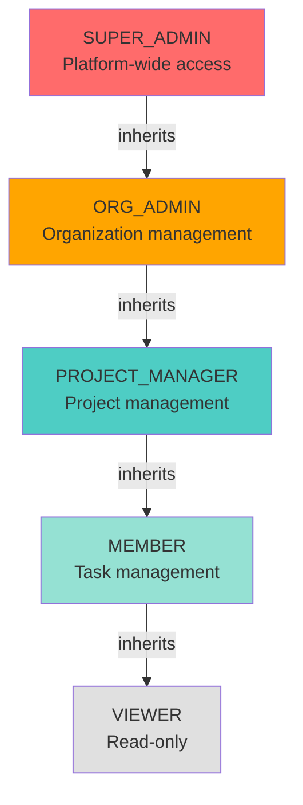

# Authorization

**Version**: 1.0.0  
**Last Updated**: 2025-10-30  
**Status**: Active

## Overview

This document defines authorization mechanisms for the Task Management System, including Role-Based Access Control (RBAC), permission systems, resource-level access control, and cross-organization isolation strategies.

---

## Authorization Principles

### Core Principles

1. **Principle of Least Privilege**: Grant minimum necessary permissions
2. **Defense in Depth**: Multiple authorization layers
3. **Fail Secure**: Deny access by default
4. **Separation of Duties**: No single role has complete control
5. **Auditability**: Log all authorization decisions

---

## Role-Based Access Control (RBAC)

### System Roles

| Role                | Scope        | Description          | Permissions                   |
| ------------------- | ------------ | -------------------- | ----------------------------- |
| **SUPER_ADMIN**     | Platform     | System administrator | All permissions               |
| **ORG_ADMIN**       | Organization | Organization owner   | Manage org, billing, members  |
| **PROJECT_MANAGER** | Project      | Project lead         | Manage projects, assign tasks |
| **MEMBER**          | Organization | Regular member       | Create tasks, comment         |
| **VIEWER**          | Project      | Read-only access     | View tasks, cannot edit       |

### Role Hierarchy



### Role Permissions Matrix

| Permission         | SUPER_ADMIN | ORG_ADMIN | PROJECT_MANAGER | MEMBER        | VIEWER |
| ------------------ | ----------- | --------- | --------------- | ------------- | ------ |
| **Organization**   |
| org:create         | ✅          | ✅        | ❌              | ❌            | ❌     |
| org:read           | ✅          | ✅        | ✅              | ✅            | ✅     |
| org:update         | ✅          | ✅        | ❌              | ❌            | ❌     |
| org:delete         | ✅          | ✅        | ❌              | ❌            | ❌     |
| org:manage_members | ✅          | ✅        | ❌              | ❌            | ❌     |
| org:manage_billing | ✅          | ✅        | ❌              | ❌            | ❌     |
| **Projects**       |
| project:create     | ✅          | ✅        | ✅              | ✅            | ❌     |
| project:read       | ✅          | ✅        | ✅              | ✅            | ✅     |
| project:update     | ✅          | ✅        | ✅ (owned)      | ❌            | ❌     |
| project:delete     | ✅          | ✅        | ✅ (owned)      | ❌            | ❌     |
| project:archive    | ✅          | ✅        | ✅ (owned)      | ❌            | ❌     |
| **Tasks**          |
| task:create        | ✅          | ✅        | ✅              | ✅            | ❌     |
| task:read          | ✅          | ✅        | ✅              | ✅            | ✅     |
| task:update        | ✅          | ✅        | ✅              | ✅ (assigned) | ❌     |
| task:delete        | ✅          | ✅        | ✅              | ✅ (created)  | ❌     |
| task:assign        | ✅          | ✅        | ✅              | ❌            | ❌     |
| **Comments**       |
| comment:create     | ✅          | ✅        | ✅              | ✅            | ❌     |
| comment:read       | ✅          | ✅        | ✅              | ✅            | ✅     |
| comment:update     | ✅          | ✅        | ✅              | ✅ (author)   | ❌     |
| comment:delete     | ✅          | ✅        | ✅              | ✅ (author)   | ❌     |
| **Users**          |
| user:invite        | ✅          | ✅        | ✅              | ❌            | ❌     |
| user:read          | ✅          | ✅        | ✅              | ✅            | ✅     |
| user:update        | ✅          | ✅        | ❌              | ❌ (self)     | ❌     |
| user:deactivate    | ✅          | ✅        | ❌              | ❌            | ❌     |
| **Reports**        |
| report:view        | ✅          | ✅        | ✅              | ✅            | ✅     |
| report:export      | ✅          | ✅        | ✅              | ❌            | ❌     |
| **Audit**          |
| audit:read         | ✅          | ✅        | ❌              | ❌            | ❌     |

---

## Permission System

### Permission Structure

```python
from enum import Enum
from dataclasses import dataclass

class PermissionAction(str, Enum):
    """CRUD operations"""
    CREATE = "create"
    READ = "read"
    UPDATE = "update"
    DELETE = "delete"
    EXECUTE = "execute"

class PermissionResource(str, Enum):
    """System resources"""
    ORGANIZATION = "organization"
    PROJECT = "project"
    TASK = "task"
    COMMENT = "comment"
    USER = "user"
    REPORT = "report"
    AUDIT = "audit"

@dataclass
class Permission:
    """Permission representation"""
    resource: PermissionResource
    action: PermissionAction

    def to_string(self) -> str:
        """Format as 'resource:action'"""
        return f"{self.resource.value}:{self.action.value}"

    @classmethod
    from_string(cls, permission_str: str) -> 'Permission':
        """Parse 'resource:action' string"""
        resource, action = permission_str.split(":")
        return cls(
            resource=PermissionResource(resource),
            action=PermissionAction(action)
        )

# Role to permissions mapping
ROLE_PERMISSIONS = {
    "SUPER_ADMIN": ["*:*"],  # All permissions
    "ORG_ADMIN": [
        "organization:*",
        "project:*",
        "task:*",
        "comment:*",
        "user:read", "user:invite", "user:update", "user:deactivate",
        "report:view", "report:export",
        "audit:read"
    ],
    "PROJECT_MANAGER": [
        "project:create", "project:read", "project:update", "project:delete",
        "task:*",
        "comment:*",
        "user:read", "user:invite",
        "report:view", "report:export"
    ],
    "MEMBER": [
        "project:create", "project:read",
        "task:create", "task:read", "task:update",
        "comment:*",
        "user:read",
        "report:view"
    ],
    "VIEWER": [
        "project:read",
        "task:read",
        "comment:read",
        "user:read",
        "report:view"
    ]
}
```

---

## Resource-Level Access Control

### Ownership and Context

Authorization depends on:

1. **User Role**: System-defined role
2. **Resource Ownership**: Creator or assignee of resource
3. **Organization Context**: Current organization scope
4. **Project Membership**: Access to specific projects

### Access Control Rules

```python
from abc import ABC, abstractmethod
from typing import Optional

class AccessControlRule(ABC):
    """Base class for access control rules"""

    @abstractmethod
    def evaluate(self, user: User, resource: any, action: str) -> bool:
        """Evaluate if user can perform action on resource"""
        pass

class OrganizationIsolationRule(AccessControlRule):
    """Ensure users only access resources in their organization"""

    def evaluate(self, user: User, resource: any, action: str) -> bool:
        """Check organization boundary"""
        if not hasattr(resource, 'organization_id'):
            return True  # No organization context

        return resource.organization_id == user.organization_id

class OwnershipRule(AccessControlRule):
    """Allow owners to manage their resources"""

    def evaluate(self, user: User, resource: any, action: str) -> bool:
        """Check if user owns resource"""
        if action not in ['update', 'delete']:
            return True  # Only restrict update/delete

        # Check various ownership patterns
        if hasattr(resource, 'owner_id'):
            return resource.owner_id == user.user_id

        if hasattr(resource, 'created_by'):
            return resource.created_by == user.user_id

        if hasattr(resource, 'author_id'):
            return resource.author_id == user.user_id

        return False

class ProjectMembershipRule(AccessControlRule):
    """Ensure user has access to project"""

    def __init__(self, project_repo):
        self.project_repo = project_repo

    def evaluate(self, user: User, resource: any, action: str) -> bool:
        """Check if user is project member"""
        if not hasattr(resource, 'project_id'):
            return True  # No project context

        project = self.project_repo.get_by_id(resource.project_id)
        return self._is_project_member(user, project)

    def _is_project_member(self, user: User, project: Project) -> bool:
        """Check project membership"""
        # Organization members have access to all org projects
        if project.organization_id == user.organization_id:
            return True

        # Check explicit project members
        return user.user_id in project.member_ids
```

### Authorization Service

```python
class AuthorizationService:
    """Centralized authorization service"""

    def __init__(self):
        self.rules = [
            OrganizationIsolationRule(),
            OwnershipRule(),
            ProjectMembershipRule(project_repo)
        ]

    def authorize(
        self,
        user: User,
        permission: str,
        resource: Optional[any] = None
    ) -> bool:
        """Check if user has permission to access resource"""

        # 1. Check if user has required permission
        if not self._has_permission(user, permission):
            return False

        # 2. Apply resource-level rules if resource provided
        if resource:
            resource_type, action = permission.split(":")

            for rule in self.rules:
                if not rule.evaluate(user, resource, action):
                    return False

        return True

    def _has_permission(self, user: User, permission: str) -> bool:
        """Check if user role has permission"""
        user_permissions = self._get_user_permissions(user)

        # Check wildcard permissions
        if "*:*" in user_permissions:
            return True

        resource, action = permission.split(":")

        # Check resource wildcard (e.g., "project:*")
        if f"{resource}:*" in user_permissions:
            return True

        # Check exact permission
        return permission in user_permissions

    def _get_user_permissions(self, user: User) -> set[str]:
        """Get all permissions for user's roles"""
        permissions = set()

        for role in user.roles:
            role_perms = ROLE_PERMISSIONS.get(role, [])
            permissions.update(role_perms)

        return permissions

    def require_permission(self, permission: str):
        """Decorator to enforce permission check"""
        def decorator(func):
            @wraps(func)
            async def wrapper(*args, **kwargs):
                # Get current user from request context
                user = get_current_user()

                # Get resource if provided
                resource = kwargs.get('resource') or kwargs.get('resource_id')

                if not self.authorize(user, permission, resource):
                    raise ForbiddenError(
                        f"User does not have permission: {permission}"
                    )

                return await func(*args, **kwargs)

            return wrapper
        return decorator
```

---

## Cross-Organization Isolation

### Isolation Strategy

**Principle**: Users in Organization A CANNOT access data from Organization B.

**Implementation**:

1. Every query includes `organization_id` filter
2. Repository layer enforces organization context
3. API layer validates organization access
4. Database partitioning by `organization_id`

### Organization-Scoped Repository

```python
class OrganizationScopedRepository:
    """Base repository with organization isolation"""

    def __init__(self, db_session, user: User):
        self.db = db_session
        self.organization_id = user.organization_id

    def _apply_organization_filter(self, query):
        """Add organization_id filter to all queries"""
        return query.filter_by(organization_id=self.organization_id)

class ProjectRepository(OrganizationScopedRepository):
    """Project repository with organization isolation"""

    def get_by_id(self, project_id: UUID) -> Optional[Project]:
        """Get project within organization context"""
        query = self.db.query(Project).filter_by(project_id=project_id)
        query = self._apply_organization_filter(query)
        return query.first()

    def list_all(self, status: Optional[str] = None) -> List[Project]:
        """List projects within organization"""
        query = self.db.query(Project)
        query = self._apply_organization_filter(query)

        if status:
            query = query.filter_by(status=status)

        return query.all()

    def create(self, project: Project) -> Project:
        """Create project with organization context"""
        # Force organization_id to current user's organization
        project.organization_id = self.organization_id
        self.db.add(project)
        self.db.commit()
        return project
```

### API Layer Enforcement

```python
from fastapi import Depends, HTTPException, status

async def get_current_user(
    credentials: HTTPAuthorizationCredentials = Depends(security)
) -> User:
    """Extract and validate current user from JWT"""
    token = credentials.credentials
    payload = auth_service.verify_access_token(token)

    user = user_repository.get_by_id(payload["sub"])
    if not user:
        raise HTTPException(status_code=401, detail="User not found")

    return user

async def require_organization_access(
    organization_id: UUID,
    user: User = Depends(get_current_user)
) -> None:
    """Verify user belongs to organization"""
    if user.organization_id != organization_id:
        raise HTTPException(
            status_code=403,
            detail="Access denied to this organization"
        )

@router.get("/organizations/{organization_id}/projects")
async def list_projects(
    organization_id: UUID,
    user: User = Depends(get_current_user),
    _: None = Depends(lambda: require_organization_access(organization_id, user))
):
    """List projects (organization-scoped)"""
    project_repo = ProjectRepository(db, user)
    projects = project_repo.list_all()
    return [project.to_dict() for project in projects]
```

---

## Dynamic Authorization

### Resource-Specific Rules

```python
class TaskAuthorizationService:
    """Task-specific authorization logic"""

    def can_update_task(self, user: User, task: Task) -> bool:
        """Check if user can update task"""
        # ORG_ADMIN can update any task in organization
        if "ORG_ADMIN" in user.roles:
            return task.organization_id == user.organization_id

        # PROJECT_MANAGER can update tasks in managed projects
        if "PROJECT_MANAGER" in user.roles:
            project = self.project_repo.get_by_id(task.project_id)
            if project.owner_id == user.user_id:
                return True

        # MEMBER can update assigned tasks
        if task.assignee_id == user.user_id:
            return True

        # Task creator can update their tasks
        if task.created_by == user.user_id:
            return True

        return False

    def can_delete_task(self, user: User, task: Task) -> bool:
        """Check if user can delete task"""
        # Only ORG_ADMIN, PROJECT_MANAGER, or creator can delete
        if "ORG_ADMIN" in user.roles:
            return task.organization_id == user.organization_id

        if "PROJECT_MANAGER" in user.roles:
            project = self.project_repo.get_by_id(task.project_id)
            if project.owner_id == user.user_id:
                return True

        # Only creator can delete task
        return task.created_by == user.user_id

    def can_assign_task(self, user: User, task: Task) -> bool:
        """Check if user can assign task to someone"""
        # ORG_ADMIN and PROJECT_MANAGER can assign tasks
        if "ORG_ADMIN" in user.roles:
            return task.organization_id == user.organization_id

        if "PROJECT_MANAGER" in user.roles:
            project = self.project_repo.get_by_id(task.project_id)
            return project.owner_id == user.user_id

        return False
```

### Policy-Based Authorization

```python
from dataclasses import dataclass
from typing import Callable

@dataclass
class AuthorizationPolicy:
    """Authorization policy definition"""
    name: str
    resource_type: str
    action: str
    condition: Callable[[User, any], bool]

class PolicyEngine:
    """Evaluate authorization policies"""

    def __init__(self):
        self.policies: List[AuthorizationPolicy] = []

    def register_policy(self, policy: AuthorizationPolicy) -> None:
        """Register authorization policy"""
        self.policies.append(policy)

    def evaluate(
        self,
        user: User,
        resource_type: str,
        action: str,
        resource: any
    ) -> bool:
        """Evaluate all applicable policies"""
        applicable_policies = [
            p for p in self.policies
            if p.resource_type == resource_type and p.action == action
        ]

        # All policies must pass (AND logic)
        for policy in applicable_policies:
            if not policy.condition(user, resource):
                logger.info(
                    f"Policy '{policy.name}' denied access",
                    extra={
                        "user_id": user.user_id,
                        "resource_type": resource_type,
                        "action": action
                    }
                )
                return False

        return True

# Register policies
policy_engine = PolicyEngine()

policy_engine.register_policy(AuthorizationPolicy(
    name="organization_isolation",
    resource_type="project",
    action="read",
    condition=lambda user, project: project.organization_id == user.organization_id
))

policy_engine.register_policy(AuthorizationPolicy(
    name="project_owner_update",
    resource_type="project",
    action="update",
    condition=lambda user, project: (
        "ORG_ADMIN" in user.roles or
        project.owner_id == user.user_id
    )
))
```

---

## Authorization Caching

### Permission Caching

**Strategy**: Cache user permissions in Redis for fast checks.

```python
class PermissionCache:
    """Cache user permissions"""

    def __init__(self, redis_client):
        self.redis = redis_client
        self.ttl = 300  # 5 minutes

    def get_permissions(self, user_id: UUID) -> Optional[set[str]]:
        """Get cached permissions"""
        key = f"permissions:{user_id}"
        data = self.redis.get(key)

        if data:
            return set(json.loads(data))
        return None

    def set_permissions(self, user_id: UUID, permissions: set[str]) -> None:
        """Cache permissions"""
        key = f"permissions:{user_id}"
        self.redis.setex(key, self.ttl, json.dumps(list(permissions)))

    def invalidate(self, user_id: UUID) -> None:
        """Invalidate cache when roles change"""
        key = f"permissions:{user_id}"
        self.redis.delete(key)
```

---

## API Authorization Examples

### Endpoint Authorization

```python
@router.post("/projects")
@require_permission("project:create")
async def create_project(
    data: CreateProjectRequest,
    user: User = Depends(get_current_user)
):
    """Create project (requires project:create permission)"""
    project = Project(
        project_id=uuid4(),
        organization_id=user.organization_id,
        name=data.name,
        owner_id=user.user_id
    )

    project_repo = ProjectRepository(db, user)
    project_repo.create(project)

    return project.to_dict()

@router.put("/tasks/{task_id}")
async def update_task(
    task_id: UUID,
    data: UpdateTaskRequest,
    user: User = Depends(get_current_user)
):
    """Update task (dynamic authorization)"""
    task_repo = TaskRepository(db, user)
    task = task_repo.get_by_id(task_id)

    if not task:
        raise HTTPException(status_code=404, detail="Task not found")

    # Check authorization
    task_auth = TaskAuthorizationService()
    if not task_auth.can_update_task(user, task):
        raise HTTPException(
            status_code=403,
            detail="You do not have permission to update this task"
        )

    # Update task
    task.title = data.title or task.title
    task.status = data.status or task.status
    task_repo.save(task)

    return task.to_dict()
```

---

## Security Best Practices

### DO ✅

1. **Enforce Organization Isolation**: Always filter by `organization_id`
2. **Check Permissions on Every Request**: Never trust client
3. **Use Principle of Least Privilege**: Grant minimum permissions
4. **Log Authorization Failures**: Track attempted unauthorized access
5. **Cache Permissions**: Reduce database lookups
6. **Validate Resource Ownership**: Check owner before allowing updates
7. **Use Decorators**: Centralize authorization logic

### DON'T ❌

1. **Don't Trust Client-Provided organization_id**: Use from JWT
2. **Don't Skip Authorization Checks**: Even for "internal" endpoints
3. **Don't Hard-Code Permissions**: Use centralized role definitions
4. **Don't Expose Permission Details**: Generic "Access denied" message
5. **Don't Allow Permission Escalation**: Validate role changes
6. **Don't Cache Authorization Decisions**: Cache permissions, not decisions
7. **Don't Forget to Test**: Unit test authorization logic

---

## Testing Authorization

### Unit Tests

```python
import pytest

class TestTaskAuthorization:
    """Test task authorization rules"""

    def test_org_admin_can_update_any_task(self):
        # Arrange
        org_admin = create_user(roles=["ORG_ADMIN"])
        task = create_task(organization_id=org_admin.organization_id)
        task_auth = TaskAuthorizationService()

        # Act
        can_update = task_auth.can_update_task(org_admin, task)

        # Assert
        assert can_update is True

    def test_member_cannot_update_others_task(self):
        # Arrange
        member = create_user(roles=["MEMBER"])
        other_user = create_user(roles=["MEMBER"])
        task = create_task(
            created_by=other_user.user_id,
            assignee_id=other_user.user_id
        )
        task_auth = TaskAuthorizationService()

        # Act
        can_update = task_auth.can_update_task(member, task)

        # Assert
        assert can_update is False

    def test_member_can_update_assigned_task(self):
        # Arrange
        member = create_user(roles=["MEMBER"])
        task = create_task(assignee_id=member.user_id)
        task_auth = TaskAuthorizationService()

        # Act
        can_update = task_auth.can_update_task(member, task)

        # Assert
        assert can_update is True

    def test_organization_isolation(self):
        # Arrange
        user_org_a = create_user(organization_id="org-a")
        task_org_b = create_task(organization_id="org-b")
        task_repo = TaskRepository(db, user_org_a)

        # Act
        task = task_repo.get_by_id(task_org_b.task_id)

        # Assert
        assert task is None  # Cannot access task from different org
```

---

## Related Documents

- [Authentication](./authentication.md)
- [Data Protection](./data-protection.md)
- [Audit Logging](./audit-logging.md)
- [Defense in Depth](./defense-in-depth.md)

---

**Last Reviewed**: 2025-10-30  
**Next Review**: 2026-01-30 (Quarterly)
