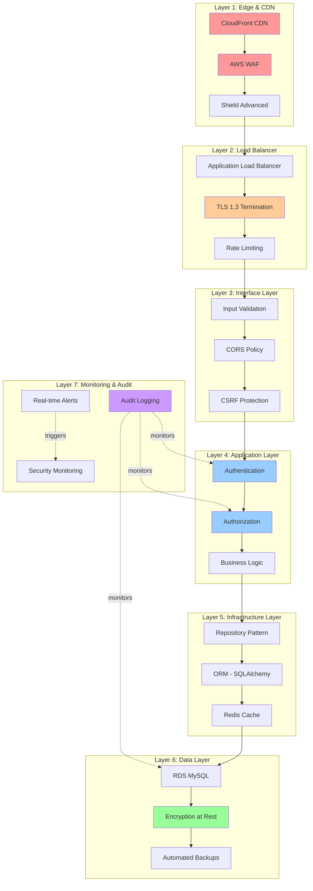

# Defense in Depth Strategy

**Version**: 1.0.0  
**Last Updated**: 2025-10-30  
**Status**: Active

## Overview

This document defines the defense-in-depth security strategy for the Task Management System, implementing multiple layers of security controls across all architectural layers. Each layer provides independent security guarantees, ensuring that a breach at one layer does not compromise the entire system.

---

## Security Architecture Layers



---

## Layer 1: Edge Security (CDN & WAF)

### CloudFront CDN

**Purpose**: First line of defense against attacks, DDoS protection, geographic filtering

```yaml
CloudFront Distribution:
  Origins:
    - ALB: taskmanager-api.example.com

  Security:
    - HTTPS Only (redirect HTTP → HTTPS)
    - TLS 1.2+ minimum
    - Origin Protocol Policy: HTTPS only

  Geo Restriction:
    Type: Whitelist
    Locations: [US, CA, EU, UK, AU]

  Custom Headers:
    X-Origin-Verify: <secret-token> # Prevent direct ALB access
```

### AWS WAF Rules

**Purpose**: Filter malicious requests before they reach the application

```yaml
WAF Rule Groups:
  1. AWS Managed Rules - Core Rule Set (CRS):
    - SQL injection protection
    - Cross-site scripting (XSS) protection
    - Local file inclusion (LFI) protection

  2. AWS Managed Rules - Known Bad Inputs:
    - Known attack patterns
    - Malformed requests

  3. Custom Rules:
    - Rate limiting (1000 req/5min per IP)
    - Geographic blocking
    - User-Agent filtering (block automated tools)

  4. IP Reputation Lists:
    - Block known malicious IPs
    - Automatic updates from threat intelligence
```

#### Example WAF Rule

```json
{
  "Name": "RateLimitRule",
  "Priority": 1,
  "Statement": {
    "RateBasedStatement": {
      "Limit": 1000,
      "AggregateKeyType": "IP"
    }
  },
  "Action": {
    "Block": {
      "CustomResponse": {
        "ResponseCode": 429,
        "CustomResponseBodyKey": "rate-limit-exceeded"
      }
    }
  }
}
```

### AWS Shield Advanced

**Purpose**: DDoS protection with 24/7 response team

```yaml
Shield Advanced:
  Protected Resources:
    - CloudFront distributions
    - Application Load Balancers
    - Route53 hosted zones

  Features:
    - Automatic DDoS mitigation
    - Real-time attack notifications
    - DDoS Response Team (DRT) access
    - Cost protection (DDoS-related scaling costs)
```

**Security Guarantees**:

- ✅ Blocks 99.9% of automated attacks
- ✅ Rate limiting prevents API abuse
- ✅ Geographic filtering reduces attack surface
- ✅ DDoS protection up to Layer 7

---

## Layer 2: Load Balancer Security

### TLS Configuration

**Purpose**: Encrypt all traffic in transit

```yaml
ALB Listener:
  Protocol: HTTPS
  Port: 443

  SSL Policy: ELBSecurityPolicy-TLS13-1-2-2021-06

  Certificates:
    - Primary: *.taskmanager.example.com
    - SNI: api.taskmanager.example.com

  Supported Protocols:
    - TLS 1.3 (preferred)
    - TLS 1.2 (fallback)

  Ciphers:
    - TLS_AES_128_GCM_SHA256
    - TLS_AES_256_GCM_SHA384
    - TLS_CHACHA20_POLY1305_SHA256
```

### Rate Limiting

**Purpose**: Prevent API abuse and brute force attacks

```python
from fastapi import Request
from fastapi.responses import JSONResponse
from redis import Redis
import time

redis = Redis(host='localhost', port=6379, db=0)

async def rate_limit_middleware(request: Request, call_next):
    """
    Rate limiting at ALB + Application level
    - 1000 requests per 5 minutes per IP (WAF)
    - 100 requests per minute per user (Application)
    """
    client_ip = request.client.host
    user_id = getattr(request.state, 'user_id', None)

    # Check IP-based rate limit
    ip_key = f"rate_limit:ip:{client_ip}"
    ip_count = redis.incr(ip_key)
    if ip_count == 1:
        redis.expire(ip_key, 60)  # 1 minute window

    if ip_count > 100:
        return JSONResponse(
            status_code=429,
            content={"detail": "Rate limit exceeded. Try again later."},
            headers={"Retry-After": "60"}
        )

    # Check user-based rate limit (if authenticated)
    if user_id:
        user_key = f"rate_limit:user:{user_id}"
        user_count = redis.incr(user_key)
        if user_count == 1:
            redis.expire(user_key, 60)

        if user_count > 100:
            return JSONResponse(
                status_code=429,
                content={"detail": "User rate limit exceeded"}
            )

    response = await call_next(request)
    return response
```

### Connection Security

**Purpose**: Enforce secure connections and prevent bypass

```yaml
Security Groups:
  ALB Security Group:
    Inbound:
      - Port 443 from 0.0.0.0/0 (HTTPS only)
      - Port 443 from CloudFront IPs only
    Outbound:
      - Port 8000 to ECS Security Group

  ECS Security Group:
    Inbound:
      - Port 8000 from ALB Security Group only
    Outbound:
      - Port 3306 to RDS Security Group
      - Port 6379 to Redis Security Group
```

**Security Guarantees**:

- ✅ All traffic encrypted (TLS 1.3)
- ✅ Rate limiting prevents abuse
- ✅ Network isolation (security groups)
- ✅ No direct access to application servers

---

## Layer 3: Interface Layer Security

### Input Validation

**Purpose**: Validate and sanitize all user input

```python
from pydantic import BaseModel, EmailStr, constr, validator, Field
from typing import Optional
import re

class CreateTaskRequest(BaseModel):
    """Strict input validation using Pydantic"""

    title: constr(min_length=1, max_length=255) = Field(
        ...,
        description="Task title (1-255 chars)"
    )

    description: Optional[constr(max_length=5000)] = Field(
        None,
        description="Task description (max 5000 chars)"
    )

    priority: int = Field(
        ge=1, le=5,
        description="Priority (1-5)"
    )

    assignee_email: Optional[EmailStr] = Field(
        None,
        description="Assignee email (validated format)"
    )

    due_date: Optional[datetime] = Field(
        None,
        description="Due date (ISO 8601)"
    )

    tags: List[constr(min_length=1, max_length=50)] = Field(
        default_factory=list,
        max_items=10,
        description="Tags (max 10, each 1-50 chars)"
    )

    @validator('title', 'description')
    def validate_no_html(cls, v):
        """Prevent HTML injection"""
        if v and re.search(r'<[^>]+>', v):
            raise ValueError('HTML tags not allowed')
        return v

    @validator('tags')
    def validate_tag_format(cls, v):
        """Validate tag format"""
        for tag in v:
            if not re.match(r'^[a-zA-Z0-9\-_]+$', tag):
                raise ValueError(f'Invalid tag format: {tag}')
        return v

    @validator('due_date')
    def validate_future_date(cls, v):
        """Due date must be in the future"""
        if v and v < datetime.utcnow():
            raise ValueError('Due date must be in the future')
        return v
```

### CORS Policy

**Purpose**: Prevent unauthorized cross-origin requests

```python
from fastapi.middleware.cors import CORSMiddleware

app.add_middleware(
    CORSMiddleware,
    allow_origins=[
        "https://taskmanager.example.com",
        "https://app.taskmanager.example.com"
    ],  # Strict whitelist (no wildcards!)
    allow_credentials=True,
    allow_methods=["GET", "POST", "PUT", "DELETE"],
    allow_headers=["Authorization", "Content-Type", "X-Request-ID"],
    expose_headers=["X-Request-ID"],
    max_age=600  # Cache preflight for 10 minutes
)
```

### CSRF Protection

**Purpose**: Prevent cross-site request forgery attacks

```python
from fastapi import Request, HTTPException
import secrets

async def csrf_protection_middleware(request: Request, call_next):
    """
    CSRF protection for state-changing operations
    - Require CSRF token in header for POST/PUT/DELETE
    - Token validated against session
    """
    if request.method in ["POST", "PUT", "DELETE"]:
        csrf_token = request.headers.get("X-CSRF-Token")
        session_token = request.cookies.get("csrf_token")

        if not csrf_token or not session_token:
            raise HTTPException(status_code=403, detail="CSRF token missing")

        if not secrets.compare_digest(csrf_token, session_token):
            raise HTTPException(status_code=403, detail="Invalid CSRF token")

    response = await call_next(request)
    return response

@app.get("/csrf-token")
async def get_csrf_token(response: Response):
    """Generate and return CSRF token"""
    token = secrets.token_urlsafe(32)
    response.set_cookie(
        key="csrf_token",
        value=token,
        httponly=True,
        secure=True,
        samesite="strict",
        max_age=3600
    )
    return {"csrf_token": token}
```

### Security Headers

**Purpose**: Add security headers to all responses

```python
@app.middleware("http")
async def add_security_headers(request: Request, call_next):
    """Add security headers to every response"""
    response = await call_next(request)

    response.headers['Strict-Transport-Security'] = 'max-age=31536000; includeSubDomains; preload'
    response.headers['X-Content-Type-Options'] = 'nosniff'
    response.headers['X-Frame-Options'] = 'DENY'
    response.headers['X-XSS-Protection'] = '1; mode=block'
    response.headers['Content-Security-Policy'] = "default-src 'self'; script-src 'self'; style-src 'self' 'unsafe-inline'"
    response.headers['Referrer-Policy'] = 'strict-origin-when-cross-origin'
    response.headers['Permissions-Policy'] = 'geolocation=(), microphone=(), camera=()'

    return response
```

**Security Guarantees**:

- ✅ All input validated before processing
- ✅ CORS prevents unauthorized origins
- ✅ CSRF protection on state-changing operations
- ✅ Security headers prevent common attacks

---

## Layer 4: Application Layer Security

### Authentication Layer

**Purpose**: Verify user identity before any operation

**Implementation**: [authentication.md](./authentication.md)

```python
from fastapi import Depends, HTTPException, status
from fastapi.security import HTTPBearer, HTTPAuthorizationCredentials

security = HTTPBearer()

async def get_current_user(
    credentials: HTTPAuthorizationCredentials = Depends(security)
) -> User:
    """
    Extract and validate JWT token
    - Verify signature
    - Check expiration
    - Validate claims
    - Check blacklist
    """
    token = credentials.credentials

    try:
        payload = jwt.decode(token, settings.JWT_SECRET, algorithms=["HS256"])
    except jwt.ExpiredSignatureError:
        raise HTTPException(
            status_code=status.HTTP_401_UNAUTHORIZED,
            detail="Token expired"
        )
    except jwt.InvalidTokenError:
        raise HTTPException(
            status_code=status.HTTP_401_UNAUTHORIZED,
            detail="Invalid token"
        )

    # Check token blacklist (revoked tokens)
    if redis.exists(f"blacklist:{token}"):
        raise HTTPException(
            status_code=status.HTTP_401_UNAUTHORIZED,
            detail="Token revoked"
        )

    user_id = payload.get("sub")
    user = await user_repository.get_by_id(UUID(user_id))

    if not user or user.status != "ACTIVE":
        raise HTTPException(
            status_code=status.HTTP_401_UNAUTHORIZED,
            detail="User not found or inactive"
        )

    return user
```

### Authorization Layer

**Purpose**: Enforce access control on all resources

**Implementation**: [authorization.md](./authorization.md)

```python
from functools import wraps

def require_permission(permission: str):
    """
    Decorator to enforce permission on endpoints
    """
    def decorator(func):
        @wraps(func)
        async def wrapper(*args, user: User = Depends(get_current_user), **kwargs):
            # Check if user has required permission
            if not authorization_service.has_permission(user, permission):
                audit_service.log(
                    action=AuditAction.PERMISSION_DENIED,
                    user=user,
                    metadata={"permission": permission}
                )
                raise HTTPException(
                    status_code=status.HTTP_403_FORBIDDEN,
                    detail=f"Permission denied: {permission}"
                )

            return await func(*args, user=user, **kwargs)
        return wrapper
    return decorator

@router.delete("/tasks/{task_id}")
@require_permission("task:delete")
async def delete_task(task_id: UUID, user: User = Depends(get_current_user)):
    """Only users with task:delete permission can delete tasks"""
    task = await task_repository.get_by_id(task_id)

    # Additional resource-level authorization
    if not authorization_service.can_access_resource(user, task):
        raise HTTPException(status_code=403, detail="Access denied")

    await task_repository.delete(task_id)

    audit_service.log(
        action=AuditAction.DELETE,
        entity_type="Task",
        entity_id=task_id,
        user=user
    )

    return {"status": "deleted"}
```

### Business Logic Security

**Purpose**: Enforce business rules and invariants

```python
class Task:
    """Domain entity with built-in invariants"""

    def assign_to(self, user: User, assignee: User):
        """Enforce business rules when assigning tasks"""

        # Rule 1: Only project members can be assigned
        if assignee.user_id not in self.project.member_ids:
            raise ValueError("Cannot assign to non-member")

        # Rule 2: Cannot assign to inactive users
        if assignee.status != "ACTIVE":
            raise ValueError("Cannot assign to inactive user")

        # Rule 3: Cannot assign completed tasks
        if self.status == "COMPLETED":
            raise ValueError("Cannot reassign completed task")

        # Rule 4: Validate permissions
        if not authorization_service.can_update(user, self):
            raise PermissionError("No permission to assign task")

        self.assignee_id = assignee.user_id
        self.updated_at = datetime.utcnow()
        self.updated_by = user.user_id
```

**Security Guarantees**:

- ✅ Authentication required for all protected endpoints
- ✅ Authorization enforced at endpoint + resource level
- ✅ Business rules prevent invalid state transitions
- ✅ All security events audited

---

## Layer 5: Infrastructure Layer Security

### Repository Pattern with Organization Isolation

**Purpose**: Automatic organization filtering on all database queries

```python
from abc import ABC, abstractmethod
from typing import Generic, TypeVar, Optional, List
from uuid import UUID

T = TypeVar('T')

class OrganizationScopedRepository(ABC, Generic[T]):
    """
    Base repository enforcing organization isolation
    All queries automatically filtered by organization_id
    """

    def __init__(self, db: Session, user: User):
        self.db = db
        self.organization_id = user.organization_id
        self.user = user

    def _apply_organization_filter(self, query):
        """Automatically filter by organization_id"""
        return query.filter_by(organization_id=self.organization_id)

    def get_by_id(self, entity_id: UUID) -> Optional[T]:
        """Get entity by ID (organization-scoped)"""
        query = self.db.query(self.model).filter_by(id=entity_id)
        query = self._apply_organization_filter(query)
        return query.first()

    def list(self, filters: dict = None) -> List[T]:
        """List entities (organization-scoped)"""
        query = self.db.query(self.model)
        query = self._apply_organization_filter(query)

        if filters:
            query = query.filter_by(**filters)

        return query.all()

    def save(self, entity: T) -> T:
        """Save entity (validate organization)"""
        # Enforce organization_id
        if entity.organization_id != self.organization_id:
            raise ValueError("Organization ID mismatch")

        self.db.add(entity)
        self.db.commit()
        self.db.refresh(entity)
        return entity

class TaskRepository(OrganizationScopedRepository[Task]):
    """Task repository with automatic organization isolation"""
    model = TaskModel
```

### ORM Security (SQLAlchemy)

**Purpose**: Prevent SQL injection via parameterized queries

```python
# ✅ SAFE: Parameterized queries via ORM
tasks = db.query(Task).filter(
    Task.project_id == project_id,
    Task.status.in_(['TODO', 'IN_PROGRESS'])
).order_by(Task.priority.desc()).all()

# ❌ NEVER: Raw SQL with string formatting
# query = f"SELECT * FROM tasks WHERE project_id = '{project_id}'"
# tasks = db.execute(query).fetchall()
```

### Connection Security

**Purpose**: Secure database connections

```python
from sqlalchemy import create_engine
from sqlalchemy.pool import QueuePool

engine = create_engine(
    f"mysql+pymysql://{user}:{password}@{host}:{port}/{database}",
    pool_size=20,
    max_overflow=10,
    pool_pre_ping=True,  # Verify connections
    connect_args={
        "ssl": {
            "ca": "/path/to/rds-ca-cert.pem",
            "check_hostname": True
        },
        "connect_timeout": 10
    }
)
```

**Security Guarantees**:

- ✅ Organization isolation enforced at repository layer
- ✅ SQL injection prevented via ORM
- ✅ Database connections encrypted (SSL/TLS)
- ✅ Connection pooling with limits

---

## Layer 6: Data Layer Security

### Encryption at Rest

**Purpose**: Protect data if storage is compromised

**Implementation**: [data-protection.md](./data-protection.md)

```yaml
RDS MySQL:
  Encryption: AWS KMS (AES-256)
  Key: arn:aws:kms:us-east-1:123456789012:key/abcd1234
  Rotation: Annual automatic rotation

S3 Attachments:
  Encryption: SSE-KMS
  Key: arn:aws:kms:us-east-1:123456789012:key/s3-key
  Versioning: Enabled

Redis Cache:
  Encryption: TLS in transit + at-rest encryption
```

### Database Access Control

**Purpose**: Principle of least privilege for database access

```sql
-- Application user (limited privileges)
CREATE USER 'taskmanager_app'@'%' IDENTIFIED BY 'secure_password';

-- Read/write access to application tables
GRANT SELECT, INSERT, UPDATE, DELETE ON taskmanager.users TO 'taskmanager_app'@'%';
GRANT SELECT, INSERT, UPDATE, DELETE ON taskmanager.projects TO 'taskmanager_app'@'%';
GRANT SELECT, INSERT, UPDATE, DELETE ON taskmanager.tasks TO 'taskmanager_app'@'%';

-- Append-only access to audit logs
GRANT INSERT, SELECT ON taskmanager.audit_logs TO 'taskmanager_app'@'%';
-- NO UPDATE or DELETE on audit logs!

-- Read-only user for analytics
CREATE USER 'taskmanager_readonly'@'%' IDENTIFIED BY 'secure_password';
GRANT SELECT ON taskmanager.* TO 'taskmanager_readonly'@'%';
```

### Backup Security

**Purpose**: Secure backups for disaster recovery

```yaml
RDS Automated Backups:
  Frequency: Daily at 03:00 UTC
  Retention: 7 days
  Encryption: KMS encrypted
  Region: us-east-1 (primary) + us-west-2 (replica)

Manual Snapshots:
  Frequency: Weekly (before deployments)
  Retention: 30 days
  Encryption: KMS encrypted
  Cross-Region Copy: Enabled
```

**Security Guarantees**:

- ✅ Data encrypted at rest (KMS)
- ✅ Least privilege database access
- ✅ Encrypted backups with retention
- ✅ Cross-region backup replication

---

## Layer 7: Monitoring & Audit Security

### Audit Logging

**Purpose**: Comprehensive logging of all security-relevant events

**Implementation**: [audit-logging.md](./audit-logging.md)

```python
# All security events automatically logged
@audit_logged(action=AuditAction.LOGIN_SUCCESS)
async def login(credentials: LoginRequest):
    # Login logic
    pass

@audit_logged(action=AuditAction.PERMISSION_DENIED)
async def access_denied():
    # Handled by authorization decorator
    pass
```

### Real-Time Alerting

**Purpose**: Immediate notification of security incidents

```yaml
CloudWatch Alarms:
  - HighFailedLoginRate:
      Condition: login_failures_total > 10 in 5 minutes
      Action: SNS topic → PagerDuty

  - UnauthorizedAccessAttempt:
      Condition: permission_denied_total > 5 in 1 minute
      Action: SNS topic → Security team

  - DatabaseConnectionFailure:
      Condition: db_connection_errors > 3 in 1 minute
      Action: SNS topic → On-call engineer
```

### Security Monitoring

**Purpose**: Continuous security posture assessment

```yaml
AWS Security Hub:
  Standards:
    - CIS AWS Foundations Benchmark
    - PCI DSS v3.2.1
    - AWS Foundational Security Best Practices

  Findings Severity:
    CRITICAL: Auto-remediate + alert
    HIGH: Alert security team
    MEDIUM: Weekly review
    LOW: Monthly review

GuardDuty:
  Enabled: true
  Findings: Send to Security Hub + S3

Config Rules:
  - encrypted-volumes
  - rds-encryption-enabled
  - s3-bucket-public-read-prohibited
  - iam-password-policy
```

**Security Guarantees**:

- ✅ All security events logged immutably
- ✅ Real-time alerts for incidents
- ✅ Continuous compliance monitoring
- ✅ Automated security assessments

---

## Attack Scenarios & Defenses

### Scenario 1: SQL Injection Attack

**Attack**: Attacker tries `?search='; DROP TABLE users; --`

**Defense Layers**:

1. ❌ **Layer 1 (WAF)**: Blocks known SQL injection patterns
2. ✅ **Layer 3 (Input Validation)**: Pydantic rejects invalid format
3. ✅ **Layer 5 (ORM)**: Parameterized queries prevent injection
4. ✅ **Layer 7 (Monitoring)**: Suspicious queries logged

**Result**: Attack blocked at multiple layers

---

### Scenario 2: Brute Force Login

**Attack**: Attacker tries 1000 passwords against admin account

**Defense Layers**:

1. ✅ **Layer 1 (WAF)**: Rate limit blocks after 1000 requests
2. ✅ **Layer 2 (ALB)**: Rate limiting kicks in at 100 req/min
3. ✅ **Layer 4 (Authentication)**: Account lockout after 5 failures
4. ✅ **Layer 7 (Monitoring)**: Alert triggered, account locked

**Result**: Attack stopped after 5 attempts, admin notified

---

### Scenario 3: Cross-Organization Data Access

**Attack**: User from Org A tries to access Org B's project

**Defense Layers**:

1. ✅ **Layer 4 (Authorization)**: Permission check fails
2. ✅ **Layer 5 (Repository)**: Organization filter prevents query
3. ✅ **Layer 6 (Database)**: No row returned (RLS if enabled)
4. ✅ **Layer 7 (Audit)**: Access attempt logged

**Result**: Access denied, attempt audited

---

### Scenario 4: Stolen JWT Token

**Attack**: Attacker obtains valid JWT token via XSS

**Defense Layers**:

1. ✅ **Layer 3 (CORS/CSP)**: Prevents XSS in the first place
2. ✅ **Layer 4 (Authentication)**: Short TTL (15 min) limits exposure
3. ✅ **Layer 4 (Session)**: Token revocation via blacklist
4. ✅ **Layer 7 (Monitoring)**: Anomalous activity detected

**Result**: Token expires quickly, revoked if suspicious activity

---

## Security Testing

### Layer-Specific Testing

```yaml
Layer 1 (Edge):
  - DDoS simulation (AWS testing approved)
  - WAF rule validation
  - Geographic filtering tests

Layer 2 (Load Balancer):
  - TLS configuration scanning (SSL Labs)
  - Rate limiting validation
  - Security group testing

Layer 3 (Interface):
  - Input fuzzing (all endpoints)
  - CORS policy testing
  - CSRF token validation

Layer 4 (Application):
  - Authentication bypass attempts
  - Authorization testing (all roles)
  - Business logic testing

Layer 5 (Infrastructure):
  - SQL injection testing (SQLMap)
  - ORM query analysis
  - Connection security validation

Layer 6 (Data):
  - Encryption verification
  - Backup restore testing
  - Access control validation

Layer 7 (Monitoring):
  - Alert testing (all scenarios)
  - Log completeness verification
  - Incident response drills
```

---

## Related Documents

- [Authentication](./authentication.md)
- [Authorization](./authorization.md)
- [Data Protection](./data-protection.md)
- [Audit Logging](./audit-logging.md)
- [OWASP Compliance](./owasp-compliance.md)

---

**Last Reviewed**: 2025-10-30  
**Next Review**: 2026-01-30 (Quarterly)
