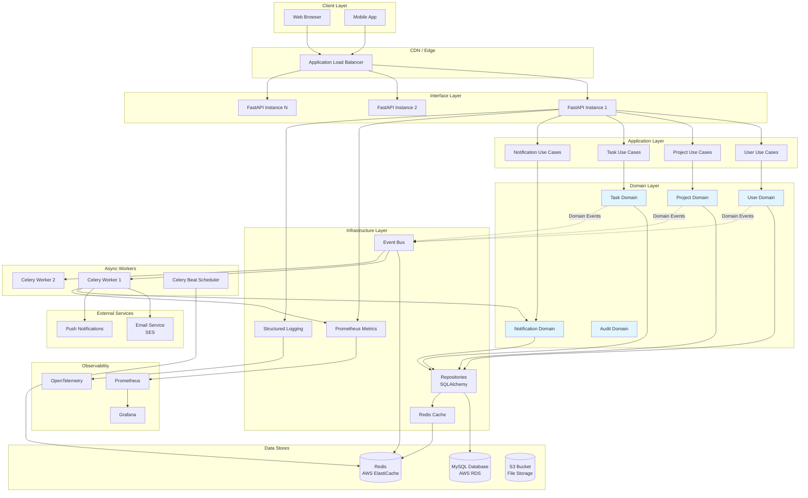
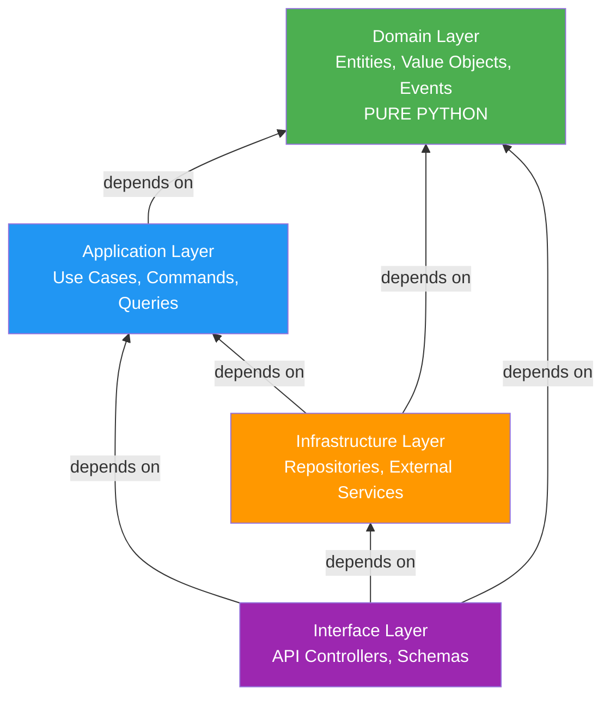
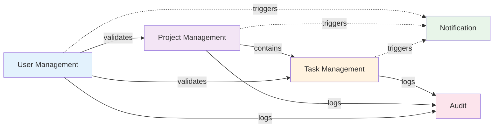
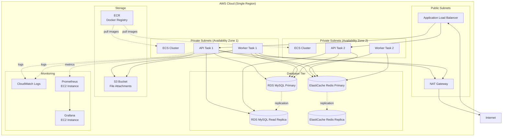
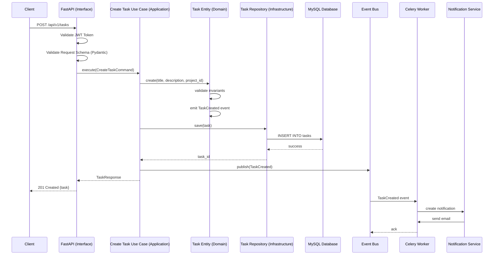
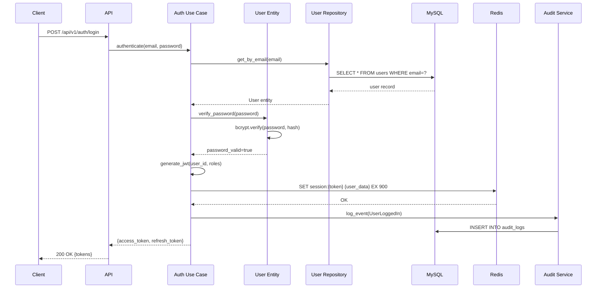
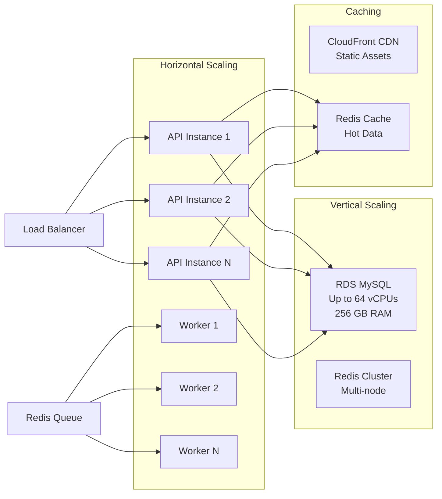

# System Architecture Diagram

**Feature**: System Architecture Design  
**Date**: 2025-10-30

## High-Level System Architecture

## Clean Architecture Layer Dependencies

## Bounded Context Relationships

## Deployment Architecture (AWS ECS)

## Request Flow - Task Creation

## Data Flow - User Authentication

## Scaling Strategy

## Legend

- **Solid lines** (→): Synchronous dependencies
- **Dotted lines** (-.->): Asynchronous events
- **Blue boxes**: Domain layer (pure business logic)
- **Orange boxes**: Infrastructure layer
- **Purple boxes**: Interface layer
- **Green boxes**: External services

## Notes

1. **Stateless API**: All API instances are identical and stateless, enabling horizontal scaling
2. **Event-Driven**: Bounded contexts communicate via domain events, reducing coupling
3. **Caching**: Redis caches frequently accessed data to reduce database load
4. **Async Processing**: Celery workers handle long-running tasks (email, reports)
5. **High Availability**: Multi-AZ deployment with automatic failover
6. **Observability**: Comprehensive metrics, logs, and traces for production monitoring
